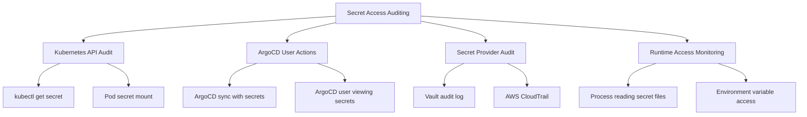

# How to Audit Secret Access in ArgoCD Managed Clusters

Author: [nawazdhandala](https://github.com/nawazdhandala)

Tags: ArgoCD, GitOps, Kubernetes, Security, Auditing

Description: Learn how to implement comprehensive secret access auditing in ArgoCD-managed Kubernetes clusters using audit logs, Falco, OPA, and secret provider audit trails.

---

Auditing secret access is a critical security requirement for regulated industries and security-conscious organizations. When ArgoCD manages your deployments, you need to track who accessed which secrets, when they were accessed, and from where. This includes both human access through kubectl and programmatic access by ArgoCD-managed workloads. This guide covers building a comprehensive audit trail for secret access across your ArgoCD-managed clusters.

## What Needs to Be Audited

Secret access auditing covers several dimensions:



## Layer 1: Kubernetes API Audit Logging

Kubernetes API audit logs capture all API requests, including secret access. Configure the audit policy to log secret operations:

```yaml
# audit-policy.yaml - Kubernetes API server audit policy
apiVersion: audit.k8s.io/v1
kind: Policy
rules:
  # Log all secret access at the RequestResponse level
  - level: RequestResponse
    resources:
      - group: ""
        resources: ["secrets"]
    # Exclude high-frequency system accounts
    omitStages:
      - RequestReceived
    # But do not include the secret data in the log
    omitManagedFields: true

  # Log all secret list operations
  - level: Metadata
    resources:
      - group: ""
        resources: ["secrets"]
    verbs: ["list", "watch"]

  # Log ArgoCD service account actions at Metadata level
  - level: Metadata
    users:
      - "system:serviceaccount:argocd:argocd-application-controller"
      - "system:serviceaccount:argocd:argocd-server"
    resources:
      - group: ""
        resources: ["secrets"]

  # Default: log at Metadata level for everything else
  - level: Metadata
    resources:
      - group: ""
        resources: ["secrets"]
```

For EKS, enable audit logging through the cluster configuration:

```bash
# Enable audit logging on EKS
aws eks update-cluster-config \
  --name my-cluster \
  --logging '{"clusterLogging":[{"types":["audit"],"enabled":true}]}'
```

For self-managed clusters, configure the API server:

```yaml
# kube-apiserver configuration
apiVersion: v1
kind: Pod
metadata:
  name: kube-apiserver
spec:
  containers:
    - name: kube-apiserver
      command:
        - kube-apiserver
        - --audit-policy-file=/etc/kubernetes/audit-policy.yaml
        - --audit-log-path=/var/log/kubernetes/audit.log
        - --audit-log-maxage=30
        - --audit-log-maxbackup=10
        - --audit-log-maxsize=100
```

### Parsing Secret Audit Events

Extract secret access events from audit logs:

```bash
# Find all secret read operations in the last hour
kubectl logs -n kube-system kube-apiserver | \
  jq 'select(.objectRef.resource == "secrets" and .verb == "get")' | \
  jq '{
    timestamp: .requestReceivedTimestamp,
    user: .user.username,
    verb: .verb,
    secret_name: .objectRef.name,
    namespace: .objectRef.namespace,
    source_ip: .sourceIPs[0]
  }'
```

## Layer 2: ArgoCD Audit Logging

ArgoCD logs all user actions, including operations that involve secrets.

### Enable Detailed ArgoCD Audit Logs

```yaml
# ArgoCD ConfigMap for audit logging
apiVersion: v1
kind: ConfigMap
metadata:
  name: argocd-cmd-params-cm
  namespace: argocd
data:
  # Enable server audit logging
  server.log.level: "info"
  server.log.format: "json"
  # Enable RBAC logging
  server.rbac.log.enforce.enable: "true"
```

ArgoCD automatically logs these events:
- Application sync operations (which may include secrets)
- User login/logout
- RBAC permission checks
- Application creation/deletion

### Extract ArgoCD Secret-Related Audit Events

```bash
# Find ArgoCD operations involving applications with secrets
kubectl logs -n argocd deploy/argocd-server | \
  jq 'select(.msg | contains("secret") or contains("Secret"))' | \
  jq '{time: .time, user: .user, action: .msg, app: .app}'

# Find all sync operations (which may deploy secrets)
kubectl logs -n argocd deploy/argocd-application-controller | \
  jq 'select(.msg | contains("sync"))' | \
  jq '{time: .time, app: .app, msg: .msg}'
```

## Layer 3: Secret Provider Audit Trails

### HashiCorp Vault Audit Log

Vault has built-in audit logging that records every secret access:

```bash
# Enable Vault audit log
vault audit enable file file_path=/vault/logs/audit.log

# Enable syslog audit for shipping to SIEM
vault audit enable syslog
```

Vault audit logs include:
- Who accessed the secret (authenticated identity)
- Which secret was accessed (path)
- When the access occurred (timestamp)
- What operation was performed (read, write, delete)
- Whether the request was successful

Query Vault audit logs for ArgoCD-related access:

```bash
# Find ESO-related secret reads in Vault audit log
cat /vault/logs/audit.log | \
  jq 'select(.auth.metadata.role == "external-secrets") | {
    time: .time,
    operation: .request.operation,
    path: .request.path,
    remote_addr: .request.remote_address
  }'
```

### AWS CloudTrail for Secrets Manager

AWS CloudTrail automatically logs all Secrets Manager API calls:

```bash
# Query CloudTrail for secret access events
aws cloudtrail lookup-events \
  --lookup-attributes AttributeKey=EventSource,AttributeValue=secretsmanager.amazonaws.com \
  --start-time "2026-02-25T00:00:00Z" \
  --end-time "2026-02-26T00:00:00Z" \
  --query 'Events[].{
    Time: EventTime,
    Event: EventName,
    User: Username,
    Secret: Resources[0].ResourceName
  }' \
  --output table
```

Create a CloudWatch alarm for suspicious secret access:

```bash
# Create metric filter for unauthorized secret access attempts
aws logs put-metric-filter \
  --log-group-name "CloudTrail/DefaultLogGroup" \
  --filter-name "UnauthorizedSecretAccess" \
  --filter-pattern '{ $.eventSource = "secretsmanager.amazonaws.com" && $.errorCode = "AccessDeniedException" }' \
  --metric-transformations \
    metricName=UnauthorizedSecretAccessCount,metricNamespace=Security,metricValue=1

# Create alarm
aws cloudwatch put-metric-alarm \
  --alarm-name "UnauthorizedSecretAccess" \
  --metric-name UnauthorizedSecretAccessCount \
  --namespace Security \
  --statistic Sum \
  --period 300 \
  --evaluation-periods 1 \
  --threshold 3 \
  --comparison-operator GreaterThanOrEqualToThreshold \
  --alarm-actions arn:aws:sns:us-east-1:123456789:security-alerts
```

## Layer 4: Runtime Secret Access Monitoring with Falco

Falco can detect runtime secret access patterns that go beyond API-level auditing:

```yaml
# Falco rules for secret access monitoring
# Deploy Falco via ArgoCD
apiVersion: argoproj.io/v1alpha1
kind: Application
metadata:
  name: falco
  namespace: argocd
spec:
  source:
    repoURL: https://falcosecurity.github.io/charts
    chart: falco
    targetRevision: 4.0.0
    helm:
      values: |
        falco:
          rulesFile:
            - /etc/falco/falco_rules.yaml
            - /etc/falco/rules.d/secret-access.yaml
        customRules:
          secret-access.yaml: |
            - rule: Read Secret Files in Pod
              desc: Detect when a process reads mounted secret files
              condition: >
                open_read and
                fd.directory startswith /var/run/secrets and
                not proc.name in (kubelet, kube-proxy)
              output: >
                Secret file read (user=%user.name command=%proc.cmdline
                file=%fd.name container=%container.name
                pod=%k8s.pod.name namespace=%k8s.ns.name)
              priority: WARNING
              tags: [secrets, filesystem]

            - rule: Suspicious Secret Environment Variable Access
              desc: Detect processes reading secret environment variables
              condition: >
                spawned_process and
                proc.cmdline contains "env" and
                (proc.cmdline contains "SECRET" or
                 proc.cmdline contains "PASSWORD" or
                 proc.cmdline contains "TOKEN" or
                 proc.cmdline contains "API_KEY")
              output: >
                Suspicious secret env access (user=%user.name
                command=%proc.cmdline container=%container.name
                pod=%k8s.pod.name)
              priority: WARNING
              tags: [secrets, process]
  destination:
    server: https://kubernetes.default.svc
    namespace: falco
```

## Layer 5: OPA-Based Access Control Auditing

Use OPA Gatekeeper to enforce and audit who can access secrets:

```yaml
# Gatekeeper constraint for secret access
apiVersion: templates.gatekeeper.sh/v1
kind: ConstraintTemplate
metadata:
  name: k8ssecretaccess
spec:
  crd:
    spec:
      names:
        kind: K8sSecretAccess
      validation:
        openAPIV3Schema:
          type: object
          properties:
            allowedServiceAccounts:
              type: array
              items:
                type: string
  targets:
    - target: admission.k8s.gatekeeper.sh
      rego: |
        package k8ssecretaccess

        violation[{"msg": msg}] {
          input.review.resource.resource == "secrets"
          input.review.operation == "get"
          sa := input.review.userInfo.username
          not sa_allowed(sa)
          msg := sprintf("Service account %v is not authorized to read secrets", [sa])
        }

        sa_allowed(sa) {
          input.parameters.allowedServiceAccounts[_] == sa
        }
---
apiVersion: constraints.gatekeeper.sh/v1beta1
kind: K8sSecretAccess
metadata:
  name: restrict-secret-access
spec:
  match:
    kinds:
      - apiGroups: [""]
        kinds: ["Secret"]
  parameters:
    allowedServiceAccounts:
      - "system:serviceaccount:argocd:argocd-application-controller"
      - "system:serviceaccount:argocd:argocd-server"
      - "system:serviceaccount:external-secrets:external-secrets"
```

## Building a Centralized Audit Dashboard

Ship all audit data to a centralized system for correlation:

```yaml
# OpenTelemetry Collector for audit log aggregation
apiVersion: v1
kind: ConfigMap
metadata:
  name: audit-collector-config
data:
  collector.yaml: |
    receivers:
      filelog/k8s-audit:
        include:
          - /var/log/kubernetes/audit.log
        operators:
          - type: json_parser

      filelog/argocd-audit:
        include:
          - /var/log/pods/argocd_argocd-server-*/argocd-server/*.log

    processors:
      attributes:
        actions:
          - key: audit.source
            value: kubernetes
            action: upsert
          - key: cluster.name
            from_attribute: CLUSTER_NAME
            action: upsert

    exporters:
      otlphttp:
        endpoint: "https://oneuptime.com/otlp"
        headers:
          x-oneuptime-token: "${ONEUPTIME_TOKEN}"

    service:
      pipelines:
        logs:
          receivers: [filelog/k8s-audit, filelog/argocd-audit]
          processors: [attributes]
          exporters: [otlphttp]
```

## Compliance Reporting

Generate compliance reports from the audit data:

```bash
#!/bin/bash
# generate-secret-audit-report.sh
# Generates a secret access audit report for compliance

PERIOD=${1:-"30d"}

echo "Secret Access Audit Report"
echo "Period: Last $PERIOD"
echo "Generated: $(date -u +%Y-%m-%dT%H:%M:%SZ)"
echo "================================"
echo ""

echo "1. Kubernetes Secret Access Summary"
echo "   - Total secret read operations: $(kubectl logs ... | grep -c 'secrets.*get')"
echo "   - Unique users accessing secrets: $(... | jq -r '.user.username' | sort -u | wc -l)"
echo ""

echo "2. ArgoCD Secret Operations"
echo "   - Applications synced (may include secrets): $(argocd app list -o json | jq length)"
echo "   - Sync operations in period: $(kubectl logs ... | grep -c 'sync')"
echo ""

echo "3. Failed Secret Access Attempts"
echo "   - Unauthorized access attempts: $(... | grep 'Forbidden' | wc -l)"
echo ""

echo "4. Secret Rotation Status"
argocd app list -o json | jq -c '.[]' | while read app; do
  NS=$(echo $app | jq -r '.spec.destination.namespace')
  kubectl get secrets -n "$NS" -o json | jq -r '.items[] | select(.type == "Opaque") | "\(.metadata.namespace)/\(.metadata.name): created \(.metadata.creationTimestamp)"'
done
```

## Summary

Auditing secret access in ArgoCD-managed clusters requires a multi-layered approach. Use Kubernetes audit logs for API-level access tracking, ArgoCD's built-in audit logging for GitOps operations, secret provider audit trails (Vault audit log, CloudTrail) for external secret access, Falco for runtime monitoring, and OPA for access control enforcement. Ship all audit data to a centralized system for correlation and compliance reporting. The goal is a complete audit trail that answers who, what, when, and where for every secret access. For related security topics, see our guides on [managing secrets lifecycle with ArgoCD](https://oneuptime.com/blog/post/2026-02-26-argocd-secrets-lifecycle-management/view) and [handling secrets in multi-cluster setups](https://oneuptime.com/blog/post/2026-02-26-argocd-multi-cluster-secrets/view).
