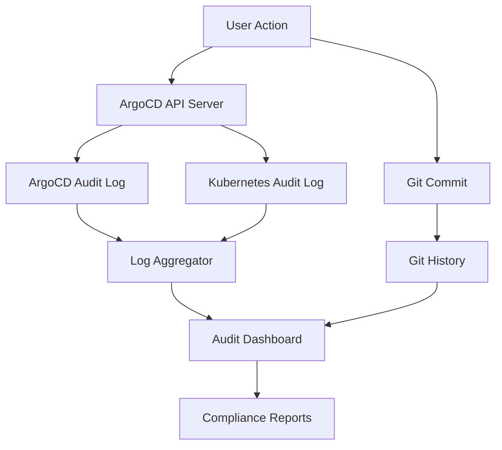

# How to Audit Tenant Activities in ArgoCD

Author: [nawazdhandala](https://github.com/nawazdhandala)

Tags: ArgoCD, GitOps, Kubernetes, Auditing, Compliance

Description: Learn how to audit tenant activities in ArgoCD with event tracking, audit logs, Git history analysis, and compliance reporting for multi-tenant Kubernetes environments.

---

When multiple teams share an ArgoCD instance, you need to know who did what, when, and to which resources. A developer syncs an application to production at 3 AM, and the next morning the service is down. Without audit trails, you spend hours investigating. With proper auditing, you look up the sync event, see the commit it deployed, and identify the problem in minutes.

Auditing in ArgoCD covers several layers: the ArgoCD API server logs, Kubernetes audit logs, Git history, and ArgoCD events. This guide shows how to capture, correlate, and report on tenant activities across all these layers.

## Audit Data Sources



## Enabling ArgoCD Audit Logging

ArgoCD logs every API call by default. To get useful audit data, increase the log level and structure the output.

```yaml
apiVersion: v1
kind: ConfigMap
metadata:
  name: argocd-cmd-params-cm
  namespace: argocd
data:
  # Enable JSON logging for structured parsing
  server.log.format: json
  server.log.level: info
  # Enable application events
  controller.log.format: json
  controller.log.level: info
```

ArgoCD API server logs include:

- User identity (from SSO or local accounts)
- Action performed (create, update, delete, sync)
- Target resource (application name, project)
- Timestamp
- Source IP address

Example log entry:

```json
{
  "level": "info",
  "msg": "sync",
  "application": "payment-service-prod",
  "dest-namespace": "team-alpha-prod",
  "dest-server": "https://kubernetes.default.svc",
  "project": "team-alpha",
  "user": "jane.doe@example.com",
  "time": "2026-02-26T14:30:00Z"
}
```

## Capturing User Identity

For audit trails to be useful, every action must be tied to a specific user. Configure SSO so ArgoCD knows who is performing each action.

```yaml
# argocd-cm ConfigMap
apiVersion: v1
kind: ConfigMap
metadata:
  name: argocd-cm
  namespace: argocd
data:
  # OIDC configuration that captures user identity
  oidc.config: |
    name: Okta
    issuer: https://myorg.okta.com/oauth2/default
    clientID: argocd-client-id
    clientSecret: $oidc.okta.clientSecret
    requestedScopes:
      - openid
      - profile
      - email
      - groups
    requestedIDTokenClaims:
      email:
        essential: true
      groups:
        essential: true
```

With SSO configured, every API call in the audit log includes the authenticated user's email and group memberships.

## Kubernetes Audit Logging

Enable Kubernetes audit logging to capture resource changes made by ArgoCD. This provides a second layer of audit data that captures what happened at the cluster level.

```yaml
# Kubernetes audit policy
apiVersion: audit.k8s.io/v1
kind: Policy
rules:
  # Log all ArgoCD Application changes
  - level: RequestResponse
    resources:
      - group: argoproj.io
        resources: ["applications", "appprojects"]
    verbs: ["create", "update", "patch", "delete"]

  # Log all namespace-level resource changes
  - level: Metadata
    resources:
      - group: ""
        resources: ["pods", "services", "configmaps", "secrets"]
      - group: apps
        resources: ["deployments", "statefulsets"]
    verbs: ["create", "update", "patch", "delete"]

  # Skip read-only operations to reduce volume
  - level: None
    verbs: ["get", "list", "watch"]
```

On EKS, enable audit logging through the cluster configuration:

```bash
aws eks update-cluster-config \
  --name my-cluster \
  --logging '{"clusterLogging":[{"types":["audit"],"enabled":true}]}'
```

## Tracking Application Events

ArgoCD generates Kubernetes events for significant application lifecycle changes. These events are valuable for auditing.

```bash
# View recent ArgoCD events
kubectl get events -n argocd --sort-by='.lastTimestamp' | grep -E "Sync|Health|Created|Deleted"
```

Events include:

- Application created
- Sync started/completed/failed
- Health status changed
- Resource pruned
- Hook executed

To retain events beyond the default Kubernetes retention period (1 hour), forward them to your log aggregator:

```yaml
# Use kube-events-exporter to forward events
apiVersion: apps/v1
kind: Deployment
metadata:
  name: event-exporter
  namespace: monitoring
spec:
  template:
    spec:
      containers:
        - name: event-exporter
          image: ghcr.io/resmoio/kubernetes-event-exporter:v1.6
          args:
            - -conf=/data/config.yaml
          volumeMounts:
            - name: config
              mountPath: /data
      volumes:
        - name: config
          configMap:
            name: event-exporter-config
```

## Git-Based Audit Trail

In GitOps, the Git history is the primary audit trail. Every deployment corresponds to a Git commit with an author, timestamp, message, and diff.

Query Git history for deployment auditing:

```bash
# Show all commits that changed production configuration
git log --oneline --since="2026-02-01" -- k8s/overlays/prod/

# Show who changed a specific file
git log --format="%h %an %ad %s" -- k8s/overlays/prod/deployment.yaml

# Show the exact changes in a deployment
git show abc1234 -- k8s/overlays/prod/
```

Enforce commit signing for stronger auditability:

```yaml
# ArgoCD project with signature verification
apiVersion: argoproj.io/v1alpha1
kind: AppProject
metadata:
  name: team-alpha
spec:
  signatureKeys:
    - keyID: "ABC123DEF456"
```

## Building an Audit Dashboard

Combine ArgoCD logs, Kubernetes audit logs, and Git history into a single dashboard.

### Structured Log Queries

If you use Elasticsearch/OpenSearch, create queries for common audit scenarios:

```json
{
  "query": {
    "bool": {
      "must": [
        {"match": {"kubernetes.container_name": "argocd-server"}},
        {"match": {"msg": "sync"}},
        {"range": {"@timestamp": {"gte": "now-24h"}}}
      ]
    }
  },
  "sort": [{"@timestamp": {"order": "desc"}}]
}
```

### Prometheus Metrics for Activity Tracking

ArgoCD exposes metrics that track sync operations per application and project:

```promql
# Sync operations per project in the last hour
sum by (project) (increase(argocd_app_sync_total[1h]))

# Failed syncs per project
sum by (project) (increase(argocd_app_sync_total{phase="Error"}[24h]))

# Application health changes
changes(argocd_app_info{health_status!="Healthy"}[1h])
```

### Grafana Dashboard Panels

Create a Grafana dashboard with these panels:

1. **Sync Activity Timeline** - shows when each application was synced
2. **User Activity** - shows which users performed actions
3. **Failed Operations** - highlights sync failures and permission denials
4. **Project Activity** - breaks down activity by ArgoCD project (tenant)

```json
{
  "title": "ArgoCD Tenant Activity",
  "panels": [
    {
      "title": "Syncs Per Team (24h)",
      "type": "barchart",
      "targets": [{
        "expr": "sum by (project) (increase(argocd_app_sync_total[24h]))"
      }]
    },
    {
      "title": "Recent Sync Failures",
      "type": "table",
      "targets": [{
        "expr": "argocd_app_sync_total{phase='Error'}"
      }]
    }
  ]
}
```

## Per-Tenant Audit Reports

Generate regular audit reports for each tenant. This is useful for compliance (SOC2, ISO 27001) and for team leads who want to review their team's deployment activity.

```bash
#!/bin/bash
# generate-audit-report.sh
TEAM=$1
START_DATE=$2
END_DATE=$3

echo "=== Deployment Audit Report ==="
echo "Team: $TEAM"
echo "Period: $START_DATE to $END_DATE"
echo ""

# ArgoCD application syncs
echo "--- Sync Operations ---"
argocd app list --project $TEAM -o json | \
  jq -r '.[] | "\(.metadata.name): last sync \(.status.operationState.finishedAt) by \(.status.operationState.operation.initiatedBy.username)"'

echo ""
echo "--- Application Changes ---"
# Git history for the team's config
git log --since="$START_DATE" --until="$END_DATE" \
  --format="%h | %an | %ad | %s" -- "teams/$TEAM/"
```

## Alerting on Suspicious Activity

Set up alerts for activity that might indicate a security issue:

```yaml
# Prometheus alert rules
groups:
  - name: argocd-audit-alerts
    rules:
      - alert: UnusualSyncActivity
        expr: |
          sum by (project) (increase(argocd_app_sync_total[1h])) > 20
        for: 5m
        labels:
          severity: warning
        annotations:
          summary: "Unusual sync activity in project {{ $labels.project }}"
          description: "More than 20 syncs in the last hour for project {{ $labels.project }}"

      - alert: AfterHoursDeployment
        expr: |
          increase(argocd_app_sync_total{dest_namespace=~".*-prod"}[1h]) > 0
          and on() (hour() < 8 or hour() > 20)
        labels:
          severity: warning
        annotations:
          summary: "After-hours production deployment detected"

      - alert: FailedSyncSpike
        expr: |
          sum by (project) (increase(argocd_app_sync_total{phase="Error"}[30m])) > 5
        labels:
          severity: critical
        annotations:
          summary: "Multiple sync failures in project {{ $labels.project }}"
```

## Retention and Compliance

For compliance, audit data must be retained for a specific period (typically 1 to 7 years depending on the standard).

- **ArgoCD logs**: Forward to your log aggregator with appropriate retention
- **Kubernetes audit logs**: Forward to cloud-native storage (CloudWatch, Cloud Logging)
- **Git history**: Preserved automatically in your Git repository
- **ArgoCD events**: Export before the default Kubernetes retention expires

Configure your log aggregator's retention policy to match your compliance requirements:

```yaml
# Example: Elasticsearch ILM policy
{
  "policy": {
    "phases": {
      "hot": {"actions": {"rollover": {"max_size": "50GB", "max_age": "30d"}}},
      "warm": {"min_age": "30d", "actions": {"shrink": {"number_of_shards": 1}}},
      "cold": {"min_age": "90d", "actions": {"freeze": {}}},
      "delete": {"min_age": "365d", "actions": {"delete": {}}}
    }
  }
}
```

Auditing tenant activities in ArgoCD is not optional for production multi-tenant clusters. It provides the accountability, troubleshooting capability, and compliance evidence that organizations need. The combination of ArgoCD's built-in logging, Kubernetes audit logs, and Git history gives you a complete picture of every change in your cluster - who made it, when, and why.
