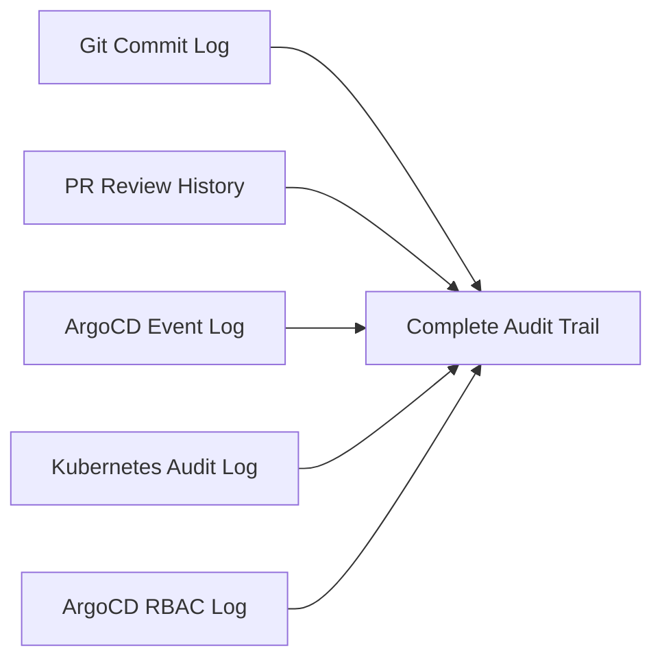

# How to Implement Audit Trails for All Deployments

Author: [nawazdhandala](https://github.com/nawazdhandala)

Tags: ArgoCD, GitOps, Kubernetes, Audit, Compliance

Description: Learn how to implement comprehensive audit trails for ArgoCD deployments covering Git history, sync events, RBAC actions, and compliance reporting for regulatory requirements.

---

When an auditor asks "who deployed what, when, and why?" you need a clear answer. One of the biggest advantages of GitOps is that Git itself provides an audit trail - every change is a commit with an author, timestamp, and message. But Git alone is not enough. You also need to track who triggered syncs in ArgoCD, what ArgoCD actually applied to the cluster, and whether any manual changes occurred. This guide shows you how to build a complete audit trail.

## The Audit Trail Components

A complete deployment audit trail captures:

1. **Git commits** - What changed in the config repo and who authored it
2. **PR reviews** - Who approved the change and when
3. **ArgoCD sync events** - When ArgoCD detected and applied the change
4. **Kubernetes events** - What resources were created, updated, or deleted
5. **Manual interventions** - Any kubectl commands or ArgoCD manual syncs



## Git-Based Audit Trail

### Commit History as Deployment Log

Every commit to your config repo is a deployment event:

```bash
# View deployment history for a specific service
git log --oneline --format='%h %ai %an: %s' -- services/payment-service/

# Output:
# a1b2c3d 2026-02-26 10:30:00 +0000 jane.doe: Update payment-service to v2.1.0
# e4f5g6h 2026-02-25 14:15:00 +0000 ci-bot: Auto-update image to sha-abc1234
# i7j8k9l 2026-02-24 09:00:00 +0000 john.smith: Increase replicas to 5
```

### Structured Commit Messages

Enforce structured commit messages for better auditability:

```bash
# commitlint configuration
# .commitlintrc.yaml
extends:
  - '@commitlint/config-conventional'
rules:
  type-enum:
    - 2
    - always
    - [deploy, config, scale, rollback, security, infra]
  scope-enum:
    - 2
    - always
    - [payment-service, user-service, frontend, platform, monitoring]
```

Example commits:

```text
deploy(payment-service): update to v2.1.0

Changelog: https://github.com/org/payment-service/releases/tag/v2.1.0
Ticket: JIRA-1234
Tested-in: staging

Approved-by: jane.doe, bob.smith
```

### PR History as Approval Record

Every merged PR is an approval record:

```bash
# List merged PRs with their reviewers
gh pr list --state merged --limit 20 --json number,title,mergedAt,mergedBy,reviewDecision \
  | jq '.[] | {number, title, mergedAt, mergedBy: .mergedBy.login, reviewDecision}'
```

## ArgoCD Audit Logging

### Enable Server-Side Audit Logging

ArgoCD logs all API operations:

```yaml
# argocd-cmd-params-cm ConfigMap
apiVersion: v1
kind: ConfigMap
metadata:
  name: argocd-cmd-params-cm
  namespace: argocd
data:
  # Enable audit logging
  server.log.level: info
  server.log.format: json
```

The server logs contain entries like:

```json
{
  "level": "info",
  "msg": "sync initiated",
  "application": "payment-service-production",
  "user": "jane.doe@example.com",
  "action": "sync",
  "dest-namespace": "production",
  "dest-server": "https://production-cluster.example.com",
  "revision": "a1b2c3d"
}
```

### Export Audit Logs to External Systems

Ship ArgoCD logs to your logging platform:

```yaml
# Fluentd sidecar for ArgoCD server
apiVersion: apps/v1
kind: Deployment
metadata:
  name: argocd-server
spec:
  template:
    spec:
      containers:
        - name: argocd-server
          # ... existing config ...
        - name: fluentd-sidecar
          image: fluent/fluentd:v1.16
          volumeMounts:
            - name: argocd-logs
              mountPath: /var/log/argocd
          env:
            - name: ELASTICSEARCH_HOST
              value: elasticsearch.logging.svc
```

### ArgoCD Notifications for Audit Events

Send every deployment event to an audit channel:

```yaml
# argocd-notifications-cm ConfigMap
template.audit-log: |
  webhook:
    audit-webhook:
      method: POST
      body: |
        {
          "timestamp": "{{ .app.status.operationState.finishedAt }}",
          "application": "{{ .app.metadata.name }}",
          "project": "{{ .app.spec.project }}",
          "action": "sync",
          "status": "{{ .app.status.operationState.phase }}",
          "revision": "{{ .app.status.sync.revision }}",
          "initiatedBy": "{{ .app.status.operationState.operation.initiatedBy.username }}",
          "automated": {{ if .app.status.operationState.operation.initiatedBy.automated }}true{{ else }}false{{ end }},
          "destination": {
            "server": "{{ .app.spec.destination.server }}",
            "namespace": "{{ .app.spec.destination.namespace }}"
          },
          "source": {
            "repoURL": "{{ .app.spec.source.repoURL }}",
            "path": "{{ .app.spec.source.path }}"
          }
        }

trigger.audit-on-sync-complete: |
  - when: app.status.operationState.phase in ['Succeeded', 'Failed', 'Error']
    send: [audit-log]

service.webhook.audit-webhook: |
  url: https://audit-api.example.com/events/argocd
  headers:
    - name: Authorization
      value: Bearer $audit-api-token
    - name: Content-Type
      value: application/json
```

## Kubernetes Audit Logging

### Enable Kubernetes API Audit

Configure the Kubernetes API server audit policy:

```yaml
# audit-policy.yaml
apiVersion: audit.k8s.io/v1
kind: Policy
rules:
  # Log all changes to deployments, services, and configmaps
  - level: RequestResponse
    resources:
      - group: "apps"
        resources: ["deployments", "statefulsets", "daemonsets"]
      - group: ""
        resources: ["services", "configmaps", "secrets"]
    verbs: ["create", "update", "patch", "delete"]

  # Log RBAC changes
  - level: RequestResponse
    resources:
      - group: "rbac.authorization.k8s.io"
        resources: ["roles", "rolebindings", "clusterroles", "clusterrolebindings"]

  # Log namespace operations
  - level: RequestResponse
    resources:
      - group: ""
        resources: ["namespaces"]
    verbs: ["create", "delete"]

  # Skip high-volume read operations
  - level: None
    verbs: ["get", "list", "watch"]
```

### Track ArgoCD-Specific Events

Filter Kubernetes audit logs for ArgoCD operations:

```bash
# Find all resources modified by ArgoCD
kubectl get events --all-namespaces -o json | jq '.items[] |
  select(.source.component == "argocd-application-controller") |
  {
    time: .lastTimestamp,
    namespace: .metadata.namespace,
    resource: .involvedObject.name,
    kind: .involvedObject.kind,
    reason: .reason,
    message: .message
  }'
```

## Building an Audit Dashboard

### Query ArgoCD Application History

```bash
# Get deployment history for an application
argocd app history payment-service-production

# Output:
# ID  DATE                           REVISION
# 5   2026-02-26 10:30:00 +0000 UTC  a1b2c3d
# 4   2026-02-25 14:15:00 +0000 UTC  e4f5g6h
# 3   2026-02-24 09:00:00 +0000 UTC  i7j8k9l
```

### Comprehensive Audit Query Script

```bash
#!/bin/bash
# audit-report.sh - Generate deployment audit report

APP_NAME=$1
DAYS=${2:-7}

echo "=== Deployment Audit Report for $APP_NAME ==="
echo "Period: Last $DAYS days"
echo ""

# ArgoCD sync history
echo "--- ArgoCD Sync Events ---"
argocd app history "$APP_NAME" | head -20

# Git commit history
echo ""
echo "--- Git Commits ---"
REPO_URL=$(argocd app get "$APP_NAME" -o json | jq -r '.spec.source.repoURL')
APP_PATH=$(argocd app get "$APP_NAME" -o json | jq -r '.spec.source.path')
echo "Repo: $REPO_URL"
echo "Path: $APP_PATH"

# Get the commit details for each revision in the history
argocd app history "$APP_NAME" -o json | jq -r '.[].revision' | while read rev; do
  echo "  Revision: $rev"
done

# Current status
echo ""
echo "--- Current Status ---"
argocd app get "$APP_NAME" -o json | jq '{
  syncStatus: .status.sync.status,
  healthStatus: .status.health.status,
  currentRevision: .status.sync.revision,
  lastSync: .status.operationState.finishedAt,
  syncedBy: .status.operationState.operation.initiatedBy
}'
```

## Compliance Reporting

### SOC 2 Requirements

For SOC 2 compliance, you need to demonstrate:

1. **Change management process** - Show PR reviews and approvals for every deployment
2. **Access controls** - Show RBAC policies and who has what access
3. **Monitoring** - Show that unauthorized changes are detected and remediated
4. **Separation of duties** - Show that developers cannot deploy to production directly

```bash
# Generate a compliance report
echo "=== SOC 2 Compliance Report ==="
echo ""

echo "1. Change Management:"
echo "   - All changes require PR with minimum 2 approvals"
echo "   - Branch protection enforced on main branch"
gh api repos/org/config-repo/branches/main/protection | jq '{
  required_reviews: .required_pull_request_reviews.required_approving_review_count,
  enforce_admins: .enforce_admins.enabled,
  force_push_blocked: (.allow_force_pushes.enabled | not)
}'

echo ""
echo "2. Access Controls:"
argocd proj list -o json | jq '.[] | {
  project: .metadata.name,
  sourceRepos: .spec.sourceRepos,
  destinations: .spec.destinations
}'

echo ""
echo "3. Deployment Log (Last 30 days):"
argocd app list -o json | jq '.[] | {
  name: .metadata.name,
  lastSync: .status.operationState.finishedAt,
  syncedBy: .status.operationState.operation.initiatedBy
}'
```

### Storing Audit Data Long-Term

For long-term retention, push audit events to a dedicated store:

```yaml
# Send audit events to S3 via webhook
service.webhook.s3-audit: |
  url: https://audit-lambda.example.com/ingest
  headers:
    - name: Authorization
      value: Bearer $audit-token

template.s3-audit-event: |
  webhook:
    s3-audit:
      method: POST
      body: |
        {
          "eventType": "deployment",
          "timestamp": "{{ .app.status.operationState.finishedAt }}",
          "application": "{{ .app.metadata.name }}",
          "revision": "{{ .app.status.sync.revision }}",
          "status": "{{ .app.status.operationState.phase }}",
          "cluster": "{{ .app.spec.destination.server }}",
          "namespace": "{{ .app.spec.destination.namespace }}"
        }
```

## Best Practices

1. **Never disable audit logging** even if it generates a lot of data
2. **Retain audit logs** for at least the period required by your compliance framework
3. **Alert on anomalies** like syncs outside business hours or from unknown users
4. **Regularly review** audit logs as part of your security operations
5. **Automate report generation** for compliance audits

For more on ArgoCD security and monitoring, see our guide on [monitoring ArgoCD deployments with OpenTelemetry](https://oneuptime.com/blog/post/2026-02-06-monitor-argocd-deployments-opentelemetry/view) and [ArgoCD RBAC policies](https://oneuptime.com/blog/post/2026-01-25-rbac-policies-argocd/view).
