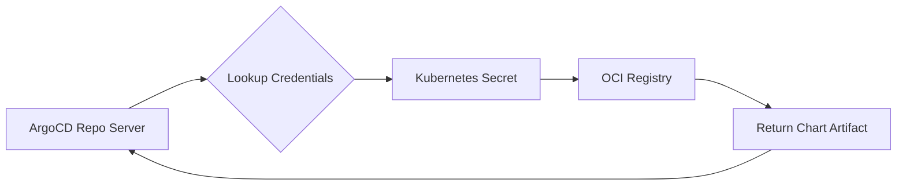

# How to Authenticate with OCI Registries in ArgoCD

Author: [nawazdhandala](https://github.com/nawazdhandala)

Tags: ArgoCD, GitOps, Kubernetes, OCI, Security

Description: Learn how to configure authentication for OCI container registries in ArgoCD, covering token-based auth, service accounts, credential helpers, and automated token refresh strategies.

---

Private OCI registries require authentication before ArgoCD can pull Helm charts or other OCI artifacts. The authentication mechanism varies by registry provider - some use static tokens, others use short-lived credentials that need periodic refresh, and cloud providers often support IAM-based authentication. This guide covers all the common authentication patterns and how to configure them in ArgoCD.

## Authentication Architecture

ArgoCD's repo server handles OCI registry authentication. When it needs to pull a chart, it looks up the credentials stored in its configuration:



Credentials are stored as Kubernetes Secrets in the `argocd` namespace with the label `argocd.argoproj.io/secret-type: repository`.

## Method 1: Username and Password/Token

The most common method. Works with most registries that support basic auth or token-based authentication:

```bash
# Add repository with credentials via CLI
argocd repo add ghcr.io/your-org/charts \
  --type helm \
  --enable-oci \
  --username your-username \
  --password your-access-token
```

Or declaratively:

```yaml
# oci-creds.yaml - Registry credentials as Kubernetes Secret
apiVersion: v1
kind: Secret
metadata:
  name: oci-registry-ghcr
  namespace: argocd
  labels:
    argocd.argoproj.io/secret-type: repository
type: Opaque
stringData:
  type: helm
  name: ghcr
  url: ghcr.io/your-org/charts
  enableOCI: "true"
  username: your-username
  password: ghp_your_github_personal_access_token
```

```bash
kubectl apply -f oci-creds.yaml
```

## Method 2: Credential Templates

If you have multiple chart repositories in the same registry, credential templates avoid repeating credentials for each one:

```yaml
# oci-cred-template.yaml - Applies to all repos under the URL prefix
apiVersion: v1
kind: Secret
metadata:
  name: oci-creds-template-ghcr
  namespace: argocd
  labels:
    argocd.argoproj.io/secret-type: repo-creds
type: Opaque
stringData:
  type: helm
  url: ghcr.io/your-org
  enableOCI: "true"
  username: your-username
  password: ghp_your_token
```

This template matches any repository URL starting with `ghcr.io/your-org`, so `ghcr.io/your-org/charts`, `ghcr.io/your-org/infra-charts`, and `ghcr.io/your-org/team-a/charts` all use the same credentials.

## Method 3: AWS ECR Authentication

AWS ECR tokens expire after 12 hours, so static credentials do not work long-term. You need a mechanism to refresh them.

### Option A: argocd-ecr-credential-updater

Use a CronJob that refreshes ECR credentials periodically:

```yaml
# ecr-credential-updater.yaml
apiVersion: batch/v1
kind: CronJob
metadata:
  name: ecr-credential-updater
  namespace: argocd
spec:
  schedule: "*/6 * * * *"  # Every 6 hours (before the 12-hour expiry)
  jobTemplate:
    spec:
      template:
        spec:
          serviceAccountName: argocd-ecr-updater
          containers:
            - name: updater
              image: amazon/aws-cli:latest
              command:
                - /bin/sh
                - -c
                - |
                  # Get ECR token
                  TOKEN=$(aws ecr get-login-password --region us-east-1)

                  # Update the ArgoCD repository secret
                  kubectl -n argocd create secret generic ecr-oci-creds \
                    --from-literal=type=helm \
                    --from-literal=name=ecr \
                    --from-literal=url=123456789012.dkr.ecr.us-east-1.amazonaws.com \
                    --from-literal=enableOCI=true \
                    --from-literal=username=AWS \
                    --from-literal=password="$TOKEN" \
                    --dry-run=client -o yaml | \
                  kubectl label -f - argocd.argoproj.io/secret-type=repository --dry-run=client -o yaml | \
                  kubectl apply -f -
              env:
                - name: AWS_REGION
                  value: us-east-1
          restartPolicy: OnFailure
```

### Option B: IRSA (IAM Roles for Service Accounts)

If ArgoCD runs on EKS, use IRSA to give the repo server direct ECR access:

```yaml
# ServiceAccount with ECR access
apiVersion: v1
kind: ServiceAccount
metadata:
  name: argocd-repo-server
  namespace: argocd
  annotations:
    eks.amazonaws.com/role-arn: arn:aws:iam::123456789012:role/argocd-ecr-role
```

The IAM role needs this policy:

```json
{
  "Version": "2012-10-17",
  "Statement": [
    {
      "Effect": "Allow",
      "Action": [
        "ecr:GetAuthorizationToken",
        "ecr:BatchCheckLayerAvailability",
        "ecr:GetDownloadUrlForLayer",
        "ecr:BatchGetImage"
      ],
      "Resource": "*"
    }
  ]
}
```

## Method 4: Google Artifact Registry Authentication

### Using Service Account Key

```yaml
apiVersion: v1
kind: Secret
metadata:
  name: gar-oci-creds
  namespace: argocd
  labels:
    argocd.argoproj.io/secret-type: repository
type: Opaque
stringData:
  type: helm
  name: gar
  url: us-central1-docker.pkg.dev/my-project/charts
  enableOCI: "true"
  username: _json_key
  password: |
    {
      "type": "service_account",
      "project_id": "my-project",
      ...
    }
```

### Using Workload Identity (GKE)

Configure Workload Identity on GKE to avoid managing service account keys:

```yaml
# ArgoCD repo server ServiceAccount with Workload Identity
apiVersion: v1
kind: ServiceAccount
metadata:
  name: argocd-repo-server
  namespace: argocd
  annotations:
    iam.gke.io/gcp-service-account: argocd-repo@my-project.iam.gserviceaccount.com
```

Grant the GCP service account `roles/artifactregistry.reader` on the Artifact Registry repository.

## Method 5: Azure Container Registry Authentication

### Using Service Principal

```yaml
apiVersion: v1
kind: Secret
metadata:
  name: acr-oci-creds
  namespace: argocd
  labels:
    argocd.argoproj.io/secret-type: repository
type: Opaque
stringData:
  type: helm
  name: acr
  url: myregistry.azurecr.io
  enableOCI: "true"
  username: <service-principal-app-id>
  password: <service-principal-password>
```

### Using Managed Identity (AKS)

On AKS with managed identities, attach the ACR to the AKS cluster:

```bash
# Attach ACR to AKS (grants AcrPull role)
az aks update -n myAKSCluster -g myResourceGroup --attach-acr myregistry
```

Then configure ArgoCD to use the kubelet identity for ACR authentication.

## Method 6: Docker Hub Authentication

```yaml
apiVersion: v1
kind: Secret
metadata:
  name: dockerhub-oci-creds
  namespace: argocd
  labels:
    argocd.argoproj.io/secret-type: repository
type: Opaque
stringData:
  type: helm
  name: dockerhub
  url: registry-1.docker.io/your-org
  enableOCI: "true"
  username: your-dockerhub-username
  password: dckr_pat_your_personal_access_token
```

Use a Personal Access Token instead of your Docker Hub password for security.

## Verifying Authentication

After configuring credentials, verify ArgoCD can access the registry:

```bash
# List registered repositories
argocd repo list

# Check a specific repo
argocd repo get ghcr.io/your-org/charts

# Create a test application to verify chart pulls
argocd app create test-oci \
  --repo ghcr.io/your-org/charts \
  --helm-chart my-chart \
  --revision 1.0.0 \
  --dest-server https://kubernetes.default.svc \
  --dest-namespace test \
  --sync-policy none

# Try to render manifests (this tests the pull)
argocd app manifests test-oci

# Clean up
argocd app delete test-oci --cascade=false
```

## Troubleshooting Authentication Issues

```bash
# Check repo server logs for auth errors
kubectl logs -n argocd -l app.kubernetes.io/name=argocd-repo-server \
  --tail=100 | grep -i "auth\|401\|403\|denied\|credential"

# Verify the secret exists and has correct labels
kubectl get secrets -n argocd -l argocd.argoproj.io/secret-type=repository

# Inspect the secret contents (base64 decoded)
kubectl get secret oci-registry-ghcr -n argocd -o jsonpath='{.data.password}' | base64 -d

# Test authentication outside ArgoCD
helm registry login ghcr.io -u your-user -p your-token
helm pull oci://ghcr.io/your-org/charts/my-chart --version 1.0.0
```

Common authentication errors:

| Error | Cause | Fix |
|---|---|---|
| `401 Unauthorized` | Invalid credentials | Update username/password |
| `403 Forbidden` | Insufficient permissions | Grant read access to the registry |
| `token expired` | Short-lived token (ECR) | Set up credential rotation |
| `name unknown` | Wrong registry URL | Check the URL format |

## Security Best Practices

**Use short-lived tokens** - Prefer mechanisms like IRSA, Workload Identity, or Managed Identity over static tokens.

**Rotate static credentials** - If you must use static tokens, rotate them regularly (at least every 90 days).

**Use read-only credentials** - ArgoCD only needs pull access. Never give it push permissions.

**Encrypt secrets at rest** - Enable Kubernetes secrets encryption or use an external secret manager (like External Secrets Operator or Sealed Secrets).

**Audit access** - Enable registry access logging to track which credentials are being used.

**Scope credentials narrowly** - If possible, create credentials that only have access to the specific repositories ArgoCD needs, not the entire registry.

For more on OCI with ArgoCD, see [OCI artifacts as application sources](https://oneuptime.com/blog/post/2026-02-26-argocd-oci-artifacts-application-sources/view) and [using AWS ECR with ArgoCD](https://oneuptime.com/blog/post/2026-02-26-argocd-aws-ecr-oci-registry/view).
