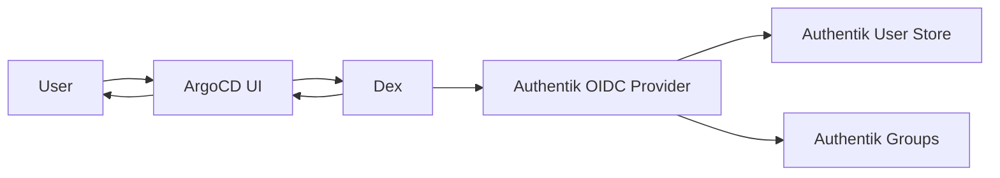

# How to Integrate ArgoCD with Authentik

Author: [nawazdhandala](https://github.com/nawazdhandala)

Tags: ArgoCD, GitOps, Kubernetes, Authentik, Authentication

Description: Learn how to integrate ArgoCD with Authentik identity provider for self-hosted SSO, including OIDC configuration, group mapping, and multi-tenant authentication setup.

---

Authentik is a self-hosted, open-source identity provider that has gained significant popularity in the Kubernetes community. It supports OIDC, SAML, LDAP, and SCIM protocols, making it a versatile choice for organizations that want full control over their authentication infrastructure. Integrating Authentik with ArgoCD gives you self-hosted SSO with group-based RBAC - no dependency on cloud identity providers.

This guide covers the complete Authentik-to-ArgoCD integration using OIDC through Dex.

## Why Authentik for ArgoCD

Authentik stands out for several reasons:
- Fully self-hosted - no external dependencies
- Rich policy engine for conditional access
- Built-in MFA support
- Modern web UI for identity management
- Supports user self-service (password reset, profile management)
- Can proxy authentication for applications that do not support SSO

## Architecture



## Step 1: Create an OAuth2/OIDC Provider in Authentik

In the Authentik admin interface:

1. Navigate to Applications, then Providers
2. Create a new OAuth2/OpenID Provider
3. Configure the provider settings:
   - Name: `ArgoCD`
   - Authorization flow: `default-provider-authorization-explicit-consent` (or implicit if you prefer no consent screen)
   - Client type: Confidential
   - Client ID: `argocd` (auto-generated or custom)
   - Client Secret: Note this down
   - Redirect URIs: `https://argocd.example.com/api/dex/callback`
   - Signing Key: Select your Authentik signing key

4. Under Advanced protocol settings:
   - Subject mode: Based on the User's username
   - Include claims in id_token: Enabled
   - Scopes: `openid`, `profile`, `email`

5. Create a custom scope mapping for groups:
   - Go to Customization, then Property Mappings
   - Create a new Scope Mapping:
     - Name: `ArgoCD Groups`
     - Scope name: `groups`
     - Expression:
       ```python
       return {
           "groups": [group.name for group in request.user.ak_groups.all()]
       }
       ```
   - Assign this mapping to your ArgoCD provider

## Step 2: Create an Application in Authentik

1. Navigate to Applications, then Applications
2. Create a new application:
   - Name: `ArgoCD`
   - Slug: `argocd`
   - Provider: Select the `ArgoCD` provider created above
   - Launch URL: `https://argocd.example.com`

## Step 3: Configure ArgoCD Dex for Authentik

```yaml
apiVersion: v1
kind: ConfigMap
metadata:
  name: argocd-cm
  namespace: argocd
data:
  url: https://argocd.example.com

  dex.config: |
    connectors:
    - type: oidc
      id: authentik
      name: Authentik
      config:
        issuer: https://authentik.example.com/application/o/argocd/
        clientID: argocd
        clientSecret: $dex.authentik.clientSecret
        redirectURI: https://argocd.example.com/api/dex/callback

        # Request scopes
        scopes:
        - openid
        - profile
        - email
        - groups

        # Enable group claims
        insecureEnableGroups: true
        groupsKey: groups

        # Claim mapping
        userIDKey: sub
        userNameKey: preferred_username
        emailKey: email
```

Note the issuer URL format for Authentik: `https://authentik.example.com/application/o/<slug>/`. This is Authentik's OIDC discovery endpoint path.

Store the client secret:

```bash
kubectl patch secret argocd-secret -n argocd \
  --type merge \
  -p '{"stringData": {"dex.authentik.clientSecret": "your-authentik-client-secret"}}'
```

## Step 4: Configure RBAC with Authentik Groups

Create groups in Authentik that map to ArgoCD roles:

In Authentik admin:
1. Create groups: `argocd-admins`, `argocd-developers`, `argocd-viewers`
2. Assign users to appropriate groups

Then configure ArgoCD RBAC:

```yaml
apiVersion: v1
kind: ConfigMap
metadata:
  name: argocd-rbac-cm
  namespace: argocd
data:
  policy.default: role:readonly
  scopes: '[groups, email]'

  policy.csv: |
    # Admin role
    p, role:admin, applications, *, */*, allow
    p, role:admin, clusters, *, *, allow
    p, role:admin, repositories, *, *, allow
    p, role:admin, projects, *, *, allow
    p, role:admin, accounts, *, *, allow
    p, role:admin, gpgkeys, *, *, allow
    p, role:admin, certificates, *, *, allow

    # Developer role
    p, role:developer, applications, get, */*, allow
    p, role:developer, applications, list, */*, allow
    p, role:developer, applications, sync, */*, allow
    p, role:developer, applications, action/*, */*, allow
    p, role:developer, logs, get, */*, allow
    p, role:developer, repositories, get, *, allow
    p, role:developer, projects, get, *, allow

    # Map Authentik groups
    g, argocd-admins, role:admin
    g, argocd-developers, role:developer
```

## Step 5: Apply and Test

```bash
# Restart Dex to pick up changes
kubectl rollout restart deployment argocd-dex-server -n argocd

# Watch for successful startup
kubectl logs -f deployment/argocd-dex-server -n argocd

# Test login
argocd login argocd.example.com --sso
```

## Authentik Conditional Access Policies

Authentik's policy engine lets you add conditions to ArgoCD access. For example, require MFA for ArgoCD:

In Authentik admin:
1. Go to Flows and Stages, then Stages
2. Create a new stage:
   - Type: Authenticator Validation Stage
   - Device classes: TOTP, WebAuthn
3. Go to Flows and Stages, then Flows
4. Edit the authorization flow used by your ArgoCD provider
5. Add the MFA stage after password authentication

This enforces MFA specifically for ArgoCD access without requiring it for all Authentik applications.

## IP-Based Access Restrictions

Create a policy in Authentik to restrict ArgoCD access by IP:

```python
# Authentik Expression Policy
# Only allow access from corporate network
from ipaddress import ip_address, ip_network

ALLOWED_NETWORKS = [
    ip_network("10.0.0.0/8"),
    ip_network("172.16.0.0/12"),
    ip_network("192.168.0.0/16"),
]

client_ip = ip_address(request.http_request.META.get("REMOTE_ADDR", "0.0.0.0"))

for network in ALLOWED_NETWORKS:
    if client_ip in network:
        return True

# Deny access from outside corporate network
return False
```

Attach this policy to the ArgoCD application in Authentik.

## Deploying Authentik with ArgoCD

You can even manage Authentik itself with ArgoCD, creating a self-referential setup:

```yaml
apiVersion: argoproj.io/v1alpha1
kind: Application
metadata:
  name: authentik
  namespace: argocd
spec:
  project: infrastructure
  source:
    repoURL: https://charts.goauthentik.io
    chart: authentik
    targetRevision: 2024.8.3
    helm:
      values: |
        authentik:
          secret_key: "${SECRET_KEY}"
          postgresql:
            password: "${PG_PASSWORD}"
          redis:
            password: "${REDIS_PASSWORD}"

        server:
          replicas: 2
          ingress:
            enabled: true
            hosts:
            - authentik.example.com
            tls:
            - secretName: authentik-tls
              hosts:
              - authentik.example.com

        worker:
          replicas: 2

        postgresql:
          enabled: true
          auth:
            password: "${PG_PASSWORD}"

        redis:
          enabled: true
          auth:
            password: "${REDIS_PASSWORD}"
  destination:
    server: https://kubernetes.default.svc
    namespace: authentik
  syncPolicy:
    automated:
      prune: true
      selfHeal: true
    syncOptions:
    - CreateNamespace=true
```

## Troubleshooting

### "Invalid issuer" Error

The issuer URL must exactly match what Authentik returns in its OIDC discovery document. Verify:

```bash
curl -s https://authentik.example.com/application/o/argocd/.well-known/openid-configuration | jq .issuer
```

Use that exact URL in your Dex config.

### Groups Not Showing Up

1. Verify the custom scope mapping is assigned to the provider
2. Check that the `groups` scope is requested in Dex config
3. Test the token directly:

```bash
# Get a token from Authentik and decode it
curl -s -X POST https://authentik.example.com/application/o/token/ \
  -d "grant_type=client_credentials&client_id=argocd&client_secret=your-secret&scope=openid+groups" | \
  jq -r '.access_token' | cut -d. -f2 | base64 -d | jq .
```

### Redirect URI Mismatch

Ensure the redirect URI in Authentik exactly matches: `https://argocd.example.com/api/dex/callback`

Check for common mismatches: trailing slashes, http vs https, port numbers.

Monitor your Authentik and ArgoCD integration health with OneUptime to detect authentication issues before they block your team.

## Conclusion

Authentik provides a fully self-hosted identity solution that integrates cleanly with ArgoCD through OIDC. The combination gives you complete control over your authentication infrastructure - no cloud vendor lock-in, full policy control, and built-in MFA support. The setup involves creating an OIDC provider in Authentik, configuring Dex to connect to it, and mapping Authentik groups to ArgoCD RBAC roles. Authentik's conditional access policies add an extra layer of security that most OIDC providers do not offer out of the box, making it an excellent choice for security-conscious organizations running ArgoCD.
