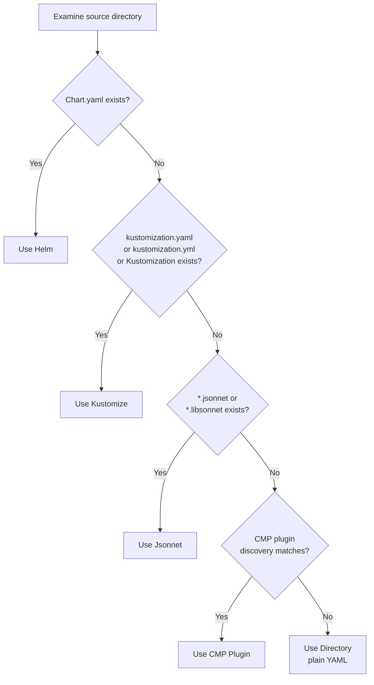

# How ArgoCD Automatically Detects Application Tool Types

Author: [nawazdhandala](https://github.com/nawazdhandala)

Tags: ArgoCD, GitOps, Kubernetes, Tool Detection, Configuration

Description: Understand how ArgoCD automatically detects whether an application uses Helm, Kustomize, Jsonnet, or plain YAML and how the detection logic works.

---

When you create an ArgoCD application and point it at a Git repository path, you do not always have to specify whether the manifests use Helm, Kustomize, Jsonnet, or plain YAML. ArgoCD examines the repository contents and automatically determines the right tool to use for manifest generation. This auto-detection is convenient but can sometimes produce surprising results. Understanding exactly how it works helps you avoid unexpected behavior and debug issues when ArgoCD picks the wrong tool.

## The Detection Algorithm

ArgoCD checks for specific marker files in the application's source path (the directory specified by `spec.source.path`). It evaluates them in a specific order, and the first match wins:



The detection priority is:

1. **Helm** - if `Chart.yaml` exists in the source path
2. **Kustomize** - if `kustomization.yaml`, `kustomization.yml`, or `Kustomization` exists
3. **Jsonnet** - if any `.jsonnet` or `.libsonnet` file exists
4. **CMP Plugin** - if any installed plugin's discovery rule matches
5. **Directory** (plain YAML) - the fallback when nothing else matches

## What Each Detection Looks For

### Helm Detection

ArgoCD looks for a `Chart.yaml` file in the root of the source path. It does not matter what is inside `Chart.yaml` - its mere presence triggers Helm detection:

```text
my-app/
  Chart.yaml      <-- This file triggers Helm detection
  values.yaml
  templates/
    deployment.yaml
    service.yaml
```

Even an empty `Chart.yaml` will cause ArgoCD to use Helm. This sometimes catches people off guard when they have a `Chart.yaml` in a directory that is primarily Kustomize-based.

### Kustomize Detection

ArgoCD checks for three possible filenames (case-sensitive):

- `kustomization.yaml`
- `kustomization.yml`
- `Kustomization`

```text
my-app/
  kustomization.yaml   <-- This triggers Kustomize detection
  base/
    deployment.yaml
  overlays/
    production/
      patches.yaml
```

### Jsonnet Detection

ArgoCD scans for files with `.jsonnet` or `.libsonnet` extensions:

```text
my-app/
  main.jsonnet        <-- This triggers Jsonnet detection
  lib/
    helpers.libsonnet
```

### CMP Plugin Detection

After checking built-in tools, ArgoCD evaluates the `discover` rules of all installed CMP plugins. Each plugin can define a glob pattern or a command to check for matches:

```yaml
# Example plugin discovery
discover:
  find:
    glob: "**/*.cue"  # Matches if any .cue file exists
```

### Directory (Plain YAML) Detection

When no other tool matches, ArgoCD treats the source path as a directory of plain YAML manifests. It recursively reads all `.yaml`, `.yml`, and `.json` files and applies them directly.

## Detection in Practice

Let us walk through several scenarios to see how detection works.

### Scenario 1: Standard Helm Chart

```text
apps/web-app/
  Chart.yaml
  values.yaml
  templates/
    deployment.yaml
```

Detection result: **Helm**. The `Chart.yaml` file is found.

### Scenario 2: Kustomize with Helm

```text
apps/web-app/
  Chart.yaml
  kustomization.yaml
  values.yaml
  templates/
    deployment.yaml
```

Detection result: **Helm**. Because `Chart.yaml` is checked first, Helm wins even though `kustomization.yaml` is also present. This is a common source of confusion.

### Scenario 3: Kustomize Only

```text
apps/web-app/
  kustomization.yaml
  deployment.yaml
  service.yaml
  patches/
    replica-count.yaml
```

Detection result: **Kustomize**. No `Chart.yaml` exists, so ArgoCD proceeds to check for Kustomize files.

### Scenario 4: Jsonnet with Kustomization

```text
apps/monitoring/
  main.jsonnet
  kustomization.yaml
  lib/
    helpers.libsonnet
```

Detection result: **Kustomize**. Because Kustomize is checked before Jsonnet, the presence of `kustomization.yaml` means Jsonnet files are ignored.

### Scenario 5: Plain YAML

```text
apps/simple-app/
  deployment.yaml
  service.yaml
  configmap.yaml
```

Detection result: **Directory** (plain YAML). No marker files for any specific tool.

## Viewing the Detected Tool Type

You can see what tool ArgoCD detected for an application:

```bash
# Via CLI
argocd app get my-app -o json | jq '.status.sourceType'

# Via kubectl
kubectl get application my-app -n argocd \
  -o jsonpath='{.status.sourceType}'
```

The output will be one of: `Helm`, `Kustomize`, `Jsonnet`, `Plugin`, or `Directory`.

## Common Detection Pitfalls

### Accidental Chart.yaml

A common mistake is having a `Chart.yaml` left over from a migration or accidentally committed. Even a minimal `Chart.yaml` triggers Helm detection:

```yaml
# This is enough to trigger Helm detection
apiVersion: v2
name: my-app
version: 0.0.1
```

If you see unexpected Helm-related errors, check whether a `Chart.yaml` exists in your source path.

### Kustomize Overriding Jsonnet

If you have both `kustomization.yaml` and `.jsonnet` files, Kustomize will always win because it is checked first. If you want Jsonnet, remove the `kustomization.yaml` or use explicit tool specification.

### CMP Plugins and Built-in Conflicts

CMP plugins are checked after all built-in tools. If your source directory has a `Chart.yaml` and a CMP plugin with a matching discovery rule, Helm will be used - not the plugin. To force the plugin, either remove the `Chart.yaml` or explicitly specify the plugin in the Application spec.

### Case Sensitivity

The detection is case-sensitive. `chart.yaml` (lowercase) will NOT trigger Helm detection. It must be `Chart.yaml`. Similarly, `Kustomization.yaml` will not trigger Kustomize detection, but `Kustomization` (without the .yaml extension) will.

## How Detection Relates to Multi-Source Applications

For multi-source applications, detection runs independently for each source:

```yaml
spec:
  sources:
    # This source is detected as Helm
    - repoURL: https://github.com/myorg/charts.git
      path: charts/my-app  # Contains Chart.yaml

    # This source is detected as Kustomize
    - repoURL: https://github.com/myorg/overlays.git
      path: overlays/production  # Contains kustomization.yaml
```

Each source is processed by whatever tool is detected (or explicitly specified) for that source.

## ArgoCD Source Type in the API

When you create an application, you can check the source type in the Application status:

```bash
# Full application status showing source type
kubectl get application my-app -n argocd -o yaml | grep -A5 "status:"
```

The status includes:

```yaml
status:
  sourceType: Helm  # or Kustomize, Jsonnet, Plugin, Directory
  summary:
    images:
      - my-app:v1.0
```

## Summary

ArgoCD's auto-detection follows a strict priority order: Helm, Kustomize, Jsonnet, CMP Plugins, then plain YAML Directory. The detection is based on the presence of specific marker files in the source path. Understanding this order prevents surprises when multiple tool files coexist in the same directory. When detection picks the wrong tool, you can always override it by explicitly specifying the tool type in the Application spec, which we cover in the next article on [forcing a specific tool type](https://oneuptime.com/blog/post/2026-02-26-argocd-force-specific-tool-type/view).
