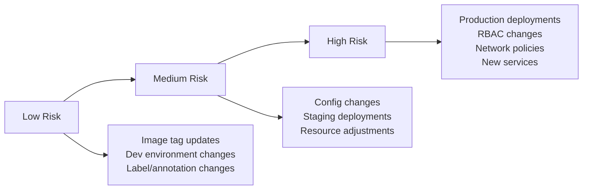

# How to Implement Auto-Merge Policies for ArgoCD

Author: [nawazdhandala](https://github.com/nawazdhandala)

Tags: ArgoCD, GitOps, Kubernetes, Automation, CI/CD

Description: Learn how to implement safe auto-merge policies for ArgoCD configuration repositories to speed up low-risk deployments while maintaining safety for critical changes.

---

Not every deployment change needs a human reviewer. Bumping an image tag to a version that already passed CI tests, or updating a non-production environment, can be safely automated. Auto-merge policies let you speed up low-risk changes while keeping strict review requirements for anything that could impact production stability. This guide shows you how to implement auto-merge safely for ArgoCD config repos.

## The Risk Spectrum

Different changes carry different risk levels:



Auto-merge is appropriate for low-risk changes. Medium and high-risk changes should always have human review.

## Setting Up Auto-Merge with GitHub

### Renovate Bot for Dependency Updates

Renovate can automatically update image tags and Helm chart versions:

```json
{
  "$schema": "https://docs.renovatebot.com/renovate-schema.json",
  "extends": ["config:base"],
  "kubernetes": {
    "fileMatch": ["(^|/).*\\.yaml$"]
  },
  "packageRules": [
    {
      "description": "Auto-merge patch version updates in dev",
      "matchPaths": ["services/*/overlays/dev/**"],
      "matchUpdateTypes": ["patch", "digest"],
      "automerge": true,
      "automergeType": "pr",
      "automergeStrategy": "squash",
      "platformAutomerge": true
    },
    {
      "description": "Auto-merge minor updates in dev after CI passes",
      "matchPaths": ["services/*/overlays/dev/**"],
      "matchUpdateTypes": ["minor"],
      "automerge": true,
      "automergeType": "pr",
      "automergeStrategy": "squash",
      "stabilityDays": 1
    },
    {
      "description": "Never auto-merge production changes",
      "matchPaths": ["services/*/overlays/production/**"],
      "automerge": false,
      "requiredStatusChecks": ["validate-manifests", "security-scan", "argocd-diff"]
    },
    {
      "description": "Auto-merge platform tool patch updates in staging",
      "matchPaths": ["platform/**"],
      "matchUpdateTypes": ["patch"],
      "automerge": true,
      "stabilityDays": 3
    }
  ]
}
```

### GitHub Auto-Merge via Actions

Create a workflow that enables auto-merge for qualifying PRs:

```yaml
# .github/workflows/auto-merge.yaml
name: Auto-Merge Low Risk Changes
on:
  pull_request:
    types: [opened, synchronize, labeled]
  check_suite:
    types: [completed]

permissions:
  pull-requests: write
  contents: write

jobs:
  evaluate-risk:
    runs-on: ubuntu-latest
    outputs:
      auto-mergeable: ${{ steps.check.outputs.auto-mergeable }}
    steps:
      - uses: actions/checkout@v4
        with:
          fetch-depth: 0

      - name: Evaluate change risk
        id: check
        run: |
          auto_merge="true"
          changed_files=$(git diff --name-only origin/main)

          # Block auto-merge for production changes
          if echo "$changed_files" | grep -q "/production/"; then
            echo "Production changes detected - blocking auto-merge"
            auto_merge="false"
          fi

          # Block for RBAC changes
          if echo "$changed_files" | grep -qi "rbac\|role\|rolebinding"; then
            echo "RBAC changes detected - blocking auto-merge"
            auto_merge="false"
          fi

          # Block for network policy changes
          if echo "$changed_files" | grep -qi "networkpolic"; then
            echo "Network policy changes detected - blocking auto-merge"
            auto_merge="false"
          fi

          # Block for new application definitions
          if echo "$changed_files" | grep -q "^apps/"; then
            echo "Application definition changes detected - blocking auto-merge"
            auto_merge="false"
          fi

          # Block for namespace or cluster-scoped resource changes
          if git diff origin/main | grep -q "kind: Namespace\|kind: ClusterRole"; then
            echo "Cluster-scoped changes detected - blocking auto-merge"
            auto_merge="false"
          fi

          # Allow: image tag only changes in dev/staging
          if echo "$changed_files" | grep -qE "/(dev|staging)/" && \
             git diff origin/main | grep -qE "^[+-].*image:|^[+-].*newTag:" && \
             ! git diff origin/main | grep -qvE "^[+-].*image:|^[+-].*newTag:|^[+-]{3}|^@@|^diff"; then
            echo "Image-only change in non-production - eligible for auto-merge"
          fi

          echo "auto-mergeable=$auto_merge" >> $GITHUB_OUTPUT

  auto-merge:
    needs: evaluate-risk
    if: needs.evaluate-risk.outputs.auto-mergeable == 'true'
    runs-on: ubuntu-latest
    steps:
      - name: Enable auto-merge
        uses: actions/github-script@v7
        with:
          script: |
            // Wait for all required checks to pass
            await github.rest.pulls.merge({
              owner: context.repo.owner,
              repo: context.repo.repo,
              pull_number: context.issue.number,
              merge_method: 'squash'
            });

      - name: Add auto-merge label
        run: |
          gh pr edit ${{ github.event.pull_request.number }} --add-label "auto-merged"
        env:
          GH_TOKEN: ${{ secrets.GITHUB_TOKEN }}
```

## Image Updater Auto-Merge

When using ArgoCD Image Updater, configure it to write back to Git and auto-merge:

```yaml
apiVersion: argoproj.io/v1alpha1
kind: Application
metadata:
  name: my-app-dev
  annotations:
    argocd-image-updater.argoproj.io/image-list: app=org/my-app
    argocd-image-updater.argoproj.io/app.update-strategy: latest
    argocd-image-updater.argoproj.io/write-back-method: git
    argocd-image-updater.argoproj.io/write-back-target: kustomization
    argocd-image-updater.argoproj.io/git-branch: main
spec:
  source:
    path: overlays/dev
```

For dev environments, Image Updater can write directly to the main branch (if branch protection allows it for the bot account). For production, configure it to create PRs instead:

```yaml
annotations:
  argocd-image-updater.argoproj.io/write-back-method: git:repocreds
  argocd-image-updater.argoproj.io/git-branch: "image-update-{{.SHA}}"
  # This creates a branch, not a PR directly
  # Use a GitHub Action to create the PR from the branch
```

## Policy Enforcement

Use a policy engine to enforce auto-merge rules:

```yaml
# .github/auto-merge-policy.yaml
policies:
  # Dev environment: auto-merge most changes
  dev:
    auto_merge: true
    conditions:
      - all_checks_passed: true
      - no_security_findings: true
    exceptions:
      - path_contains: "secret"
      - path_contains: "rbac"

  # Staging environment: auto-merge image updates only
  staging:
    auto_merge: true
    conditions:
      - all_checks_passed: true
      - no_security_findings: true
      - change_type: image_update_only
    exceptions:
      - path_contains: "secret"
      - path_contains: "rbac"
      - path_contains: "networkpolic"

  # Production: never auto-merge
  production:
    auto_merge: false
    required_reviewers: 2
    required_teams:
      - platform-team
```

## Implementing Staged Auto-Merge

For extra safety, implement a staged approach where changes auto-deploy to dev, wait, then promote:

```yaml
# .github/workflows/staged-deploy.yaml
name: Staged Deployment
on:
  push:
    branches: [main]
    paths:
      - 'services/*/overlays/dev/**'

jobs:
  # Stage 1: Dev deploys automatically via ArgoCD auto-sync
  wait-for-dev:
    runs-on: ubuntu-latest
    steps:
      - name: Wait for ArgoCD sync
        run: sleep 120  # Wait for ArgoCD to detect and sync

      - name: Verify dev deployment health
        env:
          ARGOCD_SERVER: ${{ secrets.ARGOCD_SERVER }}
          ARGOCD_AUTH_TOKEN: ${{ secrets.ARGOCD_AUTH_TOKEN }}
        run: |
          argocd login "$ARGOCD_SERVER" --auth-token "$ARGOCD_AUTH_TOKEN" --grpc-web

          # Check all dev apps are healthy
          unhealthy=$(argocd app list -l env=dev -o json | \
            jq '[.[] | select(.status.health.status != "Healthy")] | length')

          if [ "$unhealthy" -gt 0 ]; then
            echo "Dev deployment unhealthy - not promoting"
            exit 1
          fi

  # Stage 2: Auto-create staging promotion PR
  promote-to-staging:
    needs: wait-for-dev
    runs-on: ubuntu-latest
    steps:
      - uses: actions/checkout@v4

      - name: Create staging promotion PR
        run: |
          # Copy dev image tags to staging
          git checkout -b auto-promote/staging-$(date +%Y%m%d%H%M)

          # Extract image tags from dev overlays and apply to staging
          for service_dir in services/*/overlays/dev; do
            service=$(echo "$service_dir" | cut -d/ -f2)
            staging_dir="services/$service/overlays/staging"

            if [ -f "$service_dir/kustomization.yaml" ] && [ -d "$staging_dir" ]; then
              # Copy image section from dev to staging kustomization
              # This is simplified - real implementation would use yq
              echo "Promoting $service to staging"
            fi
          done

          git add .
          git commit -m "Auto-promote dev images to staging"
          git push -u origin HEAD
          gh pr create \
            --title "Auto-promote: dev to staging" \
            --body "Automated promotion after successful dev deployment" \
            --label "auto-promotion"
```

## Safety Guardrails

Even with auto-merge, maintain safety:

1. **All CI checks must pass** - Never auto-merge if validation fails
2. **Time delays for stability** - Wait for `stabilityDays` before merging dependency updates
3. **Blast radius limits** - Only auto-merge changes affecting a single service
4. **Rollback readiness** - Ensure the previous version can be restored quickly
5. **Monitoring hooks** - Auto-merge should trigger deployment monitoring
6. **Kill switch** - Maintain a way to disable auto-merge globally

```yaml
# Emergency: disable all auto-merge
# Create a file that blocks auto-merge
# .github/AUTO_MERGE_DISABLED
# When this file exists, no auto-merges are processed
```

Auto-merge policies let you move fast for routine changes while maintaining rigorous review for anything risky. The key is clearly defining what "low risk" means for your organization and enforcing those boundaries with automation. For more on ArgoCD automated sync policies, see our guide on [ArgoCD automated sync policy](https://oneuptime.com/blog/post/2026-01-30-argocd-automated-sync-policy/view).
