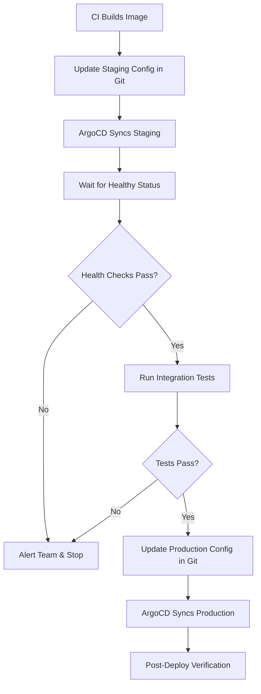

# How to Auto-Promote from Staging to Production with ArgoCD

Author: [nawazdhandala](https://github.com/nawazdhandala)

Tags: ArgoCD, GitOps, Kubernetes, CI/CD, Continuous Delivery

Description: Learn how to set up automated promotion from staging to production with ArgoCD using CI pipelines, health checks, and progressive delivery gates.

---

Fully automated promotion from staging to production is the holy grail of continuous delivery. When your test suite and monitoring give you high confidence, you can eliminate manual intervention entirely and ship changes from staging to production automatically. This guide walks through building an automated promotion pipeline with ArgoCD that only promotes when staging is verified healthy.

## The Auto-Promotion Pipeline

The automated flow works like this:



The key components are: staging deployment, health verification, automated testing, and conditional promotion to production.

## Step 1: Staging Deployment with Auto-Sync

Configure your staging ArgoCD Application with auto-sync enabled:

```yaml
apiVersion: argoproj.io/v1alpha1
kind: Application
metadata:
  name: my-app-staging
  namespace: argocd
spec:
  project: default
  source:
    repoURL: https://github.com/myorg/app-config.git
    path: overlays/staging
    targetRevision: main
  destination:
    server: https://kubernetes.default.svc
    namespace: staging
  syncPolicy:
    automated:
      prune: true
      selfHeal: true
    syncOptions:
      - CreateNamespace=true
```

## Step 2: CI Pipeline for Promotion

Create a CI pipeline that handles the entire flow from staging update to production promotion:

```yaml
# .github/workflows/auto-promote.yaml
name: Auto-Promote to Production

on:
  push:
    branches: [main]
    paths:
      - 'overlays/staging/**'

jobs:
  wait-for-staging-sync:
    runs-on: ubuntu-latest
    steps:
      - name: Install ArgoCD CLI
        run: |
          curl -sSL -o /usr/local/bin/argocd \
            https://github.com/argoproj/argo-cd/releases/latest/download/argocd-linux-amd64
          chmod +x /usr/local/bin/argocd

      - name: Login to ArgoCD
        run: |
          argocd login ${{ secrets.ARGOCD_SERVER }} \
            --username admin \
            --password ${{ secrets.ARGOCD_PASSWORD }} \
            --grpc-web

      - name: Wait for staging sync and health
        run: |
          echo "Waiting for ArgoCD to sync staging..."
          argocd app wait my-app-staging \
            --sync \
            --health \
            --timeout 600

          echo "Staging is synced and healthy"

  run-staging-tests:
    needs: wait-for-staging-sync
    runs-on: ubuntu-latest
    steps:
      - name: Checkout test repo
        uses: actions/checkout@v4

      - name: Run integration tests against staging
        run: |
          # Run your integration test suite
          npm run test:integration -- --env staging
        env:
          STAGING_URL: https://staging.myapp.example.com

      - name: Run smoke tests
        run: |
          # Quick smoke tests to verify core functionality
          curl -sf https://staging.myapp.example.com/health || exit 1
          curl -sf https://staging.myapp.example.com/api/v1/status || exit 1

      - name: Check error rates
        run: |
          # Query Prometheus for error rates over last 10 minutes
          ERROR_RATE=$(curl -s \
            "http://prometheus.monitoring:9090/api/v1/query" \
            --data-urlencode 'query=rate(http_requests_total{status=~"5.*",namespace="staging"}[10m])' \
            | jq -r '.data.result[0].value[1] // "0"')

          echo "Error rate: $ERROR_RATE"
          if (( $(echo "$ERROR_RATE > 0.01" | bc -l) )); then
            echo "Error rate exceeds threshold"
            exit 1
          fi

  promote-to-production:
    needs: run-staging-tests
    runs-on: ubuntu-latest
    steps:
      - name: Checkout config repo
        uses: actions/checkout@v4
        with:
          repository: myorg/app-config
          token: ${{ secrets.GIT_TOKEN }}

      - name: Get staging version
        id: version
        run: |
          # Extract the current staging image tag
          VERSION=$(grep -oP 'newTag: \K.*' overlays/staging/kustomization.yaml)
          echo "version=$VERSION" >> $GITHUB_OUTPUT
          echo "Promoting version: $VERSION"

      - name: Update production config
        run: |
          cd overlays/production
          kustomize edit set image myregistry/my-app=myregistry/my-app:${{ steps.version.outputs.version }}

      - name: Commit and push
        run: |
          git config user.name "Auto-Promoter"
          git config user.email "promoter@myorg.com"
          git add .
          git commit -m "Auto-promote my-app ${{ steps.version.outputs.version }} to production

          Staging validation passed:
          - Integration tests: passed
          - Smoke tests: passed
          - Error rate: within threshold"
          git push
```

## Step 3: Production Sync Strategy

For production, you can choose between auto-sync (for full automation) or manual sync (for a final human check):

```yaml
# Option A: Full automation - auto-sync production
apiVersion: argoproj.io/v1alpha1
kind: Application
metadata:
  name: my-app-production
  namespace: argocd
spec:
  project: default
  source:
    repoURL: https://github.com/myorg/app-config.git
    path: overlays/production
    targetRevision: main
  destination:
    server: https://kubernetes.default.svc
    namespace: production
  syncPolicy:
    automated:
      prune: true
      selfHeal: true
    retry:
      limit: 3
      backoff:
        duration: 30s
        factor: 2
        maxDuration: 3m
```

## Canary Validation Before Full Promotion

For safer auto-promotion, integrate with Argo Rollouts to run a canary before fully promoting:

```yaml
apiVersion: argoproj.io/v1alpha1
kind: Rollout
metadata:
  name: my-app
  namespace: production
spec:
  replicas: 5
  strategy:
    canary:
      steps:
        - setWeight: 10
        - pause: { duration: 5m }
        - analysis:
            templates:
              - templateName: success-rate
            args:
              - name: service-name
                value: my-app
        - setWeight: 50
        - pause: { duration: 10m }
        - analysis:
            templates:
              - templateName: success-rate
        - setWeight: 100
  selector:
    matchLabels:
      app: my-app
  template:
    metadata:
      labels:
        app: my-app
    spec:
      containers:
        - name: my-app
          image: myregistry/my-app:v1.2.3
```

The AnalysisTemplate queries your metrics to validate the canary:

```yaml
apiVersion: argoproj.io/v1alpha1
kind: AnalysisTemplate
metadata:
  name: success-rate
spec:
  args:
    - name: service-name
  metrics:
    - name: success-rate
      interval: 60s
      count: 5
      successCondition: result[0] >= 0.99
      failureLimit: 2
      provider:
        prometheus:
          address: http://prometheus.monitoring:9090
          query: |
            sum(rate(http_requests_total{status!~"5.*",service="{{args.service-name}}"}[5m]))
            /
            sum(rate(http_requests_total{service="{{args.service-name}}"}[5m]))
```

## Using ArgoCD Notifications for Promotion Events

Set up notifications to keep the team informed about automatic promotions:

```yaml
apiVersion: v1
kind: ConfigMap
metadata:
  name: argocd-notifications-cm
  namespace: argocd
data:
  trigger.on-deployed: |
    - when: app.status.operationState.phase in ['Succeeded'] and app.status.health.status == 'Healthy'
      send: [deployment-success]

  trigger.on-deploy-failed: |
    - when: app.status.operationState.phase in ['Error', 'Failed']
      send: [deployment-failure]

  template.deployment-success: |
    slack:
      attachments: |
        [{
          "title": "Auto-Promotion Succeeded",
          "text": "{{.app.metadata.name}} deployed successfully",
          "color": "#18be52",
          "fields": [{
            "title": "Revision",
            "value": "{{.app.status.sync.revision | trunc 7}}",
            "short": true
          }]
        }]

  template.deployment-failure: |
    slack:
      attachments: |
        [{
          "title": "Auto-Promotion Failed",
          "text": "{{.app.metadata.name}} deployment failed - manual intervention needed",
          "color": "#E96D76"
        }]
```

## Automatic Rollback on Failure

If the production deployment fails, automatically roll back to the previous version:

```yaml
# In the CI pipeline, add a post-deploy verification job
post-deploy-verification:
  needs: promote-to-production
  runs-on: ubuntu-latest
  steps:
    - name: Wait for production sync
      run: |
        argocd app wait my-app-production --sync --health --timeout 600 || {
          echo "Production deployment failed, initiating rollback"

          # Get the previous revision
          PREVIOUS_REV=$(argocd app history my-app-production \
            --output json | jq -r '.[1].revision')

          # Rollback in Git
          cd overlays/production
          git revert HEAD --no-edit
          git push

          exit 1
        }

    - name: Run production smoke tests
      run: |
        sleep 60  # Allow traffic to stabilize

        for i in $(seq 1 5); do
          HTTP_CODE=$(curl -s -o /dev/null -w "%{http_code}" \
            https://myapp.example.com/health)
          if [ "$HTTP_CODE" != "200" ]; then
            echo "Health check failed with $HTTP_CODE"
            exit 1
          fi
          sleep 10
        done
```

## Guardrails for Auto-Promotion

Even with full automation, add guardrails to prevent runaway failures:

```yaml
# Limit auto-promotion to business hours
# In the CI workflow
promote-to-production:
  if: |
    needs.run-staging-tests.result == 'success' &&
    github.event.head_commit.timestamp >= '09:00' &&
    github.event.head_commit.timestamp <= '16:00'
```

Consider adding a promotion rate limit. If multiple versions are queued, promote only the latest one rather than cycling through each version sequentially.

Also implement a circuit breaker pattern. If the last N promotions failed, pause auto-promotion and require manual intervention:

```bash
# Check recent promotion history before proceeding
RECENT_FAILURES=$(git log --oneline -10 -- overlays/production/ \
  | grep -c "Rollback\|Revert")

if [ "$RECENT_FAILURES" -ge 3 ]; then
  echo "Too many recent rollbacks. Auto-promotion paused."
  # Notify team
  exit 1
fi
```

Auto-promotion from staging to production eliminates deployment delays and reduces the human bottleneck in your release process. The key is building confidence through comprehensive staging validation, canary analysis, and automatic rollback. Start with a simple pipeline and add sophistication as your test coverage and monitoring improve.
