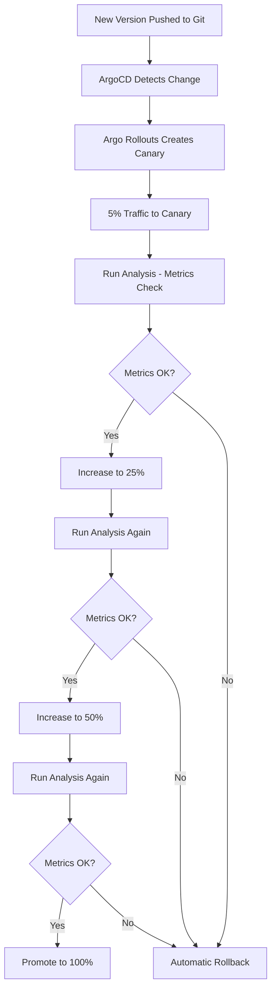

# How to Implement Automated Canary Testing with ArgoCD

Author: [nawazdhandala](https://github.com/nawazdhandala)

Tags: ArgoCD, GitOps, Kubernetes, Canary Testing, Argo Rollouts

Description: Learn how to implement automated canary testing with ArgoCD and Argo Rollouts, including metric-based analysis, automated promotion, and rollback on failure.

---

Canary deployments let you test new code on a small subset of traffic before rolling it out to everyone. But a canary deployment without automated testing is just a manual deployment with extra steps. The real power comes from automated canary analysis - where your system automatically decides whether to promote or roll back based on real metrics.

This guide shows you how to combine ArgoCD with Argo Rollouts to build a fully automated canary testing pipeline that makes promotion decisions based on actual production data.

## How Automated Canary Testing Works

The concept is straightforward: deploy the new version alongside the old one, send a small percentage of traffic to the new version, measure how it performs, and either promote or roll back based on the results.



## Prerequisites

You need ArgoCD and Argo Rollouts installed in your cluster. Install Argo Rollouts if you have not already:

```bash
# Install Argo Rollouts controller
kubectl create namespace argo-rollouts
kubectl apply -n argo-rollouts \
  -f https://github.com/argoproj/argo-rollouts/releases/latest/download/install.yaml

# Install the kubectl plugin for easier management
brew install argoproj/tap/kubectl-argo-rollouts
```

## Configuring Prometheus for Metric Analysis

Automated canary testing needs a metric source. Prometheus is the most common choice. First, define an AnalysisTemplate that queries your metrics:

```yaml
apiVersion: argoproj.io/v1alpha1
kind: AnalysisTemplate
metadata:
  name: canary-success-rate
spec:
  args:
    - name: service-name
    - name: namespace
  metrics:
    - name: success-rate
      # Run every 60 seconds during analysis
      interval: 60s
      # Need at least 3 measurements
      count: 3
      # All measurements must pass
      failureLimit: 0
      provider:
        prometheus:
          address: http://prometheus.monitoring.svc:9090
          query: |
            sum(rate(http_requests_total{
              service="{{args.service-name}}",
              namespace="{{args.namespace}}",
              status=~"2.."
            }[5m])) /
            sum(rate(http_requests_total{
              service="{{args.service-name}}",
              namespace="{{args.namespace}}"
            }[5m])) * 100
      successCondition: result[0] >= 99.0
      failureCondition: result[0] < 95.0
```

This template checks that the canary maintains a 99% success rate. If it drops below 95%, the canary fails immediately. Between 95% and 99%, it is considered inconclusive and the analysis continues.

## Building the Rollout Spec

Replace your Deployment with a Rollout resource:

```yaml
apiVersion: argoproj.io/v1alpha1
kind: Rollout
metadata:
  name: api-service
spec:
  replicas: 5
  revisionHistoryLimit: 3
  selector:
    matchLabels:
      app: api-service
  template:
    metadata:
      labels:
        app: api-service
    spec:
      containers:
        - name: api
          image: myregistry.io/api-service:v2.1.0
          ports:
            - containerPort: 8080
          resources:
            requests:
              cpu: 100m
              memory: 128Mi
            limits:
              cpu: 500m
              memory: 512Mi
  strategy:
    canary:
      # Canary service receives canary traffic
      canaryService: api-service-canary
      # Stable service receives production traffic
      stableService: api-service-stable
      trafficRouting:
        # Using Istio for traffic splitting
        istio:
          virtualServices:
            - name: api-service-vsvc
              routes:
                - primary
      steps:
        # Step 1: 5% traffic, run analysis for 3 minutes
        - setWeight: 5
        - analysis:
            templates:
              - templateName: canary-success-rate
            args:
              - name: service-name
                value: api-service-canary
              - name: namespace
                valueFrom:
                  fieldRef:
                    fieldPath: metadata.namespace
        # Step 2: 25% traffic, run analysis for 3 minutes
        - setWeight: 25
        - analysis:
            templates:
              - templateName: canary-success-rate
            args:
              - name: service-name
                value: api-service-canary
              - name: namespace
                valueFrom:
                  fieldRef:
                    fieldPath: metadata.namespace
        # Step 3: 50% traffic, run analysis for 3 minutes
        - setWeight: 50
        - analysis:
            templates:
              - templateName: canary-success-rate
            args:
              - name: service-name
                value: api-service-canary
              - name: namespace
                valueFrom:
                  fieldRef:
                    fieldPath: metadata.namespace
        # Step 4: 75% traffic, final analysis
        - setWeight: 75
        - analysis:
            templates:
              - templateName: canary-success-rate
            args:
              - name: service-name
                value: api-service-canary
              - name: namespace
                valueFrom:
                  fieldRef:
                    fieldPath: metadata.namespace
      # Automatic rollback on failure
      rollbackWindow:
        revisions: 1
```

## Adding Latency Analysis

Success rate alone is not enough. You also want to check that latency stays within acceptable bounds:

```yaml
apiVersion: argoproj.io/v1alpha1
kind: AnalysisTemplate
metadata:
  name: canary-latency
spec:
  args:
    - name: service-name
    - name: namespace
  metrics:
    - name: p99-latency
      interval: 60s
      count: 3
      failureLimit: 0
      provider:
        prometheus:
          address: http://prometheus.monitoring.svc:9090
          query: |
            histogram_quantile(0.99,
              sum(rate(http_request_duration_seconds_bucket{
                service="{{args.service-name}}",
                namespace="{{args.namespace}}"
              }[5m])) by (le)
            )
      # P99 latency must be under 500ms
      successCondition: result[0] < 0.5
      failureCondition: result[0] > 1.0
```

Now reference both analysis templates in your rollout steps:

```yaml
steps:
  - setWeight: 5
  - analysis:
      templates:
        - templateName: canary-success-rate
        - templateName: canary-latency
      args:
        - name: service-name
          value: api-service-canary
        - name: namespace
          valueFrom:
            fieldRef:
              fieldPath: metadata.namespace
```

## Custom Metric Providers with Web Analysis

If your metrics are not in Prometheus, you can use a web-based analysis that calls an HTTP endpoint:

```yaml
apiVersion: argoproj.io/v1alpha1
kind: AnalysisTemplate
metadata:
  name: canary-custom-check
spec:
  metrics:
    - name: custom-health-check
      interval: 30s
      count: 5
      failureLimit: 1
      provider:
        web:
          url: "http://api-service-canary.default.svc:8080/health/deep"
          timeoutSeconds: 10
          jsonPath: "{$.healthy}"
      successCondition: "result == true"
```

## Integrating with ArgoCD

ArgoCD manages the Rollout resource just like it manages Deployments. When you commit a new image tag to your Git repository, ArgoCD syncs the change, and Argo Rollouts handles the canary progression:

```yaml
# ArgoCD Application pointing to your rollout manifests
apiVersion: argoproj.io/v1alpha1
kind: Application
metadata:
  name: api-service
  namespace: argocd
spec:
  project: default
  source:
    repoURL: https://github.com/myorg/gitops-repo
    targetRevision: main
    path: apps/api-service
  destination:
    server: https://kubernetes.default.svc
    namespace: default
  syncPolicy:
    automated:
      prune: true
      selfHeal: true
```

The key point is that ArgoCD handles the Git-to-cluster sync, while Argo Rollouts handles the progressive delivery. They work together without conflict.

## Monitoring Canary Progress

Use the Argo Rollouts kubectl plugin to watch canary progress in real time:

```bash
# Watch the rollout progress
kubectl argo rollouts get rollout api-service --watch

# Check analysis run results
kubectl get analysisrun -l rollouts-pod-template-hash

# View detailed analysis results
kubectl describe analysisrun api-service-abc123-2
```

You can also view canary status in the ArgoCD UI. The Rollout resource shows its current step and analysis status.

## Anti-Patterns to Avoid

1. **Testing with too little traffic** - A 1% canary with low traffic volume produces statistically meaningless metrics. Make sure you have enough requests per minute to get reliable data.

2. **Analysis windows too short** - Running analysis for 30 seconds does not catch issues that manifest after a minute of load. Use at least 2 to 3 minutes per step.

3. **Missing baseline comparison** - Comparing canary metrics to hardcoded thresholds can produce false positives. Consider using the `AnalysisTemplate` with a baseline comparison instead.

4. **No rollback testing** - Test your rollback process regularly. Make sure it actually works before you need it in an emergency.

For more details on ArgoCD rollback strategies, see our guide on [rollback strategies in ArgoCD](https://oneuptime.com/blog/post/2026-01-25-rollback-strategies-argocd/view).

## Production Checklist

Before enabling automated canary testing in production:

- Verify Prometheus is collecting metrics from both canary and stable services
- Test analysis templates with known-good and known-bad scenarios
- Configure alerting for failed canary rollouts
- Set up OneUptime monitoring to track the overall success rate of canary deployments
- Document the manual override process for emergency situations
- Ensure your traffic routing (Istio, Nginx, or ALB) is correctly splitting traffic

Automated canary testing transforms deployments from a manual, anxiety-inducing process into a metrics-driven, automated workflow. ArgoCD handles the GitOps side, Argo Rollouts handles the progressive delivery, and your metrics pipeline handles the decision-making. The result is deployments that validate themselves.
