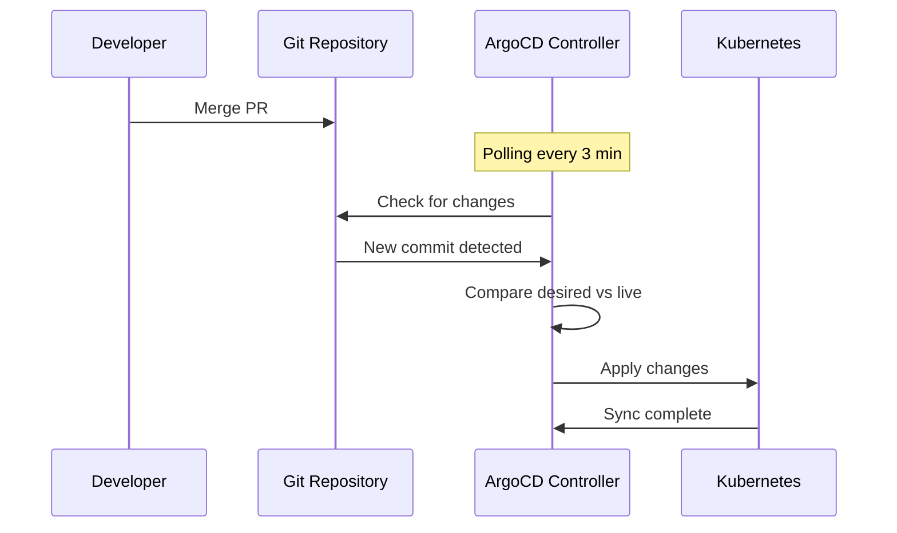
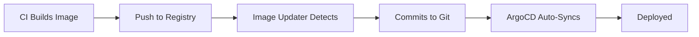

# How to Implement Automated Deployment on Merge

Author: [nawazdhandala](https://github.com/nawazdhandala)

Tags: ArgoCD, GitOps, Kubernetes, Automation, CI/CD

Description: Learn how to set up automated deployments triggered by Git merges with ArgoCD, including auto-sync configuration, webhook optimization, image updater integration, and multi-environment promotion.

---

The simplest and most powerful pattern in GitOps is this: merge a pull request, and the change deploys automatically. No manual buttons to click, no deployment scripts to run, no separate CI/CD pipeline to trigger. ArgoCD's auto-sync feature makes this possible by continuously watching Git repositories and applying changes as soon as they appear.

This guide covers setting up reliable automated deployment on merge, including the configuration details that make it work smoothly in production.

## How Auto-Sync Works

ArgoCD polls your Git repository at regular intervals (default: 3 minutes). When it detects that the live state differs from the desired state in Git, it automatically syncs:



## Basic Auto-Sync Configuration

Enable automated sync on your ArgoCD Application:

```yaml
apiVersion: argoproj.io/v1alpha1
kind: Application
metadata:
  name: myapp
  namespace: argocd
spec:
  project: default
  source:
    repoURL: https://github.com/org/config-repo.git
    targetRevision: HEAD
    path: environments/production
  destination:
    server: https://kubernetes.default.svc
    namespace: myapp
  syncPolicy:
    automated:
      # Automatically sync when drift is detected
      prune: true       # Delete resources no longer in Git
      selfHeal: true    # Revert manual changes to match Git
      allowEmpty: false  # Prevent syncing if manifests are empty
    syncOptions:
    - Validate=true
    - CreateNamespace=true
    - PrunePropagationPolicy=foreground
    - PruneLast=true
    retry:
      limit: 5
      backoff:
        duration: 5s
        factor: 2
        maxDuration: 3m
```

Let me break down the important settings:

- **prune: true** - Removes resources from the cluster that are no longer defined in Git. Without this, deleted manifests leave orphaned resources.
- **selfHeal: true** - If someone uses `kubectl edit` to modify a resource, ArgoCD reverts it back to the Git state. This enforces Git as the single source of truth.
- **allowEmpty: false** - Safety valve. If the rendered manifests somehow produce zero resources (broken Kustomize, empty Helm values), ArgoCD will not delete everything.
- **PruneLast: true** - Prunes deleted resources after all other sync operations complete, reducing the chance of dependency issues.

## Speed Up Deployment with Webhooks

The default 3-minute polling interval means merges can take up to 3 minutes to deploy. Git webhooks reduce this to seconds:

### GitHub Webhook Setup

```bash
# Configure webhook in your GitHub repo settings
# URL: https://argocd.example.com/api/webhook
# Content type: application/json
# Secret: <webhook-secret>
# Events: Push events only
```

Store the webhook secret in ArgoCD:

```bash
kubectl patch secret argocd-secret -n argocd \
  --type merge \
  -p '{"stringData": {"webhook.github.secret": "your-webhook-secret"}}'
```

### GitLab Webhook Setup

```bash
# GitLab webhook URL: https://argocd.example.com/api/webhook
# Secret Token: <webhook-secret>
# Trigger: Push events
```

```bash
kubectl patch secret argocd-secret -n argocd \
  --type merge \
  -p '{"stringData": {"webhook.gitlab.secret": "your-webhook-secret"}}'
```

With webhooks, ArgoCD receives a notification within seconds of a merge and immediately starts syncing.

## ArgoCD Image Updater for Container Images

For application code changes (not infrastructure changes), ArgoCD Image Updater automatically watches container registries and updates image tags:

```yaml
apiVersion: argoproj.io/v1alpha1
kind: Application
metadata:
  name: myapp
  namespace: argocd
  annotations:
    # Watch for new images matching semver
    argocd-image-updater.argoproj.io/image-list: myapp=registry.example.com/myapp
    argocd-image-updater.argoproj.io/myapp.update-strategy: semver
    argocd-image-updater.argoproj.io/myapp.allow-tags: regexp:^v[0-9]+\.[0-9]+\.[0-9]+$

    # Write changes back to Git (instead of just overriding in-cluster)
    argocd-image-updater.argoproj.io/write-back-method: git
    argocd-image-updater.argoproj.io/write-back-target: kustomization
    argocd-image-updater.argoproj.io/git-branch: main
spec:
  # ... standard app spec
```

The flow becomes:



## Multi-Environment Auto-Promotion

Automate promotion from dev to staging to production using a chain of auto-sync applications with different triggers:

```yaml
# Dev: auto-sync on every merge to main
apiVersion: argoproj.io/v1alpha1
kind: Application
metadata:
  name: myapp-dev
spec:
  source:
    targetRevision: HEAD
    path: environments/dev
  syncPolicy:
    automated:
      prune: true
      selfHeal: true
---
# Staging: auto-sync but watches a staging branch
apiVersion: argoproj.io/v1alpha1
kind: Application
metadata:
  name: myapp-staging
spec:
  source:
    targetRevision: release
    path: environments/staging
  syncPolicy:
    automated:
      prune: true
      selfHeal: true
---
# Production: manual sync only (merge to release triggers detection, human clicks sync)
apiVersion: argoproj.io/v1alpha1
kind: Application
metadata:
  name: myapp-production
spec:
  source:
    targetRevision: release
    path: environments/production
  # No automated sync - deliberate manual step for production
```

Then automate the promotion from dev to staging with a CI job:

```yaml
# .github/workflows/promote-to-staging.yaml
name: Promote to Staging
on:
  # Triggered when dev deployment succeeds
  repository_dispatch:
    types: [dev-deployment-succeeded]

jobs:
  promote:
    runs-on: ubuntu-latest
    steps:
    - uses: actions/checkout@v4
      with:
        ref: main

    - name: Get current dev image tag
      id: dev-tag
      run: |
        TAG=$(grep "newTag:" environments/dev/kustomization.yaml | awk '{print $2}')
        echo "tag=${TAG}" >> $GITHUB_OUTPUT

    - name: Update staging
      run: |
        cd environments/staging
        kustomize edit set image myapp=registry.example.com/myapp:${{ steps.dev-tag.outputs.tag }}

    - name: Commit and push
      run: |
        git config user.name "deploy-bot"
        git config user.email "deploy-bot@example.com"
        git add environments/staging/
        git commit -m "Promote to staging: ${{ steps.dev-tag.outputs.tag }}"
        git push
```

## Handling Sync Failures

When auto-sync fails, you need to know immediately. Configure notifications:

```yaml
apiVersion: v1
kind: ConfigMap
metadata:
  name: argocd-notifications-cm
  namespace: argocd
data:
  trigger.on-sync-failed: |
    - when: app.status.operationState.phase in ['Error', 'Failed']
      send: [slack-alert]

  template.slack-alert: |
    message: |
      :x: Deployment failed for *{{.app.metadata.name}}*
      Environment: {{.app.spec.destination.namespace}}
      Revision: {{.app.status.operationState.operation.sync.revision}}
      Error: {{.app.status.operationState.message}}
      <{{.context.argocdUrl}}/applications/{{.app.metadata.name}}|View in ArgoCD>

  service.slack: |
    token: $slack-token
```

## Sync Windows for Production Safety

Even with auto-sync, you may want to restrict when deployments can happen:

```yaml
apiVersion: argoproj.io/v1alpha1
kind: AppProject
metadata:
  name: production
  namespace: argocd
spec:
  syncWindows:
  # Allow syncs only during business hours
  - kind: allow
    schedule: "0 9 * * 1-5"
    duration: 9h
    applications:
    - "*"
  # Block syncs on weekends and nights
  - kind: deny
    schedule: "0 18 * * *"
    duration: 15h
    applications:
    - "*"
  # Emergency override: always allow manual syncs
  - kind: allow
    schedule: "* * * * *"
    duration: 24h
    applications:
    - "*"
    manualSync: true
```

Merges that happen outside the sync window queue up and deploy when the window opens.

## Safety Mechanisms

### Prevent Accidental Mass Deletion

```yaml
syncPolicy:
  automated:
    prune: true
    allowEmpty: false  # Critical safety net
  syncOptions:
  - PruneLast=true
  - RespectIgnoreDifferences=true
```

### Resource Hooks for Pre/Post Deployment

```yaml
# pre-sync-check.yaml
apiVersion: batch/v1
kind: Job
metadata:
  name: pre-deploy-validation
  annotations:
    argocd.argoproj.io/hook: PreSync
    argocd.argoproj.io/hook-delete-policy: HookSucceeded
spec:
  template:
    spec:
      containers:
      - name: validate
        image: org/deploy-validator:latest
        command: ["./validate.sh"]
      restartPolicy: Never
  backoffLimit: 0
```

If the PreSync hook fails, the deployment does not proceed - even with auto-sync enabled.

## Monitoring Automated Deployments

Track deployment frequency and success rate with OneUptime to identify trends and catch degradation in your deployment pipeline.

## Conclusion

Automated deployment on merge is the core value proposition of GitOps with ArgoCD. The key to making it work reliably in production is layering safety mechanisms on top of the basic auto-sync: webhooks for speed, retry policies for transient failures, sync windows for timing control, PreSync hooks for validation, and notifications for failure awareness. Start with auto-sync on development environments, gain confidence, and progressively enable it for staging. For production, many teams keep manual sync as the final gate while still automating everything else - the merge triggers detection, but a human confirms the deployment.
