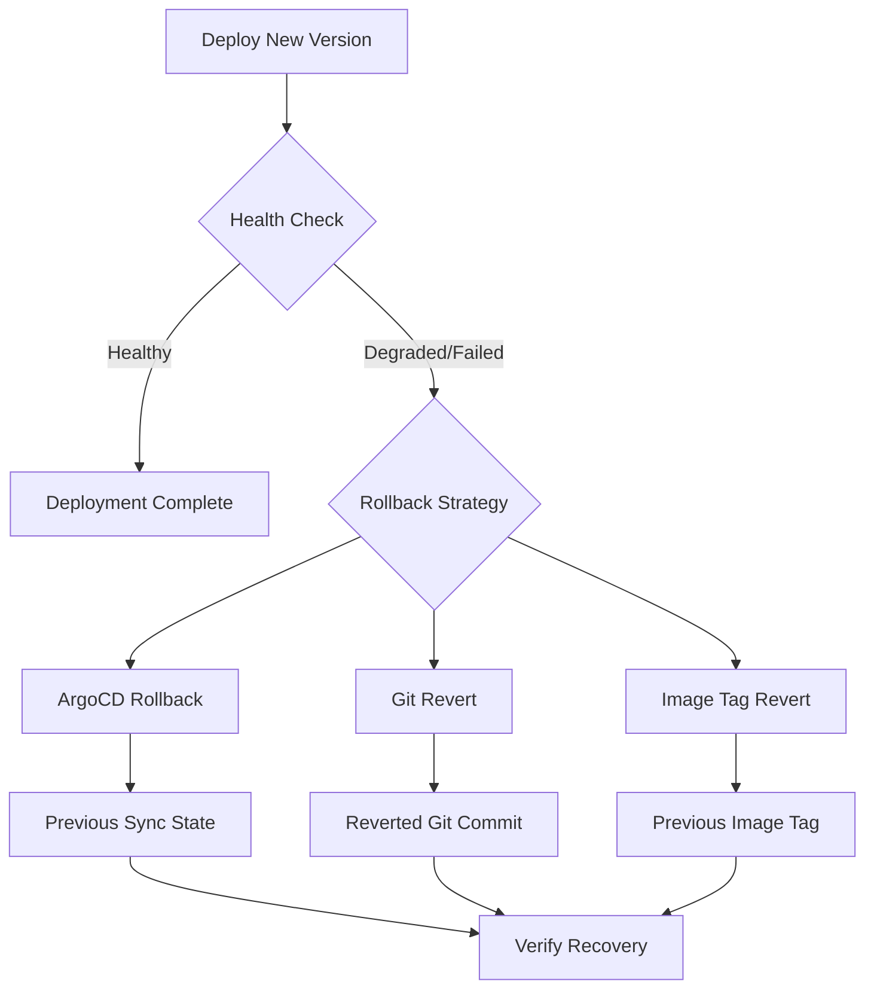

# How to Implement Automated Rollback from CI Pipeline

Author: [nawazdhandala](https://github.com/nawazdhandala)

Tags: ArgoCD, GitOps, Kubernetes, CI/CD, Rollback

Description: Learn how to implement automated rollback mechanisms in your CI pipeline when ArgoCD deployments fail, including health-check-based rollbacks and Git-revert strategies.

---

Automated rollbacks are your safety net for failed deployments. When a new release causes issues - pods crashing, health checks failing, or performance degrading - your CI pipeline should automatically revert to the last known-good state. With ArgoCD and GitOps, rollbacks are just Git operations, but automating the decision-making requires careful design.

## Rollback Strategies

There are several ways to roll back an ArgoCD deployment:

1. **ArgoCD native rollback** - Use ArgoCD's built-in rollback to a previous sync revision
2. **Git revert** - Revert the Git commit that caused the failure
3. **Image tag revert** - Update the manifest to point back to the previous image tag
4. **ArgoCD sync to specific revision** - Sync to a known-good Git commit



## ArgoCD Native Rollback

ArgoCD maintains a history of previous sync operations. You can roll back to any previous state.

### Using the CLI

```bash
# List previous sync history
argocd app history my-app \
  --server $ARGOCD_SERVER \
  --auth-token $ARGOCD_TOKEN \
  --grpc-web

# Rollback to the previous revision
argocd app rollback my-app \
  --server $ARGOCD_SERVER \
  --auth-token $ARGOCD_TOKEN \
  --grpc-web
```

### Using the API

```bash
# Get the previous revision from history
PREV_REVISION=$(curl -sf \
  -H "Authorization: Bearer $ARGOCD_TOKEN" \
  "https://$ARGOCD_SERVER/api/v1/applications/my-app" | \
  jq -r '.status.history[-2].revision')

# Sync to the previous revision
curl -X POST \
  -H "Authorization: Bearer $ARGOCD_TOKEN" \
  -H "Content-Type: application/json" \
  "https://$ARGOCD_SERVER/api/v1/applications/my-app/sync" \
  -d "{
    \"revision\": \"$PREV_REVISION\",
    \"prune\": true
  }"
```

## Automated Rollback Script

Here is a complete rollback script that monitors a deployment and automatically rolls back if it fails:

```bash
#!/bin/bash
# auto-rollback.sh - Deploy with automatic rollback on failure
set -e

APP_NAME="${1:?Usage: $0 <app-name> [timeout]}"
TIMEOUT="${2:-300}"
POLL_INTERVAL=10
ELAPSED=0

# Store the current revision before sync (for rollback)
CURRENT_REVISION=$(argocd app get "$APP_NAME" \
  --server "$ARGOCD_SERVER" \
  --auth-token "$ARGOCD_TOKEN" \
  --grpc-web \
  -o json | jq -r '.status.sync.revision')

echo "Current revision: $CURRENT_REVISION"
echo "Triggering sync..."

# Trigger the sync
argocd app sync "$APP_NAME" \
  --server "$ARGOCD_SERVER" \
  --auth-token "$ARGOCD_TOKEN" \
  --grpc-web \
  --retry-limit 2

# Wait and monitor
echo "Monitoring deployment (timeout: ${TIMEOUT}s)..."

while [ $ELAPSED -lt $TIMEOUT ]; do
  STATUS_JSON=$(argocd app get "$APP_NAME" \
    --server "$ARGOCD_SERVER" \
    --auth-token "$ARGOCD_TOKEN" \
    --grpc-web \
    -o json)

  SYNC_STATUS=$(echo "$STATUS_JSON" | jq -r '.status.sync.status')
  HEALTH_STATUS=$(echo "$STATUS_JSON" | jq -r '.status.health.status')
  OP_PHASE=$(echo "$STATUS_JSON" | jq -r '.status.operationState.phase // "None"')

  echo "  [${ELAPSED}s] Sync=$SYNC_STATUS Health=$HEALTH_STATUS Phase=$OP_PHASE"

  # Success
  if [ "$SYNC_STATUS" = "Synced" ] && [ "$HEALTH_STATUS" = "Healthy" ]; then
    echo "Deployment successful!"
    exit 0
  fi

  # Explicit failure - rollback immediately
  if [ "$OP_PHASE" = "Failed" ] || [ "$OP_PHASE" = "Error" ]; then
    echo "Sync operation failed. Initiating rollback..."
    perform_rollback "$APP_NAME" "$CURRENT_REVISION"
    exit 1
  fi

  # Degraded after sync completed - rollback
  if [ "$HEALTH_STATUS" = "Degraded" ] && [ "$OP_PHASE" = "Succeeded" ]; then
    echo "Application degraded after sync. Initiating rollback..."
    perform_rollback "$APP_NAME" "$CURRENT_REVISION"
    exit 1
  fi

  sleep $POLL_INTERVAL
  ELAPSED=$((ELAPSED + POLL_INTERVAL))
done

# Timeout - treat as failure and rollback
echo "Deployment timed out after ${TIMEOUT}s. Initiating rollback..."
perform_rollback "$APP_NAME" "$CURRENT_REVISION"
exit 1
```

The rollback function:

```bash
perform_rollback() {
  local app_name="$1"
  local target_revision="$2"

  echo "=== ROLLING BACK ==="
  echo "Rolling back $app_name to revision $target_revision"

  # Sync to the previous revision
  argocd app sync "$app_name" \
    --server "$ARGOCD_SERVER" \
    --auth-token "$ARGOCD_TOKEN" \
    --grpc-web \
    --revision "$target_revision" \
    --retry-limit 3

  # Wait for rollback to complete
  argocd app wait "$app_name" \
    --server "$ARGOCD_SERVER" \
    --auth-token "$ARGOCD_TOKEN" \
    --grpc-web \
    --health \
    --timeout 300

  ROLLBACK_HEALTH=$(argocd app get "$app_name" \
    --server "$ARGOCD_SERVER" \
    --auth-token "$ARGOCD_TOKEN" \
    --grpc-web \
    -o json | jq -r '.status.health.status')

  if [ "$ROLLBACK_HEALTH" = "Healthy" ]; then
    echo "Rollback successful. Application is healthy at revision $target_revision"
  else
    echo "WARNING: Rollback completed but application health is $ROLLBACK_HEALTH"
    echo "Manual intervention may be required."
  fi
}
```

## Git-Based Rollback

For a true GitOps rollback, revert the Git commit that caused the failure:

```bash
#!/bin/bash
# git-rollback.sh - Revert the last commit in the manifest repo
set -e

MANIFEST_REPO="$1"
APP_PATH="$2"

git clone "https://$GITHUB_TOKEN@github.com/$MANIFEST_REPO.git" /tmp/manifests
cd /tmp/manifests

# Find the last commit that modified the app path
LAST_COMMIT=$(git log -1 --format="%H" -- "$APP_PATH")

echo "Reverting commit: $LAST_COMMIT"
git revert "$LAST_COMMIT" --no-edit

git config user.email "ci-rollback@example.com"
git config user.name "Rollback Bot"
git push origin main

echo "Git revert pushed. ArgoCD will auto-sync the reverted state."
```

## GitHub Actions with Auto-Rollback

```yaml
# .github/workflows/deploy-with-rollback.yml
name: Deploy with Auto-Rollback
on:
  push:
    branches: [main]
    paths:
      - 'overlays/production/**'

jobs:
  deploy:
    runs-on: ubuntu-latest
    steps:
      - uses: actions/checkout@v4
        with:
          fetch-depth: 2  # Need previous commit for rollback

      - name: Install ArgoCD CLI
        run: |
          curl -sSL -o /usr/local/bin/argocd \
            https://github.com/argoproj/argo-cd/releases/latest/download/argocd-linux-amd64
          chmod +x /usr/local/bin/argocd

      - name: Deploy and monitor
        id: deploy
        continue-on-error: true
        env:
          ARGOCD_SERVER: ${{ secrets.ARGOCD_SERVER }}
          ARGOCD_AUTH_TOKEN: ${{ secrets.ARGOCD_TOKEN }}
        run: |
          # Sync
          argocd app sync myapp-production --grpc-web

          # Wait for healthy state
          argocd app wait myapp-production \
            --grpc-web \
            --health \
            --timeout 300

      - name: Rollback on failure
        if: steps.deploy.outcome == 'failure'
        env:
          ARGOCD_SERVER: ${{ secrets.ARGOCD_SERVER }}
          ARGOCD_AUTH_TOKEN: ${{ secrets.ARGOCD_TOKEN }}
        run: |
          echo "Deployment failed. Rolling back..."

          # Rollback ArgoCD to previous sync
          argocd app rollback myapp-production --grpc-web

          # Wait for rollback to complete
          argocd app wait myapp-production \
            --grpc-web \
            --health \
            --timeout 300

          echo "Rollback complete"

      - name: Revert Git commit on failure
        if: steps.deploy.outcome == 'failure'
        run: |
          git revert HEAD --no-edit
          git push origin main

      - name: Notify on rollback
        if: steps.deploy.outcome == 'failure'
        run: |
          curl -X POST "${{ secrets.SLACK_WEBHOOK }}" \
            -H "Content-Type: application/json" \
            -d '{
              "text": "Production deployment failed and was automatically rolled back. Check CI logs for details."
            }'
```

## Health-Check-Based Rollback Decisions

Define clear criteria for when to trigger a rollback:

```bash
#!/bin/bash
# should-rollback.sh - Determine if a rollback is needed

APP_NAME="$1"

RESPONSE=$(curl -sf \
  -H "Authorization: Bearer $ARGOCD_TOKEN" \
  "https://$ARGOCD_SERVER/api/v1/applications/$APP_NAME")

HEALTH=$(echo "$RESPONSE" | jq -r '.status.health.status')
DEGRADED_RESOURCES=$(echo "$RESPONSE" | jq '[.status.resources[] | select(.health.status == "Degraded")] | length')
TOTAL_RESOURCES=$(echo "$RESPONSE" | jq '.status.resources | length')

# Calculate health percentage
HEALTHY_RESOURCES=$(echo "$RESPONSE" | jq '[.status.resources[] | select(.health.status == "Healthy")] | length')
HEALTH_PERCENT=$((HEALTHY_RESOURCES * 100 / TOTAL_RESOURCES))

echo "Health: $HEALTH"
echo "Healthy resources: $HEALTHY_RESOURCES / $TOTAL_RESOURCES ($HEALTH_PERCENT%)"
echo "Degraded resources: $DEGRADED_RESOURCES"

# Rollback if:
# - Application is Degraded
# - More than 25% of resources are unhealthy
# - Any critical resources are degraded
if [ "$HEALTH" = "Degraded" ] || [ "$HEALTH_PERCENT" -lt 75 ]; then
  echo "ROLLBACK RECOMMENDED"
  exit 1
fi

echo "NO ROLLBACK NEEDED"
exit 0
```

## Preventing Rollback Loops

If the rollback target is also broken, you can end up in a loop. Prevent this by tracking rollback attempts:

```bash
# Check if this is already a rollback commit
LAST_COMMIT_MSG=$(git log -1 --format="%s")
if echo "$LAST_COMMIT_MSG" | grep -q "rollback:"; then
  echo "Previous commit was already a rollback. Not rolling back again."
  echo "Manual intervention required."
  exit 1
fi
```

## Monitoring Rollbacks

Track rollback events to identify patterns. If you are rolling back frequently, it points to quality issues in your pipeline. Configure [ArgoCD notifications](https://oneuptime.com/blog/post/2026-01-25-notifications-argocd/view) to send rollback alerts to your ops channel, and use [monitoring tools](https://oneuptime.com/blog/post/2026-02-26-argocd-prometheus-metrics/view) to track rollback frequency over time.

## Best Practices

1. **Always test rollback procedures** before you need them in an emergency.
2. **Set reasonable timeouts** - long enough for normal rollouts, short enough to catch failures quickly.
3. **Notify the team** on every rollback so the root cause can be investigated.
4. **Keep rollback history** - log which version was rolled back and why.
5. **Prevent rollback loops** - detect if the rollback target is itself a problematic version.
6. **Combine with feature flags** - sometimes disabling a feature flag is faster than a full rollback.

Automated rollbacks with ArgoCD and CI give you confidence to deploy frequently. When things go wrong, the system recovers automatically, minimizing downtime and manual intervention.
