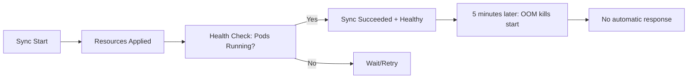

# How to Implement Automatic Rollback on Health Degradation

Author: [nawazdhandala](https://github.com/nawazdhandala)

Tags: ArgoCD, GitOps, Kubernetes, Rollback, Health Monitoring

Description: Learn how to implement automatic rollback in ArgoCD when application health degrades, including custom health checks, Argo Rollouts integration, and self-healing deployment patterns.

---

A deployment that passes initial health checks but degrades over time is one of the most dangerous failure modes. The application starts fine, ArgoCD marks it as healthy, but minutes later error rates climb, latency spikes, or pods start crash-looping. Automatic rollback on health degradation catches these delayed failures and reverts to the last known good state without human intervention. This guide covers implementing this pattern with ArgoCD and its ecosystem.

## The Problem with Standard Deployment Health Checks

ArgoCD's built-in health assessment checks resource status at sync time:



The gap is between "deployment succeeded" and "application is actually working correctly in production." We need to bridge this gap.

## Pattern 1: Argo Rollouts with Analysis

Argo Rollouts is the recommended approach for automatic rollback. It extends Kubernetes Deployments with progressive delivery and automated analysis:

```yaml
# Install Argo Rollouts
apiVersion: argoproj.io/v1alpha1
kind: Application
metadata:
  name: argo-rollouts
  namespace: argocd
spec:
  project: infrastructure
  source:
    repoURL: https://argoproj.github.io/argo-helm
    chart: argo-rollouts
    targetRevision: 2.37.x
  destination:
    server: https://kubernetes.default.svc
    namespace: argo-rollouts
  syncPolicy:
    automated:
      prune: true
    syncOptions:
    - CreateNamespace=true
```

### Rollout with Automated Analysis and Rollback

```yaml
apiVersion: argoproj.io/v1alpha1
kind: Rollout
metadata:
  name: myapp
  namespace: production
spec:
  replicas: 10
  selector:
    matchLabels:
      app: myapp
  template:
    metadata:
      labels:
        app: myapp
    spec:
      containers:
      - name: myapp
        image: registry.example.com/myapp:v2.5.0
        ports:
        - containerPort: 8080
        resources:
          requests:
            cpu: 500m
            memory: 512Mi
          limits:
            cpu: "1"
            memory: 1Gi
  strategy:
    canary:
      # Canary steps with analysis
      steps:
      - setWeight: 10
      - pause: {duration: 2m}
      - analysis:
          templates:
          - templateName: health-check
          args:
          - name: service-name
            value: myapp
      - setWeight: 30
      - pause: {duration: 3m}
      - analysis:
          templates:
          - templateName: health-check
          args:
          - name: service-name
            value: myapp
      - setWeight: 60
      - pause: {duration: 5m}
      - analysis:
          templates:
          - templateName: health-check
          args:
          - name: service-name
            value: myapp
      - setWeight: 100

      # Automatic rollback on failure
      rollbackWindow:
        revisions: 3
      abortScaleDownDelaySeconds: 30
```

### Analysis Template

Define what "healthy" means for your application:

```yaml
apiVersion: argoproj.io/v1alpha1
kind: AnalysisTemplate
metadata:
  name: health-check
  namespace: production
spec:
  args:
  - name: service-name
  metrics:
  # Check error rate from Prometheus
  - name: error-rate
    interval: 30s
    count: 10
    successCondition: result[0] < 0.05  # Less than 5% error rate
    failureCondition: result[0] >= 0.10  # Abort if 10%+ error rate
    failureLimit: 3
    provider:
      prometheus:
        address: http://prometheus.monitoring:9090
        query: |
          sum(rate(http_requests_total{service="{{args.service-name}}",status=~"5.."}[2m]))
          /
          sum(rate(http_requests_total{service="{{args.service-name}}"}[2m]))

  # Check latency P99
  - name: latency-p99
    interval: 30s
    count: 10
    successCondition: result[0] < 500  # Less than 500ms P99
    failureCondition: result[0] >= 1000  # Abort if P99 > 1s
    failureLimit: 3
    provider:
      prometheus:
        address: http://prometheus.monitoring:9090
        query: |
          histogram_quantile(0.99,
            sum(rate(http_request_duration_seconds_bucket{service="{{args.service-name}}"}[2m]))
            by (le)
          ) * 1000

  # Check pod restart count
  - name: pod-restarts
    interval: 60s
    count: 5
    successCondition: result[0] == 0
    failureCondition: result[0] > 2
    failureLimit: 1
    provider:
      prometheus:
        address: http://prometheus.monitoring:9090
        query: |
          sum(increase(kube_pod_container_status_restarts_total{
            namespace="production",
            pod=~"myapp-.*"
          }[5m]))
```

When any analysis metric fails, Argo Rollouts automatically aborts the rollout and reverts to the previous stable version.

## Pattern 2: Custom Controller for Post-Sync Health Monitoring

For deployments not using Argo Rollouts, build a post-sync health monitor:

```yaml
# PostSync hook that monitors health after deployment
apiVersion: batch/v1
kind: Job
metadata:
  name: post-deploy-health-monitor
  annotations:
    argocd.argoproj.io/hook: PostSync
    argocd.argoproj.io/hook-delete-policy: HookSucceeded
spec:
  activeDeadlineSeconds: 600  # 10-minute monitoring window
  template:
    spec:
      containers:
      - name: monitor
        image: org/health-monitor:latest
        command:
        - /bin/sh
        - -c
        - |
          APP_NAME="myapp-production"
          MONITORING_DURATION=300  # 5 minutes
          CHECK_INTERVAL=15  # Check every 15 seconds
          FAILURE_THRESHOLD=5

          ARGOCD_SERVER="argocd-server.argocd.svc.cluster.local"
          failures=0
          checks=0

          echo "Starting post-deployment health monitoring for ${MONITORING_DURATION}s..."

          end_time=$(($(date +%s) + MONITORING_DURATION))

          while [ $(date +%s) -lt $end_time ]; do
            # Check application health via Prometheus
            ERROR_RATE=$(curl -s "http://prometheus.monitoring:9090/api/v1/query" \
              --data-urlencode "query=sum(rate(http_requests_total{service=\"myapp\",status=~\"5..\"}[1m]))/sum(rate(http_requests_total{service=\"myapp\"}[1m]))" \
              | jq -r '.data.result[0].value[1] // "0"')

            checks=$((checks + 1))

            if [ "$(echo "$ERROR_RATE > 0.05" | bc -l)" = "1" ]; then
              failures=$((failures + 1))
              echo "Health check FAILED (${failures}/${FAILURE_THRESHOLD}): error rate ${ERROR_RATE}"

              if [ $failures -ge $FAILURE_THRESHOLD ]; then
                echo "CRITICAL: Health degradation detected. Initiating rollback..."

                # Trigger rollback via ArgoCD API
                curl -s -X PUT \
                  "https://${ARGOCD_SERVER}/api/v1/applications/${APP_NAME}/rollback" \
                  -H "Authorization: Bearer ${ARGOCD_TOKEN}" \
                  -H "Content-Type: application/json" \
                  -d '{"id": 0}'  # Rollback to previous version

                echo "Rollback initiated"
                exit 1
              fi
            else
              echo "Health check OK (${checks}): error rate ${ERROR_RATE}"
              # Reset failure counter on success
              failures=0
            fi

            sleep $CHECK_INTERVAL
          done

          echo "Health monitoring complete. Application is stable."
        env:
        - name: ARGOCD_TOKEN
          valueFrom:
            secretKeyRef:
              name: argocd-health-monitor
              key: token
      restartPolicy: Never
  backoffLimit: 0
```

## Pattern 3: Prometheus Alert-Driven Rollback

Use Prometheus Alertmanager to trigger rollbacks when health degrades:

```yaml
# PrometheusRule for health degradation detection
apiVersion: monitoring.coreos.com/v1
kind: PrometheusRule
metadata:
  name: deployment-health-rules
  namespace: monitoring
spec:
  groups:
  - name: deployment-health
    rules:
    - alert: DeploymentHealthDegraded
      expr: |
        (
          sum(rate(http_requests_total{status=~"5.."}[5m])) by (service)
          /
          sum(rate(http_requests_total[5m])) by (service)
        ) > 0.05
        and
        changes(kube_deployment_status_observed_generation{namespace="production"}[10m]) > 0
      for: 2m
      labels:
        severity: critical
        action: rollback
      annotations:
        summary: "Health degraded after deployment for {{ $labels.service }}"
        description: "Error rate > 5% detected within 10 minutes of a deployment change"
```

Configure Alertmanager to trigger a rollback webhook:

```yaml
# alertmanager.yml
route:
  receiver: default
  routes:
  - match:
      action: rollback
    receiver: argocd-rollback
    repeat_interval: 1h

receivers:
- name: argocd-rollback
  webhook_configs:
  - url: http://rollback-controller.argocd.svc.cluster.local:8080/rollback
    send_resolved: false
```

Build a simple rollback controller:

```python
# rollback-controller/app.py
from flask import Flask, request
import requests

app = Flask(__name__)

ARGOCD_SERVER = "https://argocd-server.argocd.svc.cluster.local"
ARGOCD_TOKEN = os.environ["ARGOCD_TOKEN"]

@app.route("/rollback", methods=["POST"])
def handle_rollback():
    alert = request.json

    for alert_item in alert.get("alerts", []):
        service = alert_item["labels"].get("service", "")
        app_name = f"{service}-production"

        # Get current app state
        headers = {"Authorization": f"Bearer {ARGOCD_TOKEN}"}
        app_info = requests.get(
            f"{ARGOCD_SERVER}/api/v1/applications/{app_name}",
            headers=headers, verify=False
        ).json()

        history = app_info.get("status", {}).get("history", [])
        if len(history) < 2:
            continue

        # Rollback to previous version
        previous = history[-2]
        requests.put(
            f"{ARGOCD_SERVER}/api/v1/applications/{app_name}/rollback",
            headers=headers,
            json={"id": previous["id"]},
            verify=False
        )

        print(f"Rolled back {app_name} to revision {previous['revision'][:7]}")

    return "OK", 200
```

## Pattern 4: ArgoCD Resource Hook with Health Check

Use a PostSync hook that runs a comprehensive health check suite:

```yaml
apiVersion: batch/v1
kind: Job
metadata:
  name: comprehensive-health-check
  annotations:
    argocd.argoproj.io/hook: PostSync
    argocd.argoproj.io/hook-delete-policy: BeforeHookCreation
spec:
  activeDeadlineSeconds: 300
  template:
    spec:
      containers:
      - name: health-check
        image: org/health-checker:latest
        command:
        - /bin/sh
        - -c
        - |
          echo "Running comprehensive health checks..."

          # Check 1: HTTP endpoint responds correctly
          for i in $(seq 1 30); do
            STATUS=$(curl -s -o /dev/null -w "%{http_code}" \
              http://myapp.production.svc.cluster.local:8080/health)
            if [ "$STATUS" != "200" ]; then
              echo "FAIL: Health endpoint returned $STATUS (attempt $i/30)"
              if [ $i -eq 30 ]; then exit 1; fi
              sleep 5
            else
              echo "OK: Health endpoint returned 200"
              break
            fi
          done

          # Check 2: Database connectivity
          curl -sf http://myapp.production.svc.cluster.local:8080/health/db || {
            echo "FAIL: Database health check failed"
            exit 1
          }

          # Check 3: Critical business endpoint works
          RESPONSE=$(curl -sf http://myapp.production.svc.cluster.local:8080/api/v1/status)
          if [ -z "$RESPONSE" ]; then
            echo "FAIL: Critical API endpoint not responding"
            exit 1
          fi

          echo "All health checks passed"
      restartPolicy: Never
  backoffLimit: 0
```

If the PostSync hook fails, ArgoCD marks the sync operation as failed. While this does not automatically rollback, it provides clear visibility that the deployment has issues.

## Git-Based Rollback (Pure GitOps)

For a pure GitOps approach, trigger a Git revert when health degrades:

```bash
#!/bin/bash
# auto-rollback.sh - Called by monitoring system when health degrades
APP_NAME=$1

# Get the last commit that changed the app
LAST_COMMIT=$(git log --oneline -1 -- "environments/production/" | awk '{print $1}')

# Revert the commit
git revert --no-edit $LAST_COMMIT
git push origin main

echo "Reverted commit $LAST_COMMIT. ArgoCD will auto-sync the rollback."
```

This is the purest GitOps approach - the rollback is a Git operation, creating a clear audit trail.

## Monitoring Rollback Events

Track rollback frequency to identify systemic issues:

```yaml
apiVersion: monitoring.coreos.com/v1
kind: PrometheusRule
metadata:
  name: rollback-monitoring
spec:
  groups:
  - name: rollback-tracking
    rules:
    - alert: FrequentRollbacks
      expr: |
        increase(argocd_app_rollback_total[24h]) > 3
      labels:
        severity: warning
      annotations:
        summary: "Application {{ $labels.name }} has rolled back more than 3 times in 24h"
```

Use [OneUptime](https://oneuptime.com/blog/post/2026-02-09-argocd-monitoring-prometheus/view) to monitor both the health metrics that trigger rollbacks and the rollback events themselves, creating a complete picture of deployment reliability.

## Conclusion

Automatic rollback on health degradation closes the gap between "deployment succeeded" and "application is actually working." Argo Rollouts with AnalysisTemplates provides the most sophisticated approach, running continuous health checks during progressive delivery and automatically aborting if metrics degrade. For simpler setups, PostSync hooks that monitor health and trigger rollbacks via the ArgoCD API work well. The Prometheus alert-driven approach scales best because it uses your existing monitoring infrastructure. Whichever pattern you choose, the goal is the same: detect health degradation quickly and revert to the last known good state before users are significantly impacted.
