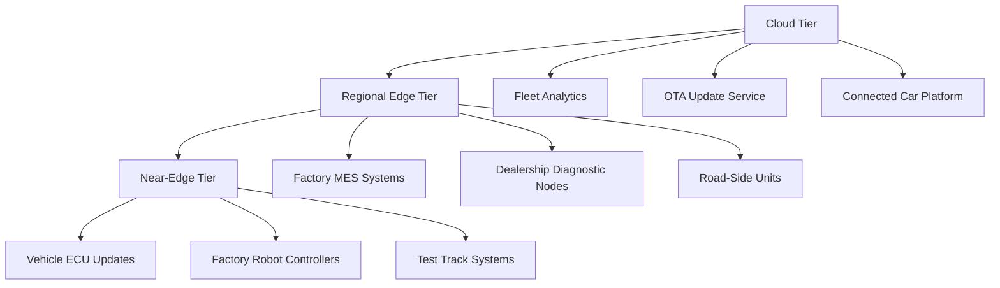

# ArgoCD for Automotive: Edge and Cloud Hybrid Deployments

Author: [nawazdhandala](https://github.com/nawazdhandala)

Tags: ArgoCD, GitOps, Kubernetes, Automotive, Edge Computing

Description: Learn how to use ArgoCD to manage hybrid edge and cloud deployments for automotive platforms, including vehicle fleet management, factory floor systems, and connected car infrastructure.

---

The automotive industry is undergoing a massive shift toward software-defined vehicles and connected car platforms. Modern vehicles generate terabytes of data, run containerized workloads at the edge (factory floors, dealerships, data centers near roads), and need cloud backends for analytics, OTA updates, and fleet management. Managing this hybrid infrastructure with traditional deployment tools is nearly impossible at scale. ArgoCD provides a GitOps-based approach that works across both cloud Kubernetes clusters and edge computing nodes.

This guide covers deploying and managing automotive infrastructure with ArgoCD across cloud and edge environments.

## The Automotive Hybrid Challenge

Automotive deployments span at least three tiers:



Each tier has different connectivity, compute capabilities, and update cadences. A single ArgoCD instance (or a federated set) needs to manage all of them.

## Multi-Tier Cluster Registration

Register your automotive clusters with ArgoCD using labels that reflect the deployment tier:

```yaml
# Register cloud clusters
apiVersion: v1
kind: Secret
metadata:
  name: cloud-analytics-cluster
  namespace: argocd
  labels:
    argocd.argoproj.io/secret-type: cluster
    tier: cloud
    region: us-east-1
    purpose: analytics
type: Opaque
stringData:
  name: cloud-analytics-us-east
  server: https://eks-analytics.us-east-1.auto-corp.com
  config: |
    {
      "awsAuthConfig": {
        "clusterName": "analytics-us-east",
        "roleARN": "arn:aws:iam::123456789:role/argocd-manager"
      }
    }
---
# Register factory edge clusters
apiVersion: v1
kind: Secret
metadata:
  name: factory-munich-cluster
  namespace: argocd
  labels:
    argocd.argoproj.io/secret-type: cluster
    tier: edge
    facility: munich-plant
    purpose: manufacturing
type: Opaque
stringData:
  name: factory-munich
  server: https://k3s.munich-plant.auto-corp.internal
  config: |
    {
      "bearerToken": "<service-account-token>",
      "tlsClientConfig": {
        "caData": "<base64-ca-cert>"
      }
    }
```

## ApplicationSet for Factory Deployments

Deploy manufacturing execution system (MES) components to all factory clusters:

```yaml
# applicationsets/factory-mes.yaml
apiVersion: argoproj.io/v1alpha1
kind: ApplicationSet
metadata:
  name: factory-mes
  namespace: argocd
spec:
  generators:
  - clusters:
      selector:
        matchLabels:
          tier: edge
          purpose: manufacturing
  template:
    metadata:
      name: 'mes-{{name}}'
    spec:
      project: manufacturing
      source:
        repoURL: https://git.auto-corp.com/manufacturing/mes-platform.git
        targetRevision: HEAD
        path: deploy/edge
        helm:
          values: |
            facility: "{{metadata.labels.facility}}"
            # Edge nodes have limited resources
            resources:
              requests:
                cpu: 500m
                memory: 512Mi
              limits:
                cpu: "2"
                memory: 2Gi
            # Local storage only - no cloud dependencies
            storage:
              class: local-path
              size: 50Gi
            # Reduced replica count for edge
            replicaCount: 2
      destination:
        server: '{{server}}'
        namespace: mes-system
      syncPolicy:
        automated:
          prune: true
          selfHeal: true
        retry:
          limit: 10
          backoff:
            duration: 30s
            factor: 2
            maxDuration: 30m
```

## OTA Update Service Deployment

Over-the-air update services are safety-critical. Deploy them with careful sync wave ordering:

```yaml
# ota-platform/application.yaml
apiVersion: argoproj.io/v1alpha1
kind: Application
metadata:
  name: ota-platform
  namespace: argocd
spec:
  project: connected-vehicle
  source:
    repoURL: https://git.auto-corp.com/connected-vehicle/ota-platform.git
    targetRevision: v5.2.0  # Pin to exact version for safety
    path: deploy
    helm:
      values: |
        # OTA signing service - most critical component
        signingService:
          replicas: 3
          image:
            tag: v5.2.0-fips  # FIPS for regulatory compliance
          resources:
            requests:
              cpu: "2"
              memory: 4Gi
          # HSM integration for code signing
          hsm:
            enabled: true
            provider: aws-cloudhsm
            slot: "0"
          podDisruptionBudget:
            minAvailable: 2

        # Update distribution service
        distributionService:
          replicas: 6
          strategy:
            type: RollingUpdate
            rollingUpdate:
              maxUnavailable: 0
              maxSurge: 1

        # Campaign management
        campaignService:
          replicas: 3
  destination:
    server: https://kubernetes.default.svc
    namespace: ota-platform
  syncPolicy:
    # Manual sync only for OTA - too critical for auto-sync
    syncOptions:
    - CreateNamespace=true
    - PrunePropagationPolicy=foreground
```

Notice the deliberate choice to not use automated sync for the OTA platform. Vehicle software updates are safety-critical, and every deployment should be explicitly triggered after review.

## Vehicle Data Pipeline

Connected vehicles stream telemetry data that needs real-time processing:

```yaml
# data-pipeline/kafka-consumers.yaml
apiVersion: apps/v1
kind: Deployment
metadata:
  name: vehicle-telemetry-consumer
  namespace: vehicle-data
  annotations:
    argocd.argoproj.io/sync-wave: "2"
spec:
  replicas: 20
  selector:
    matchLabels:
      app: telemetry-consumer
  template:
    metadata:
      labels:
        app: telemetry-consumer
    spec:
      containers:
      - name: consumer
        image: auto-corp/telemetry-consumer:v3.8.0
        env:
        - name: KAFKA_BROKERS
          value: "kafka-0.kafka:9092,kafka-1.kafka:9092,kafka-2.kafka:9092"
        - name: CONSUMER_GROUP
          value: "vehicle-telemetry-prod"
        - name: TOPICS
          value: "vehicle.telemetry.gps,vehicle.telemetry.diagnostics,vehicle.telemetry.battery"
        - name: BATCH_SIZE
          value: "1000"
        - name: TIMESERIES_DB
          value: "timescaledb.vehicle-data:5432"
        resources:
          requests:
            cpu: "1"
            memory: 2Gi
          limits:
            cpu: "2"
            memory: 4Gi
```

## Handling Intermittent Connectivity at Edge Sites

Factory and dealership edge clusters may lose connectivity to the central ArgoCD instance. Configure ArgoCD to handle this gracefully:

```yaml
# argocd-cm ConfigMap adjustments for edge management
apiVersion: v1
kind: ConfigMap
metadata:
  name: argocd-cm
  namespace: argocd
data:
  # Increase timeouts for edge clusters with slow connections
  timeout.reconciliation: 300s

  # Longer connection timeout for edge clusters
  server.connection.timeout: 60

  # Resource exclusions to reduce sync payload size
  resource.exclusions: |
    - apiGroups:
      - "metrics.k8s.io"
      kinds:
      - "*"
      clusters:
      - "factory-*"
    - apiGroups:
      - "events.k8s.io"
      kinds:
      - Event
      clusters:
      - "factory-*"
```

For sites with very unreliable connectivity, deploy a lightweight ArgoCD instance locally and use a pull-based sync model:

```yaml
# Local ArgoCD on factory K3s cluster
# Pulls from Git independently of central management
apiVersion: argoproj.io/v1alpha1
kind: Application
metadata:
  name: local-mes
  namespace: argocd
spec:
  source:
    repoURL: https://git.auto-corp.com/manufacturing/mes-platform.git
    targetRevision: HEAD
    path: deploy/edge
  destination:
    server: https://kubernetes.default.svc
    namespace: mes-system
  syncPolicy:
    automated:
      selfHeal: true
    # Sync every 5 minutes when connectivity is available
    syncOptions:
    - Retry=true
```

## Regulatory Compliance for Automotive

Automotive deployments must comply with ISO 26262 (functional safety), UNECE WP.29 (cybersecurity), and various regional regulations. Track compliance through ArgoCD annotations:

```yaml
# compliance-labels.yaml
apiVersion: apps/v1
kind: Deployment
metadata:
  name: ota-signing-service
  labels:
    compliance/iso-26262-asil: "B"
    compliance/unece-wp29: "true"
    compliance/change-ticket: "CHG-2026-04521"
    compliance/approved-by: "safety-board"
  annotations:
    compliance/last-audit: "2026-02-15"
    compliance/next-audit: "2026-05-15"
spec:
  # ... deployment spec
```

Enforce these labels with a policy engine:

```yaml
# Kyverno policy requiring compliance labels on safety-critical namespaces
apiVersion: kyverno.io/v1
kind: ClusterPolicy
metadata:
  name: require-automotive-compliance-labels
spec:
  validationFailureAction: Enforce
  rules:
  - name: require-safety-classification
    match:
      any:
      - resources:
          kinds:
          - Deployment
          - StatefulSet
          namespaces:
          - "ota-*"
          - "vehicle-*"
    validate:
      message: "Safety-critical deployments must have ISO 26262 ASIL classification"
      pattern:
        metadata:
          labels:
            compliance/iso-26262-asil: "?*"
            compliance/change-ticket: "?*"
```

## Deployment Pipeline for Safety-Critical Components


HIL (Hardware-in-the-Loop) testing is specific to automotive - real ECU hardware validates the software before production deployment. ArgoCD manages the staging environment where HIL tests run, and the production environment only syncs after explicit approval.

## Monitoring and Observability

Monitor the health of your automotive ArgoCD deployment across all tiers. Use [OneUptime](https://oneuptime.com/blog/post/2026-02-09-argocd-monitoring-prometheus/view) to aggregate alerts from cloud and edge clusters, ensuring that factory deployments are always in sync and OTA services maintain their SLAs.

## Conclusion

ArgoCD is well suited for the automotive industry's hybrid edge-cloud architecture because it can manage clusters across wildly different environments - from powerful cloud clusters running analytics to lightweight K3s nodes on factory floors. The key patterns are: using cluster labels and ApplicationSets to target deployments by tier, employing manual sync for safety-critical systems like OTA updates, handling intermittent connectivity at edge sites with increased timeouts and local ArgoCD instances, and enforcing automotive compliance requirements through policy engines. This GitOps approach gives automotive companies the deployment velocity they need while maintaining the traceability and safety controls their industry demands.
