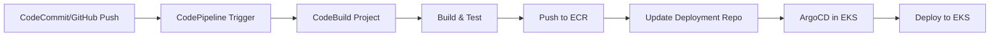

# How to Create a Complete AWS CodeBuild + ArgoCD Pipeline

Author: [nawazdhandala](https://github.com/nawazdhandala)

Tags: ArgoCD, GitOps, Kubernetes, AWS CodeBuild, CI/CD

Description: Learn how to build a complete CI/CD pipeline using AWS CodeBuild for continuous integration with ArgoCD for GitOps deployment to EKS and other Kubernetes clusters.

---

AWS CodeBuild is a fully managed build service that compiles source code, runs tests, and produces deployment artifacts. For teams running EKS (Elastic Kubernetes Service), combining CodeBuild with ArgoCD creates a pipeline that leverages AWS-native CI while using GitOps for deployment. CodeBuild handles the build, ArgoCD handles the deploy.

This guide covers building a production CodeBuild + ArgoCD pipeline targeting EKS.

## Architecture

CodeBuild runs in AWS. ArgoCD runs in your EKS cluster. ECR (Elastic Container Registry) stores the images:



## CodeBuild Project Setup

Define the CodeBuild project using CloudFormation or Terraform. Here is the CloudFormation template:

```yaml
# codebuild-project.yaml
AWSTemplateFormatVersion: '2010-09-09'
Resources:
  CodeBuildProject:
    Type: AWS::CodeBuild::Project
    Properties:
      Name: api-service-build
      Description: Build and push api-service to ECR
      ServiceRole: !GetAtt CodeBuildRole.Arn
      Artifacts:
        Type: NO_ARTIFACTS
      Environment:
        Type: LINUX_CONTAINER
        ComputeType: BUILD_GENERAL1_MEDIUM
        Image: aws/codebuild/amazonlinux2-x86_64-standard:5.0
        PrivilegedMode: true  # Required for Docker builds
        EnvironmentVariables:
          - Name: AWS_ACCOUNT_ID
            Value: !Ref AWS::AccountId
          - Name: ECR_REPO
            Value: !Sub ${AWS::AccountId}.dkr.ecr.${AWS::Region}.amazonaws.com/api-service
          - Name: DEPLOYMENT_REPO
            Value: git@github.com:myorg/k8s-deployments.git
      Source:
        Type: GITHUB
        Location: https://github.com/myorg/api-service.git
        BuildSpec: buildspec.yml
      Triggers:
        Webhook: true
        FilterGroups:
          - - Type: EVENT
              Pattern: PUSH
            - Type: HEAD_REF
              Pattern: ^refs/heads/main$

  CodeBuildRole:
    Type: AWS::IAM::Role
    Properties:
      AssumeRolePolicyDocument:
        Version: '2012-10-17'
        Statement:
          - Effect: Allow
            Principal:
              Service: codebuild.amazonaws.com
            Action: sts:AssumeRole
      ManagedPolicyArns:
        - arn:aws:iam::aws:policy/AmazonEC2ContainerRegistryPowerUser
      Policies:
        - PolicyName: CodeBuildPolicy
          PolicyDocument:
            Version: '2012-10-17'
            Statement:
              - Effect: Allow
                Action:
                  - logs:CreateLogGroup
                  - logs:CreateLogStream
                  - logs:PutLogEvents
                Resource: '*'
              - Effect: Allow
                Action:
                  - secretsmanager:GetSecretValue
                Resource: !Sub arn:aws:secretsmanager:${AWS::Region}:${AWS::AccountId}:secret:deploy-ssh-key-*
```

## BuildSpec Configuration

The `buildspec.yml` in your application repository:

```yaml
# buildspec.yml
version: 0.2

env:
  secrets-manager:
    DEPLOY_SSH_KEY: deploy-ssh-key:ssh-private-key

phases:
  install:
    runtime-versions:
      nodejs: 20
    commands:
      - echo "Installing dependencies..."
      - npm ci

  pre_build:
    commands:
      # Run tests
      - echo "Running tests..."
      - npm run test -- --ci
      - npm run lint

      # Login to ECR
      - echo "Logging into ECR..."
      - aws ecr get-login-password --region $AWS_DEFAULT_REGION | docker login --username AWS --password-stdin $ECR_REPO

      # Set image tag
      - export SHORT_SHA=$(echo $CODEBUILD_RESOLVED_SOURCE_VERSION | cut -c1-7)
      - echo "Image tag will be ${SHORT_SHA}"

  build:
    commands:
      - echo "Building Docker image..."
      - docker build -t $ECR_REPO:$SHORT_SHA -t $ECR_REPO:latest .

  post_build:
    commands:
      # Push image to ECR
      - echo "Pushing image to ECR..."
      - docker push $ECR_REPO:$SHORT_SHA
      - docker push $ECR_REPO:latest

      # Update deployment repository
      - echo "Updating deployment manifests..."
      - |
        mkdir -p ~/.ssh
        echo "$DEPLOY_SSH_KEY" > ~/.ssh/id_rsa
        chmod 600 ~/.ssh/id_rsa
        ssh-keyscan github.com >> ~/.ssh/known_hosts

        git clone $DEPLOYMENT_REPO /tmp/deploy
        cd /tmp/deploy

        sed -i "s|image: ${ECR_REPO}:.*|image: ${ECR_REPO}:${SHORT_SHA}|" \
            apps/api-service/deployment.yaml

        git config user.name "AWS CodeBuild"
        git config user.email "codebuild@myorg.com"
        git add .
        git commit -m "Deploy api-service ${SHORT_SHA}

        CodeBuild: ${CODEBUILD_BUILD_URL}
        Commit: ${CODEBUILD_RESOLVED_SOURCE_VERSION}"
        git push origin main

      - echo "Deployment manifest updated. ArgoCD will sync shortly."

reports:
  test-reports:
    files:
      - 'test-results/**/*'
    file-format: JUNITXML
```

## EKS Deployment Manifests

The manifests in the deployment repository use EKS-specific configurations:

```yaml
# apps/api-service/deployment.yaml
apiVersion: apps/v1
kind: Deployment
metadata:
  name: api-service
  namespace: production
spec:
  replicas: 3
  selector:
    matchLabels:
      app: api-service
  template:
    metadata:
      labels:
        app: api-service
    spec:
      serviceAccountName: api-service
      containers:
        - name: api-service
          image: 123456789012.dkr.ecr.us-east-1.amazonaws.com/api-service:abc1234
          ports:
            - containerPort: 8080
          env:
            # AWS SDK auto-discovers credentials via IRSA
            - name: AWS_REGION
              value: us-east-1
          resources:
            requests:
              cpu: 200m
              memory: 256Mi
            limits:
              cpu: "1"
              memory: 512Mi
          readinessProbe:
            httpGet:
              path: /healthz
              port: 8080
---
# IRSA (IAM Roles for Service Accounts) configuration
apiVersion: v1
kind: ServiceAccount
metadata:
  name: api-service
  namespace: production
  annotations:
    eks.amazonaws.com/role-arn: arn:aws:iam::123456789012:role/api-service-role
```

## ArgoCD Application for EKS

```yaml
# argocd/api-service-app.yaml
apiVersion: argoproj.io/v1alpha1
kind: Application
metadata:
  name: api-service
  namespace: argocd
spec:
  project: applications
  source:
    repoURL: https://github.com/myorg/k8s-deployments.git
    path: apps/api-service
    targetRevision: main
  destination:
    server: https://kubernetes.default.svc
    namespace: production
  syncPolicy:
    automated:
      selfHeal: true
      prune: true
    syncOptions:
      - CreateNamespace=true
    retry:
      limit: 3
      backoff:
        duration: 5s
        factor: 2
        maxDuration: 3m
```

## ECR Authentication for ArgoCD

ArgoCD Image Updater needs ECR access. Use IRSA for secure authentication:

```yaml
# argocd-image-updater service account with IRSA
apiVersion: v1
kind: ServiceAccount
metadata:
  name: argocd-image-updater
  namespace: argocd
  annotations:
    eks.amazonaws.com/role-arn: arn:aws:iam::123456789012:role/argocd-image-updater-role
```

The IAM role policy:

```json
{
  "Version": "2012-10-17",
  "Statement": [
    {
      "Effect": "Allow",
      "Action": [
        "ecr:GetAuthorizationToken",
        "ecr:BatchCheckLayerAvailability",
        "ecr:GetDownloadUrlForLayer",
        "ecr:BatchGetImage",
        "ecr:ListImages",
        "ecr:DescribeImages"
      ],
      "Resource": "*"
    }
  ]
}
```

Configure the Image Updater to watch ECR:

```yaml
apiVersion: argoproj.io/v1alpha1
kind: Application
metadata:
  name: api-service
  annotations:
    argocd-image-updater.argoproj.io/image-list: >
      app=123456789012.dkr.ecr.us-east-1.amazonaws.com/api-service
    argocd-image-updater.argoproj.io/app.update-strategy: latest
    argocd-image-updater.argoproj.io/app.allow-tags: regexp:^[a-f0-9]{7}$
    argocd-image-updater.argoproj.io/write-back-method: git
```

## CodePipeline for Multi-Stage Deployment

Use CodePipeline to orchestrate multiple CodeBuild projects for a multi-stage deployment:

```yaml
# codepipeline.yaml
AWSTemplateFormatVersion: '2010-09-09'
Resources:
  Pipeline:
    Type: AWS::CodePipeline::Pipeline
    Properties:
      Name: api-service-pipeline
      RoleArn: !GetAtt PipelineRole.Arn
      Stages:
        - Name: Source
          Actions:
            - Name: Source
              ActionTypeId:
                Category: Source
                Owner: ThirdParty
                Provider: GitHub
                Version: "1"
              Configuration:
                Owner: myorg
                Repo: api-service
                Branch: main
                OAuthToken: !Sub '{{resolve:secretsmanager:github-token}}'
              OutputArtifacts:
                - Name: SourceOutput

        - Name: Build
          Actions:
            - Name: BuildAndTest
              ActionTypeId:
                Category: Build
                Owner: AWS
                Provider: CodeBuild
                Version: "1"
              Configuration:
                ProjectName: !Ref CodeBuildProject
              InputArtifacts:
                - Name: SourceOutput

        - Name: DeployStaging
          Actions:
            - Name: UpdateStagingManifest
              ActionTypeId:
                Category: Build
                Owner: AWS
                Provider: CodeBuild
                Version: "1"
              Configuration:
                ProjectName: !Ref StagingDeployProject
              InputArtifacts:
                - Name: SourceOutput

        - Name: ApproveProduction
          Actions:
            - Name: ManualApproval
              ActionTypeId:
                Category: Approval
                Owner: AWS
                Provider: Manual
                Version: "1"
              Configuration:
                NotificationArn: !Ref ApprovalSNSTopic

        - Name: DeployProduction
          Actions:
            - Name: UpdateProductionManifest
              ActionTypeId:
                Category: Build
                Owner: AWS
                Provider: CodeBuild
                Version: "1"
              Configuration:
                ProjectName: !Ref ProductionDeployProject
              InputArtifacts:
                - Name: SourceOutput
```

## CloudWatch Monitoring

Send build and deployment events to CloudWatch:

```yaml
# In buildspec.yml post_build phase
- |
  aws cloudwatch put-metric-data \
    --namespace "CI/CD" \
    --metric-name "DeploymentTriggered" \
    --dimensions Service=api-service,Environment=production \
    --value 1 \
    --unit Count
```

## SNS Notifications

Configure SNS to notify your team about deployments:

```yaml
  ApprovalSNSTopic:
    Type: AWS::SNS::Topic
    Properties:
      TopicName: deployment-approvals
      Subscription:
        - Protocol: email
          Endpoint: team@myorg.com
```

## Summary

AWS CodeBuild + ArgoCD creates a fully managed CI pipeline with GitOps deployment. CodeBuild handles building, testing, and pushing images to ECR, then updates the deployment repository. ArgoCD in EKS syncs the changes automatically. IRSA provides secure, token-free authentication between AWS services and your Kubernetes workloads. This combination gives you the reliability of AWS managed services for CI with the operational benefits of GitOps for CD.
