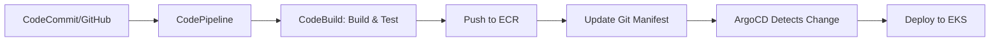

# How to Integrate ArgoCD with AWS CodePipeline

Author: [nawazdhandala](https://github.com/nawazdhandala)

Tags: ArgoCD, GitOps, Kubernetes, AWS, CI/CD

Description: Learn how to integrate ArgoCD with AWS CodePipeline to build a complete GitOps workflow that combines AWS-native CI with Kubernetes-native CD for production deployments.

---

AWS CodePipeline is a popular CI/CD service for teams that run their infrastructure on AWS. When you pair it with ArgoCD for the continuous delivery side, you get the best of both worlds - AWS-native build and test pipelines with GitOps-driven Kubernetes deployments. This guide walks you through connecting the two systems so your pipeline builds container images and ArgoCD handles the actual deployment to Kubernetes.

## Why Combine AWS CodePipeline with ArgoCD

AWS CodePipeline excels at orchestrating build and test stages using CodeBuild, CodeDeploy, and other AWS services. However, when it comes to Kubernetes deployments, using kubectl or Helm directly from CodePipeline introduces several problems. You lose visibility into what is running in the cluster, there is no drift detection, and rollbacks become manual operations.

ArgoCD fills this gap by owning the deployment step. Your CodePipeline handles the CI portion - building images, running tests, pushing to ECR - and then updates a Git repository that ArgoCD watches. ArgoCD then reconciles the cluster state to match what is in Git.



## Setting Up the Pipeline

### Step 1: Create the CodeBuild Build Spec

Your CodeBuild project needs to build the container image, push it to ECR, and then update the Kubernetes manifest repository with the new image tag.

```yaml
# buildspec.yml
version: 0.2

env:
  variables:
    ECR_REPO: "123456789012.dkr.ecr.us-east-1.amazonaws.com/my-app"
    MANIFEST_REPO: "https://github.com/my-org/k8s-manifests.git"
    APP_NAME: "my-app"
  parameter-store:
    GITHUB_TOKEN: "/codebuild/github-token"

phases:
  pre_build:
    commands:
      # Login to ECR
      - aws ecr get-login-password --region us-east-1 | docker login --username AWS --password-stdin $ECR_REPO
      # Set image tag to commit hash
      - export IMAGE_TAG=$(echo $CODEBUILD_RESOLVED_SOURCE_VERSION | cut -c 1-7)
  build:
    commands:
      # Build the container image
      - docker build -t $ECR_REPO:$IMAGE_TAG .
      - docker push $ECR_REPO:$IMAGE_TAG
  post_build:
    commands:
      # Clone the manifest repo and update the image tag
      - git clone https://$GITHUB_TOKEN@github.com/my-org/k8s-manifests.git
      - cd k8s-manifests
      # Update the image tag in the deployment manifest
      - sed -i "s|image: $ECR_REPO:.*|image: $ECR_REPO:$IMAGE_TAG|g" apps/$APP_NAME/deployment.yaml
      - git config user.email "codebuild@example.com"
      - git config user.name "CodeBuild"
      - git add .
      - git commit -m "Update $APP_NAME image to $IMAGE_TAG"
      - git push origin main
```

### Step 2: Define the CodePipeline

Create the pipeline using CloudFormation or Terraform. Here is a CloudFormation snippet that ties together the source, build, and manifest update stages.

```yaml
# codepipeline.yaml
AWSTemplateFormatVersion: '2010-09-09'
Resources:
  Pipeline:
    Type: AWS::CodePipeline::Pipeline
    Properties:
      Name: my-app-pipeline
      RoleArn: !GetAtt PipelineRole.Arn
      Stages:
        - Name: Source
          Actions:
            - Name: SourceAction
              ActionTypeId:
                Category: Source
                Owner: ThirdParty
                Provider: GitHub
                Version: '1'
              Configuration:
                Owner: my-org
                Repo: my-app
                Branch: main
                OAuthToken: !Ref GitHubToken
              OutputArtifacts:
                - Name: SourceOutput
        - Name: Build
          Actions:
            - Name: BuildAction
              ActionTypeId:
                Category: Build
                Owner: AWS
                Provider: CodeBuild
                Version: '1'
              Configuration:
                ProjectName: !Ref CodeBuildProject
              InputArtifacts:
                - Name: SourceOutput
```

### Step 3: Configure ArgoCD Application

On the ArgoCD side, create an Application that watches the manifest repository for changes.

```yaml
# argocd-application.yaml
apiVersion: argoproj.io/v1alpha1
kind: Application
metadata:
  name: my-app
  namespace: argocd
spec:
  project: default
  source:
    repoURL: https://github.com/my-org/k8s-manifests.git
    targetRevision: main
    path: apps/my-app
  destination:
    server: https://kubernetes.default.svc
    namespace: production
  syncPolicy:
    automated:
      prune: true
      selfHeal: true
    syncOptions:
      - CreateNamespace=true
```

With auto-sync enabled, ArgoCD will detect the Git commit from CodeBuild within a few minutes and deploy the new image to your EKS cluster.

## Using ArgoCD API for Pipeline Feedback

Sometimes you want CodePipeline to know whether the ArgoCD deployment succeeded. You can add a post-deployment stage in CodePipeline that checks ArgoCD sync status via its API.

```yaml
# buildspec-verify.yml
version: 0.2

env:
  parameter-store:
    ARGOCD_TOKEN: "/codebuild/argocd-token"
    ARGOCD_SERVER: "/codebuild/argocd-server"

phases:
  build:
    commands:
      # Wait for sync and check status
      - |
        for i in $(seq 1 30); do
          STATUS=$(curl -s -H "Authorization: Bearer $ARGOCD_TOKEN" \
            "https://$ARGOCD_SERVER/api/v1/applications/my-app" | \
            jq -r '.status.sync.status')
          HEALTH=$(curl -s -H "Authorization: Bearer $ARGOCD_TOKEN" \
            "https://$ARGOCD_SERVER/api/v1/applications/my-app" | \
            jq -r '.status.health.status')
          echo "Sync: $STATUS, Health: $HEALTH"
          if [ "$STATUS" = "Synced" ] && [ "$HEALTH" = "Healthy" ]; then
            echo "Deployment successful"
            exit 0
          fi
          sleep 10
        done
        echo "Deployment did not complete in time"
        exit 1
```

## Handling ECR Authentication in ArgoCD

If your ArgoCD Image Updater needs to pull from ECR, you need to configure ECR credentials. The simplest approach on EKS is to use IAM Roles for Service Accounts (IRSA).

```yaml
# argocd-image-updater-sa.yaml
apiVersion: v1
kind: ServiceAccount
metadata:
  name: argocd-image-updater
  namespace: argocd
  annotations:
    # Associate with IAM role that has ECR read access
    eks.amazonaws.com/role-arn: arn:aws:iam::123456789012:role/argocd-image-updater-role
```

## Webhook Configuration for Faster Syncs

By default, ArgoCD polls Git every three minutes. You can set up a webhook from your manifest repository to trigger immediate syncs when CodeBuild pushes changes.

```yaml
# argocd-cm ConfigMap addition
apiVersion: v1
kind: ConfigMap
metadata:
  name: argocd-cm
  namespace: argocd
data:
  # Add webhook secret for GitHub
  webhook.github.secret: "your-webhook-secret"
```

Then configure a GitHub webhook on the manifest repo pointing to `https://argocd.example.com/api/webhook`.

## Security Best Practices

When integrating CodePipeline with ArgoCD, keep these security practices in mind:

1. **Store secrets in Parameter Store or Secrets Manager** - Never hardcode tokens in buildspec files. Use SSM Parameter Store for the ArgoCD API token and GitHub token.

2. **Use IRSA for ECR access** - Instead of storing ECR credentials, use IAM Roles for Service Accounts so pods authenticate natively.

3. **Limit CodeBuild IAM role** - The CodeBuild role should only have permissions to push to ECR and read from Parameter Store. It should not have kubectl access to your cluster.

4. **Use separate repositories** - Keep your application source code and Kubernetes manifests in separate repositories. This enforces the separation between CI and CD concerns.

5. **Enable ArgoCD audit logging** - Track who and what triggered deployments by enabling ArgoCD's audit logging feature.

## Monitoring the Integration

You can monitor your ArgoCD deployments alongside your AWS pipeline using OneUptime. Set up monitors for both the CodePipeline execution status and ArgoCD application health to get end-to-end visibility into your deployment pipeline. Check out [how to send ArgoCD metrics to monitoring tools](https://oneuptime.com/blog/post/2026-02-26-argocd-prometheus-metrics/view) for more on observability.

## Troubleshooting Common Issues

**CodeBuild cannot push to the manifest repo** - Make sure the GitHub token stored in Parameter Store has write access to the manifest repository. Also verify the token has not expired.

**ArgoCD does not detect the change** - Check that the ArgoCD Application is pointing to the correct branch and path. Run `argocd app get my-app` to verify the source configuration.

**Image pull errors after deployment** - If the EKS nodes cannot pull from ECR, verify the node IAM role has the `AmazonEC2ContainerRegistryReadOnly` policy attached.

**Sync takes too long** - Configure a webhook on the manifest repo so ArgoCD picks up changes immediately instead of waiting for the next poll cycle.

This integration pattern gives you a clean separation between CI and CD. AWS CodePipeline handles building and testing, while ArgoCD handles the Kubernetes deployment with full drift detection and self-healing capabilities.
