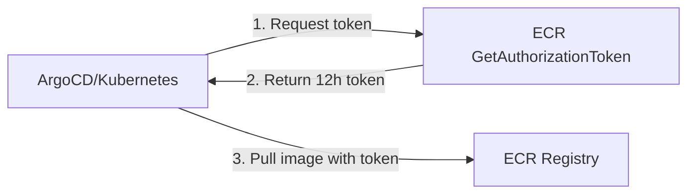

# How to Use ArgoCD with AWS ECR for Image Sources

Author: [nawazdhandala](https://github.com/nawazdhandala)

Tags: ArgoCD, GitOps, Kubernetes, AWS, ECR

Description: Learn how to configure ArgoCD to work with Amazon ECR for pulling container images and OCI Helm charts, including authentication, image updater setup, and cross-account access patterns.

---

Amazon Elastic Container Registry (ECR) is the most common container registry for teams running on AWS. Integrating ECR with ArgoCD involves two main concerns: ensuring your Kubernetes clusters can pull images from ECR, and optionally using ArgoCD Image Updater to automatically detect and deploy new image versions.

This guide covers both the basic and advanced ECR integration patterns with ArgoCD.

## Understanding ECR Authentication

ECR uses temporary tokens that expire every 12 hours. This is fundamentally different from registries like Docker Hub or GitHub Container Registry that use static credentials. You need a mechanism to continuously refresh these tokens.



## Basic Setup: Image Pull Secrets

The simplest approach is creating an ECR image pull secret and refreshing it with a CronJob:

```yaml
# CronJob to refresh ECR token every 6 hours
apiVersion: batch/v1
kind: CronJob
metadata:
  name: ecr-credentials-refresh
  namespace: production
spec:
  schedule: "0 */6 * * *"
  successfulJobsHistoryLimit: 1
  failedJobsHistoryLimit: 1
  jobTemplate:
    spec:
      template:
        spec:
          serviceAccountName: ecr-refresh-sa  # With IRSA
          containers:
            - name: ecr-refresh
              image: amazon/aws-cli:latest
              command:
                - /bin/sh
                - -c
                - |
                  TOKEN=$(aws ecr get-login-password --region us-east-1)
                  kubectl delete secret ecr-registry --namespace production --ignore-not-found
                  kubectl create secret docker-registry ecr-registry \
                    --namespace production \
                    --docker-server=123456789.dkr.ecr.us-east-1.amazonaws.com \
                    --docker-username=AWS \
                    --docker-password=$TOKEN
          restartPolicy: OnFailure
```

Reference the secret in your deployments:

```yaml
apiVersion: apps/v1
kind: Deployment
metadata:
  name: my-app
spec:
  template:
    spec:
      imagePullSecrets:
        - name: ecr-registry
      containers:
        - name: app
          image: 123456789.dkr.ecr.us-east-1.amazonaws.com/my-app:v1.0.0
```

## Better Approach: ECR Credential Helper on Nodes

If you are using EC2-based node groups, the best approach is configuring the ECR credential helper at the node level. EKS nodes come pre-configured to pull from ECR in the same account. For cross-account ECR access, configure the node IAM role:

```json
{
  "Version": "2012-10-17",
  "Statement": [
    {
      "Effect": "Allow",
      "Action": [
        "ecr:GetAuthorizationToken",
        "ecr:BatchCheckLayerAvailability",
        "ecr:GetDownloadUrlForLayer",
        "ecr:BatchGetImage"
      ],
      "Resource": "*"
    }
  ]
}
```

With this in place, no image pull secrets are needed for pods running on the node.

## OCI Helm Charts from ECR

ECR supports OCI artifacts, which means you can store Helm charts in ECR:

```bash
# Push a Helm chart to ECR
aws ecr create-repository --repository-name helm-charts/my-app

# Login to ECR for Helm
aws ecr get-login-password --region us-east-1 | \
  helm registry login --username AWS --password-stdin 123456789.dkr.ecr.us-east-1.amazonaws.com

# Push chart
helm push my-app-1.0.0.tgz oci://123456789.dkr.ecr.us-east-1.amazonaws.com/helm-charts
```

Configure ArgoCD to use OCI Helm charts from ECR:

```yaml
apiVersion: argoproj.io/v1alpha1
kind: Application
metadata:
  name: my-app
  namespace: argocd
spec:
  project: default
  source:
    repoURL: 123456789.dkr.ecr.us-east-1.amazonaws.com/helm-charts
    chart: my-app
    targetRevision: 1.0.0
    helm:
      values: |
        replicaCount: 3
        image:
          repository: 123456789.dkr.ecr.us-east-1.amazonaws.com/my-app
          tag: v1.0.0
  destination:
    server: https://kubernetes.default.svc
    namespace: production
```

Register ECR as a Helm OCI repository in ArgoCD:

```yaml
apiVersion: v1
kind: Secret
metadata:
  name: ecr-helm-repo
  namespace: argocd
  labels:
    argocd.argoproj.io/secret-type: repository
type: Opaque
stringData:
  type: helm
  name: ecr-helm
  url: 123456789.dkr.ecr.us-east-1.amazonaws.com
  enableOCI: "true"
  username: AWS
  password: ""   # ECR token - managed by credential helper
```

For ECR OCI authentication, ArgoCD's repo server needs IRSA with ECR permissions. See our guide on [ArgoCD with AWS IAM Roles for Service Accounts](https://oneuptime.com/blog/post/2026-02-26-argocd-aws-iam-roles-service-accounts/view) for setup details.

## ArgoCD Image Updater with ECR

ArgoCD Image Updater watches container registries for new image tags and automatically updates your ArgoCD Applications. This is particularly useful with ECR for continuous deployment workflows.

### Install Image Updater

```yaml
apiVersion: argoproj.io/v1alpha1
kind: Application
metadata:
  name: argocd-image-updater
  namespace: argocd
spec:
  project: default
  source:
    repoURL: https://argoproj.github.io/argo-helm
    chart: argocd-image-updater
    targetRevision: 0.9.6
    helm:
      values: |
        config:
          registries:
            - name: ECR
              api_url: https://123456789.dkr.ecr.us-east-1.amazonaws.com
              prefix: 123456789.dkr.ecr.us-east-1.amazonaws.com
              credentials: ext:/scripts/ecr-login.sh
              credsexpire: 10h
              default: true
        serviceAccount:
          annotations:
            eks.amazonaws.com/role-arn: arn:aws:iam::123456789:role/ArgoCD-ImageUpdater-Role
  destination:
    server: https://kubernetes.default.svc
    namespace: argocd
```

### ECR Login Script

Create a ConfigMap with the ECR login script:

```yaml
apiVersion: v1
kind: ConfigMap
metadata:
  name: ecr-login-script
  namespace: argocd
data:
  ecr-login.sh: |
    #!/bin/sh
    aws ecr get-login-password --region us-east-1
```

Mount it in the Image Updater deployment:

```yaml
# In the Helm values
extraVolumes:
  - name: ecr-login
    configMap:
      name: ecr-login-script
      defaultMode: 0755

extraVolumeMounts:
  - name: ecr-login
    mountPath: /scripts
```

### Configure Applications for Image Updating

Annotate ArgoCD Applications to enable automatic image updates:

```yaml
apiVersion: argoproj.io/v1alpha1
kind: Application
metadata:
  name: my-api
  namespace: argocd
  annotations:
    # Tell Image Updater to watch this image
    argocd-image-updater.argoproj.io/image-list: >-
      main=123456789.dkr.ecr.us-east-1.amazonaws.com/my-api
    # Use semver strategy - pick the latest semver tag
    argocd-image-updater.argoproj.io/main.update-strategy: semver
    argocd-image-updater.argoproj.io/main.semver-constraint: ">=1.0.0"
    # Write changes back to Git
    argocd-image-updater.argoproj.io/write-back-method: git
    argocd-image-updater.argoproj.io/git-branch: main
spec:
  project: default
  source:
    repoURL: https://github.com/your-org/k8s-config.git
    targetRevision: main
    path: apps/my-api/overlays/production
  destination:
    server: https://kubernetes.default.svc
    namespace: production
```

### Update Strategies

```yaml
# Semver: picks latest matching semantic version
argocd-image-updater.argoproj.io/main.update-strategy: semver
argocd-image-updater.argoproj.io/main.semver-constraint: "~1.5"  # >=1.5.0, <1.6.0

# Latest: picks the most recently pushed tag
argocd-image-updater.argoproj.io/main.update-strategy: latest
argocd-image-updater.argoproj.io/main.allow-tags: "regexp:^v[0-9]+\\.[0-9]+\\.[0-9]+$"

# Digest: updates when the image at a tag is updated (e.g., latest)
argocd-image-updater.argoproj.io/main.update-strategy: digest

# Name: lexicographic sorting of tags
argocd-image-updater.argoproj.io/main.update-strategy: name
```

## Cross-Account ECR Access

If your images are in a different AWS account:

### ECR Repository Policy (in the source account)

```json
{
  "Version": "2012-10-17",
  "Statement": [
    {
      "Sid": "AllowCrossAccountPull",
      "Effect": "Allow",
      "Principal": {
        "AWS": "arn:aws:iam::123456789:root"
      },
      "Action": [
        "ecr:GetDownloadUrlForLayer",
        "ecr:BatchGetImage",
        "ecr:BatchCheckLayerAvailability",
        "ecr:DescribeImages",
        "ecr:ListImages"
      ]
    }
  ]
}
```

```bash
# Apply the policy to the ECR repository
aws ecr set-repository-policy \
  --repository-name my-app \
  --policy-text file://ecr-cross-account-policy.json \
  --region us-east-1 \
  --profile source-account
```

### IAM Policy (in the consuming account)

```json
{
  "Version": "2012-10-17",
  "Statement": [
    {
      "Effect": "Allow",
      "Action": [
        "ecr:GetAuthorizationToken"
      ],
      "Resource": "*"
    },
    {
      "Effect": "Allow",
      "Action": [
        "ecr:BatchCheckLayerAvailability",
        "ecr:GetDownloadUrlForLayer",
        "ecr:BatchGetImage",
        "ecr:DescribeImages",
        "ecr:ListImages"
      ],
      "Resource": "arn:aws:ecr:us-east-1:999999999:repository/my-app"
    }
  ]
}
```

## ECR Image Scanning Integration

ECR provides vulnerability scanning. You can gate ArgoCD deployments based on scan results:

```yaml
# PreSync hook that checks ECR scan results
apiVersion: batch/v1
kind: Job
metadata:
  name: image-scan-check
  annotations:
    argocd.argoproj.io/hook: PreSync
    argocd.argoproj.io/hook-delete-policy: BeforeHookCreation
spec:
  template:
    spec:
      serviceAccountName: scan-checker-sa
      containers:
        - name: scan-check
          image: amazon/aws-cli:latest
          command:
            - /bin/sh
            - -c
            - |
              FINDINGS=$(aws ecr describe-image-scan-findings \
                --repository-name my-app \
                --image-id imageTag=v1.0.0 \
                --query 'imageScanFindings.findingSeverityCounts.CRITICAL' \
                --output text)

              if [ "$FINDINGS" != "None" ] && [ "$FINDINGS" != "0" ]; then
                echo "CRITICAL vulnerabilities found: $FINDINGS"
                exit 1
              fi

              echo "No critical vulnerabilities found."
      restartPolicy: Never
  backoffLimit: 0
```

## ECR Lifecycle Policies

Keep your ECR clean by managing image lifecycle:

```json
{
  "rules": [
    {
      "rulePriority": 1,
      "description": "Keep last 20 release images",
      "selection": {
        "tagStatus": "tagged",
        "tagPrefixList": ["v"],
        "countType": "imageCountMoreThan",
        "countNumber": 20
      },
      "action": {
        "type": "expire"
      }
    },
    {
      "rulePriority": 2,
      "description": "Remove untagged images after 7 days",
      "selection": {
        "tagStatus": "untagged",
        "countType": "sinceImagePushed",
        "countUnit": "days",
        "countNumber": 7
      },
      "action": {
        "type": "expire"
      }
    }
  ]
}
```

## Conclusion

ECR integration with ArgoCD is straightforward once you handle the authentication layer. For basic image pulling, EKS nodes authenticate to ECR automatically within the same account. For cross-account access, IRSA-based image pull secrets or node IAM roles work well. For automated deployments, ArgoCD Image Updater with the ECR login script gives you continuous delivery from ECR to your clusters. The key is never using static credentials - always use IRSA and the ECR credential helper.

For monitoring your container deployments and ECR image scanning results, [OneUptime](https://oneuptime.com) provides unified observability for your entire AWS infrastructure.
