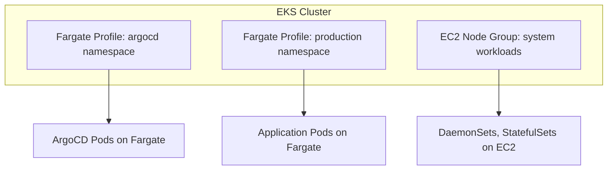

# How to Use ArgoCD with AWS Fargate Profiles

Author: [nawazdhandala](https://github.com/nawazdhandala)

Tags: ArgoCD, GitOps, Kubernetes, AWS, Fargate

Description: Learn how to run ArgoCD on AWS EKS with Fargate profiles, covering setup, limitations, networking considerations, and hybrid node group strategies for serverless Kubernetes.

---

AWS Fargate lets you run Kubernetes pods without managing EC2 nodes. Each pod runs in its own isolated micro-VM, which means no node management, automatic scaling, and per-pod billing. Running ArgoCD on Fargate is possible but comes with specific considerations around storage, networking, and DaemonSets.

This guide covers how to set up ArgoCD with Fargate on EKS and when to use a hybrid approach.

## Understanding Fargate on EKS

When you create a Fargate profile, pods matching the profile's namespace and label selectors run on Fargate instead of EC2 nodes:



## Creating Fargate Profiles

### For ArgoCD

```bash
# Create Fargate profile for ArgoCD
aws eks create-fargate-profile \
  --cluster-name my-cluster \
  --fargate-profile-name argocd \
  --pod-execution-role-arn arn:aws:iam::123456789:role/EKSFargatePodExecutionRole \
  --subnets subnet-aaa subnet-bbb subnet-ccc \
  --selectors '[{"namespace": "argocd"}]'

# Wait for it to be active
aws eks describe-fargate-profile \
  --cluster-name my-cluster \
  --fargate-profile-name argocd \
  --query "fargateProfile.status"
```

### For Application Workloads

```bash
# Create Fargate profile for application namespaces
aws eks create-fargate-profile \
  --cluster-name my-cluster \
  --fargate-profile-name production \
  --pod-execution-role-arn arn:aws:iam::123456789:role/EKSFargatePodExecutionRole \
  --subnets subnet-aaa subnet-bbb subnet-ccc \
  --selectors '[
    {"namespace": "production"},
    {"namespace": "staging"}
  ]'
```

## Installing ArgoCD on Fargate

Fargate has some limitations that affect ArgoCD installation:

1. **No DaemonSets** - Fargate does not support DaemonSets
2. **No privileged containers** - SecurityContext must set `privileged: false`
3. **No HostPort or HostNetwork** - Pods cannot bind to host ports
4. **Storage** - Only ephemeral storage and EFS are supported (no EBS)
5. **Pod size limits** - Maximum 4 vCPU and 30 GB memory per pod

### Modified Helm Values for Fargate

```yaml
# values-fargate.yaml
global:
  image:
    tag: v2.10.0

controller:
  replicas: 1   # Fargate pods start slower - keep replicas manageable
  resources:
    requests:
      cpu: 500m
      memory: 1Gi
    limits:
      cpu: 1
      memory: 2Gi

server:
  replicas: 2
  resources:
    requests:
      cpu: 250m
      memory: 256Mi
    limits:
      cpu: 500m
      memory: 512Mi
  service:
    type: ClusterIP   # Use Ingress, not LoadBalancer

repoServer:
  replicas: 2
  resources:
    requests:
      cpu: 250m
      memory: 256Mi
    limits:
      cpu: 500m
      memory: 512Mi

# Redis - cannot use redis-ha with DaemonSet on Fargate
redis:
  enabled: true
  resources:
    requests:
      cpu: 100m
      memory: 128Mi

# Disable redis-ha (requires DaemonSets or StatefulSets with EBS)
redis-ha:
  enabled: false

# Notifications controller
notifications:
  resources:
    requests:
      cpu: 100m
      memory: 64Mi

configs:
  params:
    server.insecure: true  # Terminate TLS at the ALB
```

```bash
helm repo add argo https://argoproj.github.io/argo-helm
helm install argocd argo/argo-cd -n argocd --create-namespace -f values-fargate.yaml
```

### Important: CoreDNS on Fargate

If your cluster only uses Fargate (no EC2 nodes), you need a Fargate profile for CoreDNS:

```bash
# Create Fargate profile for CoreDNS
aws eks create-fargate-profile \
  --cluster-name my-cluster \
  --fargate-profile-name coredns \
  --pod-execution-role-arn arn:aws:iam::123456789:role/EKSFargatePodExecutionRole \
  --subnets subnet-aaa subnet-bbb \
  --selectors '[{"namespace": "kube-system", "labels": {"k8s-app": "kube-dns"}}]'

# Restart CoreDNS to move to Fargate
kubectl rollout restart deployment coredns -n kube-system
```

## Exposing ArgoCD with ALB

On Fargate, use the AWS Load Balancer Controller with an Ingress:

```yaml
apiVersion: networking.k8s.io/v1
kind: Ingress
metadata:
  name: argocd-server
  namespace: argocd
  annotations:
    alb.ingress.kubernetes.io/scheme: internal
    alb.ingress.kubernetes.io/target-type: ip
    alb.ingress.kubernetes.io/certificate-arn: arn:aws:acm:us-east-1:123456789:certificate/abc-123
    alb.ingress.kubernetes.io/listen-ports: '[{"HTTPS":443}]'
    alb.ingress.kubernetes.io/backend-protocol: HTTP
    alb.ingress.kubernetes.io/healthcheck-path: /healthz
    alb.ingress.kubernetes.io/conditions.argocd-server-grpc: >-
      [{"field":"http-header","httpHeaderConfig":{"httpHeaderName":"Content-Type","values":["application/grpc"]}}]
    alb.ingress.kubernetes.io/actions.argocd-server-grpc: >-
      {"type":"forward","forwardConfig":{"targetGroups":[{"serviceName":"argocd-server","servicePort":"8083"}]}}
spec:
  ingressClassName: alb
  rules:
    - host: argocd.internal.example.com
      http:
        paths:
          - path: /
            pathType: Prefix
            backend:
              service:
                name: argocd-server
                port:
                  number: 80
```

## Storage on Fargate

Fargate pods get 20 GB of ephemeral storage by default. For ArgoCD, this is usually sufficient since the repo server caches Git repos temporarily.

If you need persistent storage (for Redis or other components), use EFS:

```yaml
# EFS StorageClass
apiVersion: storage.k8s.io/v1
kind: StorageClass
metadata:
  name: efs-sc
provisioner: efs.csi.aws.com
parameters:
  provisioningMode: efs-ap
  fileSystemId: fs-xxxxxxxxx
  directoryPerms: "700"

---
# PVC for Redis persistence (optional)
apiVersion: v1
kind: PersistentVolumeClaim
metadata:
  name: redis-data
  namespace: argocd
spec:
  accessModes:
    - ReadWriteOnce
  storageClassName: efs-sc
  resources:
    requests:
      storage: 5Gi
```

## Hybrid Approach: Fargate + EC2

The recommended approach for most production setups is hybrid - run ArgoCD on EC2 managed node groups and application workloads on Fargate:

```bash
# EC2 managed node group for ArgoCD and system workloads
eksctl create nodegroup \
  --cluster my-cluster \
  --name system-ng \
  --node-type m5.large \
  --nodes 3 \
  --nodes-min 2 \
  --nodes-max 5 \
  --node-labels "role=system"

# Fargate profile for application workloads
aws eks create-fargate-profile \
  --cluster-name my-cluster \
  --fargate-profile-name apps \
  --pod-execution-role-arn arn:aws:iam::123456789:role/EKSFargatePodExecutionRole \
  --subnets subnet-aaa subnet-bbb \
  --selectors '[
    {"namespace": "production"},
    {"namespace": "staging"}
  ]'
```

Pin ArgoCD to EC2 nodes:

```yaml
# In ArgoCD Helm values
controller:
  nodeSelector:
    role: system
server:
  nodeSelector:
    role: system
repoServer:
  nodeSelector:
    role: system
```

## Managing Fargate Applications with ArgoCD

Application manifests deployed to Fargate namespaces:

```yaml
apiVersion: argoproj.io/v1alpha1
kind: Application
metadata:
  name: my-api-production
  namespace: argocd
spec:
  project: default
  source:
    repoURL: https://github.com/your-org/k8s-config.git
    targetRevision: main
    path: apps/my-api/overlays/production
  destination:
    server: https://kubernetes.default.svc
    namespace: production   # This namespace has a Fargate profile
  syncPolicy:
    automated:
      prune: true
      selfHeal: true
```

Application manifests need Fargate-compatible settings:

```yaml
apiVersion: apps/v1
kind: Deployment
metadata:
  name: my-api
  namespace: production
spec:
  replicas: 3
  selector:
    matchLabels:
      app: my-api
  template:
    metadata:
      labels:
        app: my-api
    spec:
      # No nodeSelector needed - Fargate profile handles scheduling
      containers:
        - name: api
          image: 123456789.dkr.ecr.us-east-1.amazonaws.com/my-api:v1.0.0
          ports:
            - containerPort: 8080
          resources:
            # Resources are REQUIRED on Fargate
            # Fargate rounds up to the nearest valid CPU/memory combination
            requests:
              cpu: "250m"
              memory: "512Mi"
            limits:
              cpu: "500m"
              memory: "1Gi"
          securityContext:
            readOnlyRootFilesystem: true
            runAsNonRoot: true
            # No privileged: true on Fargate
```

## Fargate Pod Startup Time

Fargate pods take longer to start than EC2 pods (30 to 60 seconds for the micro-VM). Account for this in your ArgoCD health checks and sync timeouts:

```yaml
apiVersion: argoproj.io/v1alpha1
kind: Application
metadata:
  name: my-api-production
spec:
  syncPolicy:
    retry:
      limit: 5
      backoff:
        duration: 30s
        factor: 2
        maxDuration: 5m
```

And in your Deployment:

```yaml
spec:
  template:
    spec:
      containers:
        - name: api
          startupProbe:
            httpGet:
              path: /health
              port: 8080
            initialDelaySeconds: 10
            periodSeconds: 5
            failureThreshold: 20   # Allow 100 seconds for Fargate startup
```

## Monitoring Fargate Pods

Fargate does not support DaemonSets, so you cannot use node-level monitoring agents like Prometheus Node Exporter. Instead, use sidecar or application-level monitoring:

```yaml
# Application with metrics sidecar
spec:
  template:
    spec:
      containers:
        - name: api
          image: my-registry/my-api:v1.0.0
          # ... app config
        - name: metrics
          image: prom/statsd-exporter:latest
          ports:
            - containerPort: 9102
              name: metrics
          resources:
            requests:
              cpu: "50m"
              memory: "32Mi"
```

Or use CloudWatch Container Insights, which works natively with Fargate:

```bash
# Enable Container Insights for Fargate
aws eks create-addon \
  --cluster-name my-cluster \
  --addon-name amazon-cloudwatch-observability \
  --configuration-values '{"containerLogs":{"enabled":true}}'
```

## Conclusion

Running ArgoCD with Fargate on EKS gives you serverless pod execution for your application workloads. For most production setups, a hybrid approach works best - ArgoCD and system components on EC2 managed node groups (for DaemonSet support, faster startup, and EBS storage), and application pods on Fargate (for automatic scaling and no node management). The key is ensuring your manifests are Fargate-compatible: resource requests are required, no privileged containers, no host networking, and account for the longer pod startup times.

For monitoring your Fargate workloads and ArgoCD deployments, [OneUptime](https://oneuptime.com) provides application-level observability that works regardless of your compute platform.
