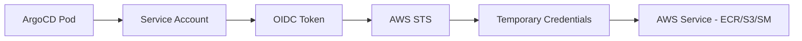
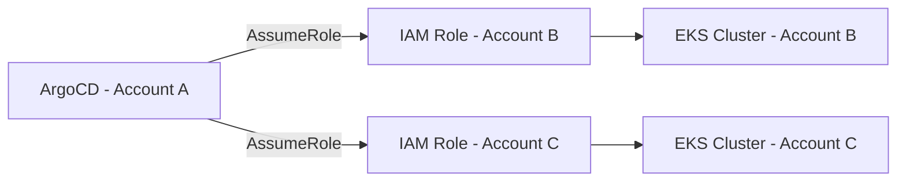

# How to Configure ArgoCD with AWS IAM Roles for Service Accounts

Author: [nawazdhandala](https://github.com/nawazdhandala)

Tags: ArgoCD, GitOps, Kubernetes, AWS, IAM

Description: Learn how to configure ArgoCD components with AWS IAM Roles for Service Accounts (IRSA) for secure, credential-free access to AWS services like ECR, S3, and Secrets Manager.

---

IAM Roles for Service Accounts (IRSA) is the recommended way to give Kubernetes pods access to AWS services. Instead of storing AWS access keys in secrets, IRSA uses short-lived, automatically rotated credentials tied to Kubernetes service accounts. For ArgoCD, this means secure access to ECR for pulling images, S3 for Helm charts, and Secrets Manager for credentials - all without managing any AWS keys.

This guide covers how to configure IRSA for every ArgoCD component that needs AWS access.

## How IRSA Works



The flow:
1. The EKS OIDC provider issues a JWT token to the pod's service account
2. The pod exchanges this token with AWS STS for temporary AWS credentials
3. These credentials are automatically injected as environment variables
4. The pod uses them to access AWS services

## Prerequisites

### Enable OIDC Provider

```bash
# Check if OIDC is already configured
aws eks describe-cluster --name my-cluster --query "cluster.identity.oidc" --output text

# If not, create it
eksctl utils associate-iam-oidc-provider --cluster my-cluster --approve

# Verify
aws iam list-open-id-connect-providers | grep $(aws eks describe-cluster --name my-cluster --query "cluster.identity.oidc.issuer" --output text | cut -d'/' -f5)
```

## IRSA for ArgoCD Repo Server

The repo server is the main component that needs AWS access - it pulls Helm charts from ECR and accesses S3 for artifacts.

### Create the IAM Policy

```json
{
  "Version": "2012-10-17",
  "Statement": [
    {
      "Sid": "ECRReadAccess",
      "Effect": "Allow",
      "Action": [
        "ecr:GetAuthorizationToken",
        "ecr:BatchCheckLayerAvailability",
        "ecr:GetDownloadUrlForLayer",
        "ecr:BatchGetImage",
        "ecr:DescribeRepositories",
        "ecr:ListImages"
      ],
      "Resource": "*"
    },
    {
      "Sid": "S3HelmChartAccess",
      "Effect": "Allow",
      "Action": [
        "s3:GetObject",
        "s3:ListBucket"
      ],
      "Resource": [
        "arn:aws:s3:::my-helm-charts-bucket",
        "arn:aws:s3:::my-helm-charts-bucket/*"
      ]
    }
  ]
}
```

```bash
# Create the policy
aws iam create-policy \
  --policy-name ArgoCD-RepoServer-Policy \
  --policy-document file://repo-server-policy.json
```

### Create the Service Account with IRSA

```bash
eksctl create iamserviceaccount \
  --name argocd-repo-server \
  --namespace argocd \
  --cluster my-cluster \
  --attach-policy-arn arn:aws:iam::123456789:policy/ArgoCD-RepoServer-Policy \
  --approve \
  --override-existing-serviceaccounts
```

Alternatively, create it declaratively:

```yaml
# Trust policy for the IAM role
# Created by eksctl, but shown here for understanding
{
  "Version": "2012-10-17",
  "Statement": [
    {
      "Effect": "Allow",
      "Principal": {
        "Federated": "arn:aws:iam::123456789:oidc-provider/oidc.eks.us-east-1.amazonaws.com/id/ABCDEFG"
      },
      "Action": "sts:AssumeRoleWithWebIdentity",
      "Condition": {
        "StringEquals": {
          "oidc.eks.us-east-1.amazonaws.com/id/ABCDEFG:sub": "system:serviceaccount:argocd:argocd-repo-server",
          "oidc.eks.us-east-1.amazonaws.com/id/ABCDEFG:aud": "sts.amazonaws.com"
        }
      }
    }
  ]
}
```

### Verify the Service Account

```bash
# Check the service account has the IAM role annotation
kubectl get serviceaccount argocd-repo-server -n argocd -o yaml
```

You should see:

```yaml
apiVersion: v1
kind: ServiceAccount
metadata:
  name: argocd-repo-server
  namespace: argocd
  annotations:
    eks.amazonaws.com/role-arn: arn:aws:iam::123456789:role/eksctl-my-cluster-argocd-repo-server
```

### Restart the Repo Server

```bash
kubectl rollout restart deployment argocd-repo-server -n argocd
```

## IRSA for ArgoCD Application Controller

The application controller needs AWS access when managing cross-account EKS clusters:

```json
{
  "Version": "2012-10-17",
  "Statement": [
    {
      "Sid": "AssumeRoleForCrossAccountClusters",
      "Effect": "Allow",
      "Action": "sts:AssumeRole",
      "Resource": [
        "arn:aws:iam::111111111:role/ArgoCD-Managed-Cluster-Role",
        "arn:aws:iam::222222222:role/ArgoCD-Managed-Cluster-Role"
      ]
    },
    {
      "Sid": "EKSAccess",
      "Effect": "Allow",
      "Action": [
        "eks:DescribeCluster",
        "eks:ListClusters"
      ],
      "Resource": "*"
    }
  ]
}
```

```bash
eksctl create iamserviceaccount \
  --name argocd-application-controller \
  --namespace argocd \
  --cluster my-cluster \
  --attach-policy-arn arn:aws:iam::123456789:policy/ArgoCD-Controller-Policy \
  --approve \
  --override-existing-serviceaccounts
```

## IRSA for ArgoCD Server

The ArgoCD server needs AWS access for SSO via Cognito or for webhook integrations:

```json
{
  "Version": "2012-10-17",
  "Statement": [
    {
      "Sid": "CognitoAccess",
      "Effect": "Allow",
      "Action": [
        "cognito-idp:DescribeUserPool",
        "cognito-idp:DescribeUserPoolClient"
      ],
      "Resource": "arn:aws:cognito-idp:us-east-1:123456789:userpool/us-east-1_XXXXX"
    }
  ]
}
```

```bash
eksctl create iamserviceaccount \
  --name argocd-server \
  --namespace argocd \
  --cluster my-cluster \
  --attach-policy-arn arn:aws:iam::123456789:policy/ArgoCD-Server-Policy \
  --approve \
  --override-existing-serviceaccounts
```

## IRSA for ArgoCD Image Updater

If you use ArgoCD Image Updater to automatically update image tags from ECR:

```json
{
  "Version": "2012-10-17",
  "Statement": [
    {
      "Sid": "ECRImageList",
      "Effect": "Allow",
      "Action": [
        "ecr:GetAuthorizationToken",
        "ecr:BatchCheckLayerAvailability",
        "ecr:GetDownloadUrlForLayer",
        "ecr:BatchGetImage",
        "ecr:DescribeImages",
        "ecr:DescribeRepositories",
        "ecr:ListImages",
        "ecr:ListTagsForResource"
      ],
      "Resource": "*"
    }
  ]
}
```

```bash
eksctl create iamserviceaccount \
  --name argocd-image-updater \
  --namespace argocd \
  --cluster my-cluster \
  --attach-policy-arn arn:aws:iam::123456789:policy/ArgoCD-ImageUpdater-ECR \
  --approve
```

Configure the Image Updater to use ECR:

```yaml
apiVersion: v1
kind: ConfigMap
metadata:
  name: argocd-image-updater-config
  namespace: argocd
data:
  registries.conf: |
    registries:
      - name: ECR
        api_url: https://123456789.dkr.ecr.us-east-1.amazonaws.com
        prefix: 123456789.dkr.ecr.us-east-1.amazonaws.com
        credentials: ext:/scripts/ecr-login.sh
        credsexpire: 10h
```

## IRSA for External Secrets Operator

ArgoCD applications often need secrets from AWS Secrets Manager:

```json
{
  "Version": "2012-10-17",
  "Statement": [
    {
      "Sid": "SecretsManagerRead",
      "Effect": "Allow",
      "Action": [
        "secretsmanager:GetSecretValue",
        "secretsmanager:DescribeSecret"
      ],
      "Resource": "arn:aws:secretsmanager:us-east-1:123456789:secret:prod/*"
    },
    {
      "Sid": "SSMParameterStoreRead",
      "Effect": "Allow",
      "Action": [
        "ssm:GetParameter",
        "ssm:GetParameters",
        "ssm:GetParametersByPath"
      ],
      "Resource": "arn:aws:ssm:us-east-1:123456789:parameter/prod/*"
    }
  ]
}
```

```bash
eksctl create iamserviceaccount \
  --name external-secrets-sa \
  --namespace external-secrets \
  --cluster my-cluster \
  --attach-policy-arn arn:aws:iam::123456789:policy/ExternalSecrets-AWS-Policy \
  --approve
```

## Cross-Account Cluster Access

For managing EKS clusters in different AWS accounts:



### In the Target Account

Create a role that ArgoCD can assume:

```json
{
  "Version": "2012-10-17",
  "Statement": [
    {
      "Effect": "Allow",
      "Principal": {
        "AWS": "arn:aws:iam::123456789:role/eksctl-my-cluster-argocd-application-controller"
      },
      "Action": "sts:AssumeRole"
    }
  ]
}
```

Attach EKS access policy to this role:

```json
{
  "Version": "2012-10-17",
  "Statement": [
    {
      "Effect": "Allow",
      "Action": [
        "eks:DescribeCluster",
        "eks:ListClusters"
      ],
      "Resource": "*"
    }
  ]
}
```

Also add the role to the target cluster's `aws-auth` ConfigMap:

```yaml
apiVersion: v1
kind: ConfigMap
metadata:
  name: aws-auth
  namespace: kube-system
data:
  mapRoles: |
    - rolearn: arn:aws:iam::222222222:role/ArgoCD-Managed-Cluster-Role
      username: argocd
      groups:
        - system:masters
```

### In ArgoCD

Register the cluster:

```yaml
apiVersion: v1
kind: Secret
metadata:
  name: production-account-b
  namespace: argocd
  labels:
    argocd.argoproj.io/secret-type: cluster
type: Opaque
stringData:
  name: production-account-b
  server: https://ABCDEFG.gr7.us-east-1.eks.amazonaws.com
  config: |
    {
      "awsAuthConfig": {
        "clusterName": "production-cluster",
        "roleARN": "arn:aws:iam::222222222:role/ArgoCD-Managed-Cluster-Role"
      }
    }
```

## Troubleshooting IRSA

Common issues and solutions:

```bash
# Check if the pod has the correct environment variables
kubectl exec -n argocd deployment/argocd-repo-server -- env | grep AWS

# You should see:
# AWS_ROLE_ARN=arn:aws:iam::123456789:role/...
# AWS_WEB_IDENTITY_TOKEN_FILE=/var/run/secrets/eks.amazonaws.com/serviceaccount/token

# Check if the token file exists
kubectl exec -n argocd deployment/argocd-repo-server -- ls -la /var/run/secrets/eks.amazonaws.com/serviceaccount/

# Test STS assume role
kubectl exec -n argocd deployment/argocd-repo-server -- aws sts get-caller-identity
```

If IRSA is not working:

1. Verify the OIDC provider is configured correctly
2. Check the service account has the correct annotation
3. Verify the IAM role trust policy matches the service account name and namespace exactly
4. Check that the pods were restarted after adding the annotation
5. Verify the EKS pod identity webhook is running: `kubectl get pods -n kube-system | grep pod-identity`

## Conclusion

IRSA is essential for running ArgoCD securely on EKS. Every ArgoCD component that touches AWS services should use IRSA instead of static credentials. The initial setup takes a bit of work, but the security benefits - short-lived credentials, automatic rotation, fine-grained access control, and no secrets to manage - are well worth it. Always follow the principle of least privilege: each service account gets only the permissions it needs.

For monitoring your EKS clusters and ArgoCD deployments, [OneUptime](https://oneuptime.com) provides comprehensive observability and alerting.
