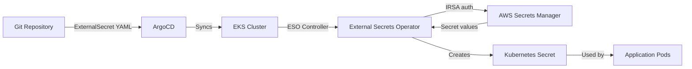

# How to Manage Secrets with ArgoCD and AWS Secrets Manager

Author: [nawazdhandala](https://github.com/nawazdhandala)

Tags: ArgoCD, GitOps, Kubernetes, AWS, Secrets Manager

Description: Learn how to integrate AWS Secrets Manager with ArgoCD using External Secrets Operator and IRSA for secure secret management on EKS clusters.

---

If you run ArgoCD on Amazon EKS, AWS Secrets Manager is the natural choice for secret management. It integrates natively with AWS IAM, supports automatic rotation, and provides audit logging through CloudTrail. This guide covers how to connect ArgoCD to AWS Secrets Manager using the External Secrets Operator with IAM Roles for Service Accounts (IRSA).

## Architecture Overview



## Prerequisites

You need:
- An EKS cluster with ArgoCD installed
- OIDC provider enabled on the cluster (required for IRSA)
- AWS CLI configured with appropriate permissions

### Verify OIDC Provider

```bash
# Check if OIDC is enabled
aws eks describe-cluster --name my-cluster \
  --query "cluster.identity.oidc.issuer" --output text

# If not enabled, create it
eksctl utils associate-iam-oidc-provider \
  --cluster my-cluster \
  --approve
```

## Setting Up IAM Roles

### Create the IAM Policy

```bash
# Create a policy that allows reading secrets
cat > eso-policy.json <<EOF
{
  "Version": "2012-10-17",
  "Statement": [
    {
      "Effect": "Allow",
      "Action": [
        "secretsmanager:GetSecretValue",
        "secretsmanager:DescribeSecret",
        "secretsmanager:ListSecrets"
      ],
      "Resource": [
        "arn:aws:secretsmanager:us-east-1:123456789012:secret:production/*",
        "arn:aws:secretsmanager:us-east-1:123456789012:secret:staging/*"
      ]
    }
  ]
}
EOF

aws iam create-policy \
  --policy-name ExternalSecretsPolicy \
  --policy-document file://eso-policy.json
```

### Create the IRSA Role

```bash
# Create IAM role with trust policy for the ESO service account
eksctl create iamserviceaccount \
  --name external-secrets \
  --namespace external-secrets \
  --cluster my-cluster \
  --role-name ExternalSecretsRole \
  --attach-policy-arn arn:aws:iam::123456789012:policy/ExternalSecretsPolicy \
  --approve
```

Or create manually:

```bash
# Get the OIDC provider
OIDC_PROVIDER=$(aws eks describe-cluster --name my-cluster \
  --query "cluster.identity.oidc.issuer" --output text | sed 's|https://||')

# Create trust policy
cat > trust-policy.json <<EOF
{
  "Version": "2012-10-17",
  "Statement": [
    {
      "Effect": "Allow",
      "Principal": {
        "Federated": "arn:aws:iam::123456789012:oidc-provider/${OIDC_PROVIDER}"
      },
      "Action": "sts:AssumeRoleWithWebIdentity",
      "Condition": {
        "StringEquals": {
          "${OIDC_PROVIDER}:sub": "system:serviceaccount:external-secrets:external-secrets",
          "${OIDC_PROVIDER}:aud": "sts.amazonaws.com"
        }
      }
    }
  ]
}
EOF

aws iam create-role \
  --role-name ExternalSecretsRole \
  --assume-role-policy-document file://trust-policy.json

aws iam attach-role-policy \
  --role-name ExternalSecretsRole \
  --policy-arn arn:aws:iam::123456789012:policy/ExternalSecretsPolicy
```

## Installing External Secrets Operator

Deploy ESO with ArgoCD, using the IRSA-annotated service account:

```yaml
apiVersion: argoproj.io/v1alpha1
kind: Application
metadata:
  name: external-secrets
  namespace: argocd
spec:
  project: default
  source:
    repoURL: https://charts.external-secrets.io
    chart: external-secrets
    targetRevision: 0.10.0
    helm:
      values: |
        installCRDs: true
        serviceAccount:
          create: true
          name: external-secrets
          annotations:
            eks.amazonaws.com/role-arn: arn:aws:iam::123456789012:role/ExternalSecretsRole
  destination:
    server: https://kubernetes.default.svc
    namespace: external-secrets
  syncPolicy:
    automated:
      prune: true
      selfHeal: true
    syncOptions:
      - CreateNamespace=true
```

## Creating the ClusterSecretStore

```yaml
apiVersion: external-secrets.io/v1beta1
kind: ClusterSecretStore
metadata:
  name: aws-secrets-manager
spec:
  provider:
    aws:
      service: SecretsManager
      region: us-east-1
      auth:
        jwt:
          serviceAccountRef:
            name: external-secrets
            namespace: external-secrets
```

Verify the store is healthy:

```bash
kubectl get clustersecretstore aws-secrets-manager
# Should show status: Valid
```

## Creating Secrets in AWS Secrets Manager

```bash
# Create a secret in AWS Secrets Manager
aws secretsmanager create-secret \
  --name production/my-app \
  --description "Production secrets for my-app" \
  --secret-string '{"DB_PASSWORD":"super-secret","API_KEY":"key-12345","REDIS_URL":"redis://redis:6379"}'

# Create environment-specific secrets
aws secretsmanager create-secret \
  --name staging/my-app \
  --secret-string '{"DB_PASSWORD":"staging-pass","API_KEY":"staging-key","REDIS_URL":"redis://redis-staging:6379"}'
```

## Syncing Secrets to Kubernetes

### Single Secret with Selected Keys

```yaml
apiVersion: external-secrets.io/v1beta1
kind: ExternalSecret
metadata:
  name: my-app-secrets
  namespace: app
  annotations:
    argocd.argoproj.io/sync-wave: "-1"
spec:
  refreshInterval: 1h
  secretStoreRef:
    name: aws-secrets-manager
    kind: ClusterSecretStore
  target:
    name: my-app-secrets
    creationPolicy: Owner
  data:
    - secretKey: DB_PASSWORD
      remoteRef:
        key: production/my-app
        property: DB_PASSWORD
    - secretKey: API_KEY
      remoteRef:
        key: production/my-app
        property: API_KEY
```

### All Properties from a Secret

```yaml
apiVersion: external-secrets.io/v1beta1
kind: ExternalSecret
metadata:
  name: my-app-all-secrets
  namespace: app
spec:
  refreshInterval: 1h
  secretStoreRef:
    name: aws-secrets-manager
    kind: ClusterSecretStore
  target:
    name: my-app-secrets
  dataFrom:
    - extract:
        key: production/my-app
```

### Multiple AWS Secrets Combined

```yaml
apiVersion: external-secrets.io/v1beta1
kind: ExternalSecret
metadata:
  name: my-app-combined
  namespace: app
spec:
  refreshInterval: 1h
  secretStoreRef:
    name: aws-secrets-manager
    kind: ClusterSecretStore
  target:
    name: my-app-combined-secrets
  data:
    # From the app-specific secret
    - secretKey: DB_PASSWORD
      remoteRef:
        key: production/my-app
        property: DB_PASSWORD
    # From a shared secret
    - secretKey: DATADOG_API_KEY
      remoteRef:
        key: production/shared/monitoring
        property: DATADOG_API_KEY
    # From another shared secret
    - secretKey: SMTP_PASSWORD
      remoteRef:
        key: production/shared/email
        property: SMTP_PASSWORD
```

## Kustomize Overlays for Multi-Environment

Structure your repository with environment-specific ExternalSecrets:

```yaml
# base/external-secret.yaml
apiVersion: external-secrets.io/v1beta1
kind: ExternalSecret
metadata:
  name: my-app-secrets
spec:
  refreshInterval: 1h
  secretStoreRef:
    name: aws-secrets-manager
    kind: ClusterSecretStore
  target:
    name: my-app-secrets
  dataFrom:
    - extract:
        key: ENVIRONMENT/my-app  # Placeholder
```

```yaml
# overlays/prod/kustomization.yaml
apiVersion: kustomize.config.k8s.io/v1beta1
kind: Kustomization
resources:
  - ../../base
patches:
  - target:
      kind: ExternalSecret
      name: my-app-secrets
    patch: |
      - op: replace
        path: /spec/dataFrom/0/extract/key
        value: production/my-app
```

```yaml
# overlays/staging/kustomization.yaml
apiVersion: kustomize.config.k8s.io/v1beta1
kind: Kustomization
resources:
  - ../../base
patches:
  - target:
      kind: ExternalSecret
      name: my-app-secrets
    patch: |
      - op: replace
        path: /spec/dataFrom/0/extract/key
        value: staging/my-app
```

## Automatic Secret Rotation

AWS Secrets Manager supports automatic rotation. ESO picks up rotated secrets on the next refresh:

```bash
# Enable automatic rotation for a secret
aws secretsmanager rotate-secret \
  --secret-id production/my-app \
  --rotation-lambda-arn arn:aws:lambda:us-east-1:123456789012:function:secret-rotator \
  --rotation-rules AutomaticallyAfterDays=30
```

Configure a shorter refresh interval for frequently rotated secrets:

```yaml
spec:
  refreshInterval: 15m  # Check more frequently
```

## Monitoring and Troubleshooting

```bash
# Check ExternalSecret status
kubectl get externalsecret -n app -o wide

# Check for errors
kubectl describe externalsecret my-app-secrets -n app

# Check ESO controller logs
kubectl logs -n external-secrets deployment/external-secrets

# Verify the secret was created
kubectl get secret my-app-secrets -n app

# Check CloudTrail for Secrets Manager access
aws cloudtrail lookup-events \
  --lookup-attributes AttributeKey=EventName,AttributeValue=GetSecretValue \
  --max-items 10
```

### Common Issues

1. **IRSA not working**: Verify the service account has the correct annotation and the trust policy matches
2. **Access denied**: Check the IAM policy resource ARN matches your secret paths
3. **Secret not found**: Verify the secret name in AWS Secrets Manager matches the `key` in ExternalSecret
4. **Stale secrets**: Reduce the `refreshInterval` if you need faster updates

## Conclusion

AWS Secrets Manager with the External Secrets Operator is the cleanest way to manage secrets in an ArgoCD-on-EKS setup. IRSA provides secure, tokenless authentication. The ExternalSecret CRDs are safe to store in Git since they only contain references. Automatic rotation and CloudTrail auditing come built-in with AWS Secrets Manager. The result is a fully GitOps-driven secret management workflow that integrates naturally with your AWS infrastructure.

For alternative approaches, see our guides on [using Azure Key Vault with ArgoCD](https://oneuptime.com/blog/post/2026-02-26-argocd-azure-key-vault-secrets/view) and [using Google Secret Manager with ArgoCD](https://oneuptime.com/blog/post/2026-02-26-argocd-google-secret-manager/view).
