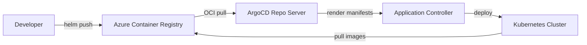

# How to Use ArgoCD with Azure Container Registry

Author: [nawazdhandala](https://github.com/nawazdhandala)

Tags: ArgoCD, GitOps, Kubernetes, Azure, Container Registry

Description: Learn how to configure ArgoCD to pull Helm charts and OCI artifacts from Azure Container Registry using multiple authentication methods.

---

Azure Container Registry (ACR) is Microsoft's managed container image registry. If you are running ArgoCD on AKS or any Kubernetes cluster that needs to pull Helm charts and OCI artifacts from ACR, you need to configure the authentication properly. This can be trickier than it sounds, especially with OCI-based Helm charts which have become the standard.

This guide covers three authentication approaches: service principal, admin credentials (for development), and managed identity (the recommended production approach).

## Understanding ACR and ArgoCD Integration

ArgoCD needs to communicate with ACR in two scenarios:

1. **Helm chart repositories** - When your Helm charts are stored in ACR as OCI artifacts
2. **Manifest generation** - When using Kustomize or plain YAML that references images from ACR

For the second case, ArgoCD does not actually pull images - Kubernetes does that. But for Helm charts stored in ACR, ArgoCD needs direct access.

## Method 1: Service Principal Authentication

This is the most common approach for non-AKS clusters or clusters without workload identity.

### Create a Service Principal

```bash
# Create a service principal with AcrPull access
ACR_NAME=myacregistry
ACR_REGISTRY_ID=$(az acr show --name $ACR_NAME --query "id" --output tsv)

az ad sp create-for-rbac \
  --name argocd-acr-pull \
  --scopes $ACR_REGISTRY_ID \
  --role acrpull
```

This will output JSON containing the `appId` and `password`. Save these values.

### Configure ArgoCD Repository Secret

Create a Kubernetes secret that tells ArgoCD how to authenticate to ACR.

```yaml
# acr-repo-secret.yaml
apiVersion: v1
kind: Secret
metadata:
  name: acr-helm-repo
  namespace: argocd
  labels:
    argocd.argoproj.io/secret-type: repository
stringData:
  # Use OCI format for Helm charts in ACR
  type: helm
  name: my-acr-charts
  enableOCI: "true"
  url: myacregistry.azurecr.io
  username: "<SERVICE_PRINCIPAL_APP_ID>"
  password: "<SERVICE_PRINCIPAL_PASSWORD>"
```

Apply it to your cluster.

```bash
kubectl apply -f acr-repo-secret.yaml
```

### Create an Application That Uses ACR Helm Charts

Now you can create an ArgoCD application that references a Helm chart stored in ACR.

```yaml
# app-from-acr.yaml
apiVersion: argoproj.io/v1alpha1
kind: Application
metadata:
  name: my-app
  namespace: argocd
spec:
  project: default
  source:
    # Reference the chart in ACR using OCI
    chart: my-helm-chart
    repoURL: myacregistry.azurecr.io
    targetRevision: 1.0.0
    helm:
      values: |
        replicaCount: 3
        image:
          repository: myacregistry.azurecr.io/my-app
          tag: latest
  destination:
    server: https://kubernetes.default.svc
    namespace: my-app
  syncPolicy:
    automated:
      prune: true
      selfHeal: true
```

## Method 2: Admin Credentials (Development Only)

For quick development setups, you can use ACR admin credentials. This is not recommended for production but works for getting started fast.

```bash
# Enable admin user on ACR
az acr update --name myacregistry --admin-enabled true

# Get the credentials
az acr credential show --name myacregistry
```

Then use the username and one of the passwords in the repository secret just like the service principal method above.

## Method 3: Managed Identity (Recommended for Production)

If you are running on AKS with workload identity enabled, this is the best approach. See our dedicated guide on [configuring ArgoCD with Azure Managed Identity](https://oneuptime.com/blog/post/2026-02-26-argocd-azure-managed-identity/view) for the full setup.

The short version is:

1. Create a user-assigned managed identity
2. Grant it `AcrPull` role on the ACR
3. Create a federated credential linking the ArgoCD service account
4. Annotate the ArgoCD service accounts with the identity's client ID

Once configured, you can use ACR without any credentials in your repository secret.

```yaml
# acr-repo-no-creds.yaml
apiVersion: v1
kind: Secret
metadata:
  name: acr-helm-repo
  namespace: argocd
  labels:
    argocd.argoproj.io/secret-type: repository
stringData:
  type: helm
  name: my-acr-charts
  enableOCI: "true"
  url: myacregistry.azurecr.io
```

## Pushing Helm Charts to ACR

Before ArgoCD can pull charts, you need to push them to ACR. Here is how.

```bash
# Login to ACR with the Azure CLI
az acr login --name myacregistry

# Package your Helm chart
helm package ./my-chart

# Push the chart to ACR as an OCI artifact
helm push my-chart-1.0.0.tgz oci://myacregistry.azurecr.io/helm
```

You can verify the chart is in ACR.

```bash
# List repositories in ACR
az acr repository list --name myacregistry --output table

# Show tags for a specific chart
az acr repository show-tags --name myacregistry --repository helm/my-chart --output table
```

## Working with ACR Geo-Replication

If you are using ACR geo-replication for multi-region deployments, ArgoCD in each region should point to the regional endpoint for best performance.

```yaml
# Use regional login server for lower latency
# East US replica
stringData:
  url: myacregistry.eastus.data.azurecr.io

# West Europe replica
stringData:
  url: myacregistry.westeurope.data.azurecr.io
```

## Architecture: ArgoCD and ACR Integration



## Troubleshooting Common Issues

### OCI Helm Chart Not Found

If ArgoCD cannot find your chart, check the URL format. A common mistake is including the protocol prefix.

```bash
# Wrong - do not include https://
url: https://myacregistry.azurecr.io

# Correct - just the registry hostname
url: myacregistry.azurecr.io
```

### Authentication Errors

Check that the secret has the correct label so ArgoCD discovers it.

```bash
# Verify the secret has the correct label
kubectl get secret acr-helm-repo -n argocd -o yaml | grep -A 2 labels
```

The label `argocd.argoproj.io/secret-type: repository` must be present.

### Token Expiration

Service principal passwords expire. If authentication suddenly stops working, check if the password has expired.

```bash
# Check service principal credential expiry
az ad sp credential list --id <APP_ID> --query "[].{endDateTime:endDateTime}" --output table
```

### Rate Limiting

ACR has rate limits based on your SKU tier. If you are hitting limits with many ArgoCD applications:

```bash
# Check current ACR SKU
az acr show --name myacregistry --query "sku.name" --output tsv

# Upgrade to Premium for higher limits
az acr update --name myacregistry --sku Premium
```

## ACR Token-Based Access for Fine-Grained Control

For scenarios where you need repository-level access control, ACR supports scope maps and tokens.

```bash
# Create a scope map with read-only access to specific repos
az acr scope-map create \
  --name argocd-read-charts \
  --registry myacregistry \
  --repository helm/my-chart content/read

# Create a token using the scope map
az acr token create \
  --name argocd-token \
  --registry myacregistry \
  --scope-map argocd-read-charts
```

This is useful when you want ArgoCD to only access specific chart repositories rather than having broad AcrPull access.

## Conclusion

Using ArgoCD with Azure Container Registry is straightforward once you understand the authentication options. For production workloads on AKS, managed identity is the clear winner. For other environments, service principals work well. Avoid admin credentials in anything beyond local development.

The key things to remember are: use OCI format for Helm charts, do not include the `https://` prefix in the URL, and make sure your repository secrets have the correct ArgoCD labels.
