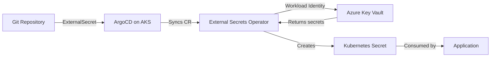

# How to Manage Secrets with ArgoCD and Azure Key Vault

Author: [nawazdhandala](https://github.com/nawazdhandala)

Tags: ArgoCD, GitOps, Kubernetes, Azure, Key Vault

Description: A practical guide to integrating Azure Key Vault with ArgoCD on AKS using Workload Identity and the External Secrets Operator for secure secret management.

---

Azure Key Vault is the natural secret management solution for teams running ArgoCD on Azure Kubernetes Service (AKS). It provides centralized secret storage, access policies, audit logging, and integration with Azure Active Directory (Entra ID). This guide covers how to connect ArgoCD to Azure Key Vault using the External Secrets Operator with Workload Identity.

## Architecture Overview



## Prerequisites

- AKS cluster with Workload Identity enabled
- Azure Key Vault created
- ArgoCD installed on the AKS cluster
- Azure CLI configured

### Enable Workload Identity on AKS

```bash
# Enable workload identity on an existing cluster
az aks update \
  --resource-group my-rg \
  --name my-aks \
  --enable-oidc-issuer \
  --enable-workload-identity

# Get the OIDC issuer URL
export AKS_OIDC_ISSUER=$(az aks show \
  --resource-group my-rg \
  --name my-aks \
  --query "oidcIssuerProfile.issuerUrl" -o tsv)
```

## Setting Up Azure Identity

### Create a Managed Identity

```bash
# Create a user-assigned managed identity
az identity create \
  --name eso-identity \
  --resource-group my-rg \
  --location eastus

# Get the identity details
export IDENTITY_CLIENT_ID=$(az identity show \
  --name eso-identity \
  --resource-group my-rg \
  --query clientId -o tsv)

export IDENTITY_OBJECT_ID=$(az identity show \
  --name eso-identity \
  --resource-group my-rg \
  --query principalId -o tsv)
```

### Grant Key Vault Access

```bash
# Get the Key Vault resource ID
export KV_NAME="my-keyvault"

# Grant the identity access to read secrets
az keyvault set-policy \
  --name $KV_NAME \
  --object-id $IDENTITY_OBJECT_ID \
  --secret-permissions get list

# Or use Azure RBAC (recommended for new deployments)
az role assignment create \
  --role "Key Vault Secrets User" \
  --assignee-object-id $IDENTITY_OBJECT_ID \
  --assignee-principal-type ServicePrincipal \
  --scope "/subscriptions/<sub-id>/resourceGroups/my-rg/providers/Microsoft.KeyVault/vaults/$KV_NAME"
```

### Create Federated Credential

```bash
# Create the federated credential for the ESO service account
az identity federated-credential create \
  --name eso-federated-credential \
  --identity-name eso-identity \
  --resource-group my-rg \
  --issuer $AKS_OIDC_ISSUER \
  --subject system:serviceaccount:external-secrets:external-secrets \
  --audience api://AzureADTokenExchange
```

## Installing External Secrets Operator

Deploy ESO with the Workload Identity annotation:

```yaml
apiVersion: argoproj.io/v1alpha1
kind: Application
metadata:
  name: external-secrets
  namespace: argocd
spec:
  project: default
  source:
    repoURL: https://charts.external-secrets.io
    chart: external-secrets
    targetRevision: 0.10.0
    helm:
      values: |
        installCRDs: true
        serviceAccount:
          create: true
          name: external-secrets
          annotations:
            azure.workload.identity/client-id: "<IDENTITY_CLIENT_ID>"
        podLabels:
          azure.workload.identity/use: "true"
  destination:
    server: https://kubernetes.default.svc
    namespace: external-secrets
  syncPolicy:
    automated:
      prune: true
      selfHeal: true
    syncOptions:
      - CreateNamespace=true
```

## Creating the SecretStore

```yaml
apiVersion: external-secrets.io/v1beta1
kind: ClusterSecretStore
metadata:
  name: azure-key-vault
spec:
  provider:
    azurekv:
      authType: WorkloadIdentity
      vaultUrl: "https://my-keyvault.vault.azure.net"
      serviceAccountRef:
        name: external-secrets
        namespace: external-secrets
```

Verify it is working:

```bash
kubectl get clustersecretstore azure-key-vault
# STATUS should show: Valid
```

## Creating Secrets in Azure Key Vault

```bash
# Create individual secrets
az keyvault secret set \
  --vault-name my-keyvault \
  --name "production-db-password" \
  --value "super-secret-password"

az keyvault secret set \
  --vault-name my-keyvault \
  --name "production-api-key" \
  --value "api-key-12345"

# Create a JSON secret (for multiple values in one secret)
az keyvault secret set \
  --vault-name my-keyvault \
  --name "production-my-app" \
  --value '{"DB_PASSWORD":"super-secret","API_KEY":"key-12345","REDIS_URL":"redis://redis:6379"}'
```

## Syncing Secrets to Kubernetes

### Individual Secrets

```yaml
apiVersion: external-secrets.io/v1beta1
kind: ExternalSecret
metadata:
  name: my-app-secrets
  namespace: app
  annotations:
    argocd.argoproj.io/sync-wave: "-1"
spec:
  refreshInterval: 1h
  secretStoreRef:
    name: azure-key-vault
    kind: ClusterSecretStore
  target:
    name: my-app-secrets
    creationPolicy: Owner
  data:
    - secretKey: DB_PASSWORD
      remoteRef:
        key: production-db-password
    - secretKey: API_KEY
      remoteRef:
        key: production-api-key
```

### JSON Secret with Property Extraction

```yaml
apiVersion: external-secrets.io/v1beta1
kind: ExternalSecret
metadata:
  name: my-app-secrets
  namespace: app
spec:
  refreshInterval: 1h
  secretStoreRef:
    name: azure-key-vault
    kind: ClusterSecretStore
  target:
    name: my-app-secrets
  data:
    - secretKey: DB_PASSWORD
      remoteRef:
        key: production-my-app
        property: DB_PASSWORD
    - secretKey: API_KEY
      remoteRef:
        key: production-my-app
        property: API_KEY
    - secretKey: REDIS_URL
      remoteRef:
        key: production-my-app
        property: REDIS_URL
```

### Extracting All Properties

```yaml
apiVersion: external-secrets.io/v1beta1
kind: ExternalSecret
metadata:
  name: my-app-all-secrets
  namespace: app
spec:
  refreshInterval: 1h
  secretStoreRef:
    name: azure-key-vault
    kind: ClusterSecretStore
  target:
    name: my-app-secrets
  dataFrom:
    - extract:
        key: production-my-app
```

### Using Find to Discover Secrets by Tags

Azure Key Vault supports tags on secrets. Use them for discovery:

```bash
# Tag secrets in Key Vault
az keyvault secret set \
  --vault-name my-keyvault \
  --name "production-db-password" \
  --value "super-secret" \
  --tags app=my-app env=production
```

```yaml
apiVersion: external-secrets.io/v1beta1
kind: ExternalSecret
metadata:
  name: my-app-tagged-secrets
  namespace: app
spec:
  refreshInterval: 1h
  secretStoreRef:
    name: azure-key-vault
    kind: ClusterSecretStore
  target:
    name: my-app-secrets
  dataFrom:
    - find:
        tags:
          app: my-app
          env: production
```

## Multi-Environment Setup

Use different Key Vaults for different environments:

```yaml
# Production ClusterSecretStore
apiVersion: external-secrets.io/v1beta1
kind: ClusterSecretStore
metadata:
  name: azure-kv-production
spec:
  provider:
    azurekv:
      authType: WorkloadIdentity
      vaultUrl: "https://prod-keyvault.vault.azure.net"
      serviceAccountRef:
        name: external-secrets
        namespace: external-secrets
---
# Staging ClusterSecretStore
apiVersion: external-secrets.io/v1beta1
kind: ClusterSecretStore
metadata:
  name: azure-kv-staging
spec:
  provider:
    azurekv:
      authType: WorkloadIdentity
      vaultUrl: "https://staging-keyvault.vault.azure.net"
      serviceAccountRef:
        name: external-secrets
        namespace: external-secrets
```

Use Kustomize overlays to point to the right store:

```yaml
# overlays/prod/external-secret-patch.yaml
apiVersion: external-secrets.io/v1beta1
kind: ExternalSecret
metadata:
  name: my-app-secrets
spec:
  secretStoreRef:
    name: azure-kv-production
    kind: ClusterSecretStore
```

## Syncing Certificates from Key Vault

Azure Key Vault also stores certificates. Sync them as Kubernetes TLS secrets:

```yaml
apiVersion: external-secrets.io/v1beta1
kind: ExternalSecret
metadata:
  name: app-tls
  namespace: app
spec:
  refreshInterval: 24h
  secretStoreRef:
    name: azure-key-vault
    kind: ClusterSecretStore
  target:
    name: app-tls
    template:
      type: kubernetes.io/tls
      data:
        tls.crt: "{{ .cert }}"
        tls.key: "{{ .key }}"
  data:
    - secretKey: cert
      remoteRef:
        key: my-app-tls-cert
        property: cert
    - secretKey: key
      remoteRef:
        key: my-app-tls-cert
        property: key
```

## Monitoring and Troubleshooting

```bash
# Check ExternalSecret status
kubectl get externalsecret -n app -o wide

# Check for errors
kubectl describe externalsecret my-app-secrets -n app

# Verify ESO pod has workload identity
kubectl describe pod -n external-secrets -l app.kubernetes.io/name=external-secrets | grep -A5 "Environment"

# Check Azure Key Vault diagnostic logs
az monitor diagnostic-settings list --resource "/subscriptions/<sub-id>/resourceGroups/my-rg/providers/Microsoft.KeyVault/vaults/my-keyvault"
```

### Common Issues

1. **Workload Identity not working**: Verify the federated credential subject matches `system:serviceaccount:<namespace>:<sa-name>`
2. **Access denied**: Check Key Vault access policies or RBAC role assignments
3. **Secret not found**: Key Vault secret names use hyphens, not slashes (unlike AWS)
4. **Property extraction fails**: Ensure the secret value is valid JSON

## Conclusion

Azure Key Vault with the External Secrets Operator and Workload Identity provides a secure, token-free integration for ArgoCD on AKS. The passwordless authentication through Workload Identity eliminates credential management overhead. Combined with ArgoCD's GitOps workflow, you get a fully declarative secret management setup where only references live in Git and actual secrets stay safely in Azure Key Vault.

For alternative cloud integrations, see our guides on [using AWS Secrets Manager with ArgoCD](https://oneuptime.com/blog/post/2026-02-26-argocd-aws-secrets-manager/view) and [using Google Secret Manager with ArgoCD](https://oneuptime.com/blog/post/2026-02-26-argocd-google-secret-manager/view).
