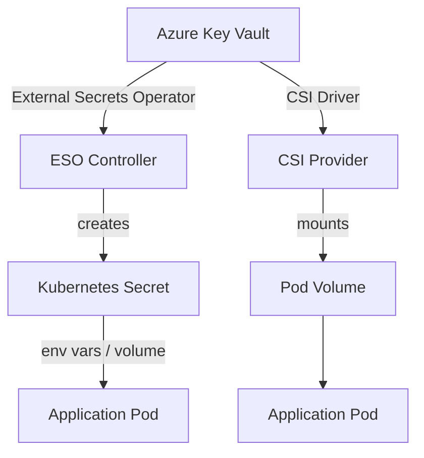

# How to Use ArgoCD with Azure Key Vault

Author: [nawazdhandala](https://github.com/nawazdhandala)

Tags: ArgoCD, GitOps, Kubernetes, Azure, Secrets Management

Description: Learn how to integrate ArgoCD with Azure Key Vault for secure secrets management using External Secrets Operator and CSI driver approaches.

---

One of the biggest challenges with GitOps is secrets management. You cannot just commit database passwords and API keys to Git. Azure Key Vault provides a secure, centralized place to store secrets, and there are several ways to bridge the gap between Key Vault and your Kubernetes workloads managed by ArgoCD.

This guide covers two main approaches: the External Secrets Operator (ESO) and the Azure Key Vault CSI Driver. Both work well with ArgoCD, but they solve the problem differently.

## The Secrets Problem in GitOps

In a GitOps workflow, everything in your Git repository should be declarative and version-controlled. But secrets present a dilemma:

- You cannot store plaintext secrets in Git
- Sealed Secrets encrypt secrets but still bloat your repo
- You need a way to reference external secrets without exposing them

Azure Key Vault solves this by being the single source of truth for secrets, while your Git repository only contains references to those secrets.

## Approach 1: External Secrets Operator (Recommended)

The External Secrets Operator (ESO) is a Kubernetes operator that syncs secrets from external providers like Azure Key Vault into Kubernetes Secrets. This is the most popular approach with ArgoCD.

### Install External Secrets Operator with ArgoCD

First, deploy ESO itself through ArgoCD.

```yaml
# external-secrets-operator-app.yaml
apiVersion: argoproj.io/v1alpha1
kind: Application
metadata:
  name: external-secrets
  namespace: argocd
spec:
  project: default
  source:
    repoURL: https://charts.external-secrets.io
    chart: external-secrets
    targetRevision: 0.9.x
    helm:
      values: |
        installCRDs: true
        webhook:
          port: 9443
  destination:
    server: https://kubernetes.default.svc
    namespace: external-secrets
  syncPolicy:
    automated:
      prune: true
      selfHeal: true
    syncOptions:
      - CreateNamespace=true
```

### Configure the SecretStore

The SecretStore tells ESO how to connect to Azure Key Vault. With workload identity, you can configure it without any static credentials.

```yaml
# azure-secret-store.yaml
apiVersion: external-secrets.io/v1beta1
kind: ClusterSecretStore
metadata:
  name: azure-key-vault
spec:
  provider:
    azurekv:
      # Your Key Vault URL
      vaultUrl: "https://my-keyvault.vault.azure.net"
      authType: WorkloadIdentity
      serviceAccountRef:
        name: external-secrets-sa
        namespace: external-secrets
```

If you are not using workload identity, you can use a service principal instead.

```yaml
# azure-secret-store-sp.yaml
apiVersion: external-secrets.io/v1beta1
kind: ClusterSecretStore
metadata:
  name: azure-key-vault
spec:
  provider:
    azurekv:
      vaultUrl: "https://my-keyvault.vault.azure.net"
      authSecretRef:
        clientId:
          name: azure-sp-creds
          namespace: external-secrets
          key: client-id
        clientSecret:
          name: azure-sp-creds
          namespace: external-secrets
          key: client-secret
      tenantId: "<YOUR_TENANT_ID>"
```

### Create ExternalSecret Resources

Now you can create ExternalSecret resources that ArgoCD manages. These are safe to store in Git because they only contain references, not actual secret values.

```yaml
# my-app-secrets.yaml
apiVersion: external-secrets.io/v1beta1
kind: ExternalSecret
metadata:
  name: my-app-secrets
  namespace: my-app
spec:
  refreshInterval: 5m
  secretStoreRef:
    name: azure-key-vault
    kind: ClusterSecretStore
  target:
    name: my-app-secrets
    creationPolicy: Owner
  data:
    # Map Key Vault secrets to Kubernetes secret keys
    - secretKey: database-password
      remoteRef:
        key: my-app-db-password
    - secretKey: api-key
      remoteRef:
        key: my-app-api-key
    - secretKey: connection-string
      remoteRef:
        key: my-app-connection-string
```

### Use the Secret in Your Deployment

Your deployment manifests reference the Kubernetes Secret created by ESO, which ArgoCD can manage normally.

```yaml
# my-app-deployment.yaml
apiVersion: apps/v1
kind: Deployment
metadata:
  name: my-app
  namespace: my-app
spec:
  replicas: 2
  selector:
    matchLabels:
      app: my-app
  template:
    metadata:
      labels:
        app: my-app
    spec:
      containers:
        - name: my-app
          image: myacr.azurecr.io/my-app:latest
          envFrom:
            - secretRef:
                name: my-app-secrets
```

## Approach 2: Azure Key Vault CSI Driver

The CSI driver mounts secrets directly from Key Vault into pods as files. This approach does not create Kubernetes Secrets at all, which some security teams prefer.

### Install the CSI Driver with ArgoCD

```yaml
# csi-driver-app.yaml
apiVersion: argoproj.io/v1alpha1
kind: Application
metadata:
  name: csi-secrets-driver
  namespace: argocd
spec:
  project: default
  source:
    repoURL: https://kubernetes-sigs.github.io/secrets-store-csi-driver/charts
    chart: secrets-store-csi-driver
    targetRevision: 1.4.x
    helm:
      values: |
        syncSecret:
          enabled: true
  destination:
    server: https://kubernetes.default.svc
    namespace: kube-system
  syncPolicy:
    automated:
      prune: true
      selfHeal: true
```

You also need the Azure provider for the CSI driver.

```yaml
# azure-csi-provider-app.yaml
apiVersion: argoproj.io/v1alpha1
kind: Application
metadata:
  name: azure-csi-provider
  namespace: argocd
spec:
  project: default
  source:
    repoURL: https://azure.github.io/secrets-store-csi-driver-provider-azure/charts
    chart: csi-secrets-store-provider-azure
    targetRevision: 1.5.x
  destination:
    server: https://kubernetes.default.svc
    namespace: kube-system
  syncPolicy:
    automated:
      prune: true
      selfHeal: true
```

### Create a SecretProviderClass

```yaml
# secret-provider-class.yaml
apiVersion: secrets-store.csi.x-k8s.io/v1
kind: SecretProviderClass
metadata:
  name: my-app-secrets
  namespace: my-app
spec:
  provider: azure
  parameters:
    usePodIdentity: "false"
    useVMManagedIdentity: "false"
    clientID: "<WORKLOAD_IDENTITY_CLIENT_ID>"
    keyvaultName: "my-keyvault"
    tenantId: "<TENANT_ID>"
    objects: |
      array:
        - |
          objectName: my-app-db-password
          objectType: secret
        - |
          objectName: my-app-api-key
          objectType: secret
```

### Mount Secrets in Your Deployment

```yaml
# deployment-with-csi.yaml
apiVersion: apps/v1
kind: Deployment
metadata:
  name: my-app
  namespace: my-app
spec:
  replicas: 2
  selector:
    matchLabels:
      app: my-app
  template:
    metadata:
      labels:
        app: my-app
    spec:
      containers:
        - name: my-app
          image: myacr.azurecr.io/my-app:latest
          volumeMounts:
            - name: secrets
              mountPath: "/mnt/secrets"
              readOnly: true
      volumes:
        - name: secrets
          csi:
            driver: secrets-store.csi.k8s.io
            readOnly: true
            volumeAttributes:
              secretProviderClass: my-app-secrets
```

## Comparing the Two Approaches



| Feature | External Secrets Operator | CSI Driver |
|---------|--------------------------|------------|
| Creates K8s Secrets | Yes | Optional |
| Auto-rotation | Yes (refreshInterval) | Yes (rotation poll) |
| Works with envFrom | Yes | Needs sync |
| GitOps friendly | Very | Good |
| Complexity | Lower | Higher |

## ArgoCD Sync Waves for Proper Ordering

When using ESO, you need the SecretStore to be ready before ExternalSecrets, and secrets must exist before deployments. Use ArgoCD sync waves.

```yaml
# Sync wave 0: SecretStore first
metadata:
  annotations:
    argocd.argoproj.io/sync-wave: "0"

# Sync wave 1: ExternalSecrets next
metadata:
  annotations:
    argocd.argoproj.io/sync-wave: "1"

# Sync wave 2: Deployments last
metadata:
  annotations:
    argocd.argoproj.io/sync-wave: "2"
```

## Conclusion

Both External Secrets Operator and the CSI Driver work well with ArgoCD and Azure Key Vault. ESO is the more popular choice in the GitOps community because it creates standard Kubernetes Secrets that are easy to consume, and the ExternalSecret manifests are safe to store in Git. The CSI driver has the advantage of not creating Kubernetes Secrets at all, which appeals to teams with strict security requirements.

Whichever approach you choose, the key is that your Git repository only contains secret references, never actual values. ArgoCD manages the synchronization of these references, and the operator or driver handles fetching the real values at runtime.
