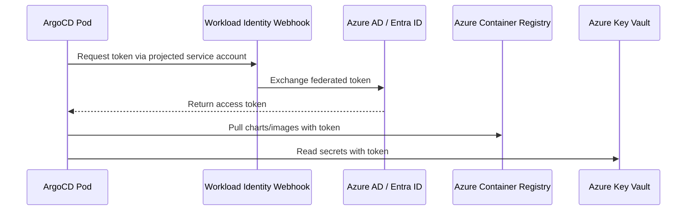

# How to Configure ArgoCD with Azure Managed Identity

Author: [nawazdhandala](https://github.com/nawazdhandala)

Tags: ArgoCD, GitOps, Kubernetes, Azure, Security

Description: Learn how to configure ArgoCD with Azure Managed Identity for secure, passwordless authentication to Azure services from your AKS cluster.

---

When running ArgoCD on Azure Kubernetes Service (AKS), one of the most important security decisions you can make is how ArgoCD authenticates to Azure services. Using service principal secrets or static credentials means managing rotation, dealing with expiration, and worrying about secret leaks. Azure Managed Identity eliminates all of that by providing automatic, passwordless authentication that Azure handles behind the scenes.

In this guide, we will walk through configuring ArgoCD to use Azure Managed Identity for secure access to Azure Container Registry, Azure Key Vault, and Git repositories hosted on Azure DevOps.

## What Is Azure Managed Identity?

Azure Managed Identity is a feature of Azure Active Directory (now called Microsoft Entra ID) that gives your Kubernetes workloads an identity without needing to manage credentials. There are two types:

- **System-assigned**: tied to the lifecycle of a single resource
- **User-assigned**: created independently and can be shared across resources

For ArgoCD on AKS, user-assigned managed identities are generally preferred because you can assign them to specific pods using Azure Workload Identity.

## Prerequisites

Before you begin, make sure you have:

- An AKS cluster with Azure Workload Identity enabled
- ArgoCD installed on the cluster
- The Azure CLI installed and configured
- The `kubectl` CLI configured to talk to your AKS cluster

## Step 1: Enable Workload Identity on AKS

If you have not already enabled workload identity on your AKS cluster, you can do so with the following command.

```bash
# Enable workload identity and OIDC issuer on an existing AKS cluster
az aks update \
  --resource-group my-resource-group \
  --name my-aks-cluster \
  --enable-oidc-issuer \
  --enable-workload-identity
```

Retrieve the OIDC issuer URL, which you will need later.

```bash
# Get the OIDC issuer URL for your cluster
export AKS_OIDC_ISSUER=$(az aks show \
  --resource-group my-resource-group \
  --name my-aks-cluster \
  --query "oidcIssuerProfile.issuerUrl" \
  --output tsv)

echo $AKS_OIDC_ISSUER
```

## Step 2: Create a User-Assigned Managed Identity

Create a managed identity that ArgoCD will use.

```bash
# Create a user-assigned managed identity for ArgoCD
az identity create \
  --resource-group my-resource-group \
  --name argocd-identity

# Store the client ID for later use
export IDENTITY_CLIENT_ID=$(az identity show \
  --resource-group my-resource-group \
  --name argocd-identity \
  --query "clientId" \
  --output tsv)
```

## Step 3: Create a Federated Credential

The federated credential links the Kubernetes service account used by ArgoCD to the Azure managed identity.

```bash
# Create federated credential for the ArgoCD repo server
az identity federated-credential create \
  --name argocd-repo-server-fed \
  --identity-name argocd-identity \
  --resource-group my-resource-group \
  --issuer $AKS_OIDC_ISSUER \
  --subject system:serviceaccount:argocd:argocd-repo-server \
  --audiences api://AzureADTokenExchange
```

If you also want the ArgoCD application controller to use this identity (for example, to access Azure resources during health checks), create a second federated credential.

```bash
# Create federated credential for the ArgoCD application controller
az identity federated-credential create \
  --name argocd-controller-fed \
  --identity-name argocd-identity \
  --resource-group my-resource-group \
  --issuer $AKS_OIDC_ISSUER \
  --subject system:serviceaccount:argocd:argocd-application-controller \
  --audiences api://AzureADTokenExchange
```

## Step 4: Annotate ArgoCD Service Accounts

Now you need to annotate the ArgoCD service accounts so that Azure Workload Identity knows which managed identity to assign them.

```yaml
# argocd-repo-server-sa-patch.yaml
apiVersion: v1
kind: ServiceAccount
metadata:
  name: argocd-repo-server
  namespace: argocd
  annotations:
    azure.workload.identity/client-id: "<YOUR_IDENTITY_CLIENT_ID>"
  labels:
    azure.workload.identity/use: "true"
```

Apply the patch.

```bash
# Apply the service account annotation
kubectl apply -f argocd-repo-server-sa-patch.yaml

# Repeat for the application controller if needed
kubectl annotate serviceaccount argocd-application-controller \
  --namespace argocd \
  azure.workload.identity/client-id="$IDENTITY_CLIENT_ID" \
  --overwrite

kubectl label serviceaccount argocd-application-controller \
  --namespace argocd \
  azure.workload.identity/use=true \
  --overwrite
```

## Step 5: Restart ArgoCD Pods

After updating the service accounts, restart the ArgoCD pods so they pick up the new identity.

```bash
# Restart ArgoCD deployments to pick up the new identity
kubectl rollout restart deployment argocd-repo-server -n argocd
kubectl rollout restart statefulset argocd-application-controller -n argocd
kubectl rollout restart deployment argocd-server -n argocd
```

## Step 6: Grant the Managed Identity Access to Azure Resources

Now grant the managed identity the permissions it needs. For Azure Container Registry access:

```bash
# Grant the managed identity AcrPull access to your container registry
az role assignment create \
  --assignee $IDENTITY_CLIENT_ID \
  --role AcrPull \
  --scope /subscriptions/<SUB_ID>/resourceGroups/<RG>/providers/Microsoft.ContainerRegistry/registries/<ACR_NAME>
```

For Azure Key Vault access (if using External Secrets Operator with ArgoCD):

```bash
# Grant Key Vault Secrets User role
az role assignment create \
  --assignee $IDENTITY_CLIENT_ID \
  --role "Key Vault Secrets User" \
  --scope /subscriptions/<SUB_ID>/resourceGroups/<RG>/providers/Microsoft.KeyVault/vaults/<VAULT_NAME>
```

## Step 7: Configure ArgoCD to Use the Identity for ACR

To pull Helm charts or images from Azure Container Registry using the managed identity, configure the repository in ArgoCD.

```yaml
# acr-repository-secret.yaml
apiVersion: v1
kind: Secret
metadata:
  name: acr-repo
  namespace: argocd
  labels:
    argocd.argoproj.io/secret-type: repository
stringData:
  type: helm
  name: my-acr
  url: https://myacr.azurecr.io/helm/v1/repo
  enableOCI: "true"
```

With workload identity configured, ArgoCD can authenticate to ACR automatically without needing a username and password in the secret.

## Architecture Overview

Here is how the authentication flow works with managed identity.



## Troubleshooting Common Issues

### Token Not Being Injected

If the pods are not receiving the managed identity token, check the labels and annotations.

```bash
# Verify the service account has the correct labels
kubectl get serviceaccount argocd-repo-server -n argocd -o yaml

# Check that the pod has the projected token volume
kubectl get pod -n argocd -l app.kubernetes.io/name=argocd-repo-server -o yaml | grep -A 5 "azure-identity-token"
```

### Authentication Failures

If ArgoCD is getting 401 errors when accessing Azure resources, verify the role assignments.

```bash
# List role assignments for the managed identity
az role assignment list \
  --assignee $IDENTITY_CLIENT_ID \
  --output table
```

### Federated Credential Mismatch

The most common issue is a mismatch between the service account name in the federated credential and the actual service account in Kubernetes.

```bash
# Verify federated credentials
az identity federated-credential list \
  --identity-name argocd-identity \
  --resource-group my-resource-group \
  --output table
```

## Security Benefits

Using managed identity with ArgoCD provides several security advantages:

1. **No secrets to manage** - Azure handles credential rotation automatically
2. **No secret sprawl** - No passwords or tokens stored in Kubernetes secrets
3. **Audit trail** - All authentication events are logged in Azure AD sign-in logs
4. **Least privilege** - You can scope permissions precisely using Azure RBAC
5. **Zero trust** - Each pod gets its own identity rather than sharing cluster-wide credentials

## Conclusion

Configuring ArgoCD with Azure Managed Identity is one of the best things you can do for your cluster's security posture. It eliminates static credentials, simplifies secret management, and integrates naturally with Azure's RBAC system. While the initial setup involves several steps, the long-term maintenance burden is significantly lower than managing service principal secrets.

If you are running ArgoCD on AKS, there is really no reason not to use managed identity. The combination of Workload Identity and ArgoCD gives you a secure, auditable, and maintainable GitOps pipeline.

For more on integrating ArgoCD with Azure services, check out our guide on [using ArgoCD with Azure Container Registry](https://oneuptime.com/blog/post/2026-02-26-argocd-azure-container-registry/view) and [using ArgoCD with Azure Key Vault](https://oneuptime.com/blog/post/2026-02-26-argocd-azure-key-vault/view).
