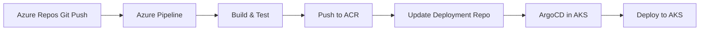

# How to Create a Complete Azure Pipelines + ArgoCD Pipeline

Author: [nawazdhandala](https://github.com/nawazdhandala)

Tags: ArgoCD, GitOps, Kubernetes, Azure Pipelines, CI/CD

Description: Learn how to build a complete CI/CD pipeline using Azure Pipelines for building and testing with ArgoCD for GitOps deployment to AKS and other Kubernetes clusters.

---

Azure Pipelines is Microsoft's CI/CD platform, tightly integrated with Azure DevOps and Azure Kubernetes Service (AKS). Combining it with ArgoCD gives you enterprise-grade CI from Azure with GitOps-based deployment through ArgoCD. This is especially popular for teams running AKS who want the Azure ecosystem for CI but prefer ArgoCD over Azure's built-in CD options.

This guide covers building a complete Azure Pipelines + ArgoCD pipeline targeting AKS.

## Architecture

Azure Pipelines runs in Azure DevOps. ArgoCD runs in your AKS cluster. The deployment repository bridges them:



## Azure Pipeline YAML

Here is the complete `azure-pipelines.yml` for the application repository:

```yaml
# azure-pipelines.yml
trigger:
  branches:
    include:
      - main
  paths:
    exclude:
      - docs/*
      - README.md

pr:
  branches:
    include:
      - main

variables:
  - group: container-registry  # Variable group with ACR credentials
  - name: acrName
    value: myorgregistry
  - name: imageName
    value: api-service
  - name: imageTag
    value: $(Build.SourceVersion)
  - name: deploymentRepo
    value: myorg/k8s-deployments

pool:
  vmImage: 'ubuntu-latest'

stages:
  - stage: Test
    displayName: 'Run Tests'
    jobs:
      - job: UnitTests
        displayName: 'Unit Tests'
        steps:
          - task: NodeTool@0
            inputs:
              versionSpec: '20.x'
            displayName: 'Install Node.js'

          - script: |
              npm ci
              npm run test -- --ci --reporters=jest-junit
            displayName: 'Run tests'

          - task: PublishTestResults@2
            inputs:
              testResultsFormat: 'JUnit'
              testResultsFiles: 'junit.xml'
            condition: succeededOrFailed()

          - script: npm run lint
            displayName: 'Run linter'

      - job: SecurityScan
        displayName: 'Security Scan'
        steps:
          - script: |
              npm audit --audit-level=high
            displayName: 'NPM Audit'
            continueOnError: true

  - stage: Build
    displayName: 'Build and Push Image'
    dependsOn: Test
    condition: and(succeeded(), eq(variables['Build.SourceBranch'], 'refs/heads/main'))
    jobs:
      - job: BuildPush
        displayName: 'Build and Push to ACR'
        steps:
          - task: Docker@2
            displayName: 'Login to ACR'
            inputs:
              command: login
              containerRegistry: 'acr-service-connection'

          - task: Docker@2
            displayName: 'Build image'
            inputs:
              command: build
              repository: $(imageName)
              dockerfile: Dockerfile
              tags: |
                $(imageTag)
                latest

          - task: Docker@2
            displayName: 'Push image'
            inputs:
              command: push
              repository: $(imageName)
              tags: |
                $(imageTag)
                latest

  - stage: Deploy
    displayName: 'Update Deployment Manifests'
    dependsOn: Build
    condition: succeeded()
    jobs:
      - job: UpdateManifests
        displayName: 'Update GitOps Repo'
        steps:
          - checkout: none

          - script: |
              # Configure Git
              git config --global user.name "Azure Pipelines"
              git config --global user.email "azuredevops@myorg.com"

              # Clone the deployment repository
              git clone https://$(DEPLOYMENT_PAT)@dev.azure.com/myorg/k8s-deployments/_git/k8s-deployments
              cd k8s-deployments

              # Get short SHA for the tag
              SHORT_SHA=$(echo "$(Build.SourceVersion)" | cut -c1-7)

              # Update image tag in the deployment manifest
              sed -i "s|image: $(acrName).azurecr.io/$(imageName):.*|image: $(acrName).azurecr.io/$(imageName):${SHORT_SHA}|" \
                  apps/api-service/deployment.yaml

              # Commit and push
              git add .
              git commit -m "Deploy $(imageName) ${SHORT_SHA}

              Pipeline: $(System.CollectionUri)$(System.TeamProject)/_build/results?buildId=$(Build.BuildId)
              Commit: $(Build.SourceVersion)"
              git push origin main
            displayName: 'Update deployment manifests'
            env:
              DEPLOYMENT_PAT: $(deployment-pat)
```

## AKS Deployment Manifests

The deployment repository contains AKS-specific manifests:

```yaml
# apps/api-service/deployment.yaml
apiVersion: apps/v1
kind: Deployment
metadata:
  name: api-service
  namespace: production
spec:
  replicas: 3
  selector:
    matchLabels:
      app: api-service
  template:
    metadata:
      labels:
        app: api-service
        azure.workload.identity/use: "true"  # AKS Workload Identity
    spec:
      serviceAccountName: api-service-sa
      containers:
        - name: api-service
          image: myorgregistry.azurecr.io/api-service:abc1234
          ports:
            - containerPort: 8080
          env:
            - name: AZURE_KEYVAULT_URL
              value: "https://myorg-kv.vault.azure.net"
            - name: APPLICATIONINSIGHTS_CONNECTION_STRING
              valueFrom:
                secretKeyRef:
                  name: app-insights
                  key: connection-string
          resources:
            requests:
              cpu: 200m
              memory: 256Mi
            limits:
              cpu: "1"
              memory: 512Mi
```

## ArgoCD Application for AKS

```yaml
# argocd/api-service-app.yaml
apiVersion: argoproj.io/v1alpha1
kind: Application
metadata:
  name: api-service
  namespace: argocd
spec:
  project: applications
  source:
    repoURL: https://dev.azure.com/myorg/k8s-deployments/_git/k8s-deployments
    path: apps/api-service
    targetRevision: main
  destination:
    server: https://kubernetes.default.svc
    namespace: production
  syncPolicy:
    automated:
      selfHeal: true
      prune: true
    syncOptions:
      - CreateNamespace=true
    retry:
      limit: 3
      backoff:
        duration: 5s
        factor: 2
        maxDuration: 3m
```

## Connecting ArgoCD to Azure Repos

ArgoCD needs access to Azure Repos. Configure this with a PAT (Personal Access Token):

```yaml
apiVersion: v1
kind: Secret
metadata:
  name: azure-devops-repo
  namespace: argocd
  labels:
    argocd.argoproj.io/secret-type: repository
type: Opaque
stringData:
  url: https://dev.azure.com/myorg/k8s-deployments/_git/k8s-deployments
  username: azure-devops
  password: <azure-devops-pat>
  type: git
```

## ACR Integration with ArgoCD

Configure ArgoCD Image Updater to watch Azure Container Registry for new images:

```yaml
apiVersion: argoproj.io/v1alpha1
kind: Application
metadata:
  name: api-service
  annotations:
    argocd-image-updater.argoproj.io/image-list: >
      app=myorgregistry.azurecr.io/api-service
    argocd-image-updater.argoproj.io/app.update-strategy: latest
    argocd-image-updater.argoproj.io/app.allow-tags: regexp:^[a-f0-9]{7}$
    argocd-image-updater.argoproj.io/write-back-method: git
```

ACR credentials for the Image Updater:

```yaml
apiVersion: v1
kind: Secret
metadata:
  name: acr-credentials
  namespace: argocd
type: kubernetes.io/dockerconfigjson
data:
  .dockerconfigjson: <base64-encoded-docker-config>
```

## Multi-Stage Environment Pipeline

Extend the pipeline for staging and production with approval gates:

```yaml
# Additional stages in azure-pipelines.yml
  - stage: DeployStaging
    displayName: 'Deploy to Staging'
    dependsOn: Build
    jobs:
      - deployment: DeployStaging
        environment: staging
        strategy:
          runOnce:
            deploy:
              steps:
                - script: |
                    # Update staging overlay
                    cd k8s-deployments
                    SHORT_SHA=$(echo "$(Build.SourceVersion)" | cut -c1-7)
                    cd apps/api-service/overlays/staging
                    kustomize edit set image \
                        "myorgregistry.azurecr.io/api-service=myorgregistry.azurecr.io/api-service:${SHORT_SHA}"
                    git commit -am "Deploy to staging: ${SHORT_SHA}"
                    git push

  - stage: DeployProduction
    displayName: 'Deploy to Production'
    dependsOn: DeployStaging
    jobs:
      - deployment: DeployProduction
        environment: production  # Has approval gate configured in Azure DevOps
        strategy:
          runOnce:
            deploy:
              steps:
                - script: |
                    # Update production overlay
                    cd k8s-deployments
                    SHORT_SHA=$(echo "$(Build.SourceVersion)" | cut -c1-7)
                    cd apps/api-service/overlays/production
                    kustomize edit set image \
                        "myorgregistry.azurecr.io/api-service=myorgregistry.azurecr.io/api-service:${SHORT_SHA}"
                    git commit -am "Deploy to production: ${SHORT_SHA}"
                    git push
```

## Azure Monitor Integration

Send ArgoCD deployment events to Azure Application Insights:

```yaml
# argocd-notifications for Azure
service.webhook.azure-monitor: |
  url: https://dc.services.visualstudio.com/v2/track
  headers:
    - name: Content-Type
      value: application/json

template.azure-deployment-event: |
  webhook:
    azure-monitor:
      method: POST
      body: |
        {
          "name": "Microsoft.ApplicationInsights.Event",
          "data": {
            "baseType": "EventData",
            "baseData": {
              "name": "Deployment",
              "properties": {
                "application": "{{.app.metadata.name}}",
                "status": "{{.app.status.operationState.phase}}",
                "revision": "{{.app.status.operationState.syncResult.revision}}"
              }
            }
          },
          "iKey": "$azure-instrumentation-key"
        }
```

## Summary

Azure Pipelines + ArgoCD gives you enterprise Azure CI with GitOps deployment. Azure Pipelines handles building, testing, and pushing images to ACR, then updates the deployment repository. ArgoCD in AKS syncs the changes automatically. This combination works well for organizations invested in the Azure ecosystem who want the operational benefits of GitOps for their Kubernetes deployments.
