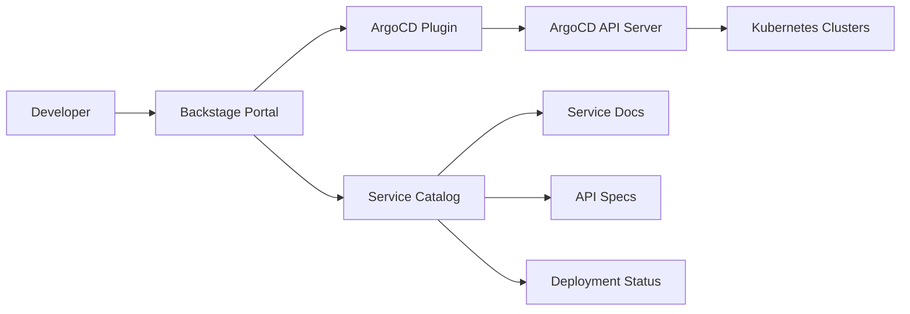

# How to Integrate ArgoCD with Backstage Service Catalog

Author: [nawazdhandala](https://github.com/nawazdhandala)

Tags: ArgoCD, GitOps, Kubernetes, Backstage, Developer Portal

Description: A practical guide to integrating ArgoCD with Backstage to show deployment status, sync state, and application health directly in your service catalog.

---

Backstage is Spotify's open-source developer portal that provides a centralized service catalog, software templates, and plugin-based extensibility. Integrating ArgoCD with Backstage brings deployment visibility directly into the developer portal, letting teams see the health and sync status of their services without leaving Backstage. This guide walks through setting up the ArgoCD plugin for Backstage and configuring it for production use.

## Why Integrate ArgoCD with Backstage

Developers should not need to learn ArgoCD's UI to check if their service deployed successfully. By integrating ArgoCD into Backstage:

- Developers see deployment status on the same page as service documentation
- Team leads get a unified view of all services and their deployment health
- On-call engineers can quickly check recent deployments during incidents
- New team members discover deployment information through the service catalog



## Installing the ArgoCD Plugin for Backstage

Backstage has an official ArgoCD plugin maintained by the community. Install both the frontend and backend components.

### Install the Frontend Plugin

```bash
# Navigate to your Backstage app directory
cd backstage-app

# Install the ArgoCD frontend plugin
yarn add --cwd packages/app @roadiehq/backstage-plugin-argo-cd
```

### Install the Backend Plugin

```bash
# Install the ArgoCD backend plugin
yarn add --cwd packages/backend @roadiehq/backstage-plugin-argo-cd-backend
```

### Register the Backend Plugin

Add the ArgoCD backend to your Backstage backend configuration:

```typescript
// packages/backend/src/index.ts
// Add the ArgoCD backend plugin to the plugin registry
import { createBackend } from '@backstage/backend-defaults';

const backend = createBackend();

// ... other plugins ...

// Register the ArgoCD backend plugin
backend.add(import('@roadiehq/backstage-plugin-argo-cd-backend'));

backend.start();
```

### Add the Frontend Component

Add the ArgoCD card to your entity page:

```typescript
// packages/app/src/components/catalog/EntityPage.tsx
import {
  EntityArgoCDOverviewCard,
  EntityArgoCDHistoryCard,
  isArgocdAvailable,
} from '@roadiehq/backstage-plugin-argo-cd';

// Add to the overview tab of the entity page
const overviewContent = (
  <Grid container spacing={3}>
    {/* Other cards */}
    <EntitySwitch>
      <EntitySwitch.Case if={isArgocdAvailable}>
        <Grid item md={6}>
          <EntityArgoCDOverviewCard />
        </Grid>
        <Grid item md={12}>
          <EntityArgoCDHistoryCard />
        </Grid>
      </EntitySwitch.Case>
    </EntitySwitch>
  </Grid>
);
```

## Configuring the ArgoCD Connection

Configure the ArgoCD instance in your Backstage `app-config.yaml`:

```yaml
# app-config.yaml - ArgoCD configuration
argocd:
  # Base URL of the ArgoCD API server
  baseUrl: https://argocd.example.com
  # Authentication - use an API token
  token: ${ARGOCD_AUTH_TOKEN}
  # Optional: configure multiple ArgoCD instances
  # appLocatorMethods:
  #   - type: config
  #     instances:
  #       - name: production
  #         url: https://argocd-prod.example.com
  #         token: ${ARGOCD_PROD_TOKEN}
  #       - name: staging
  #         url: https://argocd-staging.example.com
  #         token: ${ARGOCD_STAGING_TOKEN}
```

Create a dedicated ArgoCD account for Backstage:

```yaml
# ArgoCD ConfigMap - create a Backstage account
apiVersion: v1
kind: ConfigMap
metadata:
  name: argocd-cm
  namespace: argocd
data:
  # Create a local account for Backstage
  accounts.backstage: apiKey
  accounts.backstage.enabled: "true"
```

Set RBAC permissions for the Backstage account:

```yaml
# ArgoCD RBAC ConfigMap
apiVersion: v1
kind: ConfigMap
metadata:
  name: argocd-rbac-cm
  namespace: argocd
data:
  policy.csv: |
    # Allow Backstage read-only access to all applications
    p, role:backstage, applications, get, */*, allow
    p, role:backstage, clusters, get, *, allow
    p, role:backstage, projects, get, *, allow
    g, backstage, role:backstage
```

Generate an API token for the Backstage account:

```bash
# Generate an API token for the backstage account
argocd account generate-token --account backstage

# Store it as a Kubernetes secret for Backstage
kubectl create secret generic backstage-argocd-token \
  --from-literal=token=<generated-token> \
  -n backstage
```

## Annotating Services in the Catalog

For the ArgoCD plugin to find the right application, annotate your Backstage catalog entities:

```yaml
# catalog-info.yaml for a service
apiVersion: backstage.io/v1alpha1
kind: Component
metadata:
  name: payment-service
  description: Handles payment processing
  annotations:
    # Link to the ArgoCD application
    argocd/app-name: payment-service
    # For multiple ArgoCD instances, specify the instance
    # argocd/app-name: production/payment-service
    # For multiple apps per service (e.g., different environments)
    # argocd/app-selector: app.kubernetes.io/instance=payment-service
  tags:
    - python
    - payments
spec:
  type: service
  lifecycle: production
  owner: payments-team
```

If a service has multiple ArgoCD applications (like staging and production), use a label selector:

```yaml
# catalog-info.yaml with app selector for multiple environments
metadata:
  name: payment-service
  annotations:
    # This selector finds all ArgoCD apps with matching labels
    argocd/app-selector: service=payment-service
```

And make sure your ArgoCD Applications have matching labels:

```yaml
# ArgoCD Application with labels for Backstage selector
apiVersion: argoproj.io/v1alpha1
kind: Application
metadata:
  name: payment-service-prod
  namespace: argocd
  labels:
    service: payment-service
    environment: production
spec:
  # ... application spec ...
---
apiVersion: argoproj.io/v1alpha1
kind: Application
metadata:
  name: payment-service-staging
  namespace: argocd
  labels:
    service: payment-service
    environment: staging
spec:
  # ... application spec ...
```

## Configuring Multiple ArgoCD Instances

For organizations with separate ArgoCD instances per environment:

```yaml
# app-config.yaml with multiple ArgoCD instances
argocd:
  appLocatorMethods:
    - type: config
      instances:
        - name: production
          url: https://argocd-prod.example.com
          token: ${ARGOCD_PROD_TOKEN}
        - name: staging
          url: https://argocd-staging.example.com
          token: ${ARGOCD_STAGING_TOKEN}
        - name: development
          url: https://argocd-dev.example.com
          token: ${ARGOCD_DEV_TOKEN}
```

Reference the instance in catalog annotations:

```yaml
# Reference a specific ArgoCD instance
annotations:
  argocd/app-name: production/payment-service
```

## What the Integration Shows

Once configured, the ArgoCD plugin shows several pieces of information on the entity page:

**Overview Card**:
- Current sync status (Synced, OutOfSync, Unknown)
- Health status (Healthy, Degraded, Progressing, Missing)
- Current revision (Git commit SHA)
- Last sync time

**History Card**:
- Recent sync operations with timestamps
- Sync result (success or failure)
- Revision deployed in each sync
- Duration of each sync operation

## Automating Catalog Registration

Use ArgoCD Application metadata to automatically generate Backstage catalog entries:

```yaml
# Script to generate catalog-info.yaml from ArgoCD applications
#!/bin/bash
# generate-catalog.sh

# List all ArgoCD applications
argocd app list -o json | jq -c '.[]' | while read app; do
  name=$(echo $app | jq -r '.metadata.name')
  namespace=$(echo $app | jq -r '.spec.destination.namespace')
  team=$(echo $app | jq -r '.metadata.labels.team // "platform"')

  cat <<EOF > "catalog-info-${name}.yaml"
apiVersion: backstage.io/v1alpha1
kind: Component
metadata:
  name: ${name}
  annotations:
    argocd/app-name: ${name}
spec:
  type: service
  lifecycle: production
  owner: ${team}
EOF
done
```

## Troubleshooting

**Plugin shows "No ArgoCD app found"**: Verify the annotation matches an actual ArgoCD application name:

```bash
# Check ArgoCD application exists
argocd app get payment-service
```

**Authentication errors**: Verify the token is valid and the account has the right permissions:

```bash
# Test the API token
curl -H "Authorization: Bearer <token>" \
  https://argocd.example.com/api/v1/applications
```

**Multiple instance confusion**: When using multiple instances, make sure the annotation includes the instance name prefix.

## Summary

Integrating ArgoCD with Backstage brings deployment visibility to where developers already work. Install the plugin, configure the ArgoCD connection with a read-only account, annotate your catalog entities, and developers get deployment status on their service pages without needing direct ArgoCD access. For other developer portal integrations, see our guides on [integrating ArgoCD with Port](https://oneuptime.com/blog/post/2026-02-26-argocd-port-developer-portal/view) and [building a self-service deployment catalog](https://oneuptime.com/blog/post/2026-02-26-argocd-self-service-deployment-catalog/view).
