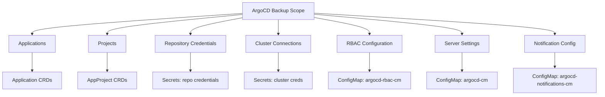

# How to Backup ArgoCD Configuration and State

Author: [nawazdhandala](https://github.com/nawazdhandala)

Tags: ArgoCD, GitOps, Kubernetes, Backups, Disaster Recovery

Description: Learn how to backup ArgoCD configuration, applications, projects, repositories, and cluster connections for disaster recovery and migration.

---

ArgoCD stores its configuration and state as Kubernetes resources - primarily ConfigMaps, Secrets, and Custom Resources in the argocd namespace. Backing up this data is critical for disaster recovery, migration, and rollback scenarios. While your application manifests live in Git (that is the whole point of GitOps), the ArgoCD configuration that tells the system how to deploy those manifests needs its own backup strategy.

## What Needs to Be Backed Up

ArgoCD's state consists of several categories of data:



Here is what you need to capture:

1. **Application resources** - ArgoCD Application CRDs
2. **ApplicationSet resources** - ApplicationSet CRDs
3. **AppProject resources** - Project definitions with RBAC
4. **ConfigMaps** - `argocd-cm`, `argocd-rbac-cm`, `argocd-cmd-params-cm`, `argocd-notifications-cm`, `argocd-ssh-known-hosts-cm`, `argocd-tls-certs-cm`, `argocd-gpg-keys-cm`
5. **Secrets** - Repository credentials, cluster credentials, notification secrets
6. **Custom resources** - Any other ArgoCD-related CRDs

## Using argocd admin for Backup

ArgoCD provides a built-in admin tool for exporting and importing:

### Export All ArgoCD Data

```bash
# Export all ArgoCD resources to a YAML file
argocd admin export -n argocd > argocd-backup-$(date +%Y%m%d).yaml

# The export includes:
# - Applications
# - ApplicationSets
# - AppProjects
# - Repository credentials
# - Cluster credentials
# - ConfigMaps
# - Secrets
```

### Export with Namespace Flag

```bash
# If ArgoCD is in a custom namespace
argocd admin export -n my-argocd-namespace > backup.yaml
```

### Selective Export

```bash
# Export only applications
kubectl get applications.argoproj.io -n argocd -o yaml > apps-backup.yaml

# Export only projects
kubectl get appprojects.argoproj.io -n argocd -o yaml > projects-backup.yaml

# Export only ApplicationSets
kubectl get applicationsets.argoproj.io -n argocd -o yaml > appsets-backup.yaml
```

## Comprehensive Backup Script

Here is a production-grade backup script that captures everything:

```bash
#!/bin/bash
# argocd-backup.sh - Complete ArgoCD backup

set -euo pipefail

NAMESPACE="${ARGOCD_NAMESPACE:-argocd}"
BACKUP_DIR="/backups/argocd/$(date +%Y%m%d-%H%M%S)"

mkdir -p "$BACKUP_DIR"

echo "Starting ArgoCD backup to $BACKUP_DIR"

# 1. Backup Applications
echo "Backing up Applications..."
kubectl get applications.argoproj.io -n "$NAMESPACE" -o yaml \
  > "$BACKUP_DIR/applications.yaml" 2>/dev/null || echo "No applications found"

# 2. Backup ApplicationSets
echo "Backing up ApplicationSets..."
kubectl get applicationsets.argoproj.io -n "$NAMESPACE" -o yaml \
  > "$BACKUP_DIR/applicationsets.yaml" 2>/dev/null || echo "No applicationsets found"

# 3. Backup Projects
echo "Backing up Projects..."
kubectl get appprojects.argoproj.io -n "$NAMESPACE" -o yaml \
  > "$BACKUP_DIR/projects.yaml" 2>/dev/null || echo "No projects found"

# 4. Backup ConfigMaps
echo "Backing up ConfigMaps..."
for cm in argocd-cm argocd-rbac-cm argocd-cmd-params-cm \
           argocd-notifications-cm argocd-ssh-known-hosts-cm \
           argocd-tls-certs-cm argocd-gpg-keys-cm; do
  kubectl get configmap "$cm" -n "$NAMESPACE" -o yaml \
    > "$BACKUP_DIR/cm-${cm}.yaml" 2>/dev/null || echo "  $cm not found, skipping"
done

# 5. Backup Secrets (repository and cluster credentials)
echo "Backing up Secrets..."
# Repository credentials
kubectl get secrets -n "$NAMESPACE" \
  -l argocd.argoproj.io/secret-type=repository -o yaml \
  > "$BACKUP_DIR/secrets-repos.yaml" 2>/dev/null || echo "  No repo secrets found"

# Repository credential templates
kubectl get secrets -n "$NAMESPACE" \
  -l argocd.argoproj.io/secret-type=repo-creds -o yaml \
  > "$BACKUP_DIR/secrets-repo-creds.yaml" 2>/dev/null || echo "  No repo-creds found"

# Cluster credentials
kubectl get secrets -n "$NAMESPACE" \
  -l argocd.argoproj.io/secret-type=cluster -o yaml \
  > "$BACKUP_DIR/secrets-clusters.yaml" 2>/dev/null || echo "  No cluster secrets found"

# Notification secrets
kubectl get secret argocd-notifications-secret -n "$NAMESPACE" -o yaml \
  > "$BACKUP_DIR/secrets-notifications.yaml" 2>/dev/null || echo "  No notification secrets"

# 6. Create an inventory
echo "Creating backup inventory..."
cat > "$BACKUP_DIR/inventory.txt" << EOF
ArgoCD Backup Inventory
=======================
Date: $(date -u +"%Y-%m-%d %H:%M:%S UTC")
Namespace: $NAMESPACE
Kubernetes Context: $(kubectl config current-context)

Applications: $(kubectl get applications.argoproj.io -n "$NAMESPACE" --no-headers 2>/dev/null | wc -l | tr -d ' ')
ApplicationSets: $(kubectl get applicationsets.argoproj.io -n "$NAMESPACE" --no-headers 2>/dev/null | wc -l | tr -d ' ')
Projects: $(kubectl get appprojects.argoproj.io -n "$NAMESPACE" --no-headers 2>/dev/null | wc -l | tr -d ' ')
Repository Secrets: $(kubectl get secrets -n "$NAMESPACE" -l argocd.argoproj.io/secret-type=repository --no-headers 2>/dev/null | wc -l | tr -d ' ')
Cluster Secrets: $(kubectl get secrets -n "$NAMESPACE" -l argocd.argoproj.io/secret-type=cluster --no-headers 2>/dev/null | wc -l | tr -d ' ')

Files:
$(ls -la "$BACKUP_DIR")
EOF

# 7. Compress the backup
echo "Compressing backup..."
tar -czf "$BACKUP_DIR.tar.gz" -C "$(dirname "$BACKUP_DIR")" "$(basename "$BACKUP_DIR")"
rm -rf "$BACKUP_DIR"

echo ""
echo "Backup complete: $BACKUP_DIR.tar.gz"
echo "Size: $(du -h "$BACKUP_DIR.tar.gz" | cut -f1)"
```

## Backing Up to Cloud Storage

### Upload to S3

```bash
#!/bin/bash
# backup-to-s3.sh - Backup ArgoCD to S3

BACKUP_FILE="/tmp/argocd-backup-$(date +%Y%m%d-%H%M%S).yaml"
S3_BUCKET="s3://my-backups/argocd"

# Export all ArgoCD data
argocd admin export -n argocd > "$BACKUP_FILE"

# Upload to S3
aws s3 cp "$BACKUP_FILE" "$S3_BUCKET/"

# Keep only last 30 days of backups in S3
aws s3 ls "$S3_BUCKET/" | \
  while read -r line; do
    FILE_DATE=$(echo "$line" | awk '{print $1}')
    if [[ $(date -d "$FILE_DATE" +%s) -lt $(date -d "30 days ago" +%s) ]]; then
      FILE=$(echo "$line" | awk '{print $4}')
      aws s3 rm "$S3_BUCKET/$FILE"
    fi
  done

# Cleanup local file
rm -f "$BACKUP_FILE"
echo "Backup uploaded to $S3_BUCKET"
```

### Upload to Google Cloud Storage

```bash
#!/bin/bash
# backup-to-gcs.sh

BACKUP_FILE="/tmp/argocd-backup-$(date +%Y%m%d-%H%M%S).yaml"
GCS_BUCKET="gs://my-backups/argocd"

argocd admin export -n argocd > "$BACKUP_FILE"
gsutil cp "$BACKUP_FILE" "$GCS_BUCKET/"

# Set lifecycle policy for auto-cleanup
gsutil lifecycle set '{"rule": [{"action": {"type": "Delete"}, "condition": {"age": 30}}]}' \
  "$GCS_BUCKET"

rm -f "$BACKUP_FILE"
```

## Cleaning Up Backup Files for Restore

Before restoring, you need to strip Kubernetes-managed fields from the backup:

```bash
# Strip managed fields that would cause conflicts during restore
# This removes resourceVersion, uid, creationTimestamp, etc.
cat argocd-backup.yaml | \
  python3 -c "
import sys, yaml

for doc in yaml.safe_load_all(sys.stdin):
    if doc is None:
        continue
    # Remove cluster-specific metadata
    meta = doc.get('metadata', {})
    for field in ['resourceVersion', 'uid', 'creationTimestamp',
                  'generation', 'managedFields', 'selfLink']:
        meta.pop(field, None)
    # Remove status
    doc.pop('status', None)
    print('---')
    print(yaml.dump(doc, default_flow_style=False))
" > argocd-backup-clean.yaml
```

## Verifying Backups

Always verify your backups:

```bash
#!/bin/bash
# verify-backup.sh - Verify an ArgoCD backup file

BACKUP_FILE="$1"

if [ -z "$BACKUP_FILE" ]; then
  echo "Usage: $0 <backup-file>"
  exit 1
fi

echo "Verifying backup: $BACKUP_FILE"
echo ""

# Count resources by kind
echo "Resource counts:"
grep "^kind:" "$BACKUP_FILE" | sort | uniq -c | sort -rn

echo ""

# Check for applications
APP_COUNT=$(grep "kind: Application$" "$BACKUP_FILE" | wc -l | tr -d ' ')
echo "Applications: $APP_COUNT"

# Check for projects
PROJ_COUNT=$(grep "kind: AppProject" "$BACKUP_FILE" | wc -l | tr -d ' ')
echo "Projects: $PROJ_COUNT"

# Validate YAML syntax
echo ""
echo "Validating YAML syntax..."
python3 -c "
import yaml, sys
try:
    docs = list(yaml.safe_load_all(open('$BACKUP_FILE')))
    print(f'Valid YAML: {len([d for d in docs if d])} documents')
except yaml.YAMLError as e:
    print(f'YAML Error: {e}')
    sys.exit(1)
"

echo ""
echo "Backup verification complete"
```

## Backup Frequency Recommendations

| Component | Frequency | Reason |
|-----------|-----------|--------|
| Applications | Daily | Change frequently with deployments |
| Projects | Weekly | Change less often |
| ConfigMaps | On change | Critical configuration |
| Secrets | On change | Credentials rarely change |
| Full backup | Daily | Comprehensive protection |

For automated scheduled backups, see our guide on [Automating ArgoCD Backups with CronJobs](https://oneuptime.com/blog/post/2026-02-26-argocd-automate-backup-cronjobs/view).

Backing up ArgoCD is not optional - it is a fundamental part of running ArgoCD in production. While GitOps means your application manifests are safely in Git, the ArgoCD configuration that orchestrates everything needs its own backup strategy. Implement automated daily backups, store them in durable cloud storage, and regularly test your restore procedures.
