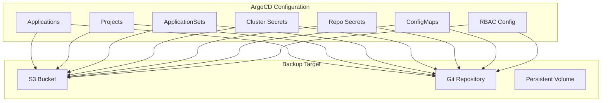

# How to Backup and Restore ArgoCD Configuration

Author: [nawazdhandala](https://github.com/nawazdhandala)

Tags: ArgoCD, GitOps, Kubernetes, Backup, Disaster Recovery

Description: Learn how to backup and restore ArgoCD configuration including applications, projects, repositories, clusters, and settings, with automated backup strategies.

---

ArgoCD stores critical configuration as Kubernetes resources: Application CRDs, Projects, Secrets containing repository credentials and cluster connections, and ConfigMaps with settings. Losing this configuration means losing your entire GitOps setup - every application definition, every repository connection, every RBAC policy. Regular backups ensure you can recover quickly from cluster failures, accidental deletions, or migration needs.

## What to Backup

ArgoCD configuration consists of these resource types:

| Resource Type | Purpose | Storage Location |
|---|---|---|
| Applications | Application definitions and sync config | CRDs in argocd namespace |
| AppProjects | Project isolation and RBAC | CRDs in argocd namespace |
| ApplicationSets | Template-based app generation | CRDs in argocd namespace |
| Secrets (cluster type) | Cluster connection credentials | Secrets in argocd namespace |
| Secrets (repo type) | Repository credentials | Secrets in argocd namespace |
| ConfigMaps | ArgoCD settings | ConfigMaps in argocd namespace |
| RBAC policies | Access control rules | ConfigMap argocd-rbac-cm |



## Method 1: Using argocd admin export

ArgoCD includes a built-in export/import tool:

```bash
# Export all ArgoCD configuration to YAML
argocd admin export > argocd-backup-$(date +%Y%m%d).yaml

# This exports:
# - Applications
# - Projects
# - Repositories
# - Clusters
# - Settings (ConfigMaps)
```

To restore:

```bash
# Import from backup
argocd admin import - < argocd-backup-20260226.yaml
```

Note: `argocd admin export` requires direct access to the ArgoCD namespace. It reads resources from the Kubernetes API, not through the ArgoCD API.

## Method 2: kubectl-Based Backup

For more control over what you backup, use kubectl directly:

```bash
#!/bin/bash
# argocd-backup.sh
BACKUP_DIR="/tmp/argocd-backup-$(date +%Y%m%d-%H%M%S)"
mkdir -p "$BACKUP_DIR"

echo "Backing up ArgoCD configuration to $BACKUP_DIR"

# Backup Applications
kubectl get applications.argoproj.io -n argocd -o yaml > "$BACKUP_DIR/applications.yaml"
echo "Backed up $(kubectl get applications.argoproj.io -n argocd --no-headers | wc -l) applications"

# Backup ApplicationSets
kubectl get applicationsets.argoproj.io -n argocd -o yaml > "$BACKUP_DIR/applicationsets.yaml"
echo "Backed up $(kubectl get applicationsets.argoproj.io -n argocd --no-headers | wc -l) applicationsets"

# Backup Projects
kubectl get appprojects.argoproj.io -n argocd -o yaml > "$BACKUP_DIR/projects.yaml"
echo "Backed up $(kubectl get appprojects.argoproj.io -n argocd --no-headers | wc -l) projects"

# Backup Repository credentials (secrets)
kubectl get secrets -n argocd \
  -l argocd.argoproj.io/secret-type=repository -o yaml > "$BACKUP_DIR/repo-secrets.yaml"

# Backup Repository credential templates
kubectl get secrets -n argocd \
  -l argocd.argoproj.io/secret-type=repo-creds -o yaml > "$BACKUP_DIR/repo-cred-templates.yaml"

# Backup Cluster secrets
kubectl get secrets -n argocd \
  -l argocd.argoproj.io/secret-type=cluster -o yaml > "$BACKUP_DIR/cluster-secrets.yaml"

# Backup ConfigMaps
for cm in argocd-cm argocd-cmd-params-cm argocd-rbac-cm argocd-tls-certs-cm argocd-ssh-known-hosts-cm; do
  kubectl get configmap "$cm" -n argocd -o yaml > "$BACKUP_DIR/$cm.yaml" 2>/dev/null
done

# Backup GPG keys
kubectl get secrets -n argocd \
  -l argocd.argoproj.io/secret-type=gnupg-key -o yaml > "$BACKUP_DIR/gpg-keys.yaml" 2>/dev/null

echo "Backup complete: $BACKUP_DIR"
ls -la "$BACKUP_DIR"
```

## Method 3: Declarative Backup with Git

The most GitOps-native approach is storing all ArgoCD configuration in Git:

```yaml
# gitops-config/argocd/applications/frontend.yaml
apiVersion: argoproj.io/v1alpha1
kind: Application
metadata:
  name: frontend
  namespace: argocd
spec:
  project: team-frontend
  source:
    repoURL: https://github.com/myorg/frontend
    targetRevision: main
    path: k8s/production
  destination:
    server: https://kubernetes.default.svc
    namespace: frontend
  syncPolicy:
    automated:
      prune: true
      selfHeal: true
```

```yaml
# gitops-config/argocd/projects/team-frontend.yaml
apiVersion: argoproj.io/v1alpha1
kind: AppProject
metadata:
  name: team-frontend
  namespace: argocd
spec:
  destinations:
    - namespace: frontend
      server: https://kubernetes.default.svc
  sourceRepos:
    - 'https://github.com/myorg/frontend'
```

Use an App-of-Apps to manage these declarative configurations:

```yaml
# root-app.yaml
apiVersion: argoproj.io/v1alpha1
kind: Application
metadata:
  name: argocd-config
  namespace: argocd
spec:
  project: default
  source:
    repoURL: https://github.com/myorg/gitops-config
    targetRevision: main
    path: argocd
  destination:
    server: https://kubernetes.default.svc
    namespace: argocd
```

This way, your ArgoCD configuration is always backed up in Git. Recovery means just re-applying the root application.

## Automated Backup with CronJob

Set up automated backups to S3 or another object store:

```yaml
apiVersion: batch/v1
kind: CronJob
metadata:
  name: argocd-backup
  namespace: argocd
spec:
  schedule: "0 2 * * *"  # Daily at 2 AM
  successfulJobsHistoryLimit: 7
  failedJobsHistoryLimit: 3
  jobTemplate:
    spec:
      template:
        spec:
          serviceAccountName: argocd-backup
          containers:
            - name: backup
              image: bitnami/kubectl:latest
              env:
                - name: AWS_ACCESS_KEY_ID
                  valueFrom:
                    secretKeyRef:
                      name: backup-s3-credentials
                      key: access-key
                - name: AWS_SECRET_ACCESS_KEY
                  valueFrom:
                    secretKeyRef:
                      name: backup-s3-credentials
                      key: secret-key
                - name: S3_BUCKET
                  value: "my-argocd-backups"
              command:
                - /bin/bash
                - -c
                - |
                  set -e
                  TIMESTAMP=$(date +%Y%m%d-%H%M%S)
                  BACKUP_FILE="/tmp/argocd-backup-${TIMESTAMP}.yaml"

                  echo "Starting ArgoCD backup..."

                  # Export all ArgoCD resources
                  {
                    echo "---"
                    kubectl get applications.argoproj.io -n argocd -o yaml
                    echo "---"
                    kubectl get applicationsets.argoproj.io -n argocd -o yaml
                    echo "---"
                    kubectl get appprojects.argoproj.io -n argocd -o yaml
                    echo "---"
                    kubectl get secrets -n argocd \
                      -l argocd.argoproj.io/secret-type=repository -o yaml
                    echo "---"
                    kubectl get secrets -n argocd \
                      -l argocd.argoproj.io/secret-type=repo-creds -o yaml
                    echo "---"
                    kubectl get secrets -n argocd \
                      -l argocd.argoproj.io/secret-type=cluster -o yaml
                    echo "---"
                    kubectl get configmap argocd-cm -n argocd -o yaml
                    echo "---"
                    kubectl get configmap argocd-rbac-cm -n argocd -o yaml
                    echo "---"
                    kubectl get configmap argocd-cmd-params-cm -n argocd -o yaml
                  } > "$BACKUP_FILE"

                  # Upload to S3
                  apt-get update -qq && apt-get install -qq -y awscli > /dev/null 2>&1
                  aws s3 cp "$BACKUP_FILE" \
                    "s3://${S3_BUCKET}/argocd-backups/argocd-backup-${TIMESTAMP}.yaml"

                  # Keep only last 30 backups
                  aws s3 ls "s3://${S3_BUCKET}/argocd-backups/" | \
                    sort | head -n -30 | \
                    awk '{print $4}' | \
                    xargs -I {} aws s3 rm "s3://${S3_BUCKET}/argocd-backups/{}"

                  echo "Backup complete: argocd-backup-${TIMESTAMP}.yaml"
          restartPolicy: OnFailure
```

Create the required RBAC:

```yaml
apiVersion: v1
kind: ServiceAccount
metadata:
  name: argocd-backup
  namespace: argocd
---
apiVersion: rbac.authorization.k8s.io/v1
kind: Role
metadata:
  name: argocd-backup
  namespace: argocd
rules:
  - apiGroups: ["argoproj.io"]
    resources: ["applications", "applicationsets", "appprojects"]
    verbs: ["get", "list"]
  - apiGroups: [""]
    resources: ["secrets", "configmaps"]
    verbs: ["get", "list"]
---
apiVersion: rbac.authorization.k8s.io/v1
kind: RoleBinding
metadata:
  name: argocd-backup
  namespace: argocd
subjects:
  - kind: ServiceAccount
    name: argocd-backup
    namespace: argocd
roleRef:
  kind: Role
  name: argocd-backup
  apiGroup: rbac.authorization.k8s.io
```

## Restore Procedure

### Full Restore from kubectl Backup

```bash
#!/bin/bash
# argocd-restore.sh
BACKUP_DIR="$1"

if [ -z "$BACKUP_DIR" ]; then
  echo "Usage: $0 <backup-directory>"
  exit 1
fi

echo "Restoring ArgoCD from $BACKUP_DIR"

# Step 1: Ensure ArgoCD is installed
kubectl get namespace argocd || kubectl create namespace argocd

# Step 2: Restore ConfigMaps first (settings)
for cm in argocd-cm argocd-cmd-params-cm argocd-rbac-cm argocd-tls-certs-cm argocd-ssh-known-hosts-cm; do
  if [ -f "$BACKUP_DIR/$cm.yaml" ]; then
    kubectl apply -f "$BACKUP_DIR/$cm.yaml"
    echo "Restored $cm"
  fi
done

# Step 3: Restore secrets (credentials)
kubectl apply -f "$BACKUP_DIR/repo-secrets.yaml" 2>/dev/null
kubectl apply -f "$BACKUP_DIR/repo-cred-templates.yaml" 2>/dev/null
kubectl apply -f "$BACKUP_DIR/cluster-secrets.yaml" 2>/dev/null
echo "Restored secrets"

# Step 4: Restore projects (before applications)
kubectl apply -f "$BACKUP_DIR/projects.yaml"
echo "Restored projects"

# Step 5: Restore ApplicationSets
kubectl apply -f "$BACKUP_DIR/applicationsets.yaml" 2>/dev/null
echo "Restored applicationsets"

# Step 6: Restore Applications
kubectl apply -f "$BACKUP_DIR/applications.yaml"
echo "Restored applications"

# Step 7: Verify
echo "Verifying restore..."
argocd app list
argocd proj list
argocd repo list
argocd cluster list

echo "Restore complete"
```

### Partial Restore (Single Application)

```bash
# Extract and restore a single application from backup
kubectl get application my-app -n argocd -o yaml < backup/applications.yaml | \
  kubectl apply -f -

# Or create from scratch if you know the configuration
argocd app create my-app \
  --repo https://github.com/myorg/app \
  --path k8s/production \
  --dest-server https://kubernetes.default.svc \
  --dest-namespace my-app \
  --sync-policy automated
```

## Security Considerations for Backups

Backup files contain sensitive data including:
- Repository credentials (passwords, SSH keys, tokens)
- Cluster connection tokens
- TLS certificates and keys

Encrypt backups at rest:

```bash
# Encrypt with GPG before uploading
gpg --symmetric --cipher-algo AES256 argocd-backup.yaml
# Creates argocd-backup.yaml.gpg

# Decrypt when restoring
gpg --decrypt argocd-backup.yaml.gpg > argocd-backup.yaml
```

Or use S3 server-side encryption:

```bash
aws s3 cp argocd-backup.yaml s3://my-bucket/backups/ \
  --sse aws:kms \
  --sse-kms-key-id alias/argocd-backup-key
```

## Backup Validation

Regularly validate that backups can actually be restored:

```bash
# Create a test namespace
kubectl create namespace argocd-restore-test

# Attempt to dry-run the restore
kubectl apply -f backup/applications.yaml \
  --dry-run=server \
  --namespace=argocd-restore-test

# Clean up
kubectl delete namespace argocd-restore-test
```

Backup without tested restore is not backup - it is hope. Test your restore procedure at least quarterly. For monitoring backup job success and ArgoCD health, use [OneUptime](https://oneuptime.com) to track CronJob completions and alert on failures.
