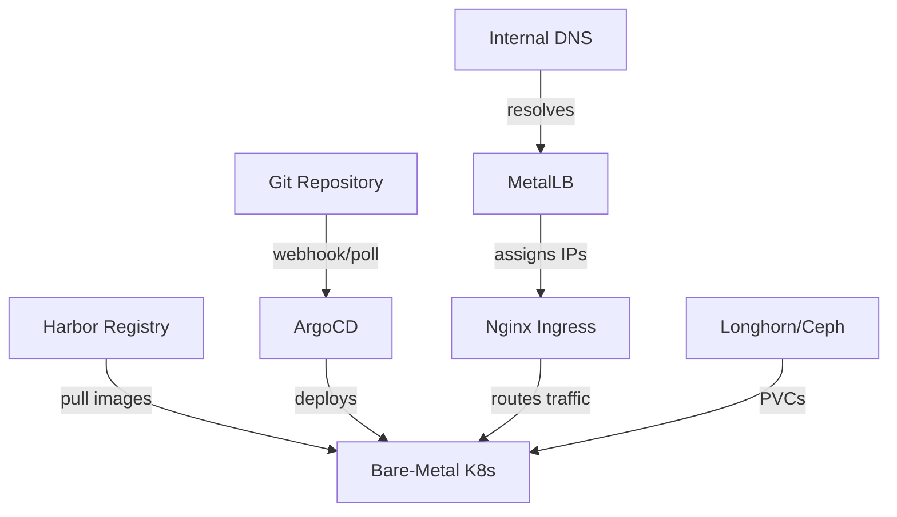

# How to Use ArgoCD on Bare-Metal Kubernetes Clusters

Author: [nawazdhandala](https://github.com/nawazdhandala)

Tags: ArgoCD, GitOps, Kubernetes, Bare Metal, On-Premises

Description: Learn how to deploy and configure ArgoCD on bare-metal Kubernetes clusters with MetalLB, local storage, and production networking considerations.

---

Running Kubernetes on bare metal means no cloud provider managing your infrastructure. There are no managed load balancers, no cloud-provisioned volumes, and no integrated container registries. But for many organizations, bare-metal Kubernetes is the reality, whether for cost reasons, data sovereignty, compliance requirements, or simply because the workloads demand the performance that only dedicated hardware can provide.

ArgoCD works great on bare metal, but you need to fill in the gaps that cloud providers normally handle. This guide covers the full setup: deploying ArgoCD, exposing it with MetalLB and ingress, handling persistent storage, and the operational considerations unique to bare-metal environments.

## Prerequisites

- A Kubernetes cluster running on bare metal (kubeadm, k3s, or similar)
- At least 3 nodes with 4GB RAM each
- A range of available IP addresses for MetalLB
- kubectl configured with cluster access

## Step 1: Install MetalLB for Load Balancing

The biggest difference between cloud and bare-metal Kubernetes is load balancing. Cloud providers automatically provision load balancers for services of type LoadBalancer. On bare metal, you need MetalLB.

```bash
# Install MetalLB
kubectl apply -f https://raw.githubusercontent.com/metallb/metallb/v0.14.3/config/manifests/metallb-native.yaml

# Wait for MetalLB pods to be ready
kubectl wait --for=condition=Ready pod --all -n metallb-system --timeout=120s
```

Configure MetalLB with an IP address pool from your network.

```yaml
# metallb-config.yaml
apiVersion: metallb.io/v1beta1
kind: IPAddressPool
metadata:
  name: default-pool
  namespace: metallb-system
spec:
  addresses:
    # Use a range of IPs from your network that are not used by DHCP
    - 192.168.1.200-192.168.1.250
---
apiVersion: metallb.io/v1beta1
kind: L2Advertisement
metadata:
  name: default
  namespace: metallb-system
spec:
  ipAddressPools:
    - default-pool
```

```bash
kubectl apply -f metallb-config.yaml
```

## Step 2: Install ArgoCD

```bash
# Create namespace and install ArgoCD
kubectl create namespace argocd
kubectl apply -n argocd -f https://raw.githubusercontent.com/argoproj/argo-cd/stable/manifests/install.yaml

# Wait for all pods
kubectl wait --for=condition=Ready pod --all -n argocd --timeout=300s

# Get initial admin password
kubectl -n argocd get secret argocd-initial-admin-secret \
  -o jsonpath="{.data.password}" | base64 -d && echo
```

## Step 3: Expose ArgoCD

With MetalLB installed, you can now use LoadBalancer services. But for a proper setup, use an ingress controller.

### Install Nginx Ingress Controller

```yaml
# nginx-ingress-baremetal.yaml
apiVersion: argoproj.io/v1alpha1
kind: Application
metadata:
  name: nginx-ingress
  namespace: argocd
spec:
  project: default
  source:
    repoURL: https://kubernetes.github.io/ingress-nginx
    chart: ingress-nginx
    targetRevision: 4.x
    helm:
      values: |
        controller:
          service:
            type: LoadBalancer
          # For bare metal, hostNetwork can be an alternative
          # hostNetwork: true
          # dnsPolicy: ClusterFirstWithHostNet
  destination:
    server: https://kubernetes.default.svc
    namespace: ingress-nginx
  syncPolicy:
    automated:
      prune: true
      selfHeal: true
    syncOptions:
      - CreateNamespace=true
```

### Create ArgoCD Ingress

```yaml
# argocd-ingress.yaml
apiVersion: networking.k8s.io/v1
kind: Ingress
metadata:
  name: argocd-server
  namespace: argocd
  annotations:
    nginx.ingress.kubernetes.io/ssl-passthrough: "true"
    nginx.ingress.kubernetes.io/backend-protocol: "HTTPS"
spec:
  ingressClassName: nginx
  rules:
    - host: argocd.internal.example.com
      http:
        paths:
          - path: /
            pathType: Prefix
            backend:
              service:
                name: argocd-server
                port:
                  number: 443
```

### Alternative: HostNetwork Approach

For environments where MetalLB is not an option, you can run ArgoCD server directly on host networking.

```yaml
# Patch ArgoCD server to use hostNetwork
# This binds directly to the node's network interface
spec:
  template:
    spec:
      hostNetwork: true
      dnsPolicy: ClusterFirstWithHostNet
```

## Step 4: Set Up Persistent Storage

Bare-metal clusters need a storage solution. There are several options.

### Option A: Local Path Provisioner

The simplest option, suitable for development and small clusters.

```bash
# Install Rancher's local-path-provisioner
kubectl apply -f https://raw.githubusercontent.com/rancher/local-path-provisioner/master/deploy/local-path-storage.yaml

# Set as default storage class
kubectl patch storageclass local-path \
  -p '{"metadata": {"annotations":{"storageclass.kubernetes.io/is-default-class":"true"}}}'
```

### Option B: Longhorn

A distributed storage system designed for Kubernetes on bare metal.

```yaml
# longhorn-app.yaml
apiVersion: argoproj.io/v1alpha1
kind: Application
metadata:
  name: longhorn
  namespace: argocd
spec:
  project: default
  source:
    repoURL: https://charts.longhorn.io
    chart: longhorn
    targetRevision: 1.6.x
    helm:
      values: |
        defaultSettings:
          defaultReplicaCount: 2
        persistence:
          defaultClassReplicaCount: 2
  destination:
    server: https://kubernetes.default.svc
    namespace: longhorn-system
  syncPolicy:
    automated:
      prune: true
      selfHeal: true
    syncOptions:
      - CreateNamespace=true
```

### Option C: Rook-Ceph

For larger clusters that need enterprise-grade storage.

```yaml
# rook-ceph-operator.yaml
apiVersion: argoproj.io/v1alpha1
kind: Application
metadata:
  name: rook-ceph-operator
  namespace: argocd
spec:
  project: default
  source:
    repoURL: https://charts.rook.io/release
    chart: rook-ceph
    targetRevision: v1.13.x
  destination:
    server: https://kubernetes.default.svc
    namespace: rook-ceph
  syncPolicy:
    automated:
      prune: true
      selfHeal: true
    syncOptions:
      - CreateNamespace=true
```

## Step 5: Container Registry

Without a cloud registry, you have two main options.

### Self-Hosted Harbor

Deploy a Harbor registry on your cluster.

```yaml
# harbor-app.yaml
apiVersion: argoproj.io/v1alpha1
kind: Application
metadata:
  name: harbor
  namespace: argocd
spec:
  project: default
  source:
    repoURL: https://helm.goharbor.io
    chart: harbor
    targetRevision: 1.14.x
    helm:
      values: |
        expose:
          type: ingress
          ingress:
            hosts:
              core: registry.internal.example.com
            className: nginx
        persistence:
          enabled: true
          persistentVolumeClaim:
            registry:
              size: 100Gi
  destination:
    server: https://kubernetes.default.svc
    namespace: harbor
  syncPolicy:
    automated:
      prune: true
      selfHeal: true
    syncOptions:
      - CreateNamespace=true
```

### External Registry

Or simply use an external registry like Docker Hub, GitHub Container Registry, or GitLab Container Registry.

## Step 6: TLS Certificates

On bare metal, you handle your own TLS. For internal clusters, use cert-manager with a private CA or Let's Encrypt if you have external access.

### Internal CA with cert-manager

```yaml
# self-signed-issuer.yaml
apiVersion: cert-manager.io/v1
kind: ClusterIssuer
metadata:
  name: selfsigned-issuer
spec:
  selfSigned: {}
---
# Create a CA certificate
apiVersion: cert-manager.io/v1
kind: Certificate
metadata:
  name: internal-ca
  namespace: cert-manager
spec:
  isCA: true
  commonName: internal-ca
  secretName: internal-ca-secret
  privateKey:
    algorithm: RSA
    size: 2048
  issuerRef:
    name: selfsigned-issuer
    kind: ClusterIssuer
---
# Use the CA to issue certificates
apiVersion: cert-manager.io/v1
kind: ClusterIssuer
metadata:
  name: internal-ca-issuer
spec:
  ca:
    secretName: internal-ca-secret
```

## Architecture on Bare Metal



## Bare-Metal-Specific Considerations

### Network Connectivity for Git Access

If your bare-metal cluster is in a private network, ArgoCD needs to reach your Git repositories. Options include:

- Run a local GitLab or Gitea instance
- Set up an HTTP proxy for external Git access
- Use a VPN connection to your Git provider

```yaml
# Configure ArgoCD to use an HTTP proxy
apiVersion: v1
kind: ConfigMap
metadata:
  name: argocd-cm
  namespace: argocd
data:
  # Set proxy for Git operations
  HTTPS_PROXY: "http://proxy.internal:3128"
  HTTP_PROXY: "http://proxy.internal:3128"
  NO_PROXY: "10.0.0.0/8,192.168.0.0/16,kubernetes.default.svc"
```

### High Availability Without Cloud Features

On bare metal, you are responsible for HA at every layer.

```yaml
# ArgoCD HA deployment
# Use the HA installation manifests
kubectl apply -n argocd -f https://raw.githubusercontent.com/argoproj/argo-cd/stable/manifests/ha/install.yaml
```

For Redis HA, switch to Redis Sentinel mode.

### Hardware Failures

Unlike cloud providers, failed hardware on bare metal stays failed until you fix it. Plan for this:

- Run at least 3 master nodes
- Use distributed storage (Longhorn or Ceph) with replication
- Set PodDisruptionBudgets on ArgoCD components
- Monitor node health with tools like node-problem-detector

```yaml
# PDB for ArgoCD application controller
apiVersion: policy/v1
kind: PodDisruptionBudget
metadata:
  name: argocd-application-controller-pdb
  namespace: argocd
spec:
  minAvailable: 1
  selector:
    matchLabels:
      app.kubernetes.io/name: argocd-application-controller
```

### DNS Resolution

Without cloud DNS, set up CoreDNS or your own DNS server for internal service discovery.

```bash
# Add internal DNS entries for ArgoCD
# In your DNS server or /etc/hosts on all nodes
192.168.1.200 argocd.internal.example.com
192.168.1.200 registry.internal.example.com
```

## Troubleshooting on Bare Metal

### MetalLB Not Assigning IPs

Check that the IP range does not overlap with your DHCP pool and that ARP/NDP works correctly on your network.

```bash
kubectl logs -n metallb-system -l component=speaker
```

### Slow Git Operations

If ArgoCD is slow to sync, check network connectivity to your Git server.

```bash
kubectl exec -n argocd deployment/argocd-repo-server -- \
  git ls-remote https://github.com/my-org/my-repo
```

### Storage Performance Issues

Monitor I/O performance on your nodes.

```bash
kubectl top nodes
# For detailed storage metrics, check your storage solution's dashboard
```

## Conclusion

Running ArgoCD on bare-metal Kubernetes requires more upfront work than a cloud deployment, but it gives you complete control over your infrastructure. The key components you need to add are MetalLB for load balancing, a storage solution like Longhorn or Ceph, and optionally a self-hosted container registry. Once these foundations are in place, ArgoCD works identically to how it runs on any cloud provider. For organizations with existing data center infrastructure or strict compliance requirements, bare-metal Kubernetes with ArgoCD is a proven, production-ready approach.
