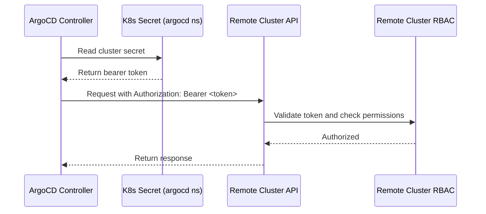

# How to Configure Bearer Token Auth for Remote Clusters in ArgoCD

Author: [nawazdhandala](https://github.com/nawazdhandala)

Tags: ArgoCD, GitOps, Kubernetes, Authentication, Security

Description: Learn how to configure bearer token authentication for remote Kubernetes clusters in ArgoCD, including ServiceAccount creation, token generation, RBAC setup, and token lifecycle management.

---

Bearer token authentication is the most straightforward way to connect ArgoCD to remote Kubernetes clusters. A bearer token is a long-lived credential tied to a Kubernetes ServiceAccount. When ArgoCD needs to interact with the remote cluster, it includes this token in the Authorization header of every API request.

This guide covers the complete setup: creating the right ServiceAccount, generating tokens that work across Kubernetes versions, configuring RBAC, and managing the token lifecycle.

## How Bearer Token Auth Works



## Step 1: Create the ServiceAccount

On the remote cluster, create a dedicated ServiceAccount for ArgoCD:

```yaml
# argocd-manager-sa.yaml
apiVersion: v1
kind: ServiceAccount
metadata:
  name: argocd-manager
  namespace: kube-system
  labels:
    app.kubernetes.io/managed-by: argocd
    app.kubernetes.io/part-of: argocd
```

## Step 2: Generate the Token

### For Kubernetes 1.24+

Starting with Kubernetes 1.24, ServiceAccount tokens are no longer automatically created as Secrets. You need to explicitly create one:

```yaml
# argocd-manager-token.yaml
apiVersion: v1
kind: Secret
metadata:
  name: argocd-manager-token
  namespace: kube-system
  annotations:
    kubernetes.io/service-account.name: argocd-manager
type: kubernetes.io/service-account-token
```

Apply and wait for the token to be populated:

```bash
kubectl apply -f argocd-manager-token.yaml --context remote-cluster

# Wait for the token
sleep 3

# Verify the token exists
kubectl get secret argocd-manager-token -n kube-system \
  --context remote-cluster \
  -o jsonpath='{.data.token}' | base64 -d | head -c 50
```

### Alternative: Time-Bound Tokens

Kubernetes also supports creating time-bound tokens via the TokenRequest API:

```bash
# Create a token that expires in 8760 hours (1 year)
TOKEN=$(kubectl create token argocd-manager \
  -n kube-system \
  --context remote-cluster \
  --duration=8760h)
```

Note: Time-bound tokens require re-creation before expiry. The Secret-based approach is better for long-lived credentials.

### For Kubernetes 1.23 and earlier

Tokens are automatically created. Find the existing token:

```bash
TOKEN_SECRET=$(kubectl get serviceaccount argocd-manager \
  -n kube-system \
  --context remote-cluster \
  -o jsonpath='{.secrets[0].name}')

TOKEN=$(kubectl get secret $TOKEN_SECRET \
  -n kube-system \
  --context remote-cluster \
  -o jsonpath='{.data.token}' | base64 -d)
```

## Step 3: Configure RBAC

The ServiceAccount needs permissions to manage resources in the cluster:

### Full Cluster Admin

For maximum flexibility (simple but broad):

```yaml
apiVersion: rbac.authorization.k8s.io/v1
kind: ClusterRoleBinding
metadata:
  name: argocd-manager-admin
roleRef:
  apiGroup: rbac.authorization.k8s.io
  kind: ClusterRole
  name: cluster-admin
subjects:
  - kind: ServiceAccount
    name: argocd-manager
    namespace: kube-system
```

### Custom Least-Privilege Role

For production environments, restrict permissions:

```yaml
apiVersion: rbac.authorization.k8s.io/v1
kind: ClusterRole
metadata:
  name: argocd-manager
rules:
  # Read all resources for health checks and diff
  - apiGroups: ["*"]
    resources: ["*"]
    verbs: ["get", "list", "watch"]

  # Manage common workload resources
  - apiGroups: [""]
    resources:
      - configmaps
      - endpoints
      - persistentvolumeclaims
      - pods
      - secrets
      - serviceaccounts
      - services
    verbs: ["create", "update", "patch", "delete"]

  - apiGroups: ["apps"]
    resources:
      - deployments
      - daemonsets
      - replicasets
      - statefulsets
    verbs: ["create", "update", "patch", "delete"]

  - apiGroups: ["batch"]
    resources:
      - jobs
      - cronjobs
    verbs: ["create", "update", "patch", "delete"]

  - apiGroups: ["networking.k8s.io"]
    resources:
      - ingresses
      - networkpolicies
    verbs: ["create", "update", "patch", "delete"]

  # Manage namespaces (for CreateNamespace sync option)
  - apiGroups: [""]
    resources:
      - namespaces
    verbs: ["create", "update", "patch", "delete"]

  # Manage RBAC (if needed)
  - apiGroups: ["rbac.authorization.k8s.io"]
    resources:
      - roles
      - rolebindings
      - clusterroles
      - clusterrolebindings
    verbs: ["create", "update", "patch", "delete"]

---
apiVersion: rbac.authorization.k8s.io/v1
kind: ClusterRoleBinding
metadata:
  name: argocd-manager
roleRef:
  apiGroup: rbac.authorization.k8s.io
  kind: ClusterRole
  name: argocd-manager
subjects:
  - kind: ServiceAccount
    name: argocd-manager
    namespace: kube-system
```

### Namespace-Scoped Access

To restrict ArgoCD to specific namespaces:

```yaml
# For each namespace ArgoCD should manage
apiVersion: rbac.authorization.k8s.io/v1
kind: RoleBinding
metadata:
  name: argocd-manager
  namespace: app-namespace
roleRef:
  apiGroup: rbac.authorization.k8s.io
  kind: ClusterRole
  name: argocd-manager
subjects:
  - kind: ServiceAccount
    name: argocd-manager
    namespace: kube-system
```

## Step 4: Register the Cluster in ArgoCD

### Using the CLI

```bash
# If you have the token and CA data ready
argocd cluster add remote-cluster \
  --name production \
  --bearer-token "$TOKEN" \
  --server https://k8s.example.com:6443
```

### Declaratively

```yaml
apiVersion: v1
kind: Secret
metadata:
  name: production-cluster
  namespace: argocd
  labels:
    argocd.argoproj.io/secret-type: cluster
    environment: production
type: Opaque
stringData:
  name: production
  server: "https://k8s.example.com:6443"
  config: |
    {
      "bearerToken": "eyJhbGciOiJSUzI1NiIsImtpZCI6...",
      "tlsClientConfig": {
        "insecure": false,
        "caData": "LS0tLS1CRUdJTiBDRVJUSUZJQ0FURS0..."
      }
    }
```

## Token Validation and Testing

After registration, verify the token works:

```bash
# Check cluster connection status
argocd cluster get https://k8s.example.com:6443

# Expected output:
# Server:          https://k8s.example.com:6443
# Name:            production
# Connection:      Successful
# Server Version:  1.28

# If connection fails, test the token manually
curl -k -H "Authorization: Bearer $TOKEN" \
  https://k8s.example.com:6443/api/v1/namespaces

# Should return a JSON list of namespaces
```

## Token Rotation Strategy

Bearer tokens should be rotated periodically. Here is a practical approach:

```bash
#!/bin/bash
# rotate-bearer-token.sh

REMOTE_CONTEXT="remote-cluster"
SA_NAME="argocd-manager"
SA_NAMESPACE="kube-system"
SECRET_NAME="argocd-manager-token"

echo "Step 1: Delete old token secret..."
kubectl delete secret $SECRET_NAME -n $SA_NAMESPACE --context $REMOTE_CONTEXT

echo "Step 2: Create new token secret..."
cat <<EOF | kubectl apply --context $REMOTE_CONTEXT -f -
apiVersion: v1
kind: Secret
metadata:
  name: $SECRET_NAME
  namespace: $SA_NAMESPACE
  annotations:
    kubernetes.io/service-account.name: $SA_NAME
type: kubernetes.io/service-account-token
EOF

echo "Step 3: Wait for token generation..."
sleep 5

echo "Step 4: Get new token..."
NEW_TOKEN=$(kubectl get secret $SECRET_NAME -n $SA_NAMESPACE \
  --context $REMOTE_CONTEXT \
  -o jsonpath='{.data.token}' | base64 -d)

echo "Step 5: Update ArgoCD cluster secret..."
# Find the ArgoCD cluster secret by server URL
SERVER_URL="https://k8s.example.com:6443"
ARGOCD_SECRET=$(kubectl get secrets -n argocd \
  -l argocd.argoproj.io/secret-type=cluster \
  -o json | jq -r ".items[] | select(.data.server | @base64d == \"$SERVER_URL\") | .metadata.name")

# Get CA data from existing config
CA_DATA=$(kubectl get secret $ARGOCD_SECRET -n argocd \
  -o json | jq -r '.data.config | @base64d | fromjson | .tlsClientConfig.caData')

# Create new config
NEW_CONFIG=$(jq -n \
  --arg token "$NEW_TOKEN" \
  --arg ca "$CA_DATA" \
  '{bearerToken: $token, tlsClientConfig: {insecure: false, caData: $ca}}')

# Update the secret
kubectl create secret generic $ARGOCD_SECRET \
  --from-literal=name=$(kubectl get secret $ARGOCD_SECRET -n argocd -o jsonpath='{.data.name}' | base64 -d) \
  --from-literal=server=$SERVER_URL \
  --from-literal=config="$NEW_CONFIG" \
  --dry-run=client -o yaml | \
  kubectl label --local -f - argocd.argoproj.io/secret-type=cluster --dry-run=client -o yaml | \
  kubectl apply -n argocd -f -

echo "Token rotation complete. Verifying..."
argocd cluster get $SERVER_URL
```

## Summary

Bearer token authentication is reliable and works with every Kubernetes distribution. The setup involves creating a ServiceAccount in the remote cluster, generating a long-lived token, configuring appropriate RBAC, and storing the token in ArgoCD's cluster secret. For production, use least-privilege RBAC and implement automated token rotation. While bearer tokens are simple, consider exec-based authentication for cloud-managed clusters where IAM integration provides better security and audit capabilities.
