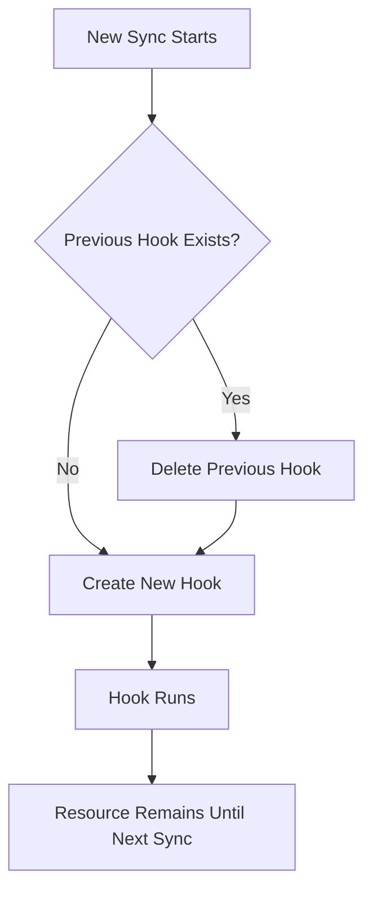
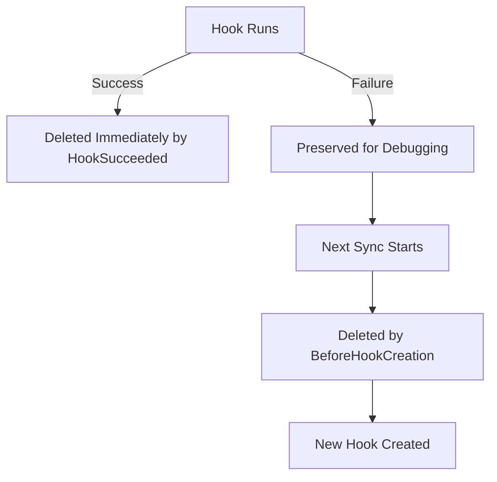

# How to Use BeforeHookCreation Delete Policy in ArgoCD

Author: [nawazdhandala](https://github.com/nawazdhandala)

Tags: ArgoCD, GitOps, Kubernetes, Sync Hooks, Resource Lifecycle

Description: Learn how to use the BeforeHookCreation delete policy in ArgoCD to automatically clean up previous hook resources before creating new ones during sync.

---

The `BeforeHookCreation` delete policy is the most practical cleanup strategy for ArgoCD sync hooks. Instead of deleting hooks based on their success or failure status, it cleans up the previous hook resource right before creating a new one for the current sync. This means you always have exactly one instance of each hook in the cluster - the one from the most recent sync.

This policy solves the naming collision problem that plagues Kubernetes Jobs and gives you a reliable way to inspect the latest hook result without accumulating old resources.

## How BeforeHookCreation Works

The lifecycle is:

1. A new sync starts
2. ArgoCD checks if a hook resource with the same name already exists
3. If it exists, ArgoCD deletes it and waits for deletion to complete
4. ArgoCD creates the new hook resource
5. The hook runs
6. The hook resource remains in the cluster (regardless of success or failure)
7. On the next sync, step 2 to 6 repeat



## The Naming Problem It Solves

Kubernetes Jobs must have unique names within a namespace. Once a Job exists, you cannot create another with the same name. Without `BeforeHookCreation`, you face a dilemma:

**Using static names**: The second sync fails because the Job already exists.
```yaml
# This fails on the second sync without cleanup
metadata:
  name: db-migrate  # Already exists from the first sync
```

**Using unique names**: Every sync creates a new Job, and old ones accumulate.
```yaml
# This creates a new Job every sync
metadata:
  name: db-migrate-v42  # Must change with every version
```

**Using generateName**: ArgoCD creates random names, and cleanup is unpredictable.
```yaml
# Random suffix - works but messy
metadata:
  generateName: db-migrate-
```

`BeforeHookCreation` lets you use static names without collisions:

```yaml
apiVersion: batch/v1
kind: Job
metadata:
  name: db-migrate  # Same name every sync - no conflicts
  annotations:
    argocd.argoproj.io/hook: PreSync
    argocd.argoproj.io/hook-delete-policy: BeforeHookCreation
spec:
  template:
    spec:
      containers:
        - name: migrate
          image: myorg/api:latest
          command: ["python", "manage.py", "migrate"]
      restartPolicy: Never
  backoffLimit: 3
```

ArgoCD deletes the old `db-migrate` Job before creating the new one. Simple and clean.

## Basic Configuration

```yaml
apiVersion: batch/v1
kind: Job
metadata:
  name: presync-task
  annotations:
    argocd.argoproj.io/hook: PreSync
    argocd.argoproj.io/hook-delete-policy: BeforeHookCreation
spec:
  template:
    spec:
      containers:
        - name: task
          image: myorg/tools:latest
          command: ["./run-task.sh"]
      restartPolicy: Never
  backoffLimit: 1
```

## Inspecting the Latest Hook

Since the hook resource stays until the next sync, you can inspect it anytime:

```bash
# Check the most recent migration status
kubectl get job db-migrate -n my-app
kubectl describe job db-migrate -n my-app
kubectl logs job/db-migrate -n my-app

# See when it ran and its status
kubectl get job db-migrate -n my-app -o jsonpath='{.status}'
```

This is particularly valuable for debugging. If a migration ran 3 hours ago and your application has issues, you can still check the migration logs.

## Combining with HookSucceeded

The most popular combination is `BeforeHookCreation` with `HookSucceeded`:

```yaml
annotations:
  argocd.argoproj.io/hook-delete-policy: HookSucceeded, BeforeHookCreation
```

This gives you the best of both worlds:
- **If the hook succeeds**: Deleted immediately (HookSucceeded kicks in)
- **If the hook fails**: Stays for debugging until the next sync (BeforeHookCreation cleans it up then)



## Practical Examples

### Database Migration with Debugging Support

```yaml
apiVersion: batch/v1
kind: Job
metadata:
  name: db-migration
  annotations:
    argocd.argoproj.io/hook: PreSync
    argocd.argoproj.io/hook-delete-policy: BeforeHookCreation
spec:
  template:
    metadata:
      labels:
        hook: db-migration
    spec:
      containers:
        - name: migrate
          image: myorg/api:latest
          command:
            - /bin/sh
            - -c
            - |
              echo "Starting database migration..."
              echo "Current schema version: $(alembic current)"
              alembic upgrade head
              echo "New schema version: $(alembic current)"
              echo "Migration complete"
          env:
            - name: DATABASE_URL
              valueFrom:
                secretKeyRef:
                  name: db-credentials
                  key: url
          resources:
            requests:
              cpu: 100m
              memory: 256Mi
      restartPolicy: Never
  backoffLimit: 3
  activeDeadlineSeconds: 300
```

If this migration fails, the Job stays. You check the logs, fix the issue, and trigger another sync. BeforeHookCreation deletes the failed Job and creates a fresh one.

### Smoke Test with Result Preservation

```yaml
apiVersion: batch/v1
kind: Job
metadata:
  name: smoke-test
  annotations:
    argocd.argoproj.io/hook: PostSync
    argocd.argoproj.io/hook-delete-policy: BeforeHookCreation
spec:
  template:
    spec:
      containers:
        - name: test
          image: myorg/smoke-tests:latest
          command: ["pytest", "-v", "--tb=short", "smoke/"]
      restartPolicy: Never
  backoffLimit: 1
  activeDeadlineSeconds: 120
```

The smoke test results (pass or fail) are always available via `kubectl logs` until the next deployment.

### Configuration Validation

```yaml
apiVersion: batch/v1
kind: Job
metadata:
  name: config-validator
  annotations:
    argocd.argoproj.io/hook: PreSync
    argocd.argoproj.io/hook-delete-policy: BeforeHookCreation
spec:
  template:
    spec:
      containers:
        - name: validate
          image: myorg/config-tools:latest
          command:
            - /bin/sh
            - -c
            - |
              echo "Validating application configuration..."

              # Check required env vars will be available
              kubectl get secret app-secrets -n my-app -o jsonpath='{.data}' | \
                python3 -c "
              import sys, json, base64
              data = json.load(sys.stdin)
              required = ['DATABASE_URL', 'API_KEY', 'JWT_SECRET']
              for key in required:
                  if key not in data:
                      print(f'MISSING: {key}')
                      sys.exit(1)
                  print(f'OK: {key}')
              print('All required secrets present')
              "
      restartPolicy: Never
  backoffLimit: 0
```

## Deletion Timing and Behavior

When ArgoCD processes `BeforeHookCreation`:

1. It sends a DELETE request for the existing resource
2. It waits for the resource to be fully deleted (watches for the resource to disappear)
3. Only then does it create the new resource

This means there is a brief period where no hook resource exists. If the deletion takes a long time (for example, if the old Job has running Pods with long grace periods), the sync might appear slow at this step.

### Handling Slow Deletions

If the old hook has Pods that take a long time to terminate:

```yaml
# Set a short grace period on hook Pods
spec:
  template:
    spec:
      terminationGracePeriodSeconds: 5
      containers:
        - name: task
          image: myorg/tools:latest
```

Or set `activeDeadlineSeconds` to prevent hooks from running indefinitely:

```yaml
spec:
  activeDeadlineSeconds: 120  # Kill the Job after 2 minutes
```

## BeforeHookCreation with Finalizers

If a previous hook resource has finalizers, the deletion might hang:

```bash
# Check if a hook is stuck
kubectl get job db-migration -n my-app -o jsonpath='{.metadata.finalizers}'

# If stuck, remove the finalizer
kubectl patch job db-migration -n my-app \
  --type json -p '[{"op": "remove", "path": "/metadata/finalizers"}]'
```

This is rare but can happen when the hook interacts with controllers that add finalizers.

## BeforeHookCreation and generateName

You can use `BeforeHookCreation` with `generateName`, but it is less useful because ArgoCD needs to match the existing resource by name. With `generateName`, the name changes each time, so the old resource might not be found:

```yaml
# Not recommended - BeforeHookCreation cannot find the old resource
metadata:
  generateName: db-migrate-  # Generates db-migrate-abc123, db-migrate-def456, etc.
  annotations:
    argocd.argoproj.io/hook-delete-policy: BeforeHookCreation
```

Stick with static names when using `BeforeHookCreation`.

## When to Choose BeforeHookCreation

| Scenario | Best Policy |
|----------|-----------|
| Want to inspect the latest hook result | BeforeHookCreation |
| Want immediate cleanup on success | HookSucceeded |
| Want immediate cleanup on failure | HookFailed |
| Want debugging + eventual cleanup | HookSucceeded + BeforeHookCreation |
| Want no hooks to persist at all | HookSucceeded + HookFailed |

## Summary

`BeforeHookCreation` is the most reliable hook delete policy for maintaining a clean cluster while preserving inspectability. It guarantees exactly one hook instance per name at any time, solves the Job naming collision problem, and ensures you can always inspect the most recent hook result. Combine it with `HookSucceeded` for the optimal strategy: immediate cleanup on success, preserved-until-next-sync on failure.
