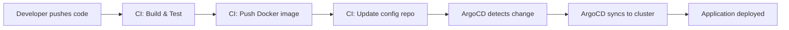

# ArgoCD Best Practices for CI/CD Integration

Author: [nawazdhandala](https://github.com/nawazdhandala)

Tags: ArgoCD, GitOps, Kubernetes, CI/CD, DevOps

Description: Learn ArgoCD CI/CD integration best practices including image tag update workflows, sync wait strategies, promotion pipelines, GitHub Actions and GitLab CI examples, and pipeline design patterns.

---

ArgoCD handles the CD (Continuous Deployment) part of CI/CD, but it needs to work seamlessly with your CI (Continuous Integration) pipeline. The integration point between CI and ArgoCD is typically a Git commit that updates the desired state - usually an image tag change. Getting this integration right means fast, reliable deployments. Getting it wrong means broken pipelines, race conditions, and confused engineers.

This guide covers the best practices for integrating ArgoCD with CI systems.

## The GitOps CI/CD flow

In a proper GitOps setup, CI and CD are clearly separated:



**CI pipeline responsibilities:**
- Build application code
- Run tests
- Build and push Docker image
- Update the image tag in the config repository

**ArgoCD responsibilities:**
- Detect Git changes
- Generate manifests
- Apply to cluster
- Monitor health

## Image tag update patterns

### Pattern 1: CI updates config repo directly

```yaml
# GitHub Actions workflow
name: Build and Deploy
on:
  push:
    branches: [main]

jobs:
  build:
    runs-on: ubuntu-latest
    steps:
      - uses: actions/checkout@v4

      - name: Build and push Docker image
        run: |
          docker build -t myorg/web-app:${{ github.sha }} .
          docker push myorg/web-app:${{ github.sha }}

      - name: Update config repo
        run: |
          git clone https://x-access-token:${{ secrets.CONFIG_REPO_TOKEN }}@github.com/myorg/config.git
          cd config

          # Update image tag using kustomize
          cd manifests/web-app/overlays/staging
          kustomize edit set image myorg/web-app=myorg/web-app:${{ github.sha }}

          git config user.name "CI Bot"
          git config user.email "ci@myorg.com"
          git add .
          git commit -m "Deploy web-app ${{ github.sha }} to staging"
          git push
```

### Pattern 2: ArgoCD Image Updater (recommended)

Let ArgoCD Image Updater detect new images automatically:

```yaml
apiVersion: argoproj.io/v1alpha1
kind: Application
metadata:
  name: staging-web-app
  annotations:
    # Configure Image Updater
    argocd-image-updater.argoproj.io/image-list: web=myorg/web-app
    argocd-image-updater.argoproj.io/web.update-strategy: latest
    argocd-image-updater.argoproj.io/web.allow-tags: "regexp:^main-[a-f0-9]{7}$"
    argocd-image-updater.argoproj.io/write-back-method: git
    argocd-image-updater.argoproj.io/git-branch: main
```

With this pattern, your CI pipeline just pushes images. ArgoCD Image Updater handles the rest.

### Pattern 3: ArgoCD CLI from CI pipeline

```yaml
# GitLab CI example
deploy_staging:
  stage: deploy
  image: argoproj/argocd:v2.13.0
  script:
    # Login to ArgoCD
    - argocd login $ARGOCD_SERVER --username $ARGOCD_USER --password $ARGOCD_PASS --insecure

    # Update the image tag
    - argocd app set staging-web-app --kustomize-image myorg/web-app=myorg/web-app:$CI_COMMIT_SHORT_SHA

    # Trigger sync
    - argocd app sync staging-web-app

    # Wait for sync and health
    - argocd app wait staging-web-app --timeout 300
```

## Sync wait strategies

Your CI pipeline needs to know when the deployment is complete:

```bash
# Wait for sync completion
argocd app wait my-app --sync --timeout 300

# Wait for health status
argocd app wait my-app --health --timeout 300

# Wait for both sync and health
argocd app wait my-app --sync --health --timeout 300

# Check the result
if [ $? -ne 0 ]; then
  echo "Deployment failed!"
  argocd app get my-app
  exit 1
fi
```

For pipelines that do not use the ArgoCD CLI, poll the API:

```bash
# Poll ArgoCD API for sync status
check_sync_status() {
  local app_name=$1
  local timeout=$2
  local start_time=$(date +%s)

  while true; do
    STATUS=$(argocd app get $app_name -o json | jq -r '.status.operationState.phase')
    HEALTH=$(argocd app get $app_name -o json | jq -r '.status.health.status')

    if [ "$STATUS" = "Succeeded" ] && [ "$HEALTH" = "Healthy" ]; then
      echo "Deployment successful"
      return 0
    fi

    if [ "$STATUS" = "Error" ] || [ "$STATUS" = "Failed" ]; then
      echo "Deployment failed: $STATUS"
      return 1
    fi

    ELAPSED=$(($(date +%s) - start_time))
    if [ $ELAPSED -gt $timeout ]; then
      echo "Deployment timed out after ${timeout}s"
      return 1
    fi

    sleep 10
  done
}
```

## Environment promotion patterns

### Pattern 1: Automated staging, manual production

```yaml
# GitHub Actions with manual approval
name: Promote to Production
on:
  workflow_dispatch:
    inputs:
      image_tag:
        description: 'Image tag to promote'
        required: true

jobs:
  promote:
    runs-on: ubuntu-latest
    environment: production  # Requires approval in GitHub
    steps:
      - uses: actions/checkout@v4
        with:
          repository: myorg/config

      - name: Update production image tag
        run: |
          cd manifests/web-app/overlays/production
          kustomize edit set image myorg/web-app=myorg/web-app:${{ inputs.image_tag }}

          git config user.name "CI Bot"
          git config user.email "ci@myorg.com"
          git add .
          git commit -m "Promote web-app ${{ inputs.image_tag }} to production"
          git push
```

### Pattern 2: Automatic promotion with health gates

```yaml
# CI pipeline that auto-promotes after staging health check
deploy_staging:
  stage: deploy-staging
  script:
    - argocd login $ARGOCD_SERVER --username $ARGOCD_USER --password $ARGOCD_PASS --insecure
    - argocd app set staging-web-app --kustomize-image myorg/web-app=myorg/web-app:$CI_COMMIT_SHORT_SHA
    - argocd app sync staging-web-app
    - argocd app wait staging-web-app --health --timeout 300

deploy_production:
  stage: deploy-production
  needs: [deploy_staging]
  when: on_success  # Only if staging succeeded
  script:
    - argocd login $ARGOCD_SERVER --username $ARGOCD_USER --password $ARGOCD_PASS --insecure
    - argocd app set prod-web-app --kustomize-image myorg/web-app=myorg/web-app:$CI_COMMIT_SHORT_SHA
    - argocd app sync prod-web-app
    - argocd app wait prod-web-app --health --timeout 600
```

## CI service account setup

Create a dedicated service account for CI pipelines:

```yaml
# ArgoCD account for CI
apiVersion: v1
kind: ConfigMap
metadata:
  name: argocd-cm
  namespace: argocd
data:
  accounts.ci-deployer: apiKey,login
  accounts.ci-deployer.enabled: "true"
```

Set RBAC for the CI account:

```yaml
apiVersion: v1
kind: ConfigMap
metadata:
  name: argocd-rbac-cm
  namespace: argocd
data:
  policy.csv: |
    # CI account can sync and read, but not delete or modify app config
    p, role:ci-deployer, applications, get, */*, allow
    p, role:ci-deployer, applications, sync, */*, allow
    p, role:ci-deployer, applications, action/*, */*, allow
    p, role:ci-deployer, applications, update, */*, deny
    p, role:ci-deployer, applications, delete, */*, deny
    p, role:ci-deployer, projects, get, *, allow

    g, ci-deployer, role:ci-deployer
```

Generate an API token:

```bash
# Generate a long-lived token for CI
argocd account generate-token --account ci-deployer
# Store this token as a CI secret (e.g., GitHub Actions secret)
```

## Webhook configuration for fast syncs

Configure Git webhooks so ArgoCD detects changes immediately instead of polling:

```yaml
# ArgoCD webhook secret
apiVersion: v1
kind: Secret
metadata:
  name: argocd-secret
  namespace: argocd
data:
  # GitHub webhook secret
  webhook.github.secret: <base64-encoded-secret>
```

Configure the webhook in GitHub:
- Payload URL: `https://argocd.myorg.com/api/webhook`
- Content type: `application/json`
- Secret: matching value from above
- Events: Push events

This reduces the delay between a CI pipeline pushing a config change and ArgoCD starting the sync from the default 3-minute polling interval to near-instant.

## Handling rollbacks from CI

```bash
# Rollback using ArgoCD history
argocd app history my-app
# ID  DATE                           REVISION
# 1   2026-02-26 08:00:00 +0000 UTC  abc1234
# 2   2026-02-26 09:00:00 +0000 UTC  def5678

# Rollback to previous revision
argocd app rollback my-app 1

# Or better: revert the Git commit
cd config-repo
git revert HEAD  # Revert the image tag change
git push
# ArgoCD will automatically sync to the previous state
```

Git revert is preferred over ArgoCD rollback because it maintains the GitOps principle that Git is the single source of truth.

## Avoiding common CI/CD integration mistakes

1. **Do not sync from CI and also have auto-sync enabled** - This can cause race conditions
2. **Do not skip the health check wait** - A successful sync does not mean the deployment is healthy
3. **Do not use `argocd app set` to change source repos or paths from CI** - Only update image tags
4. **Do not store ArgoCD tokens in application repos** - Store them in CI secret management only
5. **Do not trigger syncs during sync windows** - Check if a sync window is active before triggering

## Summary

ArgoCD CI/CD integration works best when you maintain a clear separation between CI (build and push) and CD (deploy and monitor). Use config repo updates or Image Updater for image tag management, implement sync wait strategies to know when deployments complete, set up promotion pipelines with health gates between environments, use dedicated CI service accounts with minimal permissions, and configure webhooks for fast feedback. The goal is a pipeline where developers push code, CI builds it, and ArgoCD deploys it - with full visibility at every step.
