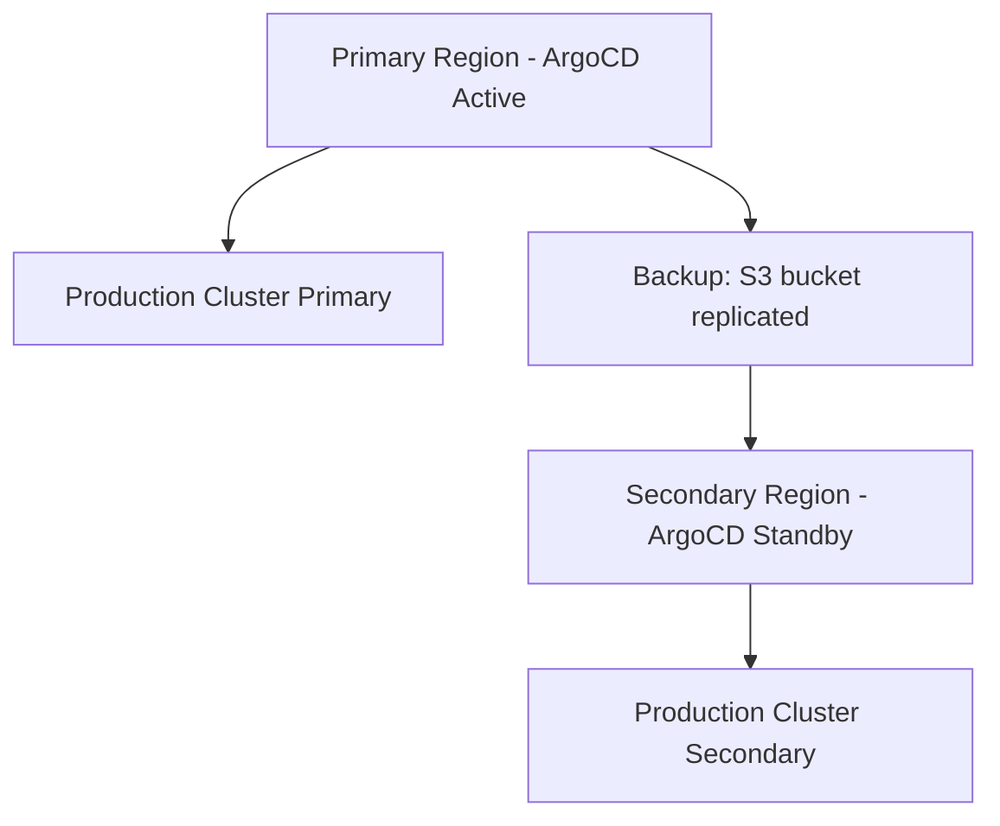

# ArgoCD Best Practices for Disaster Recovery

Author: [nawazdhandala](https://github.com/nawazdhandala)

Tags: ArgoCD, GitOps, Kubernetes, Disaster Recovery, Infrastructure

Description: Learn ArgoCD disaster recovery best practices including backup strategies, recovery procedures, multi-region failover, state reconstruction, and building resilient GitOps infrastructure.

---

When ArgoCD goes down, your deployment pipeline stops. No new deployments, no self-healing, no drift detection. If your ArgoCD state is lost entirely - application definitions, project configurations, repository credentials, cluster connections - recovering can take hours unless you have a solid disaster recovery plan.

The good news is that GitOps inherently supports disaster recovery because your desired state lives in Git. But ArgoCD itself carries operational state that is not in Git, and losing that state is what makes recovery painful.

## What state does ArgoCD hold

Understanding what needs to be recovered:

**In Git (automatically recoverable):**
- Application manifests (if you use declarative setup)
- Kubernetes resource definitions
- Kustomize overlays and Helm values

**In ArgoCD (needs explicit backup):**
- Application definitions (if created imperatively)
- AppProject configurations
- Repository credentials and connection info
- Cluster credentials and connection info
- SSO/OIDC configuration
- RBAC policies
- Notification configurations
- Application sync history
- Redis cache state

## Backup strategy

### Full ArgoCD export

```bash
# Export all ArgoCD resources
argocd admin export > argocd-backup-$(date +%Y%m%d-%H%M%S).yaml

# This exports:
# - Applications
# - AppProjects
# - Repository credentials
# - Cluster credentials
# - ConfigMaps (argocd-cm, argocd-rbac-cm, etc.)
# - Secrets
```

### Automated backup with CronJob

```yaml
apiVersion: batch/v1
kind: CronJob
metadata:
  name: argocd-backup
  namespace: argocd
spec:
  schedule: "0 */4 * * *"  # Every 4 hours
  concurrencyPolicy: Forbid
  jobTemplate:
    spec:
      template:
        spec:
          serviceAccountName: argocd-backup-sa
          containers:
            - name: backup
              image: argoproj/argocd:v2.13.0
              env:
                - name: ARGOCD_SERVER
                  value: argocd-server.argocd.svc.cluster.local
              command: ["/bin/sh", "-c"]
              args:
                - |
                  TIMESTAMP=$(date +%Y%m%d-%H%M%S)
                  BACKUP_FILE="/backup/argocd-export-$TIMESTAMP.yaml"

                  # Export ArgoCD state
                  argocd admin export > $BACKUP_FILE

                  # Also backup raw Kubernetes resources
                  kubectl get applications -n argocd -o yaml > /backup/applications-$TIMESTAMP.yaml
                  kubectl get appprojects -n argocd -o yaml > /backup/projects-$TIMESTAMP.yaml
                  kubectl get secrets -n argocd -l argocd.argoproj.io/secret-type -o yaml > /backup/secrets-$TIMESTAMP.yaml
                  kubectl get configmaps -n argocd -o yaml > /backup/configmaps-$TIMESTAMP.yaml

                  # Upload to remote storage
                  aws s3 sync /backup/ s3://argocd-backups/$(date +%Y%m%d)/

                  # Clean up old local backups
                  find /backup/ -mtime +7 -delete

                  echo "Backup completed: $BACKUP_FILE"
              volumeMounts:
                - name: backup-storage
                  mountPath: /backup
          volumes:
            - name: backup-storage
              persistentVolumeClaim:
                claimName: argocd-backup-pvc
          restartPolicy: OnFailure
---
# Service account with required permissions
apiVersion: v1
kind: ServiceAccount
metadata:
  name: argocd-backup-sa
  namespace: argocd
---
apiVersion: rbac.authorization.k8s.io/v1
kind: Role
metadata:
  name: argocd-backup-role
  namespace: argocd
rules:
  - apiGroups: ["argoproj.io"]
    resources: ["applications", "appprojects"]
    verbs: ["get", "list"]
  - apiGroups: [""]
    resources: ["secrets", "configmaps"]
    verbs: ["get", "list"]
---
apiVersion: rbac.authorization.k8s.io/v1
kind: RoleBinding
metadata:
  name: argocd-backup-binding
  namespace: argocd
roleRef:
  apiGroup: rbac.authorization.k8s.io
  kind: Role
  name: argocd-backup-role
subjects:
  - kind: ServiceAccount
    name: argocd-backup-sa
    namespace: argocd
```

### Backup verification

Regularly test that backups are valid:

```bash
#!/bin/bash
# Validate the latest backup
LATEST_BACKUP=$(ls -t /backup/argocd-export-*.yaml | head -1)

# Check file is not empty
if [ ! -s "$LATEST_BACKUP" ]; then
  echo "ERROR: Backup file is empty"
  exit 1
fi

# Validate YAML syntax
if ! python3 -c "import yaml; yaml.safe_load_all(open('$LATEST_BACKUP'))" 2>/dev/null; then
  echo "ERROR: Backup file has invalid YAML"
  exit 1
fi

# Count resources
APP_COUNT=$(grep "kind: Application" "$LATEST_BACKUP" | wc -l)
PROJECT_COUNT=$(grep "kind: AppProject" "$LATEST_BACKUP" | wc -l)
echo "Backup contains: $APP_COUNT applications, $PROJECT_COUNT projects"

# Compare with expected counts
EXPECTED_APPS=$(argocd app list -o json | jq length)
if [ "$APP_COUNT" -lt "$EXPECTED_APPS" ]; then
  echo "WARNING: Backup has fewer applications than expected ($APP_COUNT vs $EXPECTED_APPS)"
fi

echo "Backup validation passed: $LATEST_BACKUP"
```

## Recovery procedures

### Scenario 1: ArgoCD namespace deleted

```bash
# Reinstall ArgoCD
kubectl create namespace argocd
kubectl apply -n argocd -f https://raw.githubusercontent.com/argoproj/argo-cd/stable/manifests/install.yaml

# Wait for ArgoCD to start
kubectl wait --for=condition=available deployment/argocd-server -n argocd --timeout=300s

# Restore from backup
argocd admin import < argocd-backup-latest.yaml

# Verify
argocd app list
argocd cluster list
argocd repo list
```

### Scenario 2: Entire cluster lost

```bash
# 1. Provision new Kubernetes cluster
# (using Terraform, eksctl, etc.)

# 2. Install ArgoCD
kubectl create namespace argocd
kubectl apply -n argocd -f https://raw.githubusercontent.com/argoproj/argo-cd/stable/manifests/install.yaml
kubectl wait --for=condition=available deployment/argocd-server -n argocd --timeout=300s

# 3. Restore ArgoCD configuration
aws s3 cp s3://argocd-backups/latest/argocd-export.yaml /tmp/
argocd admin import < /tmp/argocd-export.yaml

# 4. Re-register clusters (credentials may need updating)
argocd cluster add prod-cluster --name prod-cluster

# 5. Sync all applications
argocd app list -o name | xargs -I {} argocd app sync {}

# 6. Verify health
argocd app list
```

### Scenario 3: Corrupted ArgoCD state (Redis or etcd)

```bash
# Clear Redis cache
kubectl delete pod -n argocd -l app.kubernetes.io/name=argocd-redis

# Force refresh all applications
argocd app list -o name | xargs -I {} argocd app get {} --hard-refresh

# If applications are still corrupted, restore from backup
argocd admin import < argocd-backup-latest.yaml
```

## Declarative setup for faster recovery

The fastest recovery happens when everything is in Git. Minimize the amount of state that only exists inside ArgoCD:

```yaml
# Store ALL application definitions in Git
# apps/production/web-frontend.yaml
apiVersion: argoproj.io/v1alpha1
kind: Application
metadata:
  name: prod-web-frontend
  namespace: argocd
  finalizers:
    - resources-finalizer.argocd.argoproj.io
spec:
  project: production
  source:
    repoURL: https://github.com/myorg/config.git
    targetRevision: main
    path: manifests/web-frontend/overlays/production
  destination:
    server: https://prod-cluster.example.com
    namespace: web-frontend
  syncPolicy:
    automated:
      selfHeal: true
      prune: true
```

```yaml
# Store project definitions in Git
# projects/production.yaml
apiVersion: argoproj.io/v1alpha1
kind: AppProject
metadata:
  name: production
  namespace: argocd
spec:
  description: Production applications
  sourceRepos:
    - https://github.com/myorg/*
  destinations:
    - server: https://prod-cluster.example.com
      namespace: "*"
```

```yaml
# Store ArgoCD configuration in Git
# argocd/argocd-cm.yaml
apiVersion: v1
kind: ConfigMap
metadata:
  name: argocd-cm
  namespace: argocd
data:
  admin.enabled: "false"
  oidc.config: |
    name: Okta
    issuer: https://myorg.okta.com
    clientID: $oidc.clientID
    clientSecret: $oidc.clientSecret
```

With this setup, recovery is:

```bash
# 1. Install ArgoCD
kubectl apply -n argocd -f argocd/install.yaml

# 2. Apply the bootstrap app-of-apps
kubectl apply -f apps/root-app.yaml

# 3. ArgoCD bootstraps itself from Git
# All applications, projects, and configs are recreated automatically
```

## Multi-region disaster recovery

For organizations requiring cross-region failover:



```yaml
# S3 cross-region replication for backups
# Terraform example:
# resource "aws_s3_bucket_replication_configuration" "argocd_backup" {
#   bucket = aws_s3_bucket.argocd_backup_primary.id
#   rule {
#     destination {
#       bucket = aws_s3_bucket.argocd_backup_secondary.arn
#       storage_class = "STANDARD"
#     }
#   }
# }
```

Failover procedure:

```bash
# 1. Verify primary is down
argocd cluster list  # Times out

# 2. Switch to secondary region
export KUBECONFIG=/path/to/secondary-cluster-config

# 3. Install ArgoCD in secondary
kubectl create namespace argocd
kubectl apply -n argocd -f https://raw.githubusercontent.com/argoproj/argo-cd/stable/manifests/install.yaml

# 4. Restore from replicated backup
aws s3 cp s3://argocd-backups-secondary/latest/argocd-export.yaml /tmp/ --region us-west-2
argocd admin import < /tmp/argocd-export.yaml

# 5. Update cluster endpoints if needed
argocd cluster rm https://old-cluster.example.com
argocd cluster add new-cluster --name production

# 6. Sync all applications
argocd app list -o name | xargs -I {} argocd app sync {}
```

## DR testing

Test your disaster recovery plan regularly:

```bash
#!/bin/bash
# Monthly DR test script
echo "=== ArgoCD DR Test $(date) ==="

# 1. Create a test namespace
kubectl create namespace argocd-dr-test

# 2. Install ArgoCD in test namespace
kubectl apply -n argocd-dr-test -f argocd-install.yaml

# 3. Wait for ready
kubectl wait --for=condition=available deployment/argocd-server -n argocd-dr-test --timeout=300s

# 4. Import backup
argocd admin import --namespace argocd-dr-test < latest-backup.yaml

# 5. Verify application count
ORIGINAL_COUNT=$(argocd app list --namespace argocd -o json | jq length)
RESTORED_COUNT=$(argocd app list --namespace argocd-dr-test -o json | jq length)

echo "Original apps: $ORIGINAL_COUNT"
echo "Restored apps: $RESTORED_COUNT"

if [ "$ORIGINAL_COUNT" -eq "$RESTORED_COUNT" ]; then
  echo "DR TEST PASSED"
else
  echo "DR TEST FAILED - count mismatch"
fi

# 6. Cleanup
kubectl delete namespace argocd-dr-test

echo "=== DR Test Complete ==="
```

## Recovery time objectives

Set clear RTO (Recovery Time Objective) and RPO (Recovery Point Objective):

| Scenario | RPO | RTO | Approach |
|----------|-----|-----|----------|
| ArgoCD pod restart | 0 | 2 min | Auto-restart by Kubernetes |
| ArgoCD namespace deleted | 4 hours | 30 min | Restore from backup |
| Management cluster lost | 4 hours | 2 hours | New cluster + backup restore |
| Region failure | 4 hours | 4 hours | Multi-region failover |

## Summary

ArgoCD disaster recovery starts with regular automated backups, both through `argocd admin export` and raw Kubernetes resource dumps. Store backups in remote, replicated storage. Minimize recovery time by keeping everything possible in Git through declarative setup - applications, projects, and ArgoCD configuration. Test your recovery procedures monthly with simulated failures. For critical environments, set up multi-region failover with replicated backups. The investment in DR planning pays off not just during actual disasters but also during routine operations like ArgoCD upgrades, cluster migrations, and configuration mistakes.
