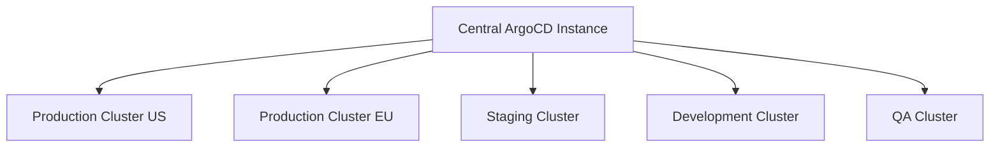
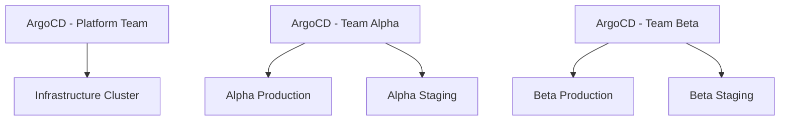

# ArgoCD Best Practices for Enterprise Organizations

Author: [nawazdhandala](https://github.com/nawazdhandala)

Tags: ArgoCD, GitOps, Kubernetes, Enterprise, DevOps

Description: Comprehensive ArgoCD best practices for enterprise organizations covering multi-tenancy, high availability, RBAC strategies, governance, compliance, and scalable GitOps architecture.

---

Running ArgoCD in an enterprise is fundamentally different from running it for a small team. You are dealing with hundreds of engineers across multiple teams, dozens to hundreds of applications, strict compliance requirements, multiple clusters across regions, and the need for strong isolation between teams while maintaining operational consistency.

This guide covers the ArgoCD best practices that matter at enterprise scale, learned from operating ArgoCD across organizations managing thousands of applications.

## Architecture: centralized vs distributed ArgoCD

The first decision is whether to run one ArgoCD instance or many:

**Centralized (one instance managing all clusters):**



**Distributed (one instance per cluster or team):**



For most enterprises, a hybrid approach works best: one central ArgoCD instance per environment tier (production, staging, dev) with HA enabled.

```yaml
# HA ArgoCD for production
apiVersion: argoproj.io/v1alpha1
kind: Application
metadata:
  name: argocd-production
  namespace: argocd
spec:
  source:
    repoURL: https://github.com/myorg/platform.git
    path: argocd/overlays/production-ha
    targetRevision: main
  destination:
    server: https://kubernetes.default.svc
    namespace: argocd
```

## Multi-tenancy with Projects

Every team should have its own ArgoCD Project that restricts what they can access:

```yaml
apiVersion: argoproj.io/v1alpha1
kind: AppProject
metadata:
  name: team-payments
  namespace: argocd
spec:
  description: "Payment processing team applications"

  # Restrict which Git repos this team can use
  sourceRepos:
    - https://github.com/myorg/payments-*
    - https://github.com/myorg/shared-charts

  # Restrict where this team can deploy
  destinations:
    - server: https://prod-cluster.example.com
      namespace: payments-*
    - server: https://staging-cluster.example.com
      namespace: payments-*

  # Restrict which Kubernetes resources this team can create
  clusterResourceWhitelist:
    - group: ""
      kind: Namespace  # Allow namespace creation

  namespaceResourceWhitelist:
    - group: apps
      kind: Deployment
    - group: apps
      kind: StatefulSet
    - group: ""
      kind: Service
    - group: ""
      kind: ConfigMap
    - group: ""
      kind: Secret
    - group: networking.k8s.io
      kind: Ingress
    - group: autoscaling
      kind: HorizontalPodAutoscaler

  # Block dangerous resource types
  namespaceResourceBlacklist:
    - group: ""
      kind: ResourceQuota  # Only platform team manages quotas
    - group: ""
      kind: LimitRange     # Only platform team manages limits

  # Orphaned resource monitoring
  orphanedResources:
    warn: true

  # Project roles for fine-grained access
  roles:
    - name: developer
      description: "Payment team developer"
      policies:
        - p, proj:team-payments:developer, applications, get, team-payments/*, allow
        - p, proj:team-payments:developer, applications, sync, team-payments/*, allow
    - name: lead
      description: "Payment team lead"
      policies:
        - p, proj:team-payments:lead, applications, *, team-payments/*, allow
```

## RBAC at enterprise scale

Enterprise RBAC needs to map SSO groups to ArgoCD roles across multiple projects:

```yaml
apiVersion: v1
kind: ConfigMap
metadata:
  name: argocd-rbac-cm
  namespace: argocd
data:
  policy.csv: |
    # Platform team - full admin access
    p, role:platform-admin, applications, *, */*, allow
    p, role:platform-admin, clusters, *, *, allow
    p, role:platform-admin, repositories, *, *, allow
    p, role:platform-admin, projects, *, *, allow

    # Team-specific roles mapped to projects
    p, role:payments-dev, applications, get, team-payments/*, allow
    p, role:payments-dev, applications, sync, team-payments/*, allow
    p, role:payments-dev, applications, delete, team-payments/*, deny

    p, role:payments-lead, applications, *, team-payments/*, allow
    p, role:payments-lead, applications, delete, team-payments/prod-*, deny

    # Read-only for auditors
    p, role:auditor, applications, get, */*, allow
    p, role:auditor, logs, get, */*, allow

    # SSO group mappings
    g, platform-engineering, role:platform-admin
    g, payments-developers, role:payments-dev
    g, payments-leads, role:payments-lead
    g, security-team, role:auditor

  policy.default: ""
  scopes: '[groups, email]'
```

## Repository strategy

Enterprise organizations need a clear repository strategy:

```
# Recommended: Config repo separate from application code repos
# Platform config repo (managed by platform team)
platform-config/
  argocd/                    # ArgoCD installation and config
  projects/                  # ArgoCD project definitions
  clusters/                  # Cluster configurations
  shared-resources/          # Shared infrastructure (monitoring, logging)

# Team config repos (one per team or domain)
payments-config/
  apps/                      # ArgoCD Application definitions
  manifests/
    payment-api/
      base/
      overlays/
        dev/
        staging/
        production/
    payment-processor/
      base/
      overlays/

# Separate repos for application source code
payments-api/                # Source code + Dockerfile
payments-processor/          # Source code + Dockerfile
```

Use ApplicationSets to generate applications from team config repos:

```yaml
apiVersion: argoproj.io/v1alpha1
kind: ApplicationSet
metadata:
  name: payments-team-apps
  namespace: argocd
spec:
  generators:
    - git:
        repoURL: https://github.com/myorg/payments-config.git
        revision: HEAD
        directories:
          - path: manifests/*/overlays/production
  template:
    metadata:
      name: 'prod-{{path[1]}}'
    spec:
      project: team-payments
      source:
        repoURL: https://github.com/myorg/payments-config.git
        targetRevision: HEAD
        path: '{{path}}'
      destination:
        server: https://prod-cluster.example.com
        namespace: 'payments-{{path[1]}}'
```

## High availability configuration

Production ArgoCD must run in HA mode:

```yaml
# Key HA settings
apiVersion: v1
kind: ConfigMap
metadata:
  name: argocd-cmd-params-cm
  namespace: argocd
data:
  # Controller settings
  controller.sharding.algorithm: "round-robin"
  controller.repo.server.timeout.seconds: "300"

  # Repo server settings
  reposerver.parallelism.limit: "10"

  # Server settings
  server.enable.gzip: "true"
```

Resource limits for HA components:

```yaml
# Application Controller
resources:
  requests:
    cpu: "2"
    memory: 4Gi
  limits:
    cpu: "4"
    memory: 8Gi

# Repo Server (scale horizontally for many repos)
replicas: 3
resources:
  requests:
    cpu: "1"
    memory: 1Gi
  limits:
    cpu: "2"
    memory: 4Gi

# API Server
replicas: 3
resources:
  requests:
    cpu: "500m"
    memory: 512Mi
  limits:
    cpu: "2"
    memory: 2Gi
```

## Sync windows for change management

Enterprise change management requires controlled deployment windows:

```yaml
apiVersion: argoproj.io/v1alpha1
kind: AppProject
metadata:
  name: team-payments
  namespace: argocd
spec:
  syncWindows:
    # Allow production deployments only during business hours
    - kind: allow
      schedule: "0 9 * * 1-5"  # Mon-Fri 9 AM
      duration: 8h              # Until 5 PM
      applications:
        - "prod-*"
      clusters:
        - "https://prod-cluster.example.com"

    # Block deployments during quarter-end freeze
    - kind: deny
      schedule: "0 0 28 3,6,9,12 *"  # Last days of each quarter
      duration: 96h
      applications:
        - "*"

    # Allow emergency deployments with manual override
    - kind: allow
      schedule: "* * * * *"  # Always
      duration: 24h
      manualSync: true  # Only manual syncs, not auto-sync
      applications:
        - "prod-*"
```

## Compliance and audit logging

Enable comprehensive audit logging:

```yaml
apiVersion: v1
kind: ConfigMap
metadata:
  name: argocd-cm
  namespace: argocd
data:
  # Audit logging
  server.audit.enabled: "true"

  # Banner for compliance
  ui.bannercontent: "Production ArgoCD - All actions are logged and auditable"
  ui.bannerurl: "https://wiki.myorg.com/deployment-policy"
  ui.bannerpermanent: "true"
```

Forward ArgoCD logs to your centralized logging system:

```yaml
# Fluent Bit sidecar for ArgoCD audit logs
apiVersion: apps/v1
kind: Deployment
metadata:
  name: argocd-server
spec:
  template:
    spec:
      containers:
        - name: fluent-bit
          image: fluent/fluent-bit:latest
          volumeMounts:
            - name: audit-logs
              mountPath: /var/log/argocd
```

## Disaster recovery

Enterprise ArgoCD needs backup and recovery procedures:

```bash
# Automated backup CronJob
apiVersion: batch/v1
kind: CronJob
metadata:
  name: argocd-backup
  namespace: argocd
spec:
  schedule: "0 */4 * * *"
  jobTemplate:
    spec:
      template:
        spec:
          serviceAccountName: argocd-backup
          containers:
            - name: backup
              image: argoproj/argocd:v2.13.0
              command: ["/bin/sh", "-c"]
              args:
                - |
                  argocd admin export > /backup/argocd-export-$(date +%Y%m%d-%H%M).yaml
                  # Upload to S3
                  aws s3 cp /backup/ s3://argocd-backups/ --recursive
          restartPolicy: OnFailure
```

Test recovery regularly:

```bash
# Restore procedure
argocd admin import < argocd-export-20260226-0800.yaml
```

## Monitoring and alerting

Enterprise ArgoCD needs comprehensive monitoring. Integrate with your existing monitoring stack:

```yaml
# ServiceMonitor for Prometheus
apiVersion: monitoring.coreos.com/v1
kind: ServiceMonitor
metadata:
  name: argocd-metrics
  namespace: argocd
spec:
  selector:
    matchLabels:
      app.kubernetes.io/part-of: argocd
  endpoints:
    - port: metrics
      interval: 30s
```

Key metrics to alert on:
- `argocd_app_info{sync_status="OutOfSync"}` - Applications not in sync
- `argocd_app_info{health_status="Degraded"}` - Unhealthy applications
- Controller memory usage approaching limits
- Repo server request latency above threshold
- Failed sync operations

For a detailed monitoring setup, consider integrating with [OneUptime](https://oneuptime.com) for comprehensive observability across your ArgoCD infrastructure.

## Summary

Enterprise ArgoCD requires multi-tenancy through Projects, strict RBAC mapped to SSO groups, HA deployment for reliability, sync windows for change management, comprehensive audit logging for compliance, automated backups for disaster recovery, and thorough monitoring. The key principle is that each team should be autonomous within their project boundaries while the platform team maintains control over cross-cutting concerns. Start with these practices on day one rather than retrofitting them later - enterprise compliance requirements are much harder to bolt on after the fact.
