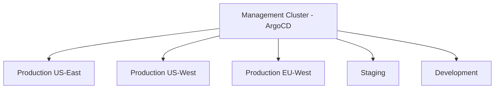
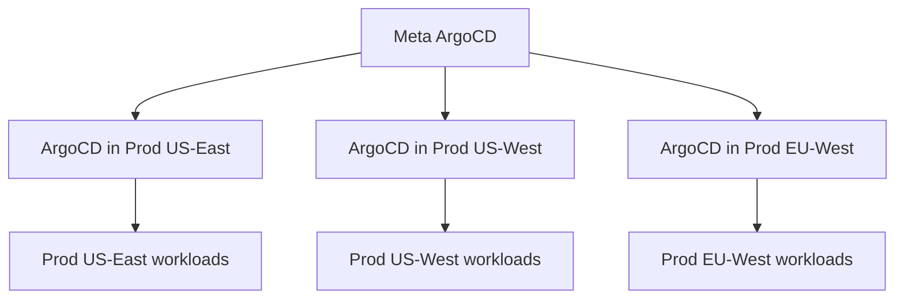

# ArgoCD Best Practices for Multi-Cluster Management

Author: [nawazdhandala](https://github.com/nawazdhandala)

Tags: ArgoCD, GitOps, Kubernetes, Multi-Cluster, Infrastructure

Description: Learn ArgoCD best practices for managing multiple Kubernetes clusters including architecture decisions, cluster registration, ApplicationSets, security isolation, and failover strategies.

---

Managing multiple Kubernetes clusters with ArgoCD introduces challenges that do not exist in single-cluster setups. You need to decide on the management topology, handle cross-cluster networking securely, maintain consistency across clusters while allowing for cluster-specific differences, and plan for scenarios where clusters become unreachable.

This guide covers the battle-tested best practices for multi-cluster ArgoCD management.

## Choosing your management topology

### Hub-and-spoke (centralized)

One ArgoCD instance manages all clusters:



```bash
# Register remote clusters with central ArgoCD
argocd cluster add prod-us-east --name prod-us-east
argocd cluster add prod-us-west --name prod-us-west
argocd cluster add prod-eu-west --name prod-eu-west
argocd cluster add staging --name staging
```

**Best for:** Organizations with fewer than 20 clusters where a central platform team manages infrastructure.

### Federated (distributed)

Each cluster has its own ArgoCD instance, with a meta-ArgoCD managing the ArgoCD instances:



**Best for:** Large organizations with 20+ clusters, strict network isolation requirements, or teams that need full autonomy.

## Cluster registration best practices

### Use service account tokens with limited scope

```bash
# Create a dedicated service account for ArgoCD in each remote cluster
kubectl --context prod-us-east create serviceaccount argocd-manager -n kube-system

# Create a ClusterRole with minimal permissions
kubectl --context prod-us-east apply -f - <<EOF
apiVersion: rbac.authorization.k8s.io/v1
kind: ClusterRole
metadata:
  name: argocd-manager-role
rules:
  - apiGroups: ["*"]
    resources: ["*"]
    verbs: ["get", "list", "watch"]
  - apiGroups: ["apps", "extensions"]
    resources: ["deployments", "statefulsets", "daemonsets", "replicasets"]
    verbs: ["create", "update", "patch", "delete"]
  - apiGroups: [""]
    resources: ["services", "configmaps", "secrets", "serviceaccounts", "persistentvolumeclaims", "namespaces", "pods"]
    verbs: ["create", "update", "patch", "delete"]
  - apiGroups: ["networking.k8s.io"]
    resources: ["ingresses", "networkpolicies"]
    verbs: ["create", "update", "patch", "delete"]
  - apiGroups: ["batch"]
    resources: ["jobs", "cronjobs"]
    verbs: ["create", "update", "patch", "delete"]
  - apiGroups: ["autoscaling"]
    resources: ["horizontalpodautoscalers"]
    verbs: ["create", "update", "patch", "delete"]
EOF
```

### Label clusters for ApplicationSet generators

```bash
# Add metadata labels when registering clusters
argocd cluster add prod-us-east \
  --name prod-us-east \
  --label environment=production \
  --label region=us-east \
  --label tier=primary

argocd cluster add prod-us-west \
  --name prod-us-west \
  --label environment=production \
  --label region=us-west \
  --label tier=secondary

argocd cluster add staging \
  --name staging \
  --label environment=staging \
  --label region=us-east
```

## Use ApplicationSets for multi-cluster deployments

ApplicationSets are the best way to deploy applications across multiple clusters consistently:

```yaml
apiVersion: argoproj.io/v1alpha1
kind: ApplicationSet
metadata:
  name: web-frontend-all-clusters
  namespace: argocd
spec:
  generators:
    # Deploy to all production clusters
    - clusters:
        selector:
          matchLabels:
            environment: production
        values:
          # Pass cluster-specific values
          replicas: "5"
          hpa_max: "20"

  template:
    metadata:
      name: '{{name}}-web-frontend'
    spec:
      project: production
      source:
        repoURL: https://github.com/myorg/platform.git
        targetRevision: main
        path: manifests/web-frontend/overlays/production
        kustomize:
          patches:
            - target:
                kind: Deployment
                name: web-frontend
              patch: |-
                - op: replace
                  path: /spec/replicas
                  value: {{values.replicas}}
      destination:
        server: '{{server}}'
        namespace: web-frontend
      syncPolicy:
        automated:
          selfHeal: true
          prune: true
        syncOptions:
          - CreateNamespace=true
```

### Matrix generator for environment-per-cluster combinations

```yaml
apiVersion: argoproj.io/v1alpha1
kind: ApplicationSet
metadata:
  name: platform-services
  namespace: argocd
spec:
  generators:
    - matrix:
        generators:
          # All production clusters
          - clusters:
              selector:
                matchLabels:
                  environment: production
          # All platform services
          - list:
              elements:
                - service: monitoring-stack
                  namespace: monitoring
                - service: ingress-controller
                  namespace: ingress-nginx
                - service: cert-manager
                  namespace: cert-manager
  template:
    metadata:
      name: '{{name}}-{{service}}'
    spec:
      project: platform
      source:
        repoURL: https://github.com/myorg/platform.git
        path: 'shared/{{service}}/overlays/production'
      destination:
        server: '{{server}}'
        namespace: '{{namespace}}'
```

## Handle cluster-specific configuration

Use merge generators for cluster-specific overrides:

```yaml
apiVersion: argoproj.io/v1alpha1
kind: ApplicationSet
metadata:
  name: api-service
  namespace: argocd
spec:
  generators:
    - merge:
        mergeKeys:
          - server
        generators:
          # Base configuration for all production clusters
          - clusters:
              selector:
                matchLabels:
                  environment: production
              values:
                replicas: "3"
                cpu_request: "500m"
                memory_request: "512Mi"

          # Override for high-traffic clusters
          - list:
              elements:
                - server: https://prod-us-east.example.com
                  values.replicas: "10"
                  values.cpu_request: "2000m"
                  values.memory_request: "2Gi"

  template:
    metadata:
      name: '{{name}}-api'
    spec:
      source:
        repoURL: https://github.com/myorg/platform.git
        path: manifests/api/overlays/production
        kustomize:
          patches:
            - target:
                kind: Deployment
              patch: |-
                - op: replace
                  path: /spec/replicas
                  value: {{values.replicas}}
      destination:
        server: '{{server}}'
        namespace: api
```

## Network security for multi-cluster

### Use dedicated VPN or private connectivity

```yaml
# Never expose Kubernetes API servers to the public internet
# Use private endpoints with VPN or direct connect

# AWS EKS example: enable private endpoint
# Terraform:
# resource "aws_eks_cluster" "production" {
#   vpc_config {
#     endpoint_private_access = true
#     endpoint_public_access  = false
#   }
# }
```

### Rotate cluster credentials regularly

```bash
#!/bin/bash
# Script to rotate ArgoCD cluster credentials
for cluster in $(argocd cluster list -o json | jq -r '.[].server'); do
  CLUSTER_NAME=$(argocd cluster list -o json | jq -r ".[] | select(.server == \"$cluster\") | .name")
  echo "Rotating credentials for: $CLUSTER_NAME"

  # Remove and re-add with fresh credentials
  argocd cluster rm "$cluster"
  argocd cluster add "$CLUSTER_NAME" --name "$CLUSTER_NAME"
done
```

## Monitoring across clusters

Monitor ArgoCD's connectivity and sync status for each cluster:

```yaml
# PrometheusRule for multi-cluster monitoring
apiVersion: monitoring.coreos.com/v1
kind: PrometheusRule
metadata:
  name: argocd-multi-cluster-alerts
spec:
  groups:
    - name: argocd-cluster-health
      rules:
        - alert: ArgocdClusterUnreachable
          expr: |
            argocd_cluster_info{connection_status!="Successful"} == 1
          for: 5m
          labels:
            severity: critical
          annotations:
            summary: "ArgoCD cannot reach cluster {{ $labels.server }}"

        - alert: ArgocdClusterSyncFailing
          expr: |
            count(argocd_app_info{sync_status="OutOfSync"}) by (dest_server) > 5
          for: 15m
          labels:
            severity: warning
          annotations:
            summary: "Multiple apps out of sync on cluster {{ $labels.dest_server }}"
```

## Failover and disaster recovery

### Active-active deployment pattern

```yaml
# Deploy the same application to multiple clusters
# Use external DNS or global load balancer for traffic routing
apiVersion: argoproj.io/v1alpha1
kind: ApplicationSet
metadata:
  name: api-active-active
spec:
  generators:
    - clusters:
        selector:
          matchLabels:
            environment: production
            role: active
  template:
    metadata:
      name: '{{name}}-api'
    spec:
      source:
        path: manifests/api/overlays/production
      destination:
        server: '{{server}}'
        namespace: api
      syncPolicy:
        automated:
          selfHeal: true
```

### Handle cluster outages gracefully

```bash
# If a cluster is unreachable, ArgoCD will show apps as "Unknown"
# Applications on healthy clusters are not affected

# To remove a dead cluster without affecting other clusters:
argocd cluster rm https://dead-cluster.example.com

# Applications targeting the dead cluster will show as "missing"
# but other applications continue operating normally
```

## Summary

Multi-cluster ArgoCD management requires careful topology decisions (centralized vs federated), secure cluster registration with minimal permissions, ApplicationSets for consistent deployments across clusters, cluster-specific overrides using merge generators, private network connectivity for security, credential rotation procedures, cross-cluster monitoring, and failover planning. The key principle is consistency - every cluster should be managed through the same patterns and tools, making it easy to add, remove, or replace clusters without changing your workflow.
