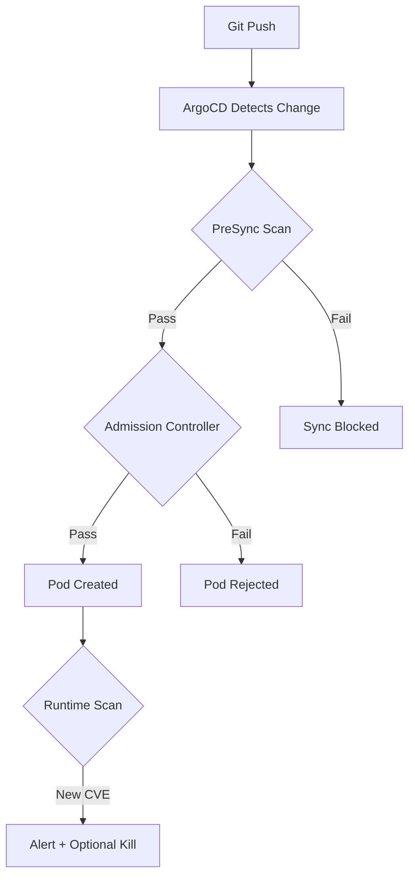

# How to Block Deployment of Vulnerable Images with ArgoCD

Author: [nawazdhandala](https://github.com/nawazdhandala)

Tags: ArgoCD, GitOps, Kubernetes, Security, Vulnerability Management

Description: Learn how to prevent vulnerable container images from being deployed through ArgoCD using admission controllers, OPA policies, Kyverno, and PreSync validation hooks.

---

Blocking vulnerable images from reaching your Kubernetes cluster is one of the most impactful security measures you can implement. When deployments flow through ArgoCD, you have several opportunities to gate deployments based on vulnerability scan results. This post covers practical techniques for enforcing image security policies in an ArgoCD-managed environment.

## The Problem with Vulnerable Images

Even with scanning in CI pipelines, vulnerable images can still reach your cluster. New CVEs are discovered daily, which means an image that was clean last week might have critical vulnerabilities today. You need runtime enforcement that blocks these images regardless of when the vulnerability was discovered.

## Strategy: Defense in Depth



## Method 1: ArgoCD PreSync Gate

The simplest approach is a PreSync hook that scans images and blocks the sync on failure:

```yaml
# hooks/vulnerability-gate.yaml
apiVersion: batch/v1
kind: Job
metadata:
  name: vulnerability-gate
  annotations:
    argocd.argoproj.io/hook: PreSync
    argocd.argoproj.io/hook-delete-policy: BeforeHookCreation
spec:
  template:
    spec:
      containers:
        - name: scanner
          image: aquasec/trivy:latest
          command:
            - /bin/sh
            - -c
            - |
              # Define the vulnerability threshold
              MAX_CRITICAL=0
              MAX_HIGH=5

              IMAGE="registry.example.com/myapp:v2.1.0"

              # Scan and get counts
              RESULT=$(trivy image \
                --format json \
                --no-progress \
                "$IMAGE")

              CRITICAL=$(echo "$RESULT" | \
                jq '[.Results[].Vulnerabilities[]? | select(.Severity=="CRITICAL")] | length')
              HIGH=$(echo "$RESULT" | \
                jq '[.Results[].Vulnerabilities[]? | select(.Severity=="HIGH")] | length')

              echo "Found: $CRITICAL critical, $HIGH high vulnerabilities"

              # Block if thresholds exceeded
              if [ "$CRITICAL" -gt "$MAX_CRITICAL" ]; then
                echo "BLOCKED: $CRITICAL critical vulnerabilities exceed threshold of $MAX_CRITICAL"
                echo "Critical CVEs:"
                echo "$RESULT" | jq -r '.Results[].Vulnerabilities[]? | select(.Severity=="CRITICAL") | "\(.VulnerabilityID): \(.PkgName) \(.InstalledVersion)"'
                exit 1
              fi

              if [ "$HIGH" -gt "$MAX_HIGH" ]; then
                echo "BLOCKED: $HIGH high vulnerabilities exceed threshold of $MAX_HIGH"
                exit 1
              fi

              echo "Image passed vulnerability gate"
          env:
            - name: TRIVY_USERNAME
              valueFrom:
                secretKeyRef:
                  name: registry-creds
                  key: username
                  optional: true
            - name: TRIVY_PASSWORD
              valueFrom:
                secretKeyRef:
                  name: registry-creds
                  key: password
                  optional: true
      restartPolicy: Never
  backoffLimit: 1
```

## Method 2: OPA Gatekeeper Policies

Open Policy Agent (OPA) Gatekeeper provides cluster-wide enforcement. First, deploy the constraint template:

```yaml
# policies/image-vulnerability-template.yaml
apiVersion: templates.gatekeeper.sh/v1
kind: ConstraintTemplate
metadata:
  name: k8simagevulnerabilities
spec:
  crd:
    spec:
      names:
        kind: K8sImageVulnerabilities
      validation:
        openAPIV3Schema:
          type: object
          properties:
            allowedRegistries:
              type: array
              items:
                type: string
            maxCritical:
              type: integer
            maxHigh:
              type: integer
  targets:
    - target: admission.k8s.gatekeeper.sh
      rego: |
        package k8simagevulnerabilities

        violation[{"msg": msg}] {
          container := input.review.object.spec.containers[_]
          image := container.image

          # Check if image is from an allowed registry
          allowed := {r | r := input.parameters.allowedRegistries[_]}
          not image_from_allowed_registry(image, allowed)

          msg := sprintf("Image '%v' is not from an allowed registry", [image])
        }

        violation[{"msg": msg}] {
          container := input.review.object.spec.containers[_]
          image := container.image

          # Check for latest tag
          endswith(image, ":latest")
          msg := sprintf("Image '%v' uses :latest tag which cannot be scanned reliably", [image])
        }

        violation[{"msg": msg}] {
          container := input.review.object.spec.containers[_]
          image := container.image

          # Check that image has a digest
          not contains(image, "@sha256:")
          not image_has_tag(image)
          msg := sprintf("Image '%v' must have an explicit tag or digest", [image])
        }

        image_from_allowed_registry(image, allowed) {
          some registry
          startswith(image, allowed[registry])
        }

        image_has_tag(image) {
          contains(image, ":")
        }
```

Then create the constraint:

```yaml
# policies/require-scanned-images.yaml
apiVersion: constraints.gatekeeper.sh/v1beta1
kind: K8sImageVulnerabilities
metadata:
  name: require-scanned-images
spec:
  enforcementAction: deny
  match:
    kinds:
      - apiGroups: [""]
        kinds: ["Pod"]
      - apiGroups: ["apps"]
        kinds: ["Deployment", "StatefulSet", "DaemonSet"]
    namespaces:
      - production
      - staging
    excludedNamespaces:
      - kube-system
      - argocd
  parameters:
    allowedRegistries:
      - "registry.example.com/"
      - "docker.io/library/"
    maxCritical: 0
    maxHigh: 5
```

## Method 3: Kyverno Image Verification

Kyverno provides a more Kubernetes-native approach with built-in image verification:

```yaml
# policies/kyverno-block-unscanned.yaml
apiVersion: kyverno.io/v1
kind: ClusterPolicy
metadata:
  name: block-unscanned-images
  annotations:
    policies.kyverno.io/title: Block Unscanned Images
    policies.kyverno.io/severity: high
spec:
  validationFailureAction: Enforce
  background: false
  rules:
    - name: verify-image-scan-attestation
      match:
        any:
          - resources:
              kinds:
                - Pod
              namespaces:
                - production
                - staging
      verifyImages:
        - imageReferences:
            - "registry.example.com/*"
          attestations:
            - type: https://cosign.sigstore.dev/attestation/vuln/v1
              conditions:
                - all:
                    # Ensure the scan is recent (within 7 days)
                    - key: "{{ time_since('', '{{ scan_timestamp }}', '') }}"
                      operator: LessThan
                      value: "168h"
                    # Zero critical vulnerabilities
                    - key: "{{ result[?(@.severity=='CRITICAL')].count | sum(@) }}"
                      operator: Equals
                      value: 0
              attestors:
                - count: 1
                  entries:
                    - keys:
                        publicKeys: |
                          -----BEGIN PUBLIC KEY-----
                          MFkwEwYHKoZIzj0CAQYIKoZIzj0DAQcDQgAE...
                          -----END PUBLIC KEY-----

    - name: block-latest-tag
      match:
        any:
          - resources:
              kinds:
                - Pod
      validate:
        message: "Images with :latest tag are not allowed. Use specific version tags."
        pattern:
          spec:
            containers:
              - image: "!*:latest"
```

## Method 4: ArgoCD Resource Hook with External Scanner

Integrate with an external scanning service like Snyk or Anchore:

```yaml
apiVersion: batch/v1
kind: Job
metadata:
  name: external-scan-gate
  annotations:
    argocd.argoproj.io/hook: PreSync
    argocd.argoproj.io/hook-delete-policy: BeforeHookCreation
spec:
  template:
    spec:
      containers:
        - name: scanner
          image: alpine:latest
          command:
            - /bin/sh
            - -c
            - |
              apk add --no-cache curl jq

              IMAGE="registry.example.com/myapp:v2.1.0"
              DIGEST=$(crane digest "$IMAGE" 2>/dev/null || echo "")

              # Query external scan API
              RESPONSE=$(curl -s -H "Authorization: Bearer $API_TOKEN" \
                "https://scan-api.example.com/v1/images?digest=$DIGEST")

              STATUS=$(echo "$RESPONSE" | jq -r '.scan_status')
              CRITICAL=$(echo "$RESPONSE" | jq -r '.vulnerability_counts.critical')

              if [ "$STATUS" != "passed" ]; then
                echo "Image scan status: $STATUS"
                echo "Critical vulnerabilities: $CRITICAL"
                echo "$RESPONSE" | jq '.vulnerabilities[] | select(.severity=="CRITICAL")'
                exit 1
              fi

              echo "External scan passed"
          env:
            - name: API_TOKEN
              valueFrom:
                secretKeyRef:
                  name: scan-api-creds
                  key: token
      restartPolicy: Never
  backoffLimit: 1
```

## Configuring Exception Policies

Not every vulnerability can be fixed immediately. Create exception policies for known, accepted risks:

```yaml
# policies/vulnerability-exceptions.yaml
apiVersion: kyverno.io/v1
kind: PolicyException
metadata:
  name: allow-known-cve-2024-1234
  namespace: production
  annotations:
    exception-reason: "No fix available, mitigated by network policy"
    exception-expiry: "2026-06-01"
    exception-approver: "security-team"
spec:
  exceptions:
    - policyName: block-unscanned-images
      ruleNames:
        - verify-image-scan-attestation
  match:
    any:
      - resources:
          kinds:
            - Pod
          names:
            - "legacy-app-*"
          namespaces:
            - production
```

## Handling Blocked Deployments in ArgoCD

When a deployment is blocked, ArgoCD will show the application as failed to sync. Configure notifications to alert your team:

```yaml
# argocd-notifications-cm
apiVersion: v1
kind: ConfigMap
metadata:
  name: argocd-notifications-cm
  namespace: argocd
data:
  trigger.on-sync-failed: |
    - when: app.status.operationState.phase in ['Error', 'Failed']
      send: [vulnerability-block-alert]
  template.vulnerability-block-alert: |
    message: |
      Application {{.app.metadata.name}} sync failed.
      This may be due to a vulnerability scan blocking deployment.
      Check the PreSync job logs for details.
    slack:
      attachments: |
        [{
          "color": "#E01E5A",
          "title": "Deployment Blocked: {{.app.metadata.name}}",
          "text": "Sync failed at {{.app.status.operationState.finishedAt}}\nCheck vulnerability scan results."
        }]
```

You can also use [OneUptime](https://oneuptime.com) for more comprehensive monitoring of blocked deployments and vulnerability trends.

## Summary

Blocking vulnerable images in ArgoCD requires a layered approach. PreSync hooks provide a simple gate that can scan images before deployment. OPA Gatekeeper and Kyverno provide cluster-wide admission control that works independently of ArgoCD. For the strongest security posture, combine all three: CI-time scanning, ArgoCD PreSync gates, and admission controller enforcement. Include exception policies for accepted risks, configure alerting for blocked deployments, and maintain all policies in Git where they benefit from the same review and audit processes as your application code.
