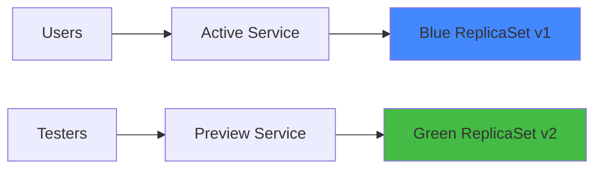
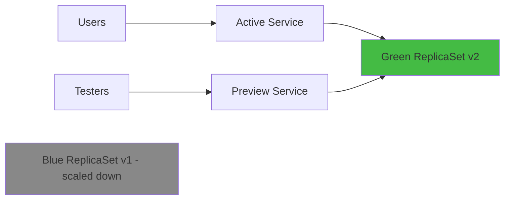

# How to Implement Blue-Green Deployments with ArgoCD

Author: [nawazdhandala](https://github.com/nawazdhandala)

Tags: ArgoCD, GitOps, Kubernetes, Deployment Strategies, Argo Rollouts

Description: Learn how to implement blue-green deployments with ArgoCD and Argo Rollouts for zero-downtime releases with instant rollback capability.

---

Blue-green deployments let you run two identical production environments side by side. One (blue) serves live traffic while the other (green) receives the new version. Once the green environment passes validation, you switch traffic over instantly. If something goes wrong, you switch back to blue. No downtime, no partial rollouts, just a clean swap.

ArgoCD alone does not provide blue-green deployment mechanics - it manages the desired state of your cluster. To implement blue-green deployments in a GitOps workflow, you combine ArgoCD with Argo Rollouts, which is a Kubernetes controller that provides advanced deployment strategies.

## Prerequisites

Before getting started, you need:

1. ArgoCD installed in your cluster
2. Argo Rollouts controller installed
3. The Argo Rollouts kubectl plugin (optional but helpful)

Install Argo Rollouts:

```bash
# Create namespace and install Argo Rollouts
kubectl create namespace argo-rollouts
kubectl apply -n argo-rollouts -f https://github.com/argoproj/argo-rollouts/releases/latest/download/install.yaml

# Install the kubectl plugin
brew install argoproj/tap/kubectl-argo-rollouts
# or on Linux:
# curl -LO https://github.com/argoproj/argo-rollouts/releases/latest/download/kubectl-argo-rollouts-linux-amd64
# chmod +x kubectl-argo-rollouts-linux-amd64
# sudo mv kubectl-argo-rollouts-linux-amd64 /usr/local/bin/kubectl-argo-rollouts
```

## How Blue-Green Works with Argo Rollouts

Instead of using a standard Kubernetes `Deployment`, you use a `Rollout` resource. Argo Rollouts manages two ReplicaSets - one for the active (blue) version and one for the preview (green) version.



After promotion:



## Setting Up the Rollout Resource

Create a Rollout resource with the blue-green strategy:

```yaml
# rollout.yaml
apiVersion: argoproj.io/v1alpha1
kind: Rollout
metadata:
  name: my-app
  namespace: production
spec:
  replicas: 3
  revisionHistoryLimit: 2
  selector:
    matchLabels:
      app: my-app
  template:
    metadata:
      labels:
        app: my-app
    spec:
      containers:
        - name: my-app
          image: myorg/my-app:1.0.0
          ports:
            - containerPort: 8080
          resources:
            requests:
              memory: "128Mi"
              cpu: "100m"
            limits:
              memory: "256Mi"
              cpu: "200m"
          readinessProbe:
            httpGet:
              path: /health
              port: 8080
            initialDelaySeconds: 5
            periodSeconds: 10
  strategy:
    blueGreen:
      # Service that serves live production traffic
      activeService: my-app-active
      # Service for the new version (preview/testing)
      previewService: my-app-preview
      # Auto-promote after the preview is ready (set to false for manual promotion)
      autoPromotionEnabled: false
      # How long to wait before scaling down the old version after promotion
      scaleDownDelaySeconds: 30
      # Optional: number of seconds to wait after preview is ready before auto-promotion
      # autoPromotionSeconds: 60
```

## Creating the Services

You need two Kubernetes Services - one for active traffic and one for preview traffic:

```yaml
# services.yaml
apiVersion: v1
kind: Service
metadata:
  name: my-app-active
  namespace: production
spec:
  selector:
    app: my-app
  ports:
    - port: 80
      targetPort: 8080
  type: ClusterIP
---
apiVersion: v1
kind: Service
metadata:
  name: my-app-preview
  namespace: production
spec:
  selector:
    app: my-app
  ports:
    - port: 80
      targetPort: 8080
  type: ClusterIP
```

Argo Rollouts will modify the selectors on these Services automatically during the rollout process. You do not need to manage the selectors yourself.

## Creating the ArgoCD Application

Now wrap everything in an ArgoCD Application:

```yaml
# argocd-application.yaml
apiVersion: argoproj.io/v1alpha1
kind: Application
metadata:
  name: my-app-production
  namespace: argocd
spec:
  project: default
  source:
    repoURL: https://github.com/myorg/my-manifests.git
    targetRevision: main
    path: production/my-app
  destination:
    server: https://kubernetes.default.svc
    namespace: production
  syncPolicy:
    automated:
      prune: true
      selfHeal: true
```

Your repository structure would look like:

```text
production/my-app/
  rollout.yaml
  services.yaml
  ingress.yaml
```

## Triggering a Blue-Green Deployment

To trigger a deployment, update the image tag in your Rollout manifest and push to Git:

```yaml
# Update the image tag in rollout.yaml
spec:
  template:
    spec:
      containers:
        - name: my-app
          image: myorg/my-app:2.0.0  # Changed from 1.0.0
```

ArgoCD detects the change and syncs it. Argo Rollouts then:

1. Creates a new ReplicaSet with the updated image (green)
2. Waits for the new pods to become ready
3. Points the preview Service to the new ReplicaSet
4. Waits for manual promotion (if `autoPromotionEnabled: false`)

## Validating and Promoting

While the new version is in preview, validate it:

```bash
# Check rollout status
kubectl argo rollouts status my-app -n production

# Watch the rollout progress in real time
kubectl argo rollouts get rollout my-app -n production --watch

# Test the preview service directly
kubectl port-forward svc/my-app-preview 8081:80 -n production
# Then curl http://localhost:8081 to test
```

Once validated, promote the new version:

```bash
# Promote the green version to active
kubectl argo rollouts promote my-app -n production
```

After promotion, Argo Rollouts:
1. Switches the active Service to point to the new ReplicaSet
2. Waits for `scaleDownDelaySeconds`
3. Scales down the old ReplicaSet

## Rolling Back

If the new version has issues after promotion:

```bash
# Abort the rollout (before promotion)
kubectl argo rollouts abort my-app -n production

# Undo the rollout (after promotion)
kubectl argo rollouts undo my-app -n production
```

For a GitOps-native rollback, revert the image change in Git and let ArgoCD sync:

```bash
git revert HEAD
git push origin main
# ArgoCD syncs the reverted manifest, triggering a new blue-green rollout
```

## Adding Analysis for Automated Promotion

You can add automated analysis to validate the preview before promotion:

```yaml
apiVersion: argoproj.io/v1alpha1
kind: Rollout
metadata:
  name: my-app
spec:
  strategy:
    blueGreen:
      activeService: my-app-active
      previewService: my-app-preview
      autoPromotionEnabled: false
      # Run analysis on the preview before allowing promotion
      prePromotionAnalysis:
        templates:
          - templateName: success-rate
        args:
          - name: service-name
            value: my-app-preview
---
apiVersion: argoproj.io/v1alpha1
kind: AnalysisTemplate
metadata:
  name: success-rate
spec:
  args:
    - name: service-name
  metrics:
    - name: success-rate
      interval: 30s
      count: 5
      successCondition: result[0] >= 0.95
      provider:
        prometheus:
          address: http://prometheus.monitoring:9090
          query: |
            sum(rate(http_requests_total{service="{{args.service-name}}", status=~"2.."}[1m]))
            /
            sum(rate(http_requests_total{service="{{args.service-name}}"}[1m]))
```

## ArgoCD Health Check Integration

ArgoCD has built-in support for Argo Rollouts health checks. It understands the Rollout resource and will show the correct health status in the ArgoCD UI. If you see the Rollout resource showing as "Progressing," it means the blue-green swap is in progress.

Make sure your ArgoCD version supports Rollout health checks (ArgoCD 2.0+ includes this by default).

## Summary

Blue-green deployments with ArgoCD and Argo Rollouts give you zero-downtime releases with instant rollback capability. Replace your standard Deployments with Rollout resources, configure active and preview Services, and let ArgoCD manage the desired state through Git. Use manual promotion for production safety, or add AnalysisTemplates for automated validation. For a more gradual approach, consider [canary deployments](https://oneuptime.com/blog/post/2026-02-26-argocd-canary-deployments-argo-rollouts/view) instead.
