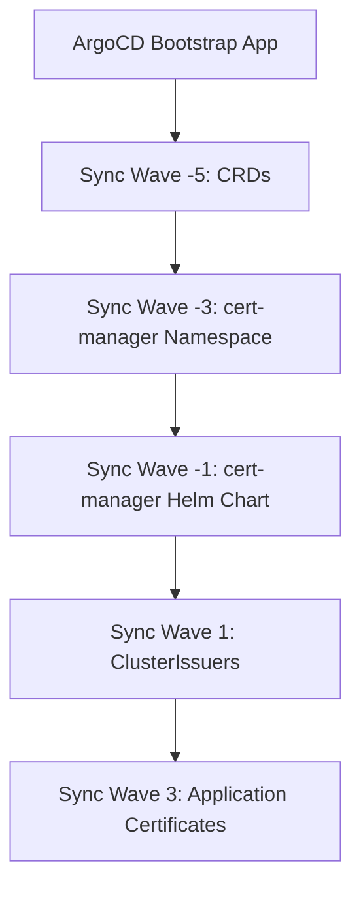

# How to Bootstrap cert-manager with ArgoCD

Author: [nawazdhandala](https://github.com/nawazdhandala)

Tags: ArgoCD, GitOps, Kubernetes, Cert-Manager, TLS

Description: Learn how to bootstrap cert-manager using ArgoCD for automated TLS certificate management in your Kubernetes cluster with GitOps workflows and proper sync wave ordering.

---

cert-manager is one of the first things you need running in a new Kubernetes cluster. Without it, your ingress controllers serve plain HTTP, your internal services talk unencrypted, and your compliance team starts asking questions. Bootstrapping cert-manager through ArgoCD ensures it is version-controlled, reproducible, and part of your cluster's declarative infrastructure.

This guide walks through setting up cert-manager as part of your ArgoCD cluster bootstrapping process, including handling CRD ordering, configuring ClusterIssuers, and solving the chicken-and-egg problems that come up.

## Why Bootstrap cert-manager with ArgoCD

Manually installing cert-manager with Helm or kubectl works fine on day one. But what happens when you need to rebuild the cluster? Or spin up a new one for a different region? You end up hunting through shell history or runbooks trying to remember which flags you used.

With ArgoCD managing cert-manager, you get:

- **Version pinning** - the exact cert-manager version is tracked in Git
- **Reproducibility** - new clusters get the same configuration every time
- **Drift detection** - ArgoCD alerts you if someone manually changes cert-manager
- **Ordered installation** - sync waves handle CRDs before CRs



## Setting Up the ArgoCD Application for cert-manager

The simplest approach uses a Helm chart source pointing to the official cert-manager repository. Create this Application manifest in your bootstrap repository.

```yaml
# bootstrap/cert-manager/application.yaml
apiVersion: argoproj.io/v1alpha1
kind: Application
metadata:
  name: cert-manager
  namespace: argocd
  annotations:
    argocd.argoproj.io/sync-wave: "-3"
  finalizers:
    - resources-finalizer.argocd.argoproj.io
spec:
  project: infrastructure
  source:
    repoURL: https://charts.jetstack.io
    chart: cert-manager
    targetRevision: v1.14.4
    helm:
      releaseName: cert-manager
      values: |
        # Install CRDs as part of the Helm release
        installCRDs: true
        # Enable Prometheus metrics
        prometheus:
          enabled: true
          servicemonitor:
            enabled: true
        # Resource limits for production
        resources:
          requests:
            cpu: 50m
            memory: 128Mi
          limits:
            cpu: 200m
            memory: 256Mi
        # Webhook resource limits
        webhook:
          resources:
            requests:
              cpu: 25m
              memory: 64Mi
            limits:
              cpu: 100m
              memory: 128Mi
        # CA injector resource limits
        cainjector:
          resources:
            requests:
              cpu: 25m
              memory: 128Mi
            limits:
              cpu: 100m
              memory: 256Mi
  destination:
    server: https://kubernetes.default.svc
    namespace: cert-manager
  syncPolicy:
    automated:
      prune: true
      selfHeal: true
    syncOptions:
      - CreateNamespace=true
      - ServerSideApply=true
    retry:
      limit: 5
      backoff:
        duration: 5s
        factor: 2
        maxDuration: 3m
```

The `ServerSideApply=true` sync option is important here. cert-manager CRDs are large, and without server-side apply you can hit annotation size limits that cause the sync to fail.

## Handling CRD Installation Order

cert-manager CRDs must exist before any Certificate, Issuer, or ClusterIssuer resources. The Helm chart handles this when you set `installCRDs: true`, but if you prefer managing CRDs separately for more control, you can split them out.

```yaml
# bootstrap/cert-manager/crds-application.yaml
apiVersion: argoproj.io/v1alpha1
kind: Application
metadata:
  name: cert-manager-crds
  namespace: argocd
  annotations:
    argocd.argoproj.io/sync-wave: "-5"
spec:
  project: infrastructure
  source:
    repoURL: https://github.com/cert-manager/cert-manager.git
    path: deploy/crds
    targetRevision: v1.14.4
  destination:
    server: https://kubernetes.default.svc
  syncPolicy:
    automated:
      prune: false  # Never auto-delete CRDs
      selfHeal: true
    syncOptions:
      - ServerSideApply=true
      - Replace=true
```

When managing CRDs separately, set `installCRDs: false` in the Helm values. The sync wave of `-5` for CRDs and `-3` for the main chart ensures correct ordering.

## Configuring ClusterIssuers

After cert-manager is running, you need at least one Issuer or ClusterIssuer. A ClusterIssuer works across all namespaces and is the standard choice for Let's Encrypt.

```yaml
# bootstrap/cert-manager/cluster-issuer-prod.yaml
apiVersion: cert-manager.io/v1
kind: ClusterIssuer
metadata:
  name: letsencrypt-prod
  annotations:
    argocd.argoproj.io/sync-wave: "1"
spec:
  acme:
    server: https://acme-v02.api.letsencrypt.org/directory
    email: platform-team@example.com
    privateKeySecretRef:
      name: letsencrypt-prod-account-key
    solvers:
      - http01:
          ingress:
            class: nginx
---
# bootstrap/cert-manager/cluster-issuer-staging.yaml
apiVersion: cert-manager.io/v1
kind: ClusterIssuer
metadata:
  name: letsencrypt-staging
  annotations:
    argocd.argoproj.io/sync-wave: "1"
spec:
  acme:
    server: https://acme-staging-v02.api.letsencrypt.org/directory
    email: platform-team@example.com
    privateKeySecretRef:
      name: letsencrypt-staging-account-key
    solvers:
      - http01:
          ingress:
            class: nginx
```

These ClusterIssuers use sync wave `1` to guarantee cert-manager is fully running before they are applied. Without this ordering, ArgoCD will try to create the ClusterIssuer before the cert-manager webhook is ready, and the admission will fail.

## Wrapping It in App-of-Apps

If you are using the app-of-apps pattern for cluster bootstrapping (as covered in our [cluster bootstrapping guide](https://oneuptime.com/blog/post/2026-02-26-argocd-bootstrap-namespaces/view)), cert-manager fits naturally as an early-stage component.

```yaml
# bootstrap/app-of-apps.yaml
apiVersion: argoproj.io/v1alpha1
kind: Application
metadata:
  name: cluster-bootstrap
  namespace: argocd
spec:
  project: default
  source:
    repoURL: https://github.com/myorg/cluster-config.git
    path: bootstrap
    targetRevision: main
  destination:
    server: https://kubernetes.default.svc
    namespace: argocd
  syncPolicy:
    automated:
      prune: true
      selfHeal: true
```

Your bootstrap directory structure would look like this:

```text
bootstrap/
  cert-manager/
    application.yaml          # sync wave -3
    cluster-issuer-prod.yaml  # sync wave 1
    cluster-issuer-staging.yaml
  ingress-nginx/
    application.yaml          # sync wave -1 (depends on cert-manager)
  monitoring/
    application.yaml          # sync wave 5
```

## Adding a Custom Health Check

ArgoCD does not know by default whether cert-manager's ClusterIssuer is actually ready to issue certificates. You can add a custom health check so ArgoCD reports the correct status.

```lua
-- Add to argocd-cm ConfigMap under resource.customizations.health
-- resource type: cert-manager.io/ClusterIssuer
hs = {}
if obj.status ~= nil then
  if obj.status.conditions ~= nil then
    for i, condition in ipairs(obj.status.conditions) do
      if condition.type == "Ready" and condition.status == "True" then
        hs.status = "Healthy"
        hs.message = condition.message
        return hs
      end
      if condition.type == "Ready" and condition.status == "False" then
        hs.status = "Degraded"
        hs.message = condition.message
        return hs
      end
    end
  end
end
hs.status = "Progressing"
hs.message = "Waiting for ClusterIssuer to become ready"
return hs
```

Add this to your ArgoCD ConfigMap so the UI shows green when your issuers are working and red when they are not.

## Handling DNS01 Challenges

For wildcard certificates or environments where HTTP01 challenges are not possible, configure DNS01 solvers. This example uses AWS Route53.

```yaml
apiVersion: cert-manager.io/v1
kind: ClusterIssuer
metadata:
  name: letsencrypt-prod-dns
  annotations:
    argocd.argoproj.io/sync-wave: "1"
spec:
  acme:
    server: https://acme-v02.api.letsencrypt.org/directory
    email: platform-team@example.com
    privateKeySecretRef:
      name: letsencrypt-prod-dns-key
    solvers:
      - dns01:
          route53:
            region: us-east-1
            hostedZoneID: Z1234567890
        selector:
          dnsZones:
            - "example.com"
```

You will need to configure IAM roles for cert-manager's service account. If you are running on EKS, use IRSA (IAM Roles for Service Accounts) by adding the annotation in your Helm values:

```yaml
serviceAccount:
  annotations:
    eks.amazonaws.com/role-arn: arn:aws:iam::123456789012:role/cert-manager-route53
```

## Ignoring Status Fields in Diff

cert-manager resources frequently update their status fields, which can cause ArgoCD to show them as OutOfSync. Configure ignoreDifferences to prevent noise.

```yaml
spec:
  ignoreDifferences:
    - group: cert-manager.io
      kind: Certificate
      jsonPointers:
        - /status
    - group: cert-manager.io
      kind: ClusterIssuer
      jsonPointers:
        - /status
```

## Troubleshooting Common Issues

**CRD not found errors**: If ArgoCD fails with "no matches for kind Certificate", your sync waves are not ordered correctly. Ensure CRDs install at a lower wave number than any CR.

**Webhook timeout**: cert-manager's webhook can take 30 to 60 seconds to become ready. The retry policy on the Application handles this, but you can also add a readiness check.

**Large CRD annotations**: cert-manager CRDs exceed the 262144-byte annotation limit. Always use `ServerSideApply=true` to avoid this.

**ACME registration failures**: Check that the email address is valid and that your cluster has outbound access to the ACME server.

## Monitoring cert-manager Through ArgoCD

Once bootstrapped, monitor cert-manager health through ArgoCD's application dashboard. The application health status reflects whether cert-manager pods are running, and with the custom health check above, it also reflects ClusterIssuer readiness.

For deeper monitoring, integrate with your observability stack. cert-manager exposes Prometheus metrics on port 9402 by default. You can track certificate expiry, issuance latency, and failure rates to catch problems before they affect your services.

Bootstrapping cert-manager with ArgoCD sets the foundation for automated TLS across your entire cluster. Every new ingress, every internal service, every webhook gets valid certificates without manual intervention. And when you need to rebuild or replicate the cluster, cert-manager comes up automatically with the right configuration.
