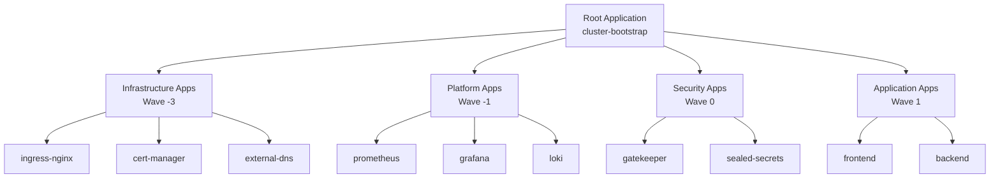

# How to Bootstrap an Entire Cluster with ArgoCD App-of-Apps

Author: [nawazdhandala](https://github.com/nawazdhandala)

Tags: ArgoCD, GitOps, Kubernetes, Bootstrap, App-of-Apps

Description: Learn how to bootstrap an entire Kubernetes cluster from scratch using ArgoCD's App-of-Apps pattern to deploy infrastructure, platform services, and applications in one shot.

---

Bootstrapping a Kubernetes cluster means going from a bare cluster to a fully operational environment with all the infrastructure components, platform services, and applications deployed and running. The ArgoCD App-of-Apps pattern lets you define everything in Git and deploy it all by applying a single root application. This guide shows you how to structure and implement a complete cluster bootstrap workflow.

## The Bootstrapping Challenge

A fresh Kubernetes cluster needs a lot of components before it is production-ready:

- **Infrastructure layer**: Ingress controllers, cert-manager, external-dns, storage classes
- **Platform layer**: Monitoring (Prometheus, Grafana), logging (Loki, Fluentbit), service mesh
- **Security layer**: OPA/Gatekeeper, Sealed Secrets, network policies
- **Application layer**: Your actual workloads

These components have dependencies. Cert-manager needs to be running before you can create Certificate resources. The ingress controller needs to exist before Ingress resources work. The App-of-Apps pattern with sync waves handles this ordering.



## Repository Structure

Create a dedicated repository for cluster configuration:

```text
cluster-bootstrap/
  root-app.yaml              # The single entry point
  infrastructure/
    cert-manager.yaml
    ingress-nginx.yaml
    external-dns.yaml
    storage-classes.yaml
  platform/
    prometheus.yaml
    grafana.yaml
    loki.yaml
    fluentbit.yaml
  security/
    sealed-secrets.yaml
    gatekeeper.yaml
    network-policies.yaml
  applications/
    frontend.yaml
    backend-api.yaml
    backend-worker.yaml
  projects/
    infrastructure.yaml
    platform.yaml
    applications.yaml
```

## Step 1: Define Projects

Start with projects that define the boundaries for each layer:

```yaml
# projects/infrastructure.yaml
apiVersion: argoproj.io/v1alpha1
kind: AppProject
metadata:
  name: infrastructure
  namespace: argocd
spec:
  description: "Cluster infrastructure components"
  sourceRepos:
    - '*'
  destinations:
    - server: https://kubernetes.default.svc
      namespace: '*'
  clusterResourceWhitelist:
    - group: '*'
      kind: '*'
```

```yaml
# projects/applications.yaml
apiVersion: argoproj.io/v1alpha1
kind: AppProject
metadata:
  name: applications
  namespace: argocd
spec:
  description: "Application workloads"
  sourceRepos:
    - 'https://github.com/myorg/*'
  destinations:
    - server: https://kubernetes.default.svc
      namespace: frontend
    - server: https://kubernetes.default.svc
      namespace: backend
  clusterResourceWhitelist: []
  namespaceResourceWhitelist:
    - group: '*'
      kind: '*'
```

## Step 2: Define Infrastructure Applications

Infrastructure components deploy first using negative sync waves:

```yaml
# infrastructure/cert-manager.yaml
apiVersion: argoproj.io/v1alpha1
kind: Application
metadata:
  name: cert-manager
  namespace: argocd
  annotations:
    argocd.argoproj.io/sync-wave: "-3"
  finalizers:
    - resources-finalizer.argocd.argoproj.io
spec:
  project: infrastructure
  source:
    repoURL: https://charts.jetstack.io
    chart: cert-manager
    targetRevision: v1.14.0
    helm:
      values: |
        installCRDs: true
        prometheus:
          enabled: true
  destination:
    server: https://kubernetes.default.svc
    namespace: cert-manager
  syncPolicy:
    automated:
      prune: true
      selfHeal: true
    syncOptions:
      - CreateNamespace=true
```

```yaml
# infrastructure/ingress-nginx.yaml
apiVersion: argoproj.io/v1alpha1
kind: Application
metadata:
  name: ingress-nginx
  namespace: argocd
  annotations:
    argocd.argoproj.io/sync-wave: "-2"
  finalizers:
    - resources-finalizer.argocd.argoproj.io
spec:
  project: infrastructure
  source:
    repoURL: https://kubernetes.github.io/ingress-nginx
    chart: ingress-nginx
    targetRevision: 4.9.0
    helm:
      values: |
        controller:
          replicaCount: 2
          metrics:
            enabled: true
          service:
            type: LoadBalancer
  destination:
    server: https://kubernetes.default.svc
    namespace: ingress-nginx
  syncPolicy:
    automated:
      prune: true
      selfHeal: true
    syncOptions:
      - CreateNamespace=true
```

## Step 3: Define Platform Services

Platform services come after infrastructure:

```yaml
# platform/prometheus.yaml
apiVersion: argoproj.io/v1alpha1
kind: Application
metadata:
  name: prometheus-stack
  namespace: argocd
  annotations:
    argocd.argoproj.io/sync-wave: "-1"
  finalizers:
    - resources-finalizer.argocd.argoproj.io
spec:
  project: platform
  source:
    repoURL: https://prometheus-community.github.io/helm-charts
    chart: kube-prometheus-stack
    targetRevision: 56.0.0
    helm:
      values: |
        grafana:
          enabled: true
          ingress:
            enabled: true
            hosts:
              - grafana.example.com
        prometheus:
          prometheusSpec:
            retention: 30d
            storageSpec:
              volumeClaimTemplate:
                spec:
                  accessModes: ["ReadWriteOnce"]
                  resources:
                    requests:
                      storage: 50Gi
  destination:
    server: https://kubernetes.default.svc
    namespace: monitoring
  syncPolicy:
    automated:
      prune: true
      selfHeal: true
    syncOptions:
      - CreateNamespace=true
      - ServerSideApply=true
```

## Step 4: Define Application Workloads

Application workloads sync last:

```yaml
# applications/backend-api.yaml
apiVersion: argoproj.io/v1alpha1
kind: Application
metadata:
  name: backend-api
  namespace: argocd
  annotations:
    argocd.argoproj.io/sync-wave: "1"
  finalizers:
    - resources-finalizer.argocd.argoproj.io
spec:
  project: applications
  source:
    repoURL: https://github.com/myorg/backend-api.git
    targetRevision: main
    path: deploy/overlays/production
  destination:
    server: https://kubernetes.default.svc
    namespace: backend
  syncPolicy:
    automated:
      prune: true
      selfHeal: true
    syncOptions:
      - CreateNamespace=true
```

## Step 5: Create the Root Application

The root application ties everything together:

```yaml
# root-app.yaml
apiVersion: argoproj.io/v1alpha1
kind: Application
metadata:
  name: cluster-bootstrap
  namespace: argocd
spec:
  project: default
  source:
    repoURL: https://github.com/myorg/cluster-bootstrap.git
    targetRevision: main
    path: .
    directory:
      recurse: true
      exclude: 'root-app.yaml'
  destination:
    server: https://kubernetes.default.svc
    namespace: argocd
  syncPolicy:
    automated:
      prune: true
      selfHeal: true
```

Note the `directory.recurse: true` setting, which makes ArgoCD scan all subdirectories for YAML files. The `exclude` prevents the root app from trying to create itself.

## The Bootstrap Process

With everything in Git, bootstrapping is a three-step process:

```bash
# Step 1: Install ArgoCD on the fresh cluster
kubectl create namespace argocd
kubectl apply -n argocd -f https://raw.githubusercontent.com/argoproj/argo-cd/stable/manifests/install.yaml

# Step 2: Wait for ArgoCD to be ready
kubectl wait --for=condition=available deployment/argocd-server -n argocd --timeout=300s

# Step 3: Apply the root application
kubectl apply -f root-app.yaml
```

That is it. ArgoCD discovers all the child applications and syncs them in wave order:

1. Wave -3: cert-manager starts installing
2. Wave -2: ingress-nginx starts after cert-manager is healthy
3. Wave -1: Monitoring stack deploys
4. Wave 0: Security components deploy
5. Wave 1: Application workloads deploy last

## Handling the Chicken-and-Egg Problem

The root application needs ArgoCD running, but what if ArgoCD itself is one of the components you want to manage through GitOps? This is the "chicken-and-egg" problem.

The solution is to have ArgoCD manage its own configuration after the initial install:

```yaml
# infrastructure/argocd.yaml
apiVersion: argoproj.io/v1alpha1
kind: Application
metadata:
  name: argocd
  namespace: argocd
  annotations:
    argocd.argoproj.io/sync-wave: "-5"  # Sync before everything else
spec:
  project: infrastructure
  source:
    repoURL: https://github.com/myorg/cluster-bootstrap.git
    targetRevision: main
    path: argocd-config
    helm:
      values: |
        server:
          ingress:
            enabled: true
            hosts:
              - argocd.example.com
  destination:
    server: https://kubernetes.default.svc
    namespace: argocd
  syncPolicy:
    automated:
      selfHeal: true
```

The initial kubectl install gets ArgoCD running, and then ArgoCD takes over managing its own configuration.

## Testing the Bootstrap

Before relying on the bootstrap process for production, test it:

```bash
# Create a test cluster with kind
kind create cluster --name bootstrap-test

# Install ArgoCD
kubectl create namespace argocd
kubectl apply -n argocd -f https://raw.githubusercontent.com/argoproj/argo-cd/stable/manifests/install.yaml
kubectl wait --for=condition=available deployment/argocd-server -n argocd --timeout=300s

# Apply root app
kubectl apply -f root-app.yaml

# Watch the bootstrap progress
watch "argocd app list 2>/dev/null || kubectl get applications -n argocd"

# Clean up when done
kind delete cluster --name bootstrap-test
```

## Best Practices

1. **Use sync waves consistently** to enforce deployment order
2. **Keep infrastructure and applications in separate projects** for access control
3. **Test the full bootstrap regularly** using disposable clusters
4. **Document the manual bootstrap steps** (ArgoCD install + root app apply)
5. **Pin chart versions** to prevent unexpected changes during bootstrap
6. **Use health checks** to ensure components are actually ready before moving to the next wave

Bootstrapping with App-of-Apps gives you a reproducible, auditable way to bring up entire clusters. Combined with [declarative project management](https://oneuptime.com/blog/post/2026-02-26-argocd-manage-projects-declaratively/view), you get a complete infrastructure-as-code solution for Kubernetes.
