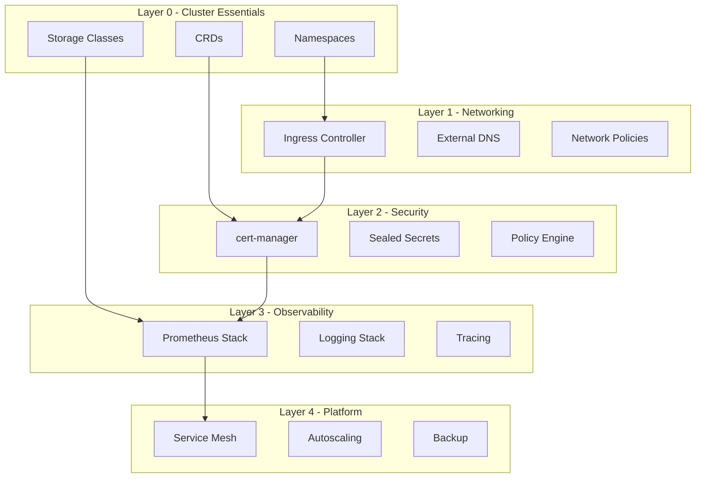

# How to Bootstrap Cluster Infrastructure Components with ArgoCD

Author: [nawazdhandala](https://github.com/nawazdhandala)

Tags: ArgoCD, GitOps, Kubernetes, Infrastructure, Bootstrapping

Description: Learn how to use ArgoCD to bootstrap essential Kubernetes cluster infrastructure components including CNI, CSI drivers, DNS, policy engines, and service mesh in the correct order.

---

Before any application can run on a Kubernetes cluster, infrastructure components need to be in place: networking, storage, DNS, security policies, and more. ArgoCD can manage all of these, but the ordering and dependency management requires careful planning. This guide shows you how to bootstrap every essential infrastructure component using ArgoCD.

## Infrastructure Component Categories



## Layer 0: Cluster Essentials (Sync Wave 0)

### Namespaces

Create all required namespaces first:

```yaml
# infrastructure/00-namespaces/application.yaml
apiVersion: argoproj.io/v1alpha1
kind: Application
metadata:
  name: cluster-namespaces
  namespace: argocd
  annotations:
    argocd.argoproj.io/sync-wave: "0"
spec:
  project: default
  source:
    repoURL: https://github.com/your-org/cluster-config.git
    path: infrastructure/00-namespaces/manifests
    targetRevision: HEAD
  destination:
    server: https://kubernetes.default.svc
  syncPolicy:
    automated:
      prune: false  # Do not delete namespaces automatically
      selfHeal: true
```

```yaml
# infrastructure/00-namespaces/manifests/namespaces.yaml
apiVersion: v1
kind: Namespace
metadata:
  name: ingress-nginx
  labels:
    purpose: infrastructure
---
apiVersion: v1
kind: Namespace
metadata:
  name: cert-manager
  labels:
    purpose: infrastructure
---
apiVersion: v1
kind: Namespace
metadata:
  name: monitoring
  labels:
    purpose: observability
---
apiVersion: v1
kind: Namespace
metadata:
  name: logging
  labels:
    purpose: observability
---
apiVersion: v1
kind: Namespace
metadata:
  name: sealed-secrets
  labels:
    purpose: security
```

### Priority Classes

Define priority classes so critical infrastructure pods are scheduled first:

```yaml
# infrastructure/00-priority-classes/manifests/priority-classes.yaml
apiVersion: scheduling.k8s.io/v1
kind: PriorityClass
metadata:
  name: infrastructure-critical
value: 1000000
globalDefault: false
description: "Used for critical infrastructure components"
---
apiVersion: scheduling.k8s.io/v1
kind: PriorityClass
metadata:
  name: application-high
value: 100000
globalDefault: false
description: "Used for high-priority application workloads"
```

### Storage Classes

```yaml
# infrastructure/00-storage/application.yaml
apiVersion: argoproj.io/v1alpha1
kind: Application
metadata:
  name: storage-classes
  namespace: argocd
  annotations:
    argocd.argoproj.io/sync-wave: "0"
spec:
  project: default
  source:
    repoURL: https://github.com/your-org/cluster-config.git
    path: infrastructure/00-storage/manifests
    targetRevision: HEAD
  destination:
    server: https://kubernetes.default.svc
  syncPolicy:
    automated:
      selfHeal: true
```

```yaml
# infrastructure/00-storage/manifests/storage-classes.yaml
apiVersion: storage.k8s.io/v1
kind: StorageClass
metadata:
  name: fast-ssd
  annotations:
    storageclass.kubernetes.io/is-default-class: "true"
provisioner: ebs.csi.aws.com  # Change for your cloud provider
parameters:
  type: gp3
  encrypted: "true"
reclaimPolicy: Delete
volumeBindingMode: WaitForFirstConsumer
allowVolumeExpansion: true
---
apiVersion: storage.k8s.io/v1
kind: StorageClass
metadata:
  name: standard-hdd
provisioner: ebs.csi.aws.com
parameters:
  type: st1
  encrypted: "true"
reclaimPolicy: Delete
volumeBindingMode: WaitForFirstConsumer
```

## Layer 1: Networking (Sync Wave 1-2)

### Ingress Controller

```yaml
# infrastructure/01-ingress/application.yaml
apiVersion: argoproj.io/v1alpha1
kind: Application
metadata:
  name: ingress-nginx
  namespace: argocd
  annotations:
    argocd.argoproj.io/sync-wave: "1"
spec:
  project: default
  source:
    repoURL: https://kubernetes.github.io/ingress-nginx
    chart: ingress-nginx
    targetRevision: 4.9.1
    helm:
      values: |
        controller:
          replicaCount: 2
          priorityClassName: infrastructure-critical
          service:
            type: LoadBalancer
            annotations:
              # AWS-specific annotations
              service.beta.kubernetes.io/aws-load-balancer-type: "nlb"
              service.beta.kubernetes.io/aws-load-balancer-scheme: "internet-facing"
          metrics:
            enabled: true
            serviceMonitor:
              enabled: true
          resources:
            requests:
              cpu: 100m
              memory: 256Mi
            limits:
              cpu: 500m
              memory: 512Mi
  destination:
    server: https://kubernetes.default.svc
    namespace: ingress-nginx
  syncPolicy:
    automated:
      prune: true
      selfHeal: true
    syncOptions:
      - CreateNamespace=true
```

### External DNS

```yaml
# infrastructure/01-external-dns/application.yaml
apiVersion: argoproj.io/v1alpha1
kind: Application
metadata:
  name: external-dns
  namespace: argocd
  annotations:
    argocd.argoproj.io/sync-wave: "2"
spec:
  project: default
  source:
    repoURL: https://kubernetes-sigs.github.io/external-dns
    chart: external-dns
    targetRevision: 1.14.3
    helm:
      values: |
        provider: aws
        policy: sync
        txtOwnerId: my-cluster
        domainFilters:
          - example.com
        serviceAccount:
          annotations:
            eks.amazonaws.com/role-arn: arn:aws:iam::123456789:role/external-dns
  destination:
    server: https://kubernetes.default.svc
    namespace: external-dns
  syncPolicy:
    automated:
      prune: true
      selfHeal: true
    syncOptions:
      - CreateNamespace=true
```

## Layer 2: Security (Sync Wave 3-4)

### cert-manager

```yaml
# infrastructure/02-cert-manager/application.yaml
apiVersion: argoproj.io/v1alpha1
kind: Application
metadata:
  name: cert-manager
  namespace: argocd
  annotations:
    argocd.argoproj.io/sync-wave: "3"
spec:
  project: default
  source:
    repoURL: https://charts.jetstack.io
    chart: cert-manager
    targetRevision: v1.14.4
    helm:
      values: |
        installCRDs: true
        priorityClassName: infrastructure-critical
        prometheus:
          enabled: true
          servicemonitor:
            enabled: true
  destination:
    server: https://kubernetes.default.svc
    namespace: cert-manager
  syncPolicy:
    automated:
      prune: true
      selfHeal: true
    syncOptions:
      - CreateNamespace=true
```

### ClusterIssuers (after cert-manager)

```yaml
# infrastructure/02-cert-manager-issuers/application.yaml
apiVersion: argoproj.io/v1alpha1
kind: Application
metadata:
  name: cert-manager-issuers
  namespace: argocd
  annotations:
    argocd.argoproj.io/sync-wave: "4"  # After cert-manager
spec:
  project: default
  source:
    repoURL: https://github.com/your-org/cluster-config.git
    path: infrastructure/02-cert-manager-issuers/manifests
    targetRevision: HEAD
  destination:
    server: https://kubernetes.default.svc
  syncPolicy:
    automated:
      selfHeal: true
```

```yaml
# infrastructure/02-cert-manager-issuers/manifests/cluster-issuer.yaml
apiVersion: cert-manager.io/v1
kind: ClusterIssuer
metadata:
  name: letsencrypt-production
spec:
  acme:
    server: https://acme-v02.api.letsencrypt.org/directory
    email: admin@example.com
    privateKeySecretRef:
      name: letsencrypt-production
    solvers:
      - http01:
          ingress:
            class: nginx
```

### Sealed Secrets

```yaml
# infrastructure/02-sealed-secrets/application.yaml
apiVersion: argoproj.io/v1alpha1
kind: Application
metadata:
  name: sealed-secrets
  namespace: argocd
  annotations:
    argocd.argoproj.io/sync-wave: "3"
spec:
  project: default
  source:
    repoURL: https://bitnami-labs.github.io/sealed-secrets
    chart: sealed-secrets
    targetRevision: 2.14.2
    helm:
      values: |
        priorityClassName: infrastructure-critical
  destination:
    server: https://kubernetes.default.svc
    namespace: sealed-secrets
  syncPolicy:
    automated:
      prune: true
      selfHeal: true
    syncOptions:
      - CreateNamespace=true
```

## Layer 3: Observability (Sync Wave 5-6)

See the dedicated guide on [bootstrapping monitoring with ArgoCD](https://oneuptime.com/blog/post/2026-02-26-argocd-bootstrap-monitoring-stack/view) for detailed monitoring setup.

## Layer 4: Platform Services (Sync Wave 7+)

### Vertical Pod Autoscaler

```yaml
# infrastructure/04-vpa/application.yaml
apiVersion: argoproj.io/v1alpha1
kind: Application
metadata:
  name: vpa
  namespace: argocd
  annotations:
    argocd.argoproj.io/sync-wave: "7"
spec:
  project: default
  source:
    repoURL: https://cowboysysop.github.io/charts
    chart: vertical-pod-autoscaler
    targetRevision: 9.4.0
    helm:
      values: |
        recommender:
          enabled: true
        updater:
          enabled: true
        admissionController:
          enabled: true
  destination:
    server: https://kubernetes.default.svc
    namespace: vpa
  syncPolicy:
    automated:
      prune: true
      selfHeal: true
    syncOptions:
      - CreateNamespace=true
```

## Verification Script

After bootstrapping, verify all infrastructure components:

```bash
#!/bin/bash
# verify-infrastructure.sh

echo "=== Infrastructure Bootstrap Verification ==="

# Check all ArgoCD applications
echo -e "\n--- Application Status ---"
kubectl get applications -n argocd \
  -o custom-columns=NAME:.metadata.name,WAVE:.metadata.annotations.argocd\\.argoproj\\.io/sync-wave,SYNC:.status.sync.status,HEALTH:.status.health.status

# Check key infrastructure components
echo -e "\n--- Ingress Controller ---"
kubectl get pods -n ingress-nginx --no-headers | head -5

echo -e "\n--- cert-manager ---"
kubectl get pods -n cert-manager --no-headers

echo -e "\n--- Monitoring ---"
kubectl get pods -n monitoring --no-headers | head -10

echo -e "\n--- Storage Classes ---"
kubectl get storageclasses

echo -e "\n--- ClusterIssuers ---"
kubectl get clusterissuers 2>/dev/null || echo "No ClusterIssuers"

# Count failed applications
FAILED=$(kubectl get applications -n argocd -o json | \
  jq '[.items[] | select(.status.sync.status != "Synced" or .status.health.status != "Healthy")] | length')

echo -e "\n=== Summary ==="
echo "Failed applications: $FAILED"
if [ "$FAILED" -eq 0 ]; then
  echo "All infrastructure components bootstrapped successfully"
else
  echo "Some components need attention. Check ArgoCD UI for details."
fi
```

## Summary

Bootstrapping cluster infrastructure with ArgoCD requires careful ordering through sync waves. Start with cluster essentials (namespaces, storage classes, CRDs), then networking (ingress, DNS), security (certificates, secrets), observability (monitoring, logging), and finally platform services (autoscaling, service mesh). Each component is defined as an ArgoCD Application with the appropriate sync wave annotation. This approach makes your entire cluster infrastructure reproducible, version-controlled, and self-healing. For monitoring the health of your bootstrapped infrastructure components, integrate with [OneUptime](https://oneuptime.com).
