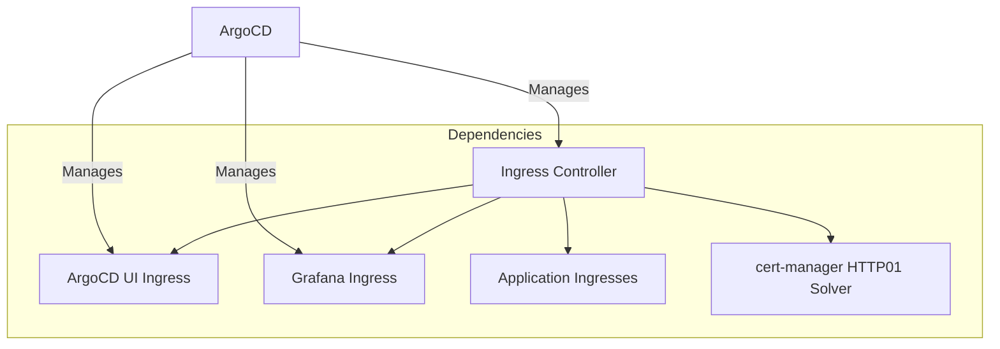

# How to Bootstrap Ingress Controller with ArgoCD

Author: [nawazdhandala](https://github.com/nawazdhandala)

Tags: ArgoCD, GitOps, Kubernetes, Ingress, Networking

Description: Learn how to bootstrap and manage Kubernetes ingress controllers with ArgoCD including Nginx, Traefik, and AWS ALB with TLS, monitoring, and multi-environment configurations.

---

An ingress controller is usually the first infrastructure component you deploy after ArgoCD itself. It provides external access to your services and is a dependency for many other components (Grafana dashboards, ArgoCD UI, application endpoints). Managing your ingress controller with ArgoCD means upgrades, configuration changes, and scaling are all GitOps-managed. This guide shows you how to bootstrap the most popular ingress controllers.

## Why Bootstrap Ingress with ArgoCD



Since many components depend on the ingress controller being available, it should be one of the first things deployed (sync wave 1 or 2).

## Bootstrapping Nginx Ingress Controller

The most widely used ingress controller in Kubernetes:

```yaml
# infrastructure/ingress-nginx/application.yaml
apiVersion: argoproj.io/v1alpha1
kind: Application
metadata:
  name: ingress-nginx
  namespace: argocd
  annotations:
    argocd.argoproj.io/sync-wave: "1"
  finalizers:
    - resources-finalizer.argocd.argoproj.io
spec:
  project: default
  source:
    repoURL: https://kubernetes.github.io/ingress-nginx
    chart: ingress-nginx
    targetRevision: 4.9.1
    helm:
      releaseName: ingress-nginx
      values: |
        controller:
          # High availability
          replicaCount: 2
          # Use host networking for better performance (optional)
          # hostNetwork: true

          # Resource allocation
          resources:
            requests:
              cpu: 100m
              memory: 256Mi
            limits:
              cpu: 1
              memory: 512Mi

          # Pod disruption budget
          minAvailable: 1

          # Service configuration
          service:
            type: LoadBalancer
            annotations:
              # AWS NLB
              service.beta.kubernetes.io/aws-load-balancer-type: "nlb"
              service.beta.kubernetes.io/aws-load-balancer-cross-zone-load-balancing-enabled: "true"
              service.beta.kubernetes.io/aws-load-balancer-scheme: "internet-facing"

          # Metrics for Prometheus
          metrics:
            enabled: true
            serviceMonitor:
              enabled: true
              additionalLabels:
                release: monitoring

          # Admission webhook
          admissionWebhooks:
            enabled: true

          # Auto-scaling
          autoscaling:
            enabled: true
            minReplicas: 2
            maxReplicas: 10
            targetCPUUtilizationPercentage: 80
            targetMemoryUtilizationPercentage: 80

          # Topology spread for HA
          topologySpreadConstraints:
            - maxSkew: 1
              topologyKey: topology.kubernetes.io/zone
              whenUnsatisfiable: DoNotSchedule
              labelSelector:
                matchLabels:
                  app.kubernetes.io/name: ingress-nginx

          # Logging configuration
          config:
            use-forwarded-headers: "true"
            compute-full-forwarded-for: "true"
            log-format-upstream: '$remote_addr - $remote_user [$time_local] "$request" $status $body_bytes_sent "$http_referer" "$http_user_agent" $request_length $request_time [$proxy_upstream_name] [$proxy_alternative_upstream_name] $upstream_addr $upstream_response_length $upstream_response_time $upstream_status $req_id'

        # Default backend
        defaultBackend:
          enabled: true
          replicaCount: 1
  destination:
    server: https://kubernetes.default.svc
    namespace: ingress-nginx
  syncPolicy:
    automated:
      prune: true
      selfHeal: true
    syncOptions:
      - CreateNamespace=true
```

## Bootstrapping Traefik Ingress Controller

For teams that prefer Traefik:

```yaml
# infrastructure/traefik/application.yaml
apiVersion: argoproj.io/v1alpha1
kind: Application
metadata:
  name: traefik
  namespace: argocd
  annotations:
    argocd.argoproj.io/sync-wave: "1"
  finalizers:
    - resources-finalizer.argocd.argoproj.io
spec:
  project: default
  source:
    repoURL: https://traefik.github.io/charts
    chart: traefik
    targetRevision: 26.0.0
    helm:
      releaseName: traefik
      values: |
        deployment:
          replicas: 2
        resources:
          requests:
            cpu: 100m
            memory: 128Mi
          limits:
            cpu: 500m
            memory: 256Mi
        service:
          type: LoadBalancer
        ports:
          web:
            redirectTo:
              port: websecure
          websecure:
            tls:
              enabled: true
        metrics:
          prometheus:
            service:
              enabled: true
            serviceMonitor:
              enabled: true
        ingressRoute:
          dashboard:
            enabled: true
            matchRule: Host(`traefik.example.com`)
  destination:
    server: https://kubernetes.default.svc
    namespace: traefik
  syncPolicy:
    automated:
      prune: true
      selfHeal: true
    syncOptions:
      - CreateNamespace=true
```

## Bootstrapping AWS ALB Ingress Controller

For AWS environments using Application Load Balancers:

```yaml
# infrastructure/aws-alb/application.yaml
apiVersion: argoproj.io/v1alpha1
kind: Application
metadata:
  name: aws-load-balancer-controller
  namespace: argocd
  annotations:
    argocd.argoproj.io/sync-wave: "1"
  finalizers:
    - resources-finalizer.argocd.argoproj.io
spec:
  project: default
  source:
    repoURL: https://aws.github.io/eks-charts
    chart: aws-load-balancer-controller
    targetRevision: 1.7.1
    helm:
      releaseName: aws-load-balancer-controller
      values: |
        clusterName: my-eks-cluster
        serviceAccount:
          create: true
          annotations:
            eks.amazonaws.com/role-arn: arn:aws:iam::123456789:role/aws-lb-controller
        replicaCount: 2
        resources:
          requests:
            cpu: 100m
            memory: 128Mi
          limits:
            cpu: 200m
            memory: 256Mi
  destination:
    server: https://kubernetes.default.svc
    namespace: kube-system
  syncPolicy:
    automated:
      prune: true
      selfHeal: true
```

## Configuring TLS with cert-manager

After deploying the ingress controller and cert-manager, configure automatic TLS:

```yaml
# infrastructure/ingress-tls/manifests/cluster-issuer.yaml
apiVersion: cert-manager.io/v1
kind: ClusterIssuer
metadata:
  name: letsencrypt-production
spec:
  acme:
    server: https://acme-v02.api.letsencrypt.org/directory
    email: admin@example.com
    privateKeySecretRef:
      name: letsencrypt-production
    solvers:
      - http01:
          ingress:
            class: nginx
```

Then use it in your ingress resources:

```yaml
# Example ingress with automatic TLS
apiVersion: networking.k8s.io/v1
kind: Ingress
metadata:
  name: my-app
  annotations:
    cert-manager.io/cluster-issuer: letsencrypt-production
    nginx.ingress.kubernetes.io/ssl-redirect: "true"
spec:
  ingressClassName: nginx
  tls:
    - hosts:
        - app.example.com
      secretName: app-tls
  rules:
    - host: app.example.com
      http:
        paths:
          - path: /
            pathType: Prefix
            backend:
              service:
                name: my-app
                port:
                  number: 80
```

## Multi-Environment Configuration

Different environments need different ingress configurations:

```yaml
# base/ingress-nginx/application.yaml
apiVersion: argoproj.io/v1alpha1
kind: Application
metadata:
  name: ingress-nginx
  namespace: argocd
spec:
  project: default
  source:
    repoURL: https://kubernetes.github.io/ingress-nginx
    chart: ingress-nginx
    targetRevision: 4.9.1
    helm:
      releaseName: ingress-nginx
      # Values will be overridden per environment
  destination:
    server: https://kubernetes.default.svc
    namespace: ingress-nginx
  syncPolicy:
    automated:
      prune: true
      selfHeal: true
    syncOptions:
      - CreateNamespace=true
```

Development environment overlay:

```yaml
# overlays/dev/ingress-patch.yaml
apiVersion: argoproj.io/v1alpha1
kind: Application
metadata:
  name: ingress-nginx
spec:
  source:
    helm:
      values: |
        controller:
          replicaCount: 1
          service:
            type: NodePort  # No LoadBalancer in dev
          autoscaling:
            enabled: false
          resources:
            requests:
              cpu: 50m
              memory: 128Mi
```

Production environment overlay:

```yaml
# overlays/production/ingress-patch.yaml
apiVersion: argoproj.io/v1alpha1
kind: Application
metadata:
  name: ingress-nginx
spec:
  source:
    helm:
      values: |
        controller:
          replicaCount: 3
          autoscaling:
            enabled: true
            minReplicas: 3
            maxReplicas: 20
          service:
            type: LoadBalancer
            annotations:
              service.beta.kubernetes.io/aws-load-balancer-type: "nlb"
          resources:
            requests:
              cpu: 500m
              memory: 512Mi
            limits:
              cpu: 2
              memory: 1Gi
```

## Monitoring Your Ingress Controller

Add a ServiceMonitor to scrape ingress metrics:

```yaml
# monitoring/ingress-monitor.yaml
apiVersion: monitoring.coreos.com/v1
kind: ServiceMonitor
metadata:
  name: ingress-nginx-monitor
  namespace: monitoring
  labels:
    release: monitoring
spec:
  selector:
    matchLabels:
      app.kubernetes.io/name: ingress-nginx
  namespaceSelector:
    matchNames:
      - ingress-nginx
  endpoints:
    - port: metrics
      interval: 15s
```

Key metrics to watch:

```
# Request rate
rate(nginx_ingress_controller_requests[5m])

# Error rate
rate(nginx_ingress_controller_requests{status=~"5.."}[5m])

# Request duration
histogram_quantile(0.99, rate(nginx_ingress_controller_request_duration_seconds_bucket[5m]))

# Active connections
nginx_ingress_controller_nginx_process_connections
```

## Upgrading the Ingress Controller

Since ArgoCD manages the ingress controller, upgrades are a Git commit:

```bash
# Update the chart version in your application YAML
# Change: targetRevision: 4.9.1
# To:     targetRevision: 4.10.0

# Commit and push
git add infrastructure/ingress-nginx/application.yaml
git commit -m "Upgrade ingress-nginx to 4.10.0"
git push

# ArgoCD will detect the change and sync automatically
# Monitor the upgrade
kubectl get pods -n ingress-nginx -w
```

For zero-downtime upgrades, the ingress controller Helm chart handles rolling updates. With multiple replicas and a PodDisruptionBudget, traffic is never interrupted.

## Verification Script

```bash
#!/bin/bash
echo "=== Ingress Controller Verification ==="

echo -e "\n--- Pods ---"
kubectl get pods -n ingress-nginx -o wide

echo -e "\n--- Service ---"
kubectl get svc -n ingress-nginx

echo -e "\n--- External IP/Hostname ---"
kubectl get svc ingress-nginx-controller -n ingress-nginx \
  -o jsonpath='{.status.loadBalancer.ingress[0].hostname}{.status.loadBalancer.ingress[0].ip}'
echo ""

echo -e "\n--- Ingress Classes ---"
kubectl get ingressclass

echo -e "\n--- Active Ingresses ---"
kubectl get ingress --all-namespaces

echo -e "\n--- Controller Version ---"
kubectl exec -n ingress-nginx deploy/ingress-nginx-controller -- \
  /nginx-ingress-controller --version 2>/dev/null | head -1
```

## Summary

Bootstrapping an ingress controller with ArgoCD follows the same GitOps pattern as any other component: define an Application resource that references a Helm chart, configure it with environment-appropriate values, and let ArgoCD manage the lifecycle. The ingress controller should be deployed early in the bootstrapping process (sync wave 1) since many other components depend on it. Use multiple replicas with topology spread for HA, enable metrics for monitoring, and configure automatic TLS with cert-manager. For complete infrastructure monitoring including ingress health, integrate with [OneUptime](https://oneuptime.com) to track request rates, error rates, and certificate expiry across all your environments.
