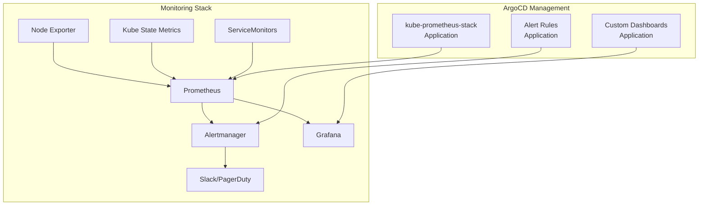

# How to Bootstrap Monitoring Stack with ArgoCD

Author: [nawazdhandala](https://github.com/nawazdhandala)

Tags: ArgoCD, GitOps, Kubernetes, Monitoring, Prometheus

Description: Learn how to bootstrap a complete monitoring stack with ArgoCD including Prometheus, Grafana, Alertmanager, and custom dashboards using GitOps for reproducible observability.

---

A monitoring stack is one of the first things you should deploy on any Kubernetes cluster. Without it, you are flying blind. Using ArgoCD to manage your monitoring stack means it is version-controlled, reproducible, and self-healing. This guide walks through deploying a complete monitoring stack - Prometheus, Grafana, Alertmanager, and custom configurations - all managed by ArgoCD.

## Monitoring Stack Architecture



## Option 1: Single Application with kube-prometheus-stack

The simplest approach is deploying the entire stack as one ArgoCD application:

```yaml
# monitoring/application.yaml
apiVersion: argoproj.io/v1alpha1
kind: Application
metadata:
  name: monitoring
  namespace: argocd
  annotations:
    argocd.argoproj.io/sync-wave: "5"
  finalizers:
    - resources-finalizer.argocd.argoproj.io
spec:
  project: default
  source:
    repoURL: https://prometheus-community.github.io/helm-charts
    chart: kube-prometheus-stack
    targetRevision: 56.6.2
    helm:
      releaseName: monitoring
      values: |
        # Global settings
        fullnameOverride: monitoring

        # Prometheus configuration
        prometheus:
          prometheusSpec:
            retention: 15d
            retentionSize: 40GB
            resources:
              requests:
                cpu: 500m
                memory: 2Gi
              limits:
                cpu: 2
                memory: 4Gi
            storageSpec:
              volumeClaimTemplate:
                spec:
                  storageClassName: fast-ssd
                  accessModes:
                    - ReadWriteOnce
                  resources:
                    requests:
                      storage: 50Gi
            # Scrape all ServiceMonitors across namespaces
            serviceMonitorSelectorNilUsesHelmValues: false
            podMonitorSelectorNilUsesHelmValues: false
            ruleSelectorNilUsesHelmValues: false

        # Grafana configuration
        grafana:
          enabled: true
          adminPassword: admin  # Change this or use a secret
          persistence:
            enabled: true
            size: 10Gi
          ingress:
            enabled: true
            annotations:
              cert-manager.io/cluster-issuer: letsencrypt-production
            hosts:
              - grafana.example.com
            tls:
              - secretName: grafana-tls
                hosts:
                  - grafana.example.com
          sidecar:
            dashboards:
              enabled: true
              searchNamespace: ALL
              label: grafana_dashboard
            datasources:
              enabled: true
              searchNamespace: ALL

        # Alertmanager configuration
        alertmanager:
          alertmanagerSpec:
            storage:
              volumeClaimTemplate:
                spec:
                  storageClassName: fast-ssd
                  accessModes:
                    - ReadWriteOnce
                  resources:
                    requests:
                      storage: 10Gi

        # Node Exporter
        nodeExporter:
          enabled: true

        # Kube State Metrics
        kubeStateMetrics:
          enabled: true
  destination:
    server: https://kubernetes.default.svc
    namespace: monitoring
  syncPolicy:
    automated:
      prune: true
      selfHeal: true
    syncOptions:
      - CreateNamespace=true
      - ServerSideApply=true  # Required for CRDs
```

Apply this:

```bash
kubectl apply -f monitoring/application.yaml
```

## Option 2: Split Into Multiple Applications

For larger teams, split the monitoring stack into separate applications for independent management:

```yaml
# monitoring/prometheus-operator.yaml
apiVersion: argoproj.io/v1alpha1
kind: Application
metadata:
  name: prometheus-operator
  namespace: argocd
  annotations:
    argocd.argoproj.io/sync-wave: "5"
spec:
  project: default
  source:
    repoURL: https://prometheus-community.github.io/helm-charts
    chart: kube-prometheus-stack
    targetRevision: 56.6.2
    helm:
      values: |
        # Install operator and CRDs only
        prometheus:
          enabled: true
        grafana:
          enabled: false  # Managed separately
        alertmanager:
          enabled: true
  destination:
    server: https://kubernetes.default.svc
    namespace: monitoring
  syncPolicy:
    automated:
      prune: true
      selfHeal: true
    syncOptions:
      - CreateNamespace=true
      - ServerSideApply=true
```

```yaml
# monitoring/grafana.yaml
apiVersion: argoproj.io/v1alpha1
kind: Application
metadata:
  name: grafana
  namespace: argocd
  annotations:
    argocd.argoproj.io/sync-wave: "6"  # After Prometheus
spec:
  project: default
  source:
    repoURL: https://grafana.github.io/helm-charts
    chart: grafana
    targetRevision: 7.3.7
    helm:
      values: |
        persistence:
          enabled: true
          size: 10Gi
        datasources:
          datasources.yaml:
            apiVersion: 1
            datasources:
              - name: Prometheus
                type: prometheus
                url: http://monitoring-prometheus.monitoring:9090
                isDefault: true
        sidecar:
          dashboards:
            enabled: true
            searchNamespace: ALL
  destination:
    server: https://kubernetes.default.svc
    namespace: monitoring
  syncPolicy:
    automated:
      prune: true
      selfHeal: true
```

## Adding Custom Dashboards via GitOps

Store Grafana dashboards as ConfigMaps in Git:

```yaml
# monitoring/dashboards/application.yaml
apiVersion: argoproj.io/v1alpha1
kind: Application
metadata:
  name: grafana-dashboards
  namespace: argocd
  annotations:
    argocd.argoproj.io/sync-wave: "7"
spec:
  project: default
  source:
    repoURL: https://github.com/your-org/cluster-config.git
    path: monitoring/dashboards/manifests
    targetRevision: HEAD
  destination:
    server: https://kubernetes.default.svc
    namespace: monitoring
  syncPolicy:
    automated:
      prune: true
      selfHeal: true
```

Create dashboard ConfigMaps:

```yaml
# monitoring/dashboards/manifests/argocd-dashboard.yaml
apiVersion: v1
kind: ConfigMap
metadata:
  name: argocd-dashboard
  namespace: monitoring
  labels:
    grafana_dashboard: "true"
data:
  argocd-dashboard.json: |
    {
      "dashboard": {
        "title": "ArgoCD Overview",
        "panels": [
          {
            "title": "Application Sync Status",
            "type": "stat",
            "targets": [
              {
                "expr": "sum(argocd_app_info{sync_status=\"Synced\"})",
                "legendFormat": "Synced"
              }
            ]
          },
          {
            "title": "Sync Failures (24h)",
            "type": "stat",
            "targets": [
              {
                "expr": "sum(increase(argocd_app_sync_total{phase=\"Error\"}[24h]))",
                "legendFormat": "Failed Syncs"
              }
            ]
          }
        ]
      }
    }
```

## Adding Custom Alert Rules

```yaml
# monitoring/alerts/application.yaml
apiVersion: argoproj.io/v1alpha1
kind: Application
metadata:
  name: alert-rules
  namespace: argocd
  annotations:
    argocd.argoproj.io/sync-wave: "7"
spec:
  project: default
  source:
    repoURL: https://github.com/your-org/cluster-config.git
    path: monitoring/alerts/manifests
    targetRevision: HEAD
  destination:
    server: https://kubernetes.default.svc
    namespace: monitoring
  syncPolicy:
    automated:
      prune: true
      selfHeal: true
```

```yaml
# monitoring/alerts/manifests/argocd-alerts.yaml
apiVersion: monitoring.coreos.com/v1
kind: PrometheusRule
metadata:
  name: argocd-alerts
  namespace: monitoring
  labels:
    release: monitoring  # Must match Prometheus label selector
spec:
  groups:
    - name: argocd
      rules:
        - alert: ArgocdAppOutOfSync
          expr: argocd_app_info{sync_status!="Synced"} == 1
          for: 15m
          labels:
            severity: warning
          annotations:
            summary: "ArgoCD app {{ $labels.name }} is out of sync"
            description: "Application {{ $labels.name }} has been out of sync for more than 15 minutes."

        - alert: ArgocdAppUnhealthy
          expr: argocd_app_info{health_status!~"Healthy|Progressing"} == 1
          for: 15m
          labels:
            severity: critical
          annotations:
            summary: "ArgoCD app {{ $labels.name }} is unhealthy"
            description: "Application {{ $labels.name }} health is {{ $labels.health_status }}."

        - alert: ArgocdSyncFailed
          expr: increase(argocd_app_sync_total{phase="Error"}[10m]) > 0
          labels:
            severity: warning
          annotations:
            summary: "ArgoCD sync failed for {{ $labels.name }}"
```

## Adding ServiceMonitors for ArgoCD

Monitor ArgoCD itself with the monitoring stack:

```yaml
# monitoring/argocd-servicemonitor/manifests/servicemonitor.yaml
apiVersion: monitoring.coreos.com/v1
kind: ServiceMonitor
metadata:
  name: argocd-metrics
  namespace: monitoring
  labels:
    release: monitoring
spec:
  selector:
    matchLabels:
      app.kubernetes.io/part-of: argocd
  namespaceSelector:
    matchNames:
      - argocd
  endpoints:
    - port: metrics
      interval: 30s
```

## Configuring Alertmanager Routes

```yaml
# monitoring/alertmanager-config/manifests/alertmanager-config.yaml
apiVersion: v1
kind: Secret
metadata:
  name: alertmanager-monitoring-alertmanager
  namespace: monitoring
stringData:
  alertmanager.yaml: |
    global:
      resolve_timeout: 5m
    route:
      group_by: ['namespace', 'alertname']
      group_wait: 30s
      group_interval: 5m
      repeat_interval: 12h
      receiver: 'default'
      routes:
        - match:
            severity: critical
          receiver: 'pagerduty'
        - match:
            severity: warning
          receiver: 'slack'
    receivers:
      - name: 'default'
        webhook_configs:
          - url: 'https://oneuptime.com/api/alert/webhook'
      - name: 'slack'
        slack_configs:
          - channel: '#alerts'
            api_url: 'https://hooks.slack.com/services/xxx/yyy/zzz'
      - name: 'pagerduty'
        pagerduty_configs:
          - service_key: 'your-pagerduty-key'
```

## Environment-Specific Values

Use different monitoring configurations per environment:

```yaml
# For dev environment - smaller resources, shorter retention
# overlays/dev/monitoring-values.yaml
prometheus:
  prometheusSpec:
    retention: 3d
    resources:
      requests:
        cpu: 200m
        memory: 512Mi
    storageSpec:
      volumeClaimTemplate:
        spec:
          resources:
            requests:
              storage: 10Gi

grafana:
  ingress:
    hosts:
      - grafana.dev.example.com

alertmanager:
  enabled: false  # No alerts in dev
```

## Verification

After bootstrapping, verify the monitoring stack:

```bash
#!/bin/bash
echo "=== Monitoring Stack Verification ==="

echo -e "\n--- Pods ---"
kubectl get pods -n monitoring

echo -e "\n--- Services ---"
kubectl get svc -n monitoring

echo -e "\n--- ServiceMonitors ---"
kubectl get servicemonitors -n monitoring

echo -e "\n--- PrometheusRules ---"
kubectl get prometheusrules -n monitoring

echo -e "\n--- PVCs ---"
kubectl get pvc -n monitoring

echo -e "\n--- Prometheus Targets ---"
# Port-forward and check targets
kubectl port-forward -n monitoring svc/monitoring-prometheus 9090:9090 &
sleep 3
curl -s localhost:9090/api/v1/targets | \
  python3 -c "import sys,json; d=json.load(sys.stdin); print(f'Active targets: {len(d[\"data\"][\"activeTargets\"])}')"
kill %1 2>/dev/null
```

## Summary

Bootstrapping a monitoring stack with ArgoCD gives you a reproducible, version-controlled observability platform. Use `kube-prometheus-stack` as the foundation, add custom dashboards and alert rules as separate ArgoCD applications, and configure ServiceMonitors to scrape your workloads. The key benefits are automatic recovery (if someone accidentally deletes a dashboard, ArgoCD recreates it), version history (every monitoring change is tracked in Git), and environment consistency (the same monitoring setup across dev, staging, and production with environment-specific overrides). For a complete monitoring and incident management solution, integrate your Prometheus alerts with [OneUptime](https://oneuptime.com) for unified observability.
