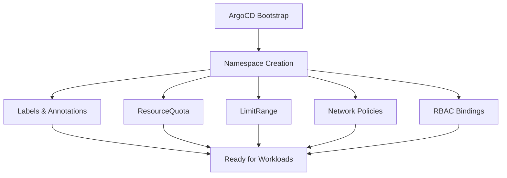

# How to Bootstrap Namespaces with ArgoCD

Author: [nawazdhandala](https://github.com/nawazdhandala)

Tags: ArgoCD, GitOps, Kubernetes, Namespace, Infrastructure

Description: Learn how to bootstrap Kubernetes namespaces using ArgoCD with labels, annotations, resource quotas, and limit ranges to establish a solid foundation for multi-team clusters.

---

Namespaces are the foundation of organization in Kubernetes. They separate teams, environments, and workloads. Getting them right from the start - with proper labels, resource quotas, and limit ranges - prevents the chaos that comes from namespaces created ad-hoc with kubectl.

Bootstrapping namespaces through ArgoCD means every cluster gets the same namespace structure. New teams get their namespace through a Git pull request, not a Slack message to the platform team. And every namespace comes with quotas and limits that prevent one team from consuming all cluster resources.

## Why Manage Namespaces with ArgoCD

Creating a namespace is easy: `kubectl create namespace my-app`. But a properly configured namespace needs:

- Labels for identification and policy selection
- Annotations for metadata and tooling integration
- ResourceQuotas to limit resource consumption
- LimitRanges to set default container limits
- Network policies (covered in our [network policies guide](https://oneuptime.com/blog/post/2026-02-26-argocd-bootstrap-network-policies/view))
- RBAC bindings (covered in our [RBAC guide](https://oneuptime.com/blog/post/2026-02-26-argocd-bootstrap-rbac-configurations/view))

Managing all of this manually for each namespace does not scale.



## Defining Namespaces in Git

Each namespace gets a directory containing the namespace manifest and its associated resources.

```text
bootstrap/namespaces/
  team-alpha/
    namespace.yaml
    resource-quota.yaml
    limit-range.yaml
  team-beta/
    namespace.yaml
    resource-quota.yaml
    limit-range.yaml
  shared-services/
    namespace.yaml
    resource-quota.yaml
    limit-range.yaml
  application.yaml
```

## Namespace Manifest with Labels

Labels on namespaces are critical. They drive network policy selection, cost allocation, and monitoring dashboards.

```yaml
# bootstrap/namespaces/team-alpha/namespace.yaml
apiVersion: v1
kind: Namespace
metadata:
  name: team-alpha
  labels:
    # Standard Kubernetes label
    kubernetes.io/metadata.name: team-alpha
    # Team ownership
    app.kubernetes.io/managed-by: argocd
    team: alpha
    # Environment tier
    environment: production
    # Cost center for chargeback
    cost-center: eng-alpha-001
    # Pod security standard
    pod-security.kubernetes.io/enforce: restricted
    pod-security.kubernetes.io/audit: restricted
    pod-security.kubernetes.io/warn: restricted
  annotations:
    # Sync wave - namespaces must be created first
    argocd.argoproj.io/sync-wave: "-5"
    # Team contact information
    team-contact: alpha-team@example.com
    team-slack: "#team-alpha"
```

## ResourceQuotas

ResourceQuotas prevent any single namespace from consuming the entire cluster. Set them based on team size and workload requirements.

```yaml
# bootstrap/namespaces/team-alpha/resource-quota.yaml
apiVersion: v1
kind: ResourceQuota
metadata:
  name: team-alpha-quota
  namespace: team-alpha
  annotations:
    argocd.argoproj.io/sync-wave: "-4"
spec:
  hard:
    # CPU limits
    requests.cpu: "8"
    limits.cpu: "16"
    # Memory limits
    requests.memory: 16Gi
    limits.memory: 32Gi
    # Storage limits
    requests.storage: 100Gi
    persistentvolumeclaims: "20"
    # Object count limits
    pods: "50"
    services: "20"
    configmaps: "50"
    secrets: "50"
    # Prevent LoadBalancer services (use ingress instead)
    services.loadbalancers: "0"
    # Limit node ports
    services.nodeports: "0"
```

## LimitRanges

LimitRanges set default resource requests and limits for containers that do not specify them. This prevents pods from being scheduled without any resource boundaries.

```yaml
# bootstrap/namespaces/team-alpha/limit-range.yaml
apiVersion: v1
kind: LimitRange
metadata:
  name: team-alpha-limits
  namespace: team-alpha
  annotations:
    argocd.argoproj.io/sync-wave: "-4"
spec:
  limits:
    # Default container limits
    - type: Container
      default:
        cpu: 500m
        memory: 512Mi
      defaultRequest:
        cpu: 100m
        memory: 128Mi
      max:
        cpu: "4"
        memory: 8Gi
      min:
        cpu: 50m
        memory: 64Mi
    # Pod-level limits
    - type: Pod
      max:
        cpu: "8"
        memory: 16Gi
    # PVC size limits
    - type: PersistentVolumeClaim
      max:
        storage: 50Gi
      min:
        storage: 1Gi
```

## The ArgoCD Application

Create a single Application that manages all namespace resources.

```yaml
# bootstrap/namespaces/application.yaml
apiVersion: argoproj.io/v1alpha1
kind: Application
metadata:
  name: cluster-namespaces
  namespace: argocd
  annotations:
    argocd.argoproj.io/sync-wave: "-5"
spec:
  project: infrastructure
  source:
    repoURL: https://github.com/myorg/cluster-config.git
    path: bootstrap/namespaces
    targetRevision: main
    directory:
      recurse: true
      exclude: "application.yaml"
  destination:
    server: https://kubernetes.default.svc
  syncPolicy:
    automated:
      prune: false  # Never auto-delete namespaces
      selfHeal: true
    syncOptions:
      - ServerSideApply=true
```

Setting `prune: false` is essential. Accidentally deleting a namespace deletes everything inside it. Namespace removal should always be manual and intentional.

## Using Kustomize for Namespace Templates

When most namespaces share the same structure, use Kustomize to avoid repetition.

```yaml
# namespaces/base/kustomization.yaml
apiVersion: kustomize.config.k8s.io/v1beta1
kind: Kustomization
resources:
  - namespace.yaml
  - resource-quota.yaml
  - limit-range.yaml
```

```yaml
# namespaces/base/namespace.yaml
apiVersion: v1
kind: Namespace
metadata:
  name: placeholder  # Overridden by overlay
  labels:
    app.kubernetes.io/managed-by: argocd
    pod-security.kubernetes.io/enforce: restricted
```

```yaml
# namespaces/base/resource-quota.yaml
apiVersion: v1
kind: ResourceQuota
metadata:
  name: default-quota
spec:
  hard:
    requests.cpu: "4"
    limits.cpu: "8"
    requests.memory: 8Gi
    limits.memory: 16Gi
    pods: "30"
```

```yaml
# namespaces/overlays/team-alpha/kustomization.yaml
apiVersion: kustomize.config.k8s.io/v1beta1
kind: Kustomization
namespace: team-alpha
resources:
  - ../../base
patches:
  - target:
      kind: Namespace
      name: placeholder
    patch: |
      - op: replace
        path: /metadata/name
        value: team-alpha
      - op: add
        path: /metadata/labels/team
        value: alpha
      - op: add
        path: /metadata/labels/cost-center
        value: eng-alpha-001
  - target:
      kind: ResourceQuota
    patch: |
      - op: replace
        path: /spec/hard/requests.cpu
        value: "8"
      - op: replace
        path: /spec/hard/limits.cpu
        value: "16"
```

## ApplicationSet for Dynamic Namespace Creation

For organizations that onboard teams frequently, use an ApplicationSet with a Git file generator. Each team gets a JSON config file, and the ApplicationSet creates their namespace automatically.

```yaml
apiVersion: argoproj.io/v1alpha1
kind: ApplicationSet
metadata:
  name: team-namespaces
  namespace: argocd
spec:
  generators:
    - git:
        repoURL: https://github.com/myorg/cluster-config.git
        revision: main
        files:
          - path: "teams/*/config.json"
  template:
    metadata:
      name: "ns-{{team.name}}"
    spec:
      project: infrastructure
      source:
        repoURL: https://github.com/myorg/cluster-config.git
        path: "namespaces/overlays/{{team.name}}"
        targetRevision: main
      destination:
        server: https://kubernetes.default.svc
      syncPolicy:
        automated:
          prune: false
          selfHeal: true
```

A team config file looks like:

```json
{
  "team": {
    "name": "team-alpha",
    "costCenter": "eng-alpha-001",
    "cpuLimit": "16",
    "memoryLimit": "32Gi"
  }
}
```

New teams submit a pull request adding their config file, and the namespace is created after merge.

## Environment-Specific Namespace Variants

Many teams need separate namespaces for dev, staging, and production. Use naming conventions and labels to differentiate them.

```yaml
# For each team, create environment-specific namespaces
apiVersion: v1
kind: Namespace
metadata:
  name: team-alpha-dev
  labels:
    team: alpha
    environment: dev
    cost-center: eng-alpha-001
---
apiVersion: v1
kind: Namespace
metadata:
  name: team-alpha-staging
  labels:
    team: alpha
    environment: staging
    cost-center: eng-alpha-001
---
apiVersion: v1
kind: Namespace
metadata:
  name: team-alpha-prod
  labels:
    team: alpha
    environment: production
    cost-center: eng-alpha-001
```

Resource quotas should differ by environment. Dev gets less, production gets more:

```yaml
# Dev quota - smaller limits
spec:
  hard:
    requests.cpu: "2"
    limits.cpu: "4"
    requests.memory: 4Gi
    limits.memory: 8Gi

# Production quota - larger limits
spec:
  hard:
    requests.cpu: "16"
    limits.cpu: "32"
    requests.memory: 32Gi
    limits.memory: 64Gi
```

## Sync Wave Ordering

Namespaces must be the first resources created during bootstrap, since almost everything else depends on them.

| Wave | Component |
|------|-----------|
| -5 | Namespaces |
| -4 | ResourceQuotas, LimitRanges, StorageClasses |
| -3 | ClusterRoles, Network Policies |
| -2 | Namespace Roles, RoleBindings |
| -1 | Infrastructure (cert-manager, ingress) |
| 0+ | Application workloads |

## Preventing Namespace Sprawl

As clusters age, unused namespaces accumulate. Use ArgoCD's orphaned resource monitoring and namespace labels to track active vs inactive namespaces. Add a `last-active` annotation updated by your CI pipeline, and periodically review namespaces that have not been active for 90+ days.

Bootstrapping namespaces with ArgoCD turns namespace management from ad-hoc kubectl commands into a structured, reviewable, and reproducible process. Teams get what they need through pull requests, every namespace has proper quotas from day one, and your cluster stays organized as it grows.
