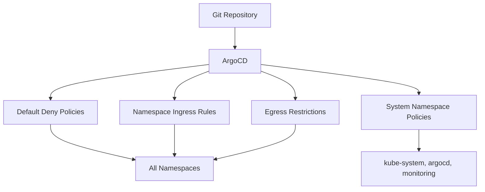

# How to Bootstrap Network Policies with ArgoCD

Author: [nawazdhandala](https://github.com/nawazdhandala)

Tags: ArgoCD, GitOps, Kubernetes, Network Policies, Security

Description: Learn how to bootstrap Kubernetes NetworkPolicies using ArgoCD to enforce zero-trust networking from cluster creation with GitOps-driven policy management.

---

A fresh Kubernetes cluster allows all pod-to-pod communication by default. Any pod can talk to any other pod across any namespace. That is fine for development, but in production it is a security risk. One compromised pod can reach your database, your secrets store, and your internal APIs without restriction.

Network policies fix this by defining which pods can communicate with each other. Bootstrapping these policies through ArgoCD ensures your cluster starts secure and stays secure, with every policy change tracked in Git and applied consistently across all environments.

## Why Bootstrap Network Policies with ArgoCD

Applying network policies manually or through scripts creates drift. Someone adds a temporary rule, forgets to remove it, and now your "zero-trust" network has a hole. ArgoCD catches this immediately.

Benefits of GitOps-managed network policies:

- **Audit trail** - every policy change is a Git commit with a timestamp and author
- **Consistency** - dev, staging, and production share the same baseline policies
- **Self-healing** - manual changes get reverted automatically
- **Ordering** - policies deploy at the right time during cluster bootstrap
- **Review process** - policy changes go through pull requests



## Prerequisites

Network policies require a CNI plugin that supports them. Not all do. Verify your CNI before expecting policies to work.

| CNI Plugin | NetworkPolicy Support |
|-----------|----------------------|
| Calico | Full |
| Cilium | Full (plus extended) |
| Weave Net | Full |
| Flannel | None |
| AWS VPC CNI | With Calico addon |
| Azure CNI | With Network Policy engine |

If you are on EKS with the default VPC CNI, you need to install Calico alongside it for network policy enforcement.

## Default Deny All Policy

The foundation of zero-trust networking is a default deny policy. This blocks all ingress and egress traffic unless explicitly allowed.

```yaml
# bootstrap/network-policies/default-deny.yaml
apiVersion: networking.k8s.io/v1
kind: NetworkPolicy
metadata:
  name: default-deny-all
  annotations:
    argocd.argoproj.io/sync-wave: "-3"
spec:
  podSelector: {}
  policyTypes:
    - Ingress
    - Egress
```

This policy applies to all pods in the namespace where it is created. You want this in every application namespace, but not in system namespaces where it would break cluster operations.

## Allowing DNS Resolution

The default deny policy blocks DNS, which breaks nearly everything. Add a policy to allow DNS.

```yaml
# bootstrap/network-policies/allow-dns.yaml
apiVersion: networking.k8s.io/v1
kind: NetworkPolicy
metadata:
  name: allow-dns
  annotations:
    argocd.argoproj.io/sync-wave: "-3"
spec:
  podSelector: {}
  policyTypes:
    - Egress
  egress:
    - to:
        - namespaceSelector:
            matchLabels:
              kubernetes.io/metadata.name: kube-system
      ports:
        - protocol: UDP
          port: 53
        - protocol: TCP
          port: 53
```

## Protecting System Namespaces

System namespaces like kube-system, argocd, and monitoring need their own policies that allow internal communication while restricting external access.

```yaml
# bootstrap/network-policies/argocd-namespace.yaml
apiVersion: networking.k8s.io/v1
kind: NetworkPolicy
metadata:
  name: argocd-allow-internal
  namespace: argocd
  annotations:
    argocd.argoproj.io/sync-wave: "-3"
spec:
  podSelector: {}
  policyTypes:
    - Ingress
    - Egress
  ingress:
    # Allow traffic from within argocd namespace
    - from:
        - namespaceSelector:
            matchLabels:
              kubernetes.io/metadata.name: argocd
    # Allow ingress controller to reach the API server
    - from:
        - namespaceSelector:
            matchLabels:
              kubernetes.io/metadata.name: ingress-nginx
      ports:
        - protocol: TCP
          port: 8080
        - protocol: TCP
          port: 8083
  egress:
    # Allow all egress - ArgoCD needs to reach Git repos and clusters
    - {}
```

```yaml
# bootstrap/network-policies/monitoring-namespace.yaml
apiVersion: networking.k8s.io/v1
kind: NetworkPolicy
metadata:
  name: monitoring-allow-scrape
  namespace: monitoring
  annotations:
    argocd.argoproj.io/sync-wave: "-3"
spec:
  podSelector: {}
  policyTypes:
    - Ingress
    - Egress
  ingress:
    # Allow Prometheus to scrape from any namespace
    - from:
        - namespaceSelector: {}
      ports:
        - protocol: TCP
          port: 9090
        - protocol: TCP
          port: 3000
  egress:
    # Prometheus needs to reach all namespaces for scraping
    - {}
```

## Creating the ArgoCD Application

Structure your network policies in a directory and create an ArgoCD Application to manage them.

```yaml
# bootstrap/network-policies/application.yaml
apiVersion: argoproj.io/v1alpha1
kind: Application
metadata:
  name: network-policies
  namespace: argocd
  annotations:
    argocd.argoproj.io/sync-wave: "-3"
spec:
  project: infrastructure
  source:
    repoURL: https://github.com/myorg/cluster-config.git
    path: bootstrap/network-policies/policies
    targetRevision: main
    directory:
      recurse: true
  destination:
    server: https://kubernetes.default.svc
  syncPolicy:
    automated:
      prune: true
      selfHeal: true
    syncOptions:
      - ServerSideApply=true
```

## Using Kustomize for Per-Namespace Policies

Since the default deny policy needs to exist in every application namespace, use Kustomize to generate it across namespaces.

```yaml
# network-policies/base/kustomization.yaml
apiVersion: kustomize.config.k8s.io/v1beta1
kind: Kustomization
resources:
  - default-deny.yaml
  - allow-dns.yaml
```

```yaml
# network-policies/overlays/team-a/kustomization.yaml
apiVersion: kustomize.config.k8s.io/v1beta1
kind: Kustomization
namespace: team-a
resources:
  - ../../base
  - allow-ingress.yaml
  - allow-database.yaml
```

Each team's overlay inherits the default deny and DNS allowance, then adds team-specific rules for their services.

## ApplicationSet for Multi-Namespace Deployment

For dynamic namespace creation, use an ApplicationSet to generate network policy applications for each namespace.

```yaml
apiVersion: argoproj.io/v1alpha1
kind: ApplicationSet
metadata:
  name: namespace-network-policies
  namespace: argocd
spec:
  generators:
    - list:
        elements:
          - namespace: team-a
            team: alpha
          - namespace: team-b
            team: beta
          - namespace: team-c
            team: gamma
  template:
    metadata:
      name: "netpol-{{namespace}}"
    spec:
      project: infrastructure
      source:
        repoURL: https://github.com/myorg/cluster-config.git
        path: "network-policies/overlays/{{namespace}}"
        targetRevision: main
      destination:
        server: https://kubernetes.default.svc
        namespace: "{{namespace}}"
      syncPolicy:
        automated:
          prune: true
          selfHeal: true
```

## Allowing Specific Application Traffic

After the default deny is in place, each application needs explicit allow rules. Here is an example for a typical web application.

```yaml
# Allow the web frontend to receive traffic from the ingress controller
apiVersion: networking.k8s.io/v1
kind: NetworkPolicy
metadata:
  name: allow-ingress-to-frontend
  namespace: team-a
spec:
  podSelector:
    matchLabels:
      app: frontend
  policyTypes:
    - Ingress
  ingress:
    - from:
        - namespaceSelector:
            matchLabels:
              kubernetes.io/metadata.name: ingress-nginx
      ports:
        - protocol: TCP
          port: 8080
---
# Allow the frontend to reach the API
apiVersion: networking.k8s.io/v1
kind: NetworkPolicy
metadata:
  name: allow-frontend-to-api
  namespace: team-a
spec:
  podSelector:
    matchLabels:
      app: api
  policyTypes:
    - Ingress
  ingress:
    - from:
        - podSelector:
            matchLabels:
              app: frontend
      ports:
        - protocol: TCP
          port: 3000
```

## Testing Network Policies

After ArgoCD deploys your policies, verify they work. A quick test using a debug pod:

```bash
# This should fail (blocked by default deny)
kubectl run test-pod --rm -it --image=busybox \
  --namespace=team-a -- wget -qO- http://api.team-b.svc:3000 --timeout=5

# This should succeed (allowed by explicit rule)
kubectl run test-pod --rm -it --image=busybox \
  --namespace=team-a --labels="app=frontend" \
  -- wget -qO- http://api.team-a.svc:3000 --timeout=5
```

## Sync Wave Ordering for Network Policies

Network policies should deploy early in the bootstrap process, but after the CNI plugin and namespaces are created.

| Wave | Component |
|------|-----------|
| -5 | CRDs and CNI plugin |
| -4 | Namespaces, StorageClasses |
| -3 | Network policies |
| -2 | Core infrastructure |
| -1 | Ingress controllers |
| 0+ | Application workloads |

## Monitoring Policy Enforcement

If you are using Calico or Cilium, enable flow logging to see which connections are being allowed or denied. This helps debug issues when a new policy accidentally blocks legitimate traffic.

Bootstrapping network policies with ArgoCD transforms your cluster security from "trust everything" to "trust nothing" from the moment the cluster comes online. Every policy change goes through code review, every exception is documented, and drift is automatically corrected. This is how you build clusters that pass security audits without scrambling at the last minute.
