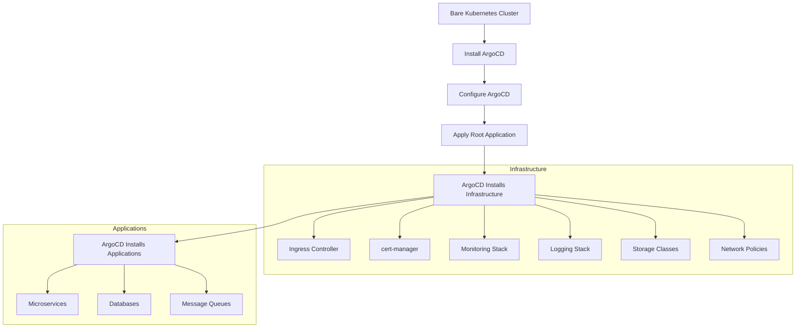

# How to Bootstrap a New Kubernetes Cluster with ArgoCD

Author: [nawazdhandala](https://github.com/nawazdhandala)

Tags: ArgoCD, GitOps, Kubernetes, Bootstrapping, Cluster Management

Description: Learn how to bootstrap a new Kubernetes cluster from scratch using ArgoCD, including installing ArgoCD itself, configuring essential components, and establishing a GitOps workflow.

---

Bootstrapping a new Kubernetes cluster means taking a bare cluster and installing everything it needs to be production-ready: networking, monitoring, logging, ingress, certificate management, and your applications. Doing this manually is tedious and error-prone. With ArgoCD, you can define your entire cluster setup in Git and have it applied automatically. This guide walks through the complete bootstrapping process.

## The Bootstrapping Problem

A new Kubernetes cluster comes with almost nothing useful. You need to install dozens of components in the right order before it is ready for workloads. The challenge is that ArgoCD itself needs to be installed first, and then it manages everything else.



## Step 1: Install ArgoCD on the New Cluster

The first step is always manual - you need ArgoCD before ArgoCD can manage things:

```bash
# Create the argocd namespace
kubectl create namespace argocd

# Install ArgoCD (use a specific version for reproducibility)
kubectl apply -n argocd -f https://raw.githubusercontent.com/argoproj/argo-cd/v2.13.3/manifests/install.yaml

# Wait for all components to be ready
kubectl wait --for=condition=ready pod \
  -l app.kubernetes.io/part-of=argocd \
  -n argocd --timeout=300s

# Get the initial admin password
ARGOCD_PASSWORD=$(kubectl -n argocd get secret argocd-initial-admin-secret \
  -o jsonpath="{.data.password}" | base64 -d)
echo "ArgoCD admin password: $ARGOCD_PASSWORD"
```

For a more reproducible installation, use a bootstrap script:

```bash
#!/bin/bash
# bootstrap-argocd.sh - Install ArgoCD on a new cluster

set -euo pipefail

ARGOCD_VERSION="v2.13.3"
NAMESPACE="argocd"

echo "=== Bootstrapping ArgoCD ${ARGOCD_VERSION} ==="

# Check cluster connectivity
echo "Checking cluster access..."
kubectl cluster-info || { echo "Cannot reach cluster"; exit 1; }

# Create namespace
echo "Creating namespace..."
kubectl create namespace $NAMESPACE --dry-run=client -o yaml | kubectl apply -f -

# Install ArgoCD
echo "Installing ArgoCD..."
kubectl apply -n $NAMESPACE \
  -f "https://raw.githubusercontent.com/argoproj/argo-cd/${ARGOCD_VERSION}/manifests/install.yaml"

# Wait for pods
echo "Waiting for ArgoCD pods..."
kubectl wait --for=condition=ready pod \
  -l app.kubernetes.io/part-of=argocd \
  -n $NAMESPACE --timeout=300s

echo "ArgoCD installed successfully"
echo "Admin password: $(kubectl -n $NAMESPACE get secret argocd-initial-admin-secret -o jsonpath='{.data.password}' | base64 -d)"
```

## Step 2: Configure ArgoCD for Bootstrapping

Apply initial configuration before ArgoCD starts managing the cluster:

```yaml
# argocd-initial-config.yaml
apiVersion: v1
kind: ConfigMap
metadata:
  name: argocd-cm
  namespace: argocd
data:
  url: "https://argocd.example.com"
  # Allow ArgoCD to manage itself
  application.instanceLabelKey: argocd.argoproj.io/instance
---
apiVersion: v1
kind: ConfigMap
metadata:
  name: argocd-cmd-params-cm
  namespace: argocd
data:
  # Run in insecure mode initially (TLS will be handled by ingress later)
  server.insecure: "true"
```

```bash
kubectl apply -f argocd-initial-config.yaml
kubectl rollout restart deployment argocd-server -n argocd
```

## Step 3: Structure the Bootstrap Repository

Create a Git repository that defines the entire cluster state:

```
cluster-config/
  bootstrap/
    root-app.yaml              # The root application (app-of-apps)
  infrastructure/
    argocd/                    # ArgoCD self-management
      application.yaml
      values.yaml
    ingress-nginx/
      application.yaml
      values.yaml
    cert-manager/
      application.yaml
      values.yaml
    monitoring/
      application.yaml
      values.yaml
    logging/
      application.yaml
      values.yaml
  applications/
    app1/
      application.yaml
    app2/
      application.yaml
  projects/
    infrastructure.yaml
    applications.yaml
```

## Step 4: Create the Root Application

The root application is the single entry point that bootstraps everything:

```yaml
# bootstrap/root-app.yaml
apiVersion: argoproj.io/v1alpha1
kind: Application
metadata:
  name: cluster-bootstrap
  namespace: argocd
  finalizers:
    - resources-finalizer.argocd.argoproj.io
spec:
  project: default
  source:
    repoURL: https://github.com/your-org/cluster-config.git
    path: infrastructure
    targetRevision: HEAD
    directory:
      recurse: true
      include: 'application.yaml'
  destination:
    server: https://kubernetes.default.svc
    namespace: argocd
  syncPolicy:
    automated:
      prune: true
      selfHeal: true
    syncOptions:
      - CreateNamespace=true
```

## Step 5: Define Infrastructure Applications

Each infrastructure component gets its own Application definition with sync waves to control ordering:

```yaml
# infrastructure/ingress-nginx/application.yaml
apiVersion: argoproj.io/v1alpha1
kind: Application
metadata:
  name: ingress-nginx
  namespace: argocd
  annotations:
    argocd.argoproj.io/sync-wave: "1"  # Install early
  finalizers:
    - resources-finalizer.argocd.argoproj.io
spec:
  project: default
  source:
    repoURL: https://kubernetes.github.io/ingress-nginx
    chart: ingress-nginx
    targetRevision: 4.9.1
    helm:
      values: |
        controller:
          replicaCount: 2
          service:
            type: LoadBalancer
          metrics:
            enabled: true
  destination:
    server: https://kubernetes.default.svc
    namespace: ingress-nginx
  syncPolicy:
    automated:
      prune: true
      selfHeal: true
    syncOptions:
      - CreateNamespace=true
```

```yaml
# infrastructure/cert-manager/application.yaml
apiVersion: argoproj.io/v1alpha1
kind: Application
metadata:
  name: cert-manager
  namespace: argocd
  annotations:
    argocd.argoproj.io/sync-wave: "2"  # After ingress
  finalizers:
    - resources-finalizer.argocd.argoproj.io
spec:
  project: default
  source:
    repoURL: https://charts.jetstack.io
    chart: cert-manager
    targetRevision: v1.14.4
    helm:
      values: |
        installCRDs: true
        prometheus:
          enabled: true
  destination:
    server: https://kubernetes.default.svc
    namespace: cert-manager
  syncPolicy:
    automated:
      prune: true
      selfHeal: true
    syncOptions:
      - CreateNamespace=true
```

## Step 6: Apply the Bootstrap

```bash
# Add the Git repository to ArgoCD
argocd repo add https://github.com/your-org/cluster-config.git \
  --username your-username \
  --password your-token

# Apply the root application
kubectl apply -f bootstrap/root-app.yaml

# Watch the bootstrap progress
watch kubectl get applications -n argocd
```

ArgoCD will now:
1. Read the root application
2. Discover all Application YAML files in the infrastructure directory
3. Create each application
4. Sync them in order based on sync waves

## Step 7: ArgoCD Self-Management

Make ArgoCD manage its own installation so future upgrades are GitOps-managed:

```yaml
# infrastructure/argocd/application.yaml
apiVersion: argoproj.io/v1alpha1
kind: Application
metadata:
  name: argocd
  namespace: argocd
  annotations:
    argocd.argoproj.io/sync-wave: "0"  # First priority
  finalizers:
    - resources-finalizer.argocd.argoproj.io
spec:
  project: default
  source:
    repoURL: https://argoproj.github.io/argo-helm
    chart: argo-cd
    targetRevision: 7.3.4
    helm:
      values: |
        server:
          ingress:
            enabled: true
            hostname: argocd.example.com
          extraArgs:
            - --insecure
        configs:
          cm:
            url: https://argocd.example.com
  destination:
    server: https://kubernetes.default.svc
    namespace: argocd
  syncPolicy:
    automated:
      prune: true
      selfHeal: true
```

## The Complete Bootstrap Flow

```bash
#!/bin/bash
# full-bootstrap.sh - Complete cluster bootstrap

set -euo pipefail

ARGOCD_VERSION="v2.13.3"
REPO_URL="https://github.com/your-org/cluster-config.git"
REPO_USERNAME="your-username"
REPO_TOKEN="your-token"

echo "=== Full Cluster Bootstrap ==="

# Step 1: Install ArgoCD
echo -e "\n--- Step 1: Installing ArgoCD ---"
kubectl create namespace argocd --dry-run=client -o yaml | kubectl apply -f -
kubectl apply -n argocd -f \
  "https://raw.githubusercontent.com/argoproj/argo-cd/${ARGOCD_VERSION}/manifests/install.yaml"
kubectl wait --for=condition=ready pod -l app.kubernetes.io/part-of=argocd \
  -n argocd --timeout=300s

# Step 2: Login
echo -e "\n--- Step 2: Configuring CLI ---"
PASS=$(kubectl -n argocd get secret argocd-initial-admin-secret -o jsonpath='{.data.password}' | base64 -d)
kubectl port-forward svc/argocd-server -n argocd 8080:443 &
sleep 3
argocd login localhost:8080 --insecure --username admin --password "$PASS"

# Step 3: Add repository
echo -e "\n--- Step 3: Adding repository ---"
argocd repo add "$REPO_URL" --username "$REPO_USERNAME" --password "$REPO_TOKEN"

# Step 4: Apply root application
echo -e "\n--- Step 4: Applying root application ---"
kubectl apply -f bootstrap/root-app.yaml

# Step 5: Monitor
echo -e "\n--- Step 5: Monitoring bootstrap ---"
echo "Bootstrap initiated. Monitor with:"
echo "  watch kubectl get applications -n argocd"
echo "  argocd app list"
```

## Summary

Bootstrapping a Kubernetes cluster with ArgoCD follows a simple pattern: install ArgoCD manually, then let ArgoCD manage everything else from Git. The key is structuring your repository with sync waves so components install in the right order (ingress before certificates, monitoring before applications). Use the app-of-apps pattern with a single root application as the entry point. Once bootstrapping is complete, ArgoCD manages itself along with all cluster infrastructure, making your cluster fully reproducible from Git. For monitoring the health of bootstrapped clusters, integrate with [OneUptime](https://oneuptime.com) to track component availability across all your environments.
