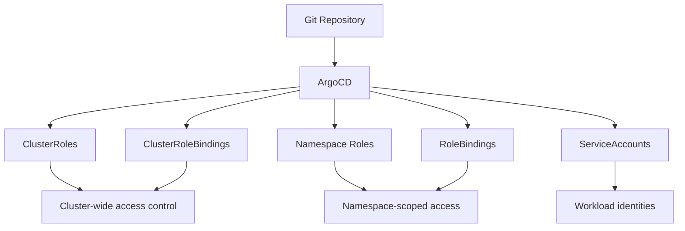

# How to Bootstrap RBAC Configurations with ArgoCD

Author: [nawazdhandala](https://github.com/nawazdhandala)

Tags: ArgoCD, GitOps, Kubernetes, RBAC, Security

Description: Learn how to bootstrap Kubernetes RBAC configurations using ArgoCD to enforce least-privilege access controls from cluster creation with GitOps-driven role management.

---

Kubernetes RBAC (Role-Based Access Control) determines who can do what in your cluster. Without proper RBAC from the start, teams end up with cluster-admin access because "it was easier." Then someone accidentally deletes a production namespace and suddenly RBAC becomes a priority.

Bootstrapping RBAC through ArgoCD ensures that access controls exist before any applications deploy. Every role, every binding, and every service account is tracked in Git. Changes go through pull requests. And if someone manually grants themselves extra permissions, ArgoCD reverts it.

## Why Manage RBAC with ArgoCD

Manual RBAC management does not scale. When you have 5 teams, 3 environments, and multiple clusters, the number of Roles and RoleBindings grows fast. Managing them through kubectl commands or shell scripts creates:

- **Inconsistency** across clusters
- **No audit trail** for who changed what
- **Drift** from the intended state
- **Difficulty onboarding** new teams or clusters

ArgoCD fixes all of these by treating RBAC as code.



## Organizing RBAC in Git

A clean directory structure makes RBAC manageable as it grows.

```
bootstrap/rbac/
  cluster-roles/
    developer.yaml
    operator.yaml
    viewer.yaml
    ci-deployer.yaml
  cluster-role-bindings/
    platform-team.yaml
    sre-team.yaml
  namespaced/
    team-a/
      roles.yaml
      role-bindings.yaml
      service-accounts.yaml
    team-b/
      roles.yaml
      role-bindings.yaml
      service-accounts.yaml
  application.yaml
```

## Defining ClusterRoles

Start with a set of ClusterRoles that cover common access patterns. Avoid giving anyone cluster-admin unless absolutely necessary.

```yaml
# bootstrap/rbac/cluster-roles/developer.yaml
apiVersion: rbac.authorization.k8s.io/v1
kind: ClusterRole
metadata:
  name: developer
  annotations:
    argocd.argoproj.io/sync-wave: "-3"
  labels:
    rbac.myorg.io/type: custom
rules:
  # Read access to most resources
  - apiGroups: [""]
    resources: ["pods", "services", "configmaps", "endpoints", "events"]
    verbs: ["get", "list", "watch"]
  - apiGroups: ["apps"]
    resources: ["deployments", "replicasets", "statefulsets", "daemonsets"]
    verbs: ["get", "list", "watch"]
  - apiGroups: ["batch"]
    resources: ["jobs", "cronjobs"]
    verbs: ["get", "list", "watch"]
  # Exec into pods for debugging
  - apiGroups: [""]
    resources: ["pods/exec", "pods/log", "pods/portforward"]
    verbs: ["get", "create"]
  # No access to secrets by default
```

```yaml
# bootstrap/rbac/cluster-roles/operator.yaml
apiVersion: rbac.authorization.k8s.io/v1
kind: ClusterRole
metadata:
  name: operator
  annotations:
    argocd.argoproj.io/sync-wave: "-3"
  labels:
    rbac.myorg.io/type: custom
rules:
  # Full access to workload resources
  - apiGroups: [""]
    resources: ["pods", "services", "configmaps", "persistentvolumeclaims"]
    verbs: ["*"]
  - apiGroups: ["apps"]
    resources: ["deployments", "replicasets", "statefulsets", "daemonsets"]
    verbs: ["*"]
  - apiGroups: ["batch"]
    resources: ["jobs", "cronjobs"]
    verbs: ["*"]
  - apiGroups: ["networking.k8s.io"]
    resources: ["ingresses", "networkpolicies"]
    verbs: ["get", "list", "watch"]
  # Read-only access to secrets
  - apiGroups: [""]
    resources: ["secrets"]
    verbs: ["get", "list", "watch"]
  # Scale resources
  - apiGroups: ["apps"]
    resources: ["deployments/scale", "statefulsets/scale"]
    verbs: ["get", "update", "patch"]
```

```yaml
# bootstrap/rbac/cluster-roles/ci-deployer.yaml
apiVersion: rbac.authorization.k8s.io/v1
kind: ClusterRole
metadata:
  name: ci-deployer
  annotations:
    argocd.argoproj.io/sync-wave: "-3"
  labels:
    rbac.myorg.io/type: custom
rules:
  # Minimal permissions for CI/CD service accounts
  - apiGroups: ["argoproj.io"]
    resources: ["applications"]
    verbs: ["get", "list", "sync"]
  - apiGroups: [""]
    resources: ["configmaps"]
    verbs: ["get", "update"]
    resourceNames: ["image-tags"]
```

## Creating ClusterRoleBindings

Bind your ClusterRoles to groups from your identity provider. This way, team membership in Okta, Azure AD, or Google Workspace automatically determines Kubernetes access.

```yaml
# bootstrap/rbac/cluster-role-bindings/platform-team.yaml
apiVersion: rbac.authorization.k8s.io/v1
kind: ClusterRoleBinding
metadata:
  name: platform-team-admin
  annotations:
    argocd.argoproj.io/sync-wave: "-3"
roleRef:
  apiGroup: rbac.authorization.k8s.io
  kind: ClusterRole
  name: cluster-admin
subjects:
  - kind: Group
    name: platform-engineering
    apiGroup: rbac.authorization.k8s.io
---
apiVersion: rbac.authorization.k8s.io/v1
kind: ClusterRoleBinding
metadata:
  name: sre-team-operator
  annotations:
    argocd.argoproj.io/sync-wave: "-3"
roleRef:
  apiGroup: rbac.authorization.k8s.io
  kind: ClusterRole
  name: operator
subjects:
  - kind: Group
    name: sre-team
    apiGroup: rbac.authorization.k8s.io
```

## Namespace-Scoped RBAC

Teams should only have write access to their own namespaces. Use Roles (not ClusterRoles) for namespace-specific permissions.

```yaml
# bootstrap/rbac/namespaced/team-a/roles.yaml
apiVersion: rbac.authorization.k8s.io/v1
kind: Role
metadata:
  name: team-a-developer
  namespace: team-a
  annotations:
    argocd.argoproj.io/sync-wave: "-2"
rules:
  - apiGroups: ["", "apps", "batch"]
    resources: ["*"]
    verbs: ["get", "list", "watch"]
  - apiGroups: [""]
    resources: ["pods/exec", "pods/log", "pods/portforward"]
    verbs: ["get", "create"]
---
apiVersion: rbac.authorization.k8s.io/v1
kind: Role
metadata:
  name: team-a-operator
  namespace: team-a
  annotations:
    argocd.argoproj.io/sync-wave: "-2"
rules:
  - apiGroups: ["", "apps", "batch", "autoscaling"]
    resources: ["*"]
    verbs: ["*"]
  - apiGroups: ["networking.k8s.io"]
    resources: ["ingresses"]
    verbs: ["*"]
```

```yaml
# bootstrap/rbac/namespaced/team-a/role-bindings.yaml
apiVersion: rbac.authorization.k8s.io/v1
kind: RoleBinding
metadata:
  name: team-a-developers
  namespace: team-a
  annotations:
    argocd.argoproj.io/sync-wave: "-2"
roleRef:
  apiGroup: rbac.authorization.k8s.io
  kind: Role
  name: team-a-developer
subjects:
  - kind: Group
    name: team-a-devs
    apiGroup: rbac.authorization.k8s.io
---
apiVersion: rbac.authorization.k8s.io/v1
kind: RoleBinding
metadata:
  name: team-a-operators
  namespace: team-a
  annotations:
    argocd.argoproj.io/sync-wave: "-2"
roleRef:
  apiGroup: rbac.authorization.k8s.io
  kind: Role
  name: team-a-operator
subjects:
  - kind: Group
    name: team-a-ops
    apiGroup: rbac.authorization.k8s.io
```

## Service Accounts for Workloads

Create dedicated service accounts with specific permissions for your applications. Never use the default service account.

```yaml
# bootstrap/rbac/namespaced/team-a/service-accounts.yaml
apiVersion: v1
kind: ServiceAccount
metadata:
  name: team-a-app
  namespace: team-a
  annotations:
    argocd.argoproj.io/sync-wave: "-2"
    # For EKS IRSA
    eks.amazonaws.com/role-arn: arn:aws:iam::123456789012:role/team-a-app
---
apiVersion: rbac.authorization.k8s.io/v1
kind: Role
metadata:
  name: team-a-app-role
  namespace: team-a
rules:
  - apiGroups: [""]
    resources: ["configmaps"]
    verbs: ["get", "list", "watch"]
  - apiGroups: [""]
    resources: ["secrets"]
    resourceNames: ["team-a-db-credentials"]
    verbs: ["get"]
---
apiVersion: rbac.authorization.k8s.io/v1
kind: RoleBinding
metadata:
  name: team-a-app-binding
  namespace: team-a
roleRef:
  apiGroup: rbac.authorization.k8s.io
  kind: Role
  name: team-a-app-role
subjects:
  - kind: ServiceAccount
    name: team-a-app
    namespace: team-a
```

## The ArgoCD Application

```yaml
# bootstrap/rbac/application.yaml
apiVersion: argoproj.io/v1alpha1
kind: Application
metadata:
  name: rbac-configuration
  namespace: argocd
  annotations:
    argocd.argoproj.io/sync-wave: "-3"
spec:
  project: infrastructure
  source:
    repoURL: https://github.com/myorg/cluster-config.git
    path: bootstrap/rbac
    targetRevision: main
    directory:
      recurse: true
      exclude: "application.yaml"
  destination:
    server: https://kubernetes.default.svc
  syncPolicy:
    automated:
      prune: true
      selfHeal: true
    syncOptions:
      - ServerSideApply=true
```

## Using ApplicationSets for Dynamic Team RBAC

When new teams onboard frequently, use an ApplicationSet with a Git file generator to create RBAC from configuration files.

```yaml
apiVersion: argoproj.io/v1alpha1
kind: ApplicationSet
metadata:
  name: team-rbac
  namespace: argocd
spec:
  generators:
    - git:
        repoURL: https://github.com/myorg/cluster-config.git
        revision: main
        files:
          - path: "teams/*/config.json"
  template:
    metadata:
      name: "rbac-{{team.name}}"
    spec:
      project: infrastructure
      source:
        repoURL: https://github.com/myorg/cluster-config.git
        path: "bootstrap/rbac/namespaced/{{team.name}}"
        targetRevision: main
      destination:
        server: https://kubernetes.default.svc
        namespace: "{{team.namespace}}"
      syncPolicy:
        automated:
          prune: true
          selfHeal: true
```

## Preventing Privilege Escalation

Kubernetes prevents users from creating roles with more permissions than they have. But ArgoCD runs with broad permissions, so it can create any role. Protect against this by:

1. **Restricting ArgoCD project resources** - limit which RBAC resources the application can manage
2. **Using OPA Gatekeeper or Kyverno** to enforce policies on role definitions
3. **Reviewing RBAC changes** carefully in pull requests

```yaml
# Kyverno policy to prevent granting cluster-admin
apiVersion: kyverno.io/v1
kind: ClusterPolicy
metadata:
  name: restrict-cluster-admin-binding
spec:
  rules:
    - name: block-cluster-admin-binding
      match:
        resources:
          kinds:
            - ClusterRoleBinding
      validate:
        message: "Binding to cluster-admin requires security team approval"
        pattern:
          roleRef:
            name: "!cluster-admin"
```

## Sync Wave Ordering

RBAC resources should deploy early, but after namespaces exist.

| Wave | Component |
|------|-----------|
| -5 | CRDs |
| -4 | Namespaces, StorageClasses |
| -3 | ClusterRoles, ClusterRoleBindings |
| -2 | Namespace Roles, RoleBindings, ServiceAccounts |
| -1 | Infrastructure components |
| 0+ | Application workloads |

Bootstrapping RBAC with ArgoCD means access control is not an afterthought. It is baked into your cluster from the first minute, enforced continuously, and changed only through reviewed, auditable Git commits. That is the kind of security posture that keeps your cluster safe and your compliance team happy.
