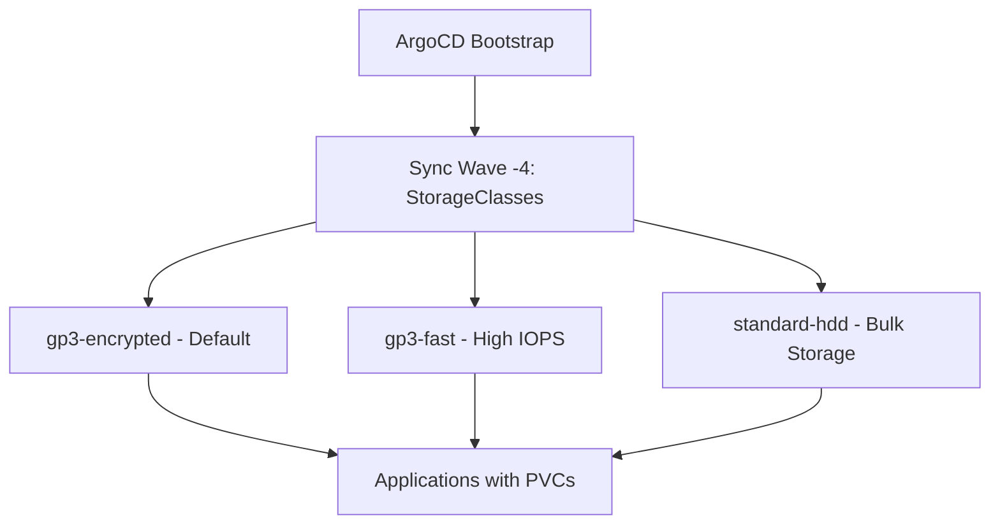

# How to Bootstrap Storage Classes with ArgoCD

Author: [nawazdhandala](https://github.com/nawazdhandala)

Tags: ArgoCD, GitOps, Kubernetes, Storage, Infrastructure

Description: Learn how to bootstrap Kubernetes StorageClasses with ArgoCD to ensure consistent storage provisioning across clusters using GitOps workflows and declarative configuration.

---

StorageClasses define how persistent volumes are provisioned in your cluster. Without them set up correctly from the start, your applications fail to schedule because their PersistentVolumeClaims have nothing to bind to. Bootstrapping StorageClasses through ArgoCD means every cluster you manage gets the same storage tiers, the same reclaim policies, and the same encryption settings - all tracked in Git.

This guide covers setting up StorageClasses as part of your ArgoCD cluster bootstrap process, including cloud-specific provisioners, default class configuration, and handling the quirks that come with storage resources.

## Why Manage StorageClasses with ArgoCD

Most managed Kubernetes services create a default StorageClass automatically. So why manage them through ArgoCD?

- **Consistency** - production and staging get identical storage configurations
- **Custom tiers** - you need fast SSD, standard HDD, and encrypted storage options
- **Compliance** - encryption-at-rest requirements need specific parameters
- **Reproducibility** - new clusters match existing ones without manual setup
- **Drift prevention** - someone changing the default StorageClass gets caught immediately



## Defining StorageClasses in Git

Create your StorageClass manifests in the bootstrap repository. Here is a set for AWS EKS using the EBS CSI driver.

```yaml
# bootstrap/storage-classes/gp3-encrypted.yaml
apiVersion: storage.k8s.io/v1
kind: StorageClass
metadata:
  name: gp3-encrypted
  annotations:
    # Set as the default StorageClass
    storageclass.kubernetes.io/is-default-class: "true"
    argocd.argoproj.io/sync-wave: "-4"
provisioner: ebs.csi.aws.com
parameters:
  type: gp3
  encrypted: "true"
  # Use AWS-managed key for encryption
  kmsKeyId: ""
  fsType: ext4
reclaimPolicy: Delete
allowVolumeExpansion: true
volumeBindingMode: WaitForFirstConsumer
```

```yaml
# bootstrap/storage-classes/gp3-fast.yaml
apiVersion: storage.k8s.io/v1
kind: StorageClass
metadata:
  name: gp3-fast
  annotations:
    argocd.argoproj.io/sync-wave: "-4"
provisioner: ebs.csi.aws.com
parameters:
  type: gp3
  encrypted: "true"
  iops: "16000"
  throughput: "1000"
  fsType: ext4
reclaimPolicy: Retain
allowVolumeExpansion: true
volumeBindingMode: WaitForFirstConsumer
```

```yaml
# bootstrap/storage-classes/standard-hdd.yaml
apiVersion: storage.k8s.io/v1
kind: StorageClass
metadata:
  name: standard-hdd
  annotations:
    argocd.argoproj.io/sync-wave: "-4"
provisioner: ebs.csi.aws.com
parameters:
  type: st1
  encrypted: "true"
  fsType: ext4
reclaimPolicy: Delete
allowVolumeExpansion: true
volumeBindingMode: WaitForFirstConsumer
```

The `volumeBindingMode: WaitForFirstConsumer` setting is critical in multi-AZ clusters. Without it, volumes get created in a random AZ and your pod might be scheduled in a different one, leading to scheduling failures.

## Creating the ArgoCD Application

Wrap these manifests in an ArgoCD Application that is part of your bootstrap process.

```yaml
# bootstrap/storage-classes/application.yaml
apiVersion: argoproj.io/v1alpha1
kind: Application
metadata:
  name: storage-classes
  namespace: argocd
  annotations:
    argocd.argoproj.io/sync-wave: "-4"
  finalizers:
    - resources-finalizer.argocd.argoproj.io
spec:
  project: infrastructure
  source:
    repoURL: https://github.com/myorg/cluster-config.git
    path: bootstrap/storage-classes
    targetRevision: main
    directory:
      recurse: false
      exclude: "application.yaml"
  destination:
    server: https://kubernetes.default.svc
  syncPolicy:
    automated:
      prune: false  # Never auto-delete StorageClasses
      selfHeal: true
    syncOptions:
      - ServerSideApply=true
```

Notice that `prune` is set to `false`. Deleting a StorageClass while PVCs reference it can cause data loss. It is safer to require manual cleanup of StorageClasses.

## Cloud-Specific StorageClass Examples

### GKE with pd-csi Driver

```yaml
apiVersion: storage.k8s.io/v1
kind: StorageClass
metadata:
  name: ssd-encrypted
  annotations:
    storageclass.kubernetes.io/is-default-class: "true"
    argocd.argoproj.io/sync-wave: "-4"
provisioner: pd.csi.storage.gke.io
parameters:
  type: pd-ssd
  disk-encryption-kms-key: projects/my-project/locations/us-central1/keyRings/my-ring/cryptoKeys/my-key
reclaimPolicy: Delete
allowVolumeExpansion: true
volumeBindingMode: WaitForFirstConsumer
```

### AKS with Azure Disk CSI Driver

```yaml
apiVersion: storage.k8s.io/v1
kind: StorageClass
metadata:
  name: managed-premium-encrypted
  annotations:
    storageclass.kubernetes.io/is-default-class: "true"
    argocd.argoproj.io/sync-wave: "-4"
provisioner: disk.csi.azure.com
parameters:
  skuName: Premium_LRS
  enableEncryptionAtHost: "true"
  fsType: ext4
reclaimPolicy: Delete
allowVolumeExpansion: true
volumeBindingMode: WaitForFirstConsumer
```

## Handling the Default StorageClass

Only one StorageClass should be marked as default. If your managed Kubernetes provider already creates one (like `gp2` on EKS), you have two options.

**Option 1: Remove the default annotation from the existing class**

Add the provider's StorageClass to your Git repo with the default annotation removed:

```yaml
# bootstrap/storage-classes/remove-gp2-default.yaml
apiVersion: storage.k8s.io/v1
kind: StorageClass
metadata:
  name: gp2
  annotations:
    storageclass.kubernetes.io/is-default-class: "false"
provisioner: kubernetes.io/aws-ebs
parameters:
  type: gp2
  fsType: ext4
reclaimPolicy: Delete
volumeBindingMode: WaitForFirstConsumer
```

**Option 2: Ignore the provider-created class and let ArgoCD manage only your custom ones**

Add it to ignoreDifferences in your ArgoCD project configuration and accept that two defaults might briefly coexist during bootstrapping.

## Using Kustomize for Multi-Cloud StorageClasses

If you manage clusters across different cloud providers, Kustomize overlays let you share the structure while varying the provisioner.

```yaml
# storage-classes/base/kustomization.yaml
apiVersion: kustomize.config.k8s.io/v1beta1
kind: Kustomization
resources: []
# Base is empty - overlays provide everything
```

```yaml
# storage-classes/overlays/aws/kustomization.yaml
apiVersion: kustomize.config.k8s.io/v1beta1
kind: Kustomization
resources:
  - gp3-encrypted.yaml
  - gp3-fast.yaml
  - standard-hdd.yaml
```

```yaml
# storage-classes/overlays/gcp/kustomization.yaml
apiVersion: kustomize.config.k8s.io/v1beta1
kind: Kustomization
resources:
  - ssd-encrypted.yaml
  - balanced.yaml
  - standard-hdd.yaml
```

Your ArgoCD Application then points to the appropriate overlay based on the target cluster.

## Sync Wave Ordering

StorageClasses should be created early in the bootstrap process - before any applications that need persistent storage. A typical ordering:

| Wave | Component |
|------|-----------|
| -5 | CRDs (cert-manager, external-secrets) |
| -4 | StorageClasses |
| -3 | Core infrastructure (cert-manager, CSI drivers) |
| -2 | Ingress controllers |
| -1 | Monitoring stack |
| 0 | Application workloads |

## Preventing Accidental Deletion

StorageClasses are cluster-scoped resources. Deleting them does not delete existing PVs, but new PVCs referencing the deleted class will fail. Protect them with:

1. **Disable pruning** on the ArgoCD Application
2. **Add resource annotations** to prevent deletion:

```yaml
metadata:
  annotations:
    argocd.argoproj.io/sync-options: Delete=false
```

3. **Use project restrictions** to limit who can modify storage resources:

```yaml
spec:
  clusterResourceWhitelist:
    - group: storage.k8s.io
      kind: StorageClass
```

## Validating StorageClass Health

ArgoCD does not have a built-in health check for StorageClasses since they are static resources. But you can verify they work by creating a test PVC as a PostSync hook.

```yaml
apiVersion: batch/v1
kind: Job
metadata:
  name: test-storage-class
  annotations:
    argocd.argoproj.io/hook: PostSync
    argocd.argoproj.io/hook-delete-policy: HookSucceeded
spec:
  template:
    spec:
      containers:
        - name: test
          image: busybox:1.36
          command: ["sh", "-c", "echo 'StorageClass validation passed'"]
      restartPolicy: Never
  backoffLimit: 1
```

Bootstrapping StorageClasses through ArgoCD ensures your cluster is ready for stateful workloads from the moment it comes online. Combined with the rest of your bootstrap pipeline, it eliminates the manual setup steps that make cluster provisioning slow and error-prone.
