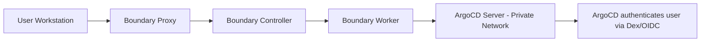
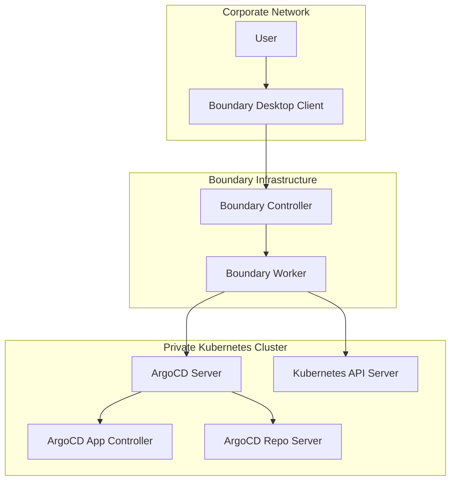

# How to Integrate ArgoCD with Boundary

Author: [nawazdhandala](https://github.com/nawazdhandala)

Tags: ArgoCD, GitOps, Kubernetes, Boundary, Zero Trust

Description: Learn how to integrate ArgoCD with HashiCorp Boundary for secure access management, including session brokering, credential injection, and identity-based authorization for GitOps workflows.

---

HashiCorp Boundary is a session-brokering tool that provides secure access to infrastructure without exposing networks or credentials directly to end users. While Boundary does not directly act as an OIDC provider for ArgoCD, it provides a valuable access layer for reaching ArgoCD instances in private networks and managing who can connect to ArgoCD at the network level. This guide covers how to use Boundary alongside ArgoCD for a defense-in-depth access architecture.

## How Boundary Fits with ArgoCD

Boundary operates at the network access layer - it controls who can reach ArgoCD, not who can authenticate to ArgoCD. Think of it as a secure tunnel:



This provides two layers of authentication:
1. **Boundary**: Identity-based access to reach ArgoCD (network layer)
2. **ArgoCD Dex/OIDC**: Application-level authentication and RBAC

## Architecture Overview

In a typical enterprise setup, ArgoCD runs in a private Kubernetes cluster that is not directly accessible from the internet. Boundary provides secure, identity-based access to that cluster:



## Step 1: Set Up Boundary Infrastructure

If you do not already have Boundary deployed, here is a quick Kubernetes deployment managed by ArgoCD itself:

```yaml
apiVersion: argoproj.io/v1alpha1
kind: Application
metadata:
  name: boundary
  namespace: argocd
spec:
  project: infrastructure
  source:
    repoURL: https://helm.releases.hashicorp.com
    chart: boundary
    targetRevision: 0.6.x
    helm:
      values: |
        server:
          replicas: 2
          resources:
            requests:
              cpu: 250m
              memory: 256Mi

          config: |
            controller {
              name = "kubernetes-controller"
              database {
                url = "env://BOUNDARY_PG_URL"
              }
            }

            worker {
              name = "kubernetes-worker"
              controllers = ["boundary-controller:9201"]
            }

            listener "tcp" {
              address = "0.0.0.0:9200"
              purpose = "api"
              tls_disable = true
            }

            listener "tcp" {
              address = "0.0.0.0:9201"
              purpose = "cluster"
            }

            listener "tcp" {
              address = "0.0.0.0:9202"
              purpose = "proxy"
            }
  destination:
    server: https://kubernetes.default.svc
    namespace: boundary
  syncPolicy:
    automated:
      prune: true
      selfHeal: true
    syncOptions:
    - CreateNamespace=true
```

## Step 2: Create Boundary Resources for ArgoCD

Define the scope, host catalog, host set, and target for ArgoCD access:

```bash
# Create an organization scope
boundary scopes create \
  -scope-id global \
  -name "Engineering" \
  -description "Engineering organization"

# Create a project scope
boundary scopes create \
  -scope-id <org-scope-id> \
  -name "GitOps Platform" \
  -description "ArgoCD and related services"

# Create a static host catalog
boundary host-catalogs create static \
  -scope-id <project-scope-id> \
  -name "ArgoCD Hosts"

# Add ArgoCD server as a host
boundary hosts create static \
  -host-catalog-id <host-catalog-id> \
  -name "argocd-server" \
  -address "argocd-server.argocd.svc.cluster.local"

# Create a host set
boundary host-sets create static \
  -host-catalog-id <host-catalog-id> \
  -name "argocd-servers"

boundary host-sets add-hosts \
  -id <host-set-id> \
  -host <host-id>
```

## Step 3: Create Boundary Targets

Create targets for different ArgoCD access patterns:

```bash
# Target for ArgoCD Web UI (HTTPS)
boundary targets create tcp \
  -scope-id <project-scope-id> \
  -name "ArgoCD Web UI" \
  -description "Access to ArgoCD web interface" \
  -default-port 443 \
  -default-client-port 8443 \
  -session-max-seconds 28800 \
  -session-connection-limit -1

boundary targets add-host-sources \
  -id <web-target-id> \
  -host-source <host-set-id>

# Target for ArgoCD gRPC API (for CLI)
boundary targets create tcp \
  -scope-id <project-scope-id> \
  -name "ArgoCD gRPC API" \
  -description "Access to ArgoCD API for CLI" \
  -default-port 443 \
  -default-client-port 8444 \
  -session-max-seconds 3600

boundary targets add-host-sources \
  -id <grpc-target-id> \
  -host-source <host-set-id>
```

## Step 4: Configure Boundary Roles and Permissions

Define who can access the ArgoCD targets:

```bash
# Create a role for ArgoCD admins
boundary roles create \
  -scope-id <project-scope-id> \
  -name "ArgoCD Admin Access" \
  -description "Full access to ArgoCD targets"

# Grant permissions to connect to ArgoCD targets
boundary roles add-grants \
  -id <admin-role-id> \
  -grant 'ids=<web-target-id>,<grpc-target-id>;actions=authorize-session'

# Add principals (users or groups from your auth method)
boundary roles add-principals \
  -id <admin-role-id> \
  -principal <platform-team-group-id>

# Create a role for developers (web UI only)
boundary roles create \
  -scope-id <project-scope-id> \
  -name "ArgoCD Developer Access" \
  -description "Web UI access to ArgoCD"

boundary roles add-grants \
  -id <dev-role-id> \
  -grant 'ids=<web-target-id>;actions=authorize-session'

boundary roles add-principals \
  -id <dev-role-id> \
  -principal <developers-group-id>
```

## Step 5: Connect to ArgoCD Through Boundary

### Web UI Access

Users connect to ArgoCD through Boundary:

```bash
# Authenticate to Boundary
boundary authenticate password \
  -auth-method-id <auth-method-id> \
  -login-name alice

# Connect to ArgoCD Web UI
boundary connect \
  -target-id <web-target-id> \
  -listen-port 8443

# ArgoCD is now accessible at https://localhost:8443
# Open browser and navigate there
```

### CLI Access

```bash
# Connect to ArgoCD API through Boundary
boundary connect \
  -target-id <grpc-target-id> \
  -listen-port 8444 &

# Use ArgoCD CLI through the Boundary tunnel
argocd login localhost:8444 --sso --insecure
argocd app list
```

## Step 6: Credential Brokering (Optional)

Boundary can inject credentials for Kubernetes API access, which ArgoCD uses to manage clusters:

```bash
# Create a credential store connected to Vault
boundary credential-stores create vault \
  -scope-id <project-scope-id> \
  -vault-address "https://vault.example.com" \
  -vault-token "s.xxxxx" \
  -name "Vault Credential Store"

# Create a credential library for Kubernetes tokens
boundary credential-libraries create vault-generic \
  -credential-store-id <cred-store-id> \
  -vault-path "kubernetes/creds/argocd-admin" \
  -name "ArgoCD K8s Credentials" \
  -credential-type username_password

# Associate credentials with the target
boundary targets add-credential-sources \
  -id <grpc-target-id> \
  -brokered-credential-source <cred-library-id>
```

## Boundary Desktop Client

For a better user experience, teams can use the Boundary Desktop application:

1. Install Boundary Desktop from the HashiCorp website
2. Connect to your Boundary controller URL
3. Authenticate with your corporate credentials
4. Browse available targets and click "Connect" for ArgoCD
5. The desktop client opens a local tunnel automatically

This is much more user-friendly than the CLI for day-to-day ArgoCD access.

## Monitoring and Audit

Boundary provides comprehensive session audit logs:

```bash
# List recent sessions
boundary sessions list \
  -scope-id <project-scope-id> \
  -recursive

# Get details of a specific session
boundary sessions read -id <session-id>
```

Boundary session events can be forwarded to your SIEM for compliance. Combine with [OneUptime](https://oneuptime.com/blog/post/2026-02-09-argocd-monitoring-prometheus/view) monitoring for complete visibility into both Boundary tunnel health and ArgoCD application health.

## Defense-in-Depth Security Model

The Boundary + ArgoCD combination creates a strong defense-in-depth model:

| Layer | Control | Purpose |
|-------|---------|---------|
| Network | Boundary | Controls who can reach ArgoCD |
| Transport | TLS | Encrypts all communication |
| Application | ArgoCD Dex/OIDC | Authenticates user identity |
| Authorization | ArgoCD RBAC | Controls what user can do |
| Audit | Boundary + ArgoCD logs | Records all actions |

## Conclusion

HashiCorp Boundary adds a network access control layer to ArgoCD that is particularly valuable when ArgoCD runs in a private network. Rather than exposing ArgoCD to the internet with an Ingress, Boundary provides identity-based access brokering with full session logging. The two-layer authentication model - Boundary for network access, ArgoCD Dex for application authentication - creates a robust security posture. For organizations already using the HashiCorp stack (Vault, Consul, Boundary), this integration fits naturally into the existing infrastructure and provides consistent access patterns across all internal services.
