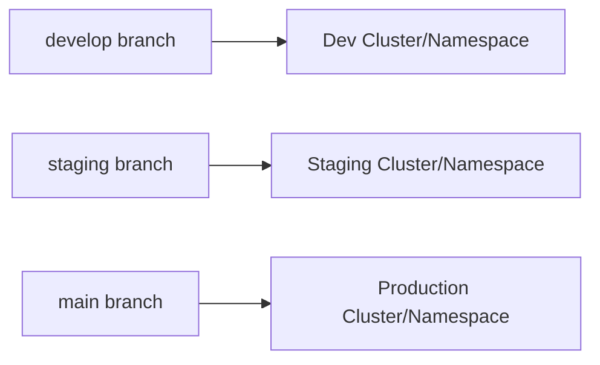

# How to Implement the Branch-per-Environment Pattern

Author: [nawazdhandala](https://github.com/nawazdhandala)

Tags: ArgoCD, GitOps, Kubernetes, Git Branching, Environment

Description: Learn how to implement the branch-per-environment pattern in ArgoCD where each Git branch represents a different deployment environment like dev, staging, and production.

---

The branch-per-environment pattern uses separate Git branches to represent different deployment environments. The `develop` branch drives dev deployments, `staging` branch drives staging, and `main` (or `production`) branch drives production. It is a pattern many teams find intuitive because it maps directly to familiar Git workflows. But it comes with trade-offs that you need to understand before adopting it at scale.

## How It Works

The core idea is simple. Instead of using different directories or overlays to separate environments, you use Git branches:



Each ArgoCD Application points to a different `targetRevision` (branch) from the same repository:

```yaml
# Dev application - tracks the develop branch
apiVersion: argoproj.io/v1alpha1
kind: Application
metadata:
  name: myapp-dev
  namespace: argocd
spec:
  project: development
  source:
    repoURL: https://github.com/org/myapp-config.git
    targetRevision: develop
    path: manifests/
  destination:
    server: https://kubernetes.default.svc
    namespace: dev
  syncPolicy:
    automated:
      selfHeal: true
      prune: true
```

```yaml
# Staging application - tracks the staging branch
apiVersion: argoproj.io/v1alpha1
kind: Application
metadata:
  name: myapp-staging
  namespace: argocd
spec:
  project: staging
  source:
    repoURL: https://github.com/org/myapp-config.git
    targetRevision: staging
    path: manifests/
  destination:
    server: https://kubernetes.default.svc
    namespace: staging
  syncPolicy:
    automated:
      selfHeal: true
      prune: true
```

```yaml
# Production application - tracks the main branch
apiVersion: argoproj.io/v1alpha1
kind: Application
metadata:
  name: myapp-production
  namespace: argocd
spec:
  project: production
  source:
    repoURL: https://github.com/org/myapp-config.git
    targetRevision: main
    path: manifests/
  destination:
    server: https://production-cluster.example.com
    namespace: production
  syncPolicy:
    automated:
      selfHeal: true
      prune: false
```

## Repository Structure

Since each branch represents a full environment, the structure within each branch is identical:

```
myapp-config/
├── manifests/
│   ├── deployment.yaml
│   ├── service.yaml
│   ├── configmap.yaml
│   ├── ingress.yaml
│   └── kustomization.yaml
├── helm-values/
│   └── values.yaml
└── README.md
```

The values differ between branches. For example, on the `develop` branch:

```yaml
# manifests/deployment.yaml (develop branch)
apiVersion: apps/v1
kind: Deployment
metadata:
  name: myapp
spec:
  replicas: 1
  selector:
    matchLabels:
      app: myapp
  template:
    metadata:
      labels:
        app: myapp
    spec:
      containers:
        - name: myapp
          image: org/myapp:dev-abc1234
          resources:
            requests:
              cpu: 100m
              memory: 128Mi
```

On the `main` branch, the same file has production values:

```yaml
# manifests/deployment.yaml (main branch)
apiVersion: apps/v1
kind: Deployment
metadata:
  name: myapp
spec:
  replicas: 3
  selector:
    matchLabels:
      app: myapp
  template:
    metadata:
      labels:
        app: myapp
    spec:
      containers:
        - name: myapp
          image: org/myapp:v1.2.3
          resources:
            requests:
              cpu: 500m
              memory: 512Mi
            limits:
              cpu: "1"
              memory: 1Gi
```

## Promotion Workflow

Promotion is handled by merging branches:

```bash
# Deploy to dev: commit directly to develop
git checkout develop
# Make changes to manifests
git add . && git commit -m "Update image to dev-abc1234"
git push origin develop

# Promote to staging: merge develop into staging
git checkout staging
git merge develop
# Resolve any conflicts, adjust env-specific values if needed
git push origin staging

# Promote to production: merge staging into main
git checkout main
git merge staging
# Review carefully, adjust production-specific values
git push origin main
```

## Using ApplicationSets

Automate the per-branch applications with a list generator:

```yaml
apiVersion: argoproj.io/v1alpha1
kind: ApplicationSet
metadata:
  name: myapp-per-environment
  namespace: argocd
spec:
  generators:
    - list:
        elements:
          - env: dev
            branch: develop
            cluster: https://kubernetes.default.svc
            namespace: dev
            project: development
          - env: staging
            branch: staging
            cluster: https://kubernetes.default.svc
            namespace: staging
            project: staging
          - env: production
            branch: main
            cluster: https://production-cluster.example.com
            namespace: production
            project: production
  template:
    metadata:
      name: 'myapp-{{env}}'
    spec:
      project: '{{project}}'
      source:
        repoURL: https://github.com/org/myapp-config.git
        targetRevision: '{{branch}}'
        path: manifests/
      destination:
        server: '{{cluster}}'
        namespace: '{{namespace}}'
      syncPolicy:
        automated:
          selfHeal: true
          prune: true
        syncOptions:
          - CreateNamespace=true
```

## Handling Environment-Specific Configuration

One challenge with branch-per-environment is managing values that differ between environments. There are several approaches:

### Approach 1: Different Values on Each Branch

The simplest approach. Each branch has its own version of the config files. When you merge, you resolve conflicts for environment-specific values.

### Approach 2: Kustomize with Branch-Specific Patches

Keep a common base and apply patches. On each branch, the kustomization file uses different patches:

```yaml
# kustomization.yaml (same structure on each branch, different patch values)
apiVersion: kustomize.config.k8s.io/v1beta1
kind: Kustomization
resources:
  - deployment.yaml
  - service.yaml
patches:
  - path: env-specific-patch.yaml
```

```yaml
# env-specific-patch.yaml (different on each branch)
apiVersion: apps/v1
kind: Deployment
metadata:
  name: myapp
spec:
  replicas: 3  # 1 on develop, 2 on staging, 3 on main
```

### Approach 3: Helm with Branch-Specific Values

```yaml
# values.yaml (different on each branch)
replicaCount: 3
image:
  tag: v1.2.3
resources:
  requests:
    cpu: 500m
    memory: 512Mi
ingress:
  host: myapp.production.example.com
```

The ArgoCD Application uses Helm:

```yaml
spec:
  source:
    repoURL: https://github.com/org/myapp-config.git
    targetRevision: main
    path: chart/
    helm:
      valueFiles:
        - values.yaml
```

## Branch Protection Rules

Since branches directly control deployments, protect them:

```yaml
# GitHub branch protection configuration (set via UI or API)
# For the main (production) branch:
# - Require pull request reviews before merging
# - Require status checks to pass before merging
# - Require branches to be up to date before merging
# - Restrict who can push to matching branches
# - Do not allow force pushes
# - Do not allow deletions
```

This is critical for production safety. No one should be able to push directly to the main branch.

## Advantages of This Pattern

1. **Familiar workflow** - Developers already understand branching
2. **Clear audit trail** - Git log on each branch shows the full deployment history
3. **Easy rollback** - Revert a merge to roll back an environment
4. **PR-based promotion** - Use pull requests for promotion reviews
5. **Simple ArgoCD config** - Each app just points to a different branch

## Disadvantages and Pitfalls

1. **Merge conflicts** - Environment-specific values cause conflicts when merging between branches
2. **Drift between branches** - Branches can diverge over time, making merges painful
3. **No single source of truth** - You cannot see all environments by looking at one branch
4. **Cherry-pick complexity** - Hotfixes need to be applied to multiple branches
5. **Harder to compare** - Comparing environments requires comparing branches

## Best Practices

To mitigate the drawbacks:

```bash
# Regularly sync branches to prevent drift
# Merge main back into staging, staging back into develop
git checkout develop
git merge main
git push origin develop

# Use merge commits (not squash) to preserve promotion history
git merge --no-ff staging

# Tag production releases for easy reference
git tag v1.2.3
git push origin v1.2.3
```

Consider using this pattern only for smaller teams or fewer environments. For larger organizations, the directory-per-environment or overlay-per-environment approaches are usually more manageable. See our guide on the [namespace-per-environment pattern](https://oneuptime.com/blog/post/2026-02-26-argocd-namespace-per-environment-pattern/view) for an alternative approach.

## CI/CD Integration

Automate the branch workflow with CI:

```yaml
# .github/workflows/promote-to-staging.yaml
name: Promote to Staging
on:
  workflow_dispatch:
    inputs:
      confirm:
        description: 'Type "yes" to confirm promotion'
        required: true

jobs:
  promote:
    runs-on: ubuntu-latest
    if: github.event.inputs.confirm == 'yes'
    steps:
      - uses: actions/checkout@v4
        with:
          ref: staging
          fetch-depth: 0
      - name: Merge develop into staging
        run: |
          git config user.name "github-actions"
          git config user.email "github-actions@github.com"
          git merge origin/develop --no-ff -m "Promote develop to staging"
          git push origin staging
```

The branch-per-environment pattern works well for teams that want a Git-native promotion workflow. Just be disciplined about keeping branches in sync and use branch protection rules to guard your production deployments.
