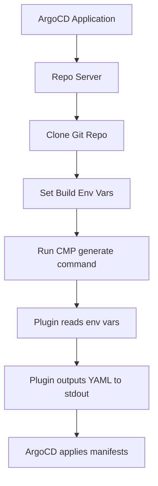

# How to Use Build Environment in Custom Plugins

Author: [nawazdhandala](https://github.com/nawazdhandala)

Tags: ArgoCD, GitOps, Kubernetes, Config Management Plugins, Build Environment

Description: Learn how to access and use ArgoCD build environment variables in custom Config Management Plugins for dynamic manifest generation with full application context.

---

Custom Config Management Plugins (CMPs) in ArgoCD let you use any tool for manifest generation - from simple shell scripts to complex Python generators. One of the key advantages of CMPs is that they have direct access to all ArgoCD build environment variables, giving your custom logic full context about the application being rendered.

This guide shows you how to build custom plugins that leverage build environment variables for dynamic, context-aware manifest generation.

## How Build Environment Variables Reach Your Plugin

When ArgoCD needs to generate manifests, the repo server runs your plugin as a subprocess with all build environment variables set:



Your plugin receives these variables automatically:

- `ARGOCD_APP_NAME` - Application name
- `ARGOCD_APP_NAMESPACE` - Application namespace
- `ARGOCD_APP_REVISION` - Git revision being synced
- `ARGOCD_APP_SOURCE_PATH` - Path within the Git repo
- `ARGOCD_APP_SOURCE_REPO_URL` - Repository URL
- `ARGOCD_APP_SOURCE_TARGET_REVISION` - Branch/tag name
- `KUBE_VERSION` - Destination cluster Kubernetes version
- `KUBE_API_VERSIONS` - Available API versions

Plus any custom variables prefixed with `ARGOCD_ENV_`.

## Creating a Sidecar Plugin

Modern ArgoCD uses sidecar-based plugins. Here is a complete setup.

### Step 1: Plugin Definition

Create a ConfigManagementPlugin manifest:

```yaml
apiVersion: argoproj.io/v1alpha1
kind: ConfigManagementPlugin
metadata:
  name: env-aware-generator
spec:
  version: v1.0

  # Init runs before generate (optional)
  init:
    command:
      - sh
      - -c
      - |
        echo "Initializing plugin for app: $ARGOCD_APP_NAME"
        echo "Namespace: $ARGOCD_APP_NAMESPACE"
        echo "Revision: $ARGOCD_APP_REVISION"
        echo "Source path: $ARGOCD_APP_SOURCE_PATH"

  # Generate outputs Kubernetes YAML to stdout
  generate:
    command:
      - python3
      - /scripts/generate.py

  # Discover tells ArgoCD when to use this plugin
  discover:
    find:
      command:
        - sh
        - -c
        - "test -f plugin-config.yaml && echo true || echo false"
```

### Step 2: Plugin Script

Create the generation script:

```python
#!/usr/bin/env python3
# generate.py - Custom manifest generator with full env context

import os
import sys
import yaml
import json

def get_env_context():
    """Gather all ArgoCD build environment variables."""
    return {
        'app_name': os.environ.get('ARGOCD_APP_NAME', 'unknown'),
        'app_namespace': os.environ.get('ARGOCD_APP_NAMESPACE', 'argocd'),
        'revision': os.environ.get('ARGOCD_APP_REVISION', 'unknown'),
        'source_path': os.environ.get('ARGOCD_APP_SOURCE_PATH', ''),
        'source_repo': os.environ.get('ARGOCD_APP_SOURCE_REPO_URL', ''),
        'target_revision': os.environ.get('ARGOCD_APP_SOURCE_TARGET_REVISION', 'main'),
        'kube_version': os.environ.get('KUBE_VERSION', ''),
        'kube_api_versions': os.environ.get('KUBE_API_VERSIONS', '').split(','),
    }

def get_custom_env_vars():
    """Gather custom ARGOCD_ENV_ variables."""
    custom = {}
    for key, value in os.environ.items():
        if key.startswith('ARGOCD_ENV_'):
            clean_key = key[len('ARGOCD_ENV_'):].lower()
            custom[clean_key] = value
    return custom

def load_plugin_config():
    """Load the plugin configuration file from the repo."""
    config_path = os.path.join(os.getcwd(), 'plugin-config.yaml')
    if os.path.exists(config_path):
        with open(config_path) as f:
            return yaml.safe_load(f)
    return {}

def generate_manifests(ctx, custom_env, config):
    """Generate Kubernetes manifests based on context."""
    manifests = []

    # Extract environment from app name
    parts = ctx['app_name'].rsplit('-', 1)
    env = parts[-1] if len(parts) > 1 else 'default'
    service_name = parts[0] if len(parts) > 1 else ctx['app_name']

    # Determine replica count based on environment
    replicas_map = config.get('replicas', {})
    replicas = replicas_map.get(env, 1)

    # Generate Deployment
    deployment = {
        'apiVersion': 'apps/v1',
        'kind': 'Deployment',
        'metadata': {
            'name': service_name,
            'labels': {
                'app.kubernetes.io/name': service_name,
                'app.kubernetes.io/managed-by': 'argocd-cmp',
                'app.kubernetes.io/part-of': ctx['app_name'],
            },
            'annotations': {
                'argocd.argoproj.io/revision': ctx['revision'],
                'argocd.argoproj.io/source-repo': ctx['source_repo'],
                'argocd.argoproj.io/source-path': ctx['source_path'],
            }
        },
        'spec': {
            'replicas': replicas,
            'selector': {
                'matchLabels': {
                    'app.kubernetes.io/name': service_name,
                }
            },
            'template': {
                'metadata': {
                    'labels': {
                        'app.kubernetes.io/name': service_name,
                        'environment': env,
                    },
                    'annotations': {
                        'git-revision': ctx['revision'][:8],
                    }
                },
                'spec': {
                    'containers': [{
                        'name': service_name,
                        'image': f"{config.get('image', {}).get('repository', service_name)}:{ctx['revision'][:12]}",
                        'ports': [{'containerPort': config.get('port', 8080)}],
                        'env': [
                            {'name': 'ENVIRONMENT', 'value': env},
                            {'name': 'GIT_REVISION', 'value': ctx['revision']},
                            {'name': 'APP_NAME', 'value': service_name},
                        ],
                        'resources': config.get('resources', {}).get(env, {
                            'requests': {'cpu': '100m', 'memory': '128Mi'},
                            'limits': {'cpu': '500m', 'memory': '512Mi'},
                        })
                    }]
                }
            }
        }
    }

    # Add custom env vars from ARGOCD_ENV_ prefix
    for key, value in custom_env.items():
        deployment['spec']['template']['spec']['containers'][0]['env'].append({
            'name': key.upper(),
            'value': value,
        })

    manifests.append(deployment)

    # Generate Service
    service = {
        'apiVersion': 'v1',
        'kind': 'Service',
        'metadata': {
            'name': service_name,
            'labels': {
                'app.kubernetes.io/name': service_name,
            }
        },
        'spec': {
            'selector': {
                'app.kubernetes.io/name': service_name,
            },
            'ports': [{
                'port': config.get('port', 8080),
                'targetPort': config.get('port', 8080),
            }]
        }
    }
    manifests.append(service)

    # Generate build info ConfigMap
    build_info = {
        'apiVersion': 'v1',
        'kind': 'ConfigMap',
        'metadata': {
            'name': f'{service_name}-build-info',
        },
        'data': {
            'argocd-app-name': ctx['app_name'],
            'argocd-app-namespace': ctx['app_namespace'],
            'git-revision': ctx['revision'],
            'git-revision-short': ctx['revision'][:8],
            'target-revision': ctx['target_revision'],
            'source-repo': ctx['source_repo'],
            'source-path': ctx['source_path'],
            'kube-version': ctx['kube_version'],
            'environment': env,
        }
    }
    manifests.append(build_info)

    return manifests

def main():
    ctx = get_env_context()
    custom_env = get_custom_env_vars()
    config = load_plugin_config()

    manifests = generate_manifests(ctx, custom_env, config)

    # Output all manifests as YAML to stdout
    for manifest in manifests:
        print('---')
        print(yaml.dump(manifest, default_flow_style=False))

if __name__ == '__main__':
    main()
```

### Step 3: Plugin Config File in Your Repo

Create a `plugin-config.yaml` in your application directory:

```yaml
# plugin-config.yaml
image:
  repository: myorg/backend-api

port: 8080

replicas:
  dev: 1
  staging: 2
  production: 5

resources:
  dev:
    requests:
      cpu: 100m
      memory: 128Mi
    limits:
      cpu: 250m
      memory: 256Mi
  production:
    requests:
      cpu: 500m
      memory: 512Mi
    limits:
      cpu: "1"
      memory: 1Gi
```

### Step 4: Sidecar Container Configuration

Add the plugin as a sidecar to the repo server:

```yaml
# argocd-repo-server deployment patch
apiVersion: apps/v1
kind: Deployment
metadata:
  name: argocd-repo-server
  namespace: argocd
spec:
  template:
    spec:
      containers:
        - name: env-aware-generator
          image: myorg/argocd-cmp-env-aware:v1.0
          command: ["/var/run/argocd/argocd-cmp-server"]
          securityContext:
            runAsNonRoot: true
            runAsUser: 999
          volumeMounts:
            - mountPath: /var/run/argocd
              name: var-files
            - mountPath: /home/argocd/cmp-server/plugins
              name: plugins
            - mountPath: /home/argocd/cmp-server/config/plugin.yaml
              subPath: plugin.yaml
              name: cmp-plugin-config
            - mountPath: /tmp
              name: cmp-tmp
      volumes:
        - name: cmp-plugin-config
          configMap:
            name: cmp-plugin-env-aware
        - name: cmp-tmp
          emptyDir: {}
```

### Step 5: Application Using the Plugin

```yaml
apiVersion: argoproj.io/v1alpha1
kind: Application
metadata:
  name: backend-api-production
  namespace: argocd
spec:
  source:
    repoURL: https://github.com/myorg/config-repo.git
    targetRevision: main
    path: apps/backend-api
    plugin:
      name: env-aware-generator
  destination:
    server: https://kubernetes.default.svc
    namespace: backend-api
```

## Passing Custom Environment Variables

Set custom variables on the repo server that your plugin can access:

```yaml
apiVersion: apps/v1
kind: Deployment
metadata:
  name: argocd-repo-server
spec:
  template:
    spec:
      containers:
        - name: argocd-repo-server
          env:
            - name: ARGOCD_ENV_CLUSTER_NAME
              value: production-east
            - name: ARGOCD_ENV_REGION
              value: us-east-1
            - name: ARGOCD_ENV_REGISTRY_URL
              value: 123456789.dkr.ecr.us-east-1.amazonaws.com
```

These are available in your plugin as `$ARGOCD_ENV_CLUSTER_NAME`, `$ARGOCD_ENV_REGION`, etc.

## Using Kube Version for API Compatibility

The `KUBE_VERSION` and `KUBE_API_VERSIONS` variables let your plugin generate version-appropriate manifests:

```python
kube_version = os.environ.get('KUBE_VERSION', '1.29.0')
api_versions = os.environ.get('KUBE_API_VERSIONS', '').split(',')

# Use the right API version based on cluster capabilities
if 'autoscaling/v2' in api_versions:
    hpa_api = 'autoscaling/v2'
else:
    hpa_api = 'autoscaling/v2beta2'
```

## Debugging Plugins with Build Variables

Test your plugin locally by setting environment variables:

```bash
# Simulate the ArgoCD environment
export ARGOCD_APP_NAME=backend-api-production
export ARGOCD_APP_NAMESPACE=argocd
export ARGOCD_APP_REVISION=a1b2c3d4e5f6
export ARGOCD_APP_SOURCE_PATH=apps/backend-api
export ARGOCD_APP_SOURCE_REPO_URL=https://github.com/myorg/config-repo.git
export ARGOCD_APP_SOURCE_TARGET_REVISION=main
export KUBE_VERSION=1.29.0
export ARGOCD_ENV_REGION=us-east-1

# Run your plugin
cd /path/to/your/app/dir
python3 generate.py
```

Check the repo server logs for plugin output:

```bash
kubectl logs -n argocd deployment/argocd-repo-server -c env-aware-generator -f
```

## Summary

Custom Config Management Plugins in ArgoCD have full access to build environment variables, making them the most flexible option for dynamic manifest generation. Use the built-in variables for application context, Git revision tracking, and Kubernetes version compatibility. Add custom variables with the `ARGOCD_ENV_` prefix for environment-specific configuration. This combination lets you build sophisticated manifest generators that produce different output based on which application, environment, and cluster they are targeting - all from a single plugin codebase.
