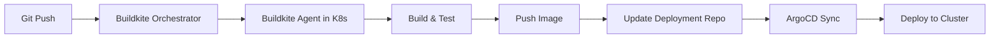

# How to Create a Complete Buildkite + ArgoCD Pipeline

Author: [nawazdhandala](https://github.com/nawazdhandala)

Tags: ArgoCD, GitOps, Kubernetes, Buildkite, CI/CD

Description: Learn how to build a complete CI/CD pipeline using Buildkite for scalable continuous integration with ArgoCD for GitOps continuous deployment to Kubernetes.

---

Buildkite is a CI platform that runs builds on your own infrastructure while providing a hosted orchestration layer. This hybrid model gives you full control over build agents, secrets, and network access while keeping pipeline management simple. Combined with ArgoCD for GitOps deployment, you get a scalable CI/CD pipeline that runs entirely on your infrastructure.

This guide covers building a production Buildkite + ArgoCD pipeline with Kubernetes-based agents.

## Architecture

Buildkite agents run in your Kubernetes cluster alongside ArgoCD. The pipeline builds and pushes images, then updates the deployment repository:



## Deploying Buildkite Agents with ArgoCD

Deploy Buildkite agents in your Kubernetes cluster using ArgoCD:

```yaml
# buildkite-agents-app.yaml
apiVersion: argoproj.io/v1alpha1
kind: Application
metadata:
  name: buildkite-agents
  namespace: argocd
spec:
  project: platform
  source:
    repoURL: https://github.com/myorg/k8s-platform.git
    path: buildkite/agents
    targetRevision: main
  destination:
    server: https://kubernetes.default.svc
    namespace: buildkite
  syncPolicy:
    automated:
      selfHeal: true
    syncOptions:
      - CreateNamespace=true
```

Buildkite agent deployment with Docker-in-Docker support:

```yaml
# buildkite/agents/deployment.yaml
apiVersion: apps/v1
kind: Deployment
metadata:
  name: buildkite-agent
  namespace: buildkite
spec:
  replicas: 5
  selector:
    matchLabels:
      app: buildkite-agent
  template:
    metadata:
      labels:
        app: buildkite-agent
    spec:
      serviceAccountName: buildkite-agent
      containers:
        - name: agent
          image: buildkite/agent:3
          env:
            - name: BUILDKITE_AGENT_TOKEN
              valueFrom:
                secretKeyRef:
                  name: buildkite-secrets
                  key: agent-token
            - name: BUILDKITE_AGENT_TAGS
              value: "queue=default,os=linux"
            - name: BUILDKITE_BUILD_PATH
              value: /workspace
          resources:
            requests:
              cpu: 500m
              memory: 1Gi
            limits:
              cpu: "2"
              memory: 4Gi
          volumeMounts:
            - name: workspace
              mountPath: /workspace
            - name: docker-socket
              mountPath: /var/run/docker.sock
      volumes:
        - name: workspace
          emptyDir: {}
        - name: docker-socket
          hostPath:
            path: /var/run/docker.sock
```

For a more secure setup, use a sidecar DinD container instead of mounting the host Docker socket:

```yaml
# buildkite/agents/deployment-dind.yaml
apiVersion: apps/v1
kind: Deployment
metadata:
  name: buildkite-agent-dind
  namespace: buildkite
spec:
  replicas: 3
  selector:
    matchLabels:
      app: buildkite-agent-dind
  template:
    metadata:
      labels:
        app: buildkite-agent-dind
    spec:
      containers:
        - name: agent
          image: buildkite/agent:3
          env:
            - name: BUILDKITE_AGENT_TOKEN
              valueFrom:
                secretKeyRef:
                  name: buildkite-secrets
                  key: agent-token
            - name: DOCKER_HOST
              value: tcp://localhost:2376
            - name: DOCKER_TLS_CERTDIR
              value: /certs
            - name: DOCKER_CERT_PATH
              value: /certs/client
            - name: DOCKER_TLS_VERIFY
              value: "1"
          volumeMounts:
            - name: workspace
              mountPath: /workspace
            - name: docker-certs
              mountPath: /certs/client
              readOnly: true
        - name: dind
          image: docker:24-dind
          securityContext:
            privileged: true
          env:
            - name: DOCKER_TLS_CERTDIR
              value: /certs
          volumeMounts:
            - name: docker-certs
              mountPath: /certs
            - name: docker-data
              mountPath: /var/lib/docker
      volumes:
        - name: workspace
          emptyDir: {}
        - name: docker-certs
          emptyDir: {}
        - name: docker-data
          emptyDir: {}
```

## Buildkite Pipeline Configuration

The `.buildkite/pipeline.yml` in your application repository:

```yaml
# .buildkite/pipeline.yml
steps:
  - group: ":test_tube: Tests"
    steps:
      - label: ":jest: Unit Tests"
        command:
          - npm ci
          - npm run test -- --ci
        plugins:
          - docker#v5.10.0:
              image: node:20-alpine
        artifact_paths:
          - "test-results/**/*"

      - label: ":eslint: Lint"
        command:
          - npm ci
          - npm run lint
        plugins:
          - docker#v5.10.0:
              image: node:20-alpine

      - label: ":lock: Security Scan"
        command:
          - trivy fs --exit-code 0 --severity HIGH,CRITICAL .
        plugins:
          - docker#v5.10.0:
              image: aquasec/trivy:latest
        soft_fail: true

  - wait

  - group: ":docker: Build and Push"
    steps:
      - label: ":docker: Build Image"
        branches: main
        commands:
          - |
            SHORT_SHA=$(echo $BUILDKITE_COMMIT | cut -c1-7)

            docker build \
              -t ghcr.io/myorg/api-service:${SHORT_SHA} \
              -t ghcr.io/myorg/api-service:latest \
              .

            echo $GHCR_TOKEN | docker login ghcr.io -u $GHCR_USER --password-stdin
            docker push ghcr.io/myorg/api-service:${SHORT_SHA}
            docker push ghcr.io/myorg/api-service:latest

            # Save tag as metadata for downstream steps
            buildkite-agent meta-data set "image-tag" "${SHORT_SHA}"

  - wait

  - group: ":rocket: Deploy"
    steps:
      - label: ":argocd: Update Deployment"
        branches: main
        commands:
          - |
            SHORT_SHA=$(buildkite-agent meta-data get "image-tag")

            # Configure SSH
            mkdir -p ~/.ssh
            echo "$DEPLOY_SSH_KEY" | base64 -d > ~/.ssh/id_rsa
            chmod 600 ~/.ssh/id_rsa
            ssh-keyscan github.com >> ~/.ssh/known_hosts

            # Clone and update deployment repo
            git clone git@github.com:myorg/k8s-deployments.git /tmp/deploy
            cd /tmp/deploy

            sed -i "s|image: ghcr.io/myorg/api-service:.*|image: ghcr.io/myorg/api-service:${SHORT_SHA}|" \
                apps/api-service/deployment.yaml

            git config user.name "Buildkite"
            git config user.email "buildkite@myorg.com"
            git add .
            git commit -m "Deploy api-service ${SHORT_SHA}

            Buildkite Build: ${BUILDKITE_BUILD_URL}
            Commit: ${BUILDKITE_COMMIT}"
            git push origin main
        plugins:
          - docker#v5.10.0:
              image: alpine/git:2.43.0
              environment:
                - DEPLOY_SSH_KEY
```

## Dynamic Pipeline Generation

Buildkite supports dynamic pipelines where one step generates the pipeline for subsequent steps. This is useful for monorepo setups:

```yaml
# .buildkite/pipeline.yml
steps:
  - label: ":pipeline: Generate Pipeline"
    command: .buildkite/generate-pipeline.sh | buildkite-agent pipeline upload
```

```bash
#!/bin/bash
# .buildkite/generate-pipeline.sh

# Detect which services changed
CHANGED_SERVICES=$(git diff --name-only HEAD~1 HEAD | grep "^services/" | cut -d/ -f2 | sort -u)

echo "steps:"
for SERVICE in $CHANGED_SERVICES; do
    cat <<EOF
  - label: ":test_tube: Test ${SERVICE}"
    command:
      - cd services/${SERVICE}
      - npm ci
      - npm test
    plugins:
      - docker#v5.10.0:
          image: node:20-alpine

  - wait

  - label: ":docker: Build ${SERVICE}"
    branches: main
    command:
      - |
        SHORT_SHA=\$(echo \$BUILDKITE_COMMIT | cut -c1-7)
        docker build -t ghcr.io/myorg/${SERVICE}:\${SHORT_SHA} services/${SERVICE}
        docker push ghcr.io/myorg/${SERVICE}:\${SHORT_SHA}
        buildkite-agent meta-data set "${SERVICE}-tag" "\${SHORT_SHA}"

  - wait

  - label: ":argocd: Deploy ${SERVICE}"
    branches: main
    command:
      - |
        TAG=\$(buildkite-agent meta-data get "${SERVICE}-tag")
        # ... update deployment repo for this service
EOF
done
```

## Multi-Environment with Block Steps

Buildkite's block steps provide manual approval gates:

```yaml
steps:
  # ... build steps ...

  - label: ":argocd: Deploy to Staging"
    branches: main
    command: .buildkite/scripts/deploy.sh staging

  - wait

  # Manual approval for production
  - block: ":rocket: Deploy to Production?"
    branches: main
    prompt: "Ready to deploy to production?"
    fields:
      - text: "Reason for deployment"
        key: "deploy-reason"
        required: true

  - label: ":argocd: Deploy to Production"
    branches: main
    command: .buildkite/scripts/deploy.sh production
```

The deploy script:

```bash
#!/bin/bash
# .buildkite/scripts/deploy.sh
ENVIRONMENT=$1
SHORT_SHA=$(buildkite-agent meta-data get "image-tag")

mkdir -p ~/.ssh
echo "$DEPLOY_SSH_KEY" | base64 -d > ~/.ssh/id_rsa
chmod 600 ~/.ssh/id_rsa
ssh-keyscan github.com >> ~/.ssh/known_hosts

git clone git@github.com:myorg/k8s-deployments.git /tmp/deploy
cd /tmp/deploy

sed -i "s|image: ghcr.io/myorg/api-service:.*|image: ghcr.io/myorg/api-service:${SHORT_SHA}|" \
    "apps/api-service/overlays/${ENVIRONMENT}/kustomization.yaml"

git config user.name "Buildkite"
git config user.email "buildkite@myorg.com"
git add .
git commit -m "Deploy api-service ${SHORT_SHA} to ${ENVIRONMENT}"
git push origin main

echo "Deployed api-service ${SHORT_SHA} to ${ENVIRONMENT}"
echo "ArgoCD will sync within 3 minutes"
```

## ArgoCD Application

```yaml
apiVersion: argoproj.io/v1alpha1
kind: Application
metadata:
  name: api-service
  namespace: argocd
spec:
  project: applications
  source:
    repoURL: https://github.com/myorg/k8s-deployments.git
    path: apps/api-service
    targetRevision: main
  destination:
    server: https://kubernetes.default.svc
    namespace: production
  syncPolicy:
    automated:
      selfHeal: true
      prune: true
```

## Agent Autoscaling

Use Buildkite's agent scaler to automatically scale agents based on queue depth:

```yaml
# buildkite/autoscaler/deployment.yaml
apiVersion: apps/v1
kind: Deployment
metadata:
  name: buildkite-agent-scaler
  namespace: buildkite
spec:
  replicas: 1
  selector:
    matchLabels:
      app: buildkite-agent-scaler
  template:
    spec:
      containers:
        - name: scaler
          image: buildkite/agent-scaler:latest
          env:
            - name: BUILDKITE_AGENT_TOKEN
              valueFrom:
                secretKeyRef:
                  name: buildkite-secrets
                  key: agent-token
            - name: BUILDKITE_QUEUE
              value: default
            - name: MIN_AGENTS
              value: "2"
            - name: MAX_AGENTS
              value: "20"
```

## Summary

Buildkite + ArgoCD gives you a scalable CI/CD pipeline where builds run on your own infrastructure. Buildkite agents deploy in your Kubernetes cluster through ArgoCD, and your application pipelines use those agents to build, test, and push images. The deployment repository update triggers ArgoCD to sync changes to the cluster. Dynamic pipelines, block steps for approval, and agent autoscaling make this combination production-ready for teams of any size.
